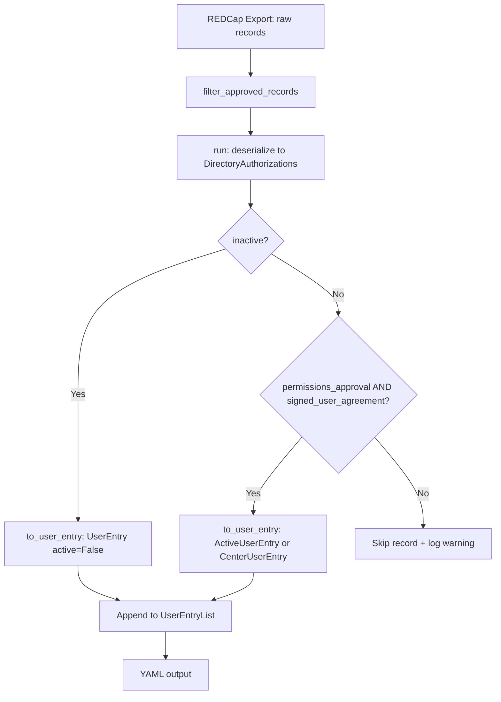

# Design Document: Archive Contact Filter Bypass

## Overview

The pull-directory gear retrieves user records from the NACC REDCap directory and converts them into a YAML file consumed by the user management gear. Currently, three filtering points silently drop archived contacts (`archive_contact='1'`) that lack `permissions_approval` or `signed_agreement_status_num_ct`:

1. `filter_approved_records()` in `gear/pull_directory/src/python/directory_app/main.py` — pre-filters on `permissions_approval == '1'`
2. `run()` in the same file — skips records where `permissions_approval` or `signed_user_agreement` is falsy
3. `to_user_entry()` in `common/src/python/users/nacc_directory.py` — returns `None` when either flag is falsy

The `to_user_entry()` method already handles the archived case correctly: when `inactive` is `True`, it returns a `UserEntry` with `active=False`. The problem is that upstream filters prevent archived contacts from ever reaching that code path.

This design modifies each filtering point so that records with `archive_contact='1'` (i.e., `inactive=True`) bypass the `permissions_approval` and `signed_agreement_status_num_ct` checks, allowing them to flow through the pipeline and appear in the output YAML with `active: false`.

## Architecture

The change is scoped to the existing pipeline architecture. No new modules, classes, or external dependencies are introduced. The three filtering points are modified in place with an additional condition check for the archived/inactive flag.



### Change Points

**1. `filter_approved_records()` — `gear/pull_directory/src/python/directory_app/main.py`**

Current: retains records where `permissions_approval == '1'`.

Modified: retains records where `permissions_approval == '1'` OR `archive_contact == '1'`.

This is a pure function operating on raw `dict[str, str]` records. The change adds a single `or` condition to the list comprehension filter.

**2. `run()` — `gear/pull_directory/src/python/directory_app/main.py`**

Current: skips records (with warning + event) when `permissions_approval` is `False` or `signed_user_agreement` is `False`.

Modified: wraps both checks in a `not dir_record.inactive` guard. When `inactive` is `True`, both checks are skipped and the record proceeds to `to_user_entry()`. The existing `assert entry is not None` after `to_user_entry()` must also be updated since archived contacts without approval will now reach this point — the assertion remains valid because `to_user_entry()` will return a `UserEntry` for inactive records regardless of approval/agreement status.

**3. `to_user_entry()` — `common/src/python/users/nacc_directory.py`**

Current: returns `None` when `signed_user_agreement` or `permissions_approval` is `False`, then checks `inactive` to return a `UserEntry`.

Modified: checks `inactive` first. When `inactive` is `True`, returns `UserEntry(active=False)` immediately, before the `signed_user_agreement` and `permissions_approval` checks. The existing inactive handling code already produces the correct output — it just needs to be moved above the guard clauses.

## Components and Interfaces

### Modified Functions

#### `filter_approved_records(records: list[dict[str, str]]) -> list[dict[str, str]]`

**File:** `gear/pull_directory/src/python/directory_app/main.py`

**Interface:** Unchanged. Accepts and returns the same types.

**Behavior change:** The filter predicate changes from:
```python
record.get("permissions_approval") == "1"
```
to:
```python
record.get("permissions_approval") == "1" or record.get("archive_contact") == "1"
```

#### `run(*, user_report, collector) -> str`

**File:** `gear/pull_directory/src/python/directory_app/main.py`

**Interface:** Unchanged.

**Behavior change:** The `permissions_approval` and `signed_user_agreement` checks are wrapped with `if not dir_record.inactive:` so that archived contacts bypass both checks and proceed directly to `to_user_entry()`.

#### `DirectoryAuthorizations.to_user_entry() -> Optional[UserEntry]`

**File:** `common/src/python/users/nacc_directory.py`

**Interface:** Unchanged.

**Behavior change:** The `inactive` check is moved to the top of the method, before the `signed_user_agreement` and `permissions_approval` guard clauses. When `inactive` is `True`, the method returns a `UserEntry` with `active=False` immediately.

### Unchanged Components

- `DirectoryAuthorizations` model fields and validators — no schema changes
- `UserEntry`, `ActiveUserEntry`, `CenterUserEntry` models — no changes
- `UserEventCollector` and event models — no changes
- YAML serialization logic — no changes

## Data Models

No data model changes are required. The existing models already support the needed output:

- `UserEntry` has an `active: bool` field that will be set to `False` for archived contacts
- `UserEntry` has `approved: bool` that will reflect the contact's `permissions_approval` value
- `DirectoryAuthorizations` already has `inactive: bool` mapped from `archive_contact`

### Output Format for Archived Contacts

An archived contact in the output YAML will look like:

```yaml
- name:
    first_name: Jane
    last_name: Doe
  email: jane.doe@institution.edu
  auth_email: jane.doe@institution.edu
  active: false
  approved: false
```

This is a `UserEntry` (not `ActiveUserEntry` or `CenterUserEntry`), so it does not include `authorizations`, `study_authorizations`, `org_name`, or `adcid` fields.


## Correctness Properties

*A property is a characteristic or behavior that should hold true across all valid executions of a system — essentially, a formal statement about what the system should do. Properties serve as the bridge between human-readable specifications and machine-verifiable correctness guarantees.*

### Property 1: Pre-filter retains a record iff it is archived or approved

*For any* raw REDCap record dict, `filter_approved_records` retains the record if and only if `archive_contact == '1'` or `permissions_approval == '1'`. Records matching neither condition are excluded.

**Validates: Requirements 1.1, 1.2**

### Property 2: Run function bypasses approval and agreement checks for inactive records

*For any* valid `DirectoryAuthorizations`-compatible record dict where `archive_contact == '1'`, the `run()` function SHALL include the record in the output YAML regardless of the values of `permissions_approval` and `signed_agreement_status_num_ct`.

**Validates: Requirements 2.1, 2.2**

### Property 3: Run function excludes non-inactive records missing approval or agreement

*For any* valid `DirectoryAuthorizations`-compatible record dict where `archive_contact != '1'` and either `permissions_approval` is falsy or `signed_agreement_status_num_ct` is falsy, the `run()` function SHALL exclude the record from the output YAML and collect an error event.

**Validates: Requirements 2.3, 2.4**

### Property 4: to_user_entry returns correct UserEntry for inactive records

*For any* `DirectoryAuthorizations` object where `inactive` is `True`, `to_user_entry()` SHALL return a `UserEntry` (not `None`) with `active == False`, and the returned entry's `name`, `email`, `auth_email`, and `approved` fields SHALL match the corresponding fields on the `DirectoryAuthorizations` object — regardless of the values of `signed_user_agreement` and `permissions_approval`.

**Validates: Requirements 3.1, 5.1, 5.2, 5.3**

### Property 5: to_user_entry returns None for non-inactive records missing approval or agreement

*For any* `DirectoryAuthorizations` object where `inactive` is `False` and either `signed_user_agreement` is `False` or `permissions_approval` is `False`, `to_user_entry()` SHALL return `None`.

**Validates: Requirements 3.2, 3.3**

### Property 6: to_user_entry returns active entry for non-inactive approved records

*For any* `DirectoryAuthorizations` object where `inactive` is `False`, `signed_user_agreement` is `True`, and `permissions_approval` is `True`, `to_user_entry()` SHALL return a `UserEntry` subclass with `active == True`.

**Validates: Requirements 3.4**

## Error Handling

### Existing Error Handling (Unchanged)

The `run()` function already handles these error cases, and this feature does not modify them:

- **ValidationError during deserialization**: Caught, logged, and collected as `MISSING_DIRECTORY_DATA` event. Continues to next record.
- **ValidationError during `to_user_entry()`**: Caught, logged, and collected as `MISSING_DIRECTORY_DATA` event. Continues to next record.
- **Duplicate emails**: Logged as a warning. Both entries are kept.

### Modified Error Handling

- **Non-approved, non-archived records**: Continue to be skipped with a `MISSING_DIRECTORY_PERMISSIONS` error event (unchanged behavior).
- **Unsigned agreement, non-archived records**: Continue to be skipped with a `MISSING_USER_AGREEMENT` error event (unchanged behavior).
- **Archived records without approval or agreement**: These now bypass the error event collection for missing permissions/agreement. No error event is generated — the record flows through to produce a `UserEntry` with `active=False`. This is intentional: archived contacts are expected to lack these approvals.

### Assertion Update

The existing assertion in `run()`:
```python
assert entry is not None, f"Unexpected None entry for {dir_record.email}"
```

This assertion remains valid after the change. For inactive records, `to_user_entry()` will return a `UserEntry` (not `None`) because the inactive check now precedes the guard clauses. For non-inactive records, the `permissions_approval` and `signed_user_agreement` checks in `run()` still guarantee that `to_user_entry()` won't return `None`.

## Testing Strategy

### Property-Based Testing

This feature is well-suited for property-based testing because:
- The functions under test (`filter_approved_records`, `run`, `to_user_entry`) have clear input/output behavior
- The filtering logic depends on combinations of boolean flags (`inactive`, `permissions_approval`, `signed_user_agreement`) and string fields (`archive_contact`)
- Universal properties hold across all valid inputs
- All operations are pure or have mockable side effects (logging, event collection)

**Library**: [Hypothesis](https://hypothesis.readthedocs.io/) — the standard PBT library for Python, already used in this codebase.

**Configuration**: Minimum 100 iterations per property test.

**Tag format**: `Feature: archive-contact-filter-bypass, Property {number}: {property_text}`

### Property Tests (6 properties)

Each correctness property maps to a single property-based test:

1. **Property 1** — Generate random record dicts with varying `archive_contact` and `permissions_approval` values. Assert `filter_approved_records` retains the record iff `archive_contact == '1'` or `permissions_approval == '1'`.

2. **Property 2** — Generate valid record dicts with `archive_contact='1'` and random `permissions_approval`/`signed_agreement_status_num_ct` values. Run through `run()` and assert the output YAML contains an entry for each record.

3. **Property 3** — Generate valid record dicts with `archive_contact='0'` and at least one of `permissions_approval`/`signed_agreement_status_num_ct` falsy. Run through `run()` and assert the record is excluded from output and an error event is collected.

4. **Property 4** — Generate `DirectoryAuthorizations` objects with `inactive=True` and random `signed_user_agreement`/`permissions_approval` values. Call `to_user_entry()` and assert the result is a `UserEntry` with `active=False` and correct field values.

5. **Property 5** — Generate `DirectoryAuthorizations` objects with `inactive=False` and at least one of `signed_user_agreement`/`permissions_approval` as `False`. Assert `to_user_entry()` returns `None`.

6. **Property 6** — Generate `DirectoryAuthorizations` objects with `inactive=False`, `signed_user_agreement=True`, `permissions_approval=True`. Assert `to_user_entry()` returns a non-None entry with `active=True`.

### Unit Tests (Example-Based)

Complement property tests with specific examples for clarity and regression:

- **Pre-filter**: Archived record with `permissions_approval='0'` is retained. Non-archived record with `permissions_approval='0'` is excluded.
- **Run function**: Archived record with both flags false produces output entry. Non-archived record with both flags true produces output entry.
- **to_user_entry**: Archived record produces `UserEntry` (not `ActiveUserEntry` or `CenterUserEntry`). Non-archived record with `adcid` produces `CenterUserEntry`.

### Integration Tests

- End-to-end test: mix of archived and non-archived records through `run()`, verifying the output YAML contains the correct entries with correct `active` and `approved` values.
- Regression test: non-archived records produce identical YAML output to the current implementation (Requirement 4.3).

### Test File Locations

- `gear/pull_directory/test/python/test_filter_approved_records.py` — extend with archive_contact bypass tests
- `common/test/python/user_test/test_directory_authorizations.py` — extend with to_user_entry inactive bypass tests
- `gear/pull_directory/test/python/test_integration_directory_error_handling.py` — extend with end-to-end archived contact tests
