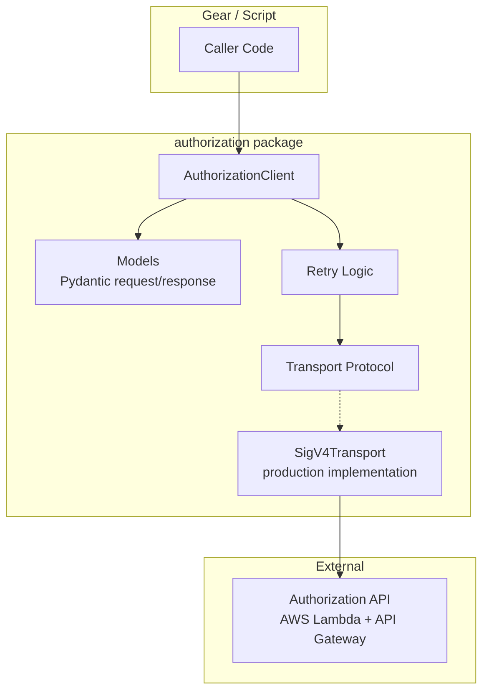

# Design Document

## Overview

The Authorization Client Library is a shared Python package at `common/src/python/authorization/` that provides a typed, idempotent interface to the NACC Authorization API. It abstracts HTTP transport, SigV4 signing, retry logic, and batch chunking behind a clean Python API.

The library follows the dependency injection pattern established in the codebase (see `LambdaClient` in `common/src/python/lambdas/`): the HTTP transport layer is injected at construction time, making the client fully testable with mocked responses.

### Design Decisions

1. **Protocol-based transport abstraction**: Use a Python `Protocol` to define the HTTP transport interface rather than coupling to `requests` or `boto3` directly. This enables test doubles without monkey-patching.

2. **Pydantic models for all payloads**: Every request and response is a Pydantic v2 `BaseModel`. This gives validation, serialization, and IDE support for free.

3. **Idempotent by default**: The client treats 409 on grant and 404 on revoke as success — callers never need to handle "already exists" logic.

4. **Transparent batch chunking**: The `batch()` method accepts any number of operations and automatically splits into chunks of ≤100, aggregating results across chunks.

5. **Retry only on 503**: Exponential backoff is applied exclusively to 503 (service unavailable). All other errors fail immediately. This matches the API's documented behavior.

6. **No gear dependencies**: The library imports only standard library, `pydantic`, `boto3`/`botocore` (for SigV4), and `requests`. It is usable by any gear or script.

## Architecture



The `AuthorizationClient` is the public entry point. It constructs typed request models, delegates HTTP calls through the injected transport (with retry wrapping), and parses responses into typed result models.

For testing, callers inject a mock transport that returns pre-built responses without network calls.

## Components and Interfaces

### Transport Protocol

```python
from typing import Protocol

class HttpResponse(Protocol):
    """Minimal response interface returned by transport."""
    @property
    def status_code(self) -> int: ...
    @property
    def body(self) -> bytes: ...

class HttpTransport(Protocol):
    """Abstract HTTP transport for the Authorization API."""
    def request(
        self,
        method: str,
        path: str,
        body: bytes | None = None,
        query_params: dict[str, str] | None = None,
    ) -> HttpResponse: ...
```

### SigV4Transport (Production Implementation)

```python
class SigV4Transport:
    """HTTP transport that signs requests with AWS SigV4."""

    def __init__(self, base_url: str, region: str | None = None):
        ...

    def request(
        self,
        method: str,
        path: str,
        body: bytes | None = None,
        query_params: dict[str, str] | None = None,
    ) -> HttpResponse:
        ...
```

Uses `botocore.auth.SigV4Auth` with the standard credential chain to sign each request against the `execute-api` service.

### AuthorizationClient

```python
class AuthorizationClient:
    """Client for the NACC Authorization API."""

    def __init__(
        self,
        transport: HttpTransport,
        max_retries: int = 3,
        base_backoff: float = 1.0,
    ):
        ...

    def grant(
        self,
        user_id: str,
        resource_type: str,
        resource_id: str,
        relation: str,
    ) -> GrantResult: ...

    def revoke(
        self,
        user_id: str,
        resource_type: str,
        resource_id: str,
        relation: str,
    ) -> RevokeResult: ...

    def batch(
        self,
        operations: list[BatchOperation],
    ) -> BatchResult: ...

    def get_user_permissions(
        self,
        user_id: str,
        type_filter: str | None = None,
        relation_filter: str | None = None,
    ) -> UserPermissions: ...

    def set_resource_parents(
        self,
        resource_type: str,
        resource_id: str,
        parents: list[ParentRelationship],
    ) -> ResourceParents: ...

    def health_check(self) -> HealthResult: ...
```

### Factory Function

```python
def create_authorization_client(
    base_url: str | None = None,
    max_retries: int = 3,
    base_backoff: float = 1.0,
) -> AuthorizationClient:
    """Create an AuthorizationClient with SigV4 transport.

    Args:
        base_url: API base URL. Falls back to AUTHORIZATION_API_URL env var.
        max_retries: Maximum retry attempts on 503.
        base_backoff: Base delay in seconds for exponential backoff.

    Raises:
        ConfigurationError: If no base URL is resolvable.
    """
    ...
```

## Data Models

### Request Models

```python
class GrantRequest(BaseModel):
    user_id: str = Field(alias="userId")
    relation: str
    type: str
    resource_id: str = Field(alias="resourceId")

class RevokeRequest(BaseModel):
    user_id: str = Field(alias="userId")
    relation: str
    type: str
    resource_id: str = Field(alias="resourceId")

class BatchOperationModel(BaseModel):
    action: Literal["grant", "revoke"]
    user_id: str = Field(alias="userId")
    relation: str
    type: str
    resource_id: str = Field(alias="resourceId")

class BatchRequestModel(BaseModel):
    operations: list[BatchOperationModel]

class SetParentsRequestModel(BaseModel):
    parents: list[ParentRelationshipModel]

class ParentRelationshipModel(BaseModel):
    structural_relation: str = Field(alias="structuralRelation")
    parent_type: str = Field(alias="parentType")
    parent_id: str = Field(alias="parentId")

class PermissionCheckRequestModel(BaseModel):
    user_id: str = Field(alias="userId")
    relation: str
    type: str
    resource_id: str = Field(alias="resourceId")
```

### Response Models

```python
class GrantResult(BaseModel):
    user_id: str = Field(alias="userId")
    relation: str
    type: str
    resource_id: str = Field(alias="resourceId")

class RevokeResult(BaseModel):
    user_id: str = Field(alias="userId")
    relation: str
    type: str
    resource_id: str = Field(alias="resourceId")

class BatchError(BaseModel):
    index: int
    error: str
    message: str

class BatchResult(BaseModel):
    total: int
    succeeded: int
    failed: int
    errors: list[BatchError] = []

class InheritanceSource(BaseModel):
    parent_type: str = Field(alias="parentType")
    parent_id: str = Field(alias="parentId")
    parent_role: str = Field(alias="parentRole")

class PermissionEntry(BaseModel):
    resource_id: str = Field(alias="resourceId")
    relation: str
    access: Literal["direct", "inherited", "both"]
    inherited_from: InheritanceSource | None = Field(
        default=None, alias="inheritedFrom"
    )

class UserPermissions(BaseModel):
    user_id: str = Field(alias="userId")
    permissions: dict[str, list[PermissionEntry]]

class ParentRelationship(BaseModel):
    structural_relation: str = Field(alias="structuralRelation")
    parent_type: str = Field(alias="parentType")
    parent_id: str = Field(alias="parentId")

class ResourceParents(BaseModel):
    type: str
    resource_id: str = Field(alias="resourceId")
    parents: list[ParentRelationship]

class HealthResult(BaseModel):
    status: Literal["healthy", "degraded", "unhealthy"]
    authorization_engine: Literal["connected", "unreachable"] | None = Field(
        default=None, alias="authorizationEngine"
    )

class ErrorResponse(BaseModel):
    error: str
    message: str
    details: dict | None = None
```

### Domain Types (used by callers)

```python
class BatchOperation(BaseModel):
    """A single grant or revoke operation for batch submission."""
    action: Literal["grant", "revoke"]
    user_id: str
    resource_type: str
    resource_id: str
    relation: str
```

### Exceptions

```python
class AuthorizationClientError(Exception):
    """Base exception for authorization client errors."""

class ConfigurationError(AuthorizationClientError):
    """Raised when the client cannot be configured (e.g., missing base URL)."""

class ValidationError(AuthorizationClientError):
    """Raised when the API returns 400 (validation error)."""
    def __init__(self, message: str, details: dict | None = None): ...

class ServiceUnavailableError(AuthorizationClientError):
    """Raised when retries are exhausted on 503."""

class UnexpectedError(AuthorizationClientError):
    """Raised on unexpected HTTP errors (non-retriable 4xx/5xx)."""
    def __init__(self, status_code: int, message: str): ...

class ParseError(AuthorizationClientError):
    """Raised when a response body cannot be parsed into the expected model."""
    def __init__(self, message: str, raw_content: bytes): ...
```


## Correctness Properties

*A property is a characteristic or behavior that should hold true across all valid executions of a system — essentially, a formal statement about what the system should do. Properties serve as the bridge between human-readable specifications and machine-verifiable correctness guarantees.*

### Property 1: Request construction correctness

*For any* valid operation (grant, revoke, get_user_permissions, set_resource_parents) with any valid combination of parameters, the client SHALL construct an HTTP request with the correct method, path, and JSON body containing all provided fields.

**Validates: Requirements 2.1, 3.1, 5.1, 6.1**

### Property 2: Response model round-trip

*For any* valid response model instance (GrantResult, RevokeResult, UserPermissions, ResourceParents, BatchResult), serializing to JSON and parsing back SHALL produce an equivalent model instance.

**Validates: Requirements 2.2, 3.2, 5.2, 6.2, 9.2**

### Property 3: Idempotent status codes yield success

*For any* grant request that receives HTTP 409, or any revoke request that receives HTTP 404, the client SHALL return a success result (not raise an exception).

**Validates: Requirements 2.3, 3.3**

### Property 4: Validation errors propagate message

*For any* API response with HTTP 400 containing an error message, the client SHALL raise a ValidationError whose message matches the API error message.

**Validates: Requirements 2.4, 3.4, 4.6, 6.3**

### Property 5: Retry on 503 with exponential backoff

*For any* request that receives HTTP 503 responses, the client SHALL retry up to max_retries times with delays following the pattern base_backoff × 2^(attempt-1), then raise ServiceUnavailableError if all retries are exhausted.

**Validates: Requirements 2.5, 3.5, 5.3, 6.4, 8.1, 8.2**

### Property 6: Immediate failure on non-retriable errors

*For any* HTTP status code that is not 503 and not an idempotent success code (409 for grant, 404 for revoke) and not 200/201, the client SHALL raise an error on the first attempt without retrying.

**Validates: Requirements 2.6, 3.6, 5.4, 6.5, 8.4**

### Property 7: Batch chunking respects size limit

*For any* list of N batch operations, the client SHALL send exactly ⌈N/100⌉ HTTP requests, each containing at most 100 operations.

**Validates: Requirements 4.1, 4.2**

### Property 8: Batch chunking preserves order

*For any* list of batch operations, the concatenation of operations across all chunks (in chunk order) SHALL equal the original list.

**Validates: Requirements 4.3**

### Property 9: Batch result aggregation

*For any* multi-chunk batch execution with mixed per-operation outcomes, the aggregate BatchResult SHALL have total equal to the sum of all chunk totals, succeeded equal to the sum of chunk successes plus idempotent errors (conflict, not_found), and failed equal to only non-idempotent failures.

**Validates: Requirements 4.4, 4.7**

### Property 10: Malformed response raises ParseError with raw content

*For any* response body that does not conform to the expected JSON schema, the client SHALL raise a ParseError whose raw_content attribute contains the original response bytes.

**Validates: Requirements 9.3**

## Error Handling

### Error Classification

| HTTP Status | Context | Client Behavior |
|---|---|---|
| 200, 201 | Any | Return typed success result |
| 400 | Any | Raise `ValidationError` with API message |
| 404 | Revoke only | Return success (idempotent) |
| 404 | Other endpoints | Raise `UnexpectedError` |
| 409 | Grant only | Return success (idempotent) |
| 409 | Other endpoints | Raise `UnexpectedError` |
| 503 | Any (except health) | Retry with exponential backoff |
| 503 | Health check | Return `HealthResult(status="unhealthy")` |
| Other 4xx/5xx | Any | Raise `UnexpectedError` immediately |

### Retry Strategy

```
delay(attempt) = base_backoff × 2^(attempt - 1)
```

- Default `base_backoff`: 1.0 seconds
- Default `max_retries`: 3
- Delays: 1s, 2s, 4s (then fail)
- Only triggered by HTTP 503
- Each retry is logged at WARNING level

### Response Parsing Failures

If a successful HTTP response (200/201) contains a body that cannot be parsed into the expected Pydantic model, the client raises `ParseError` with the raw bytes. This distinguishes API contract violations from network/auth errors.

### Batch Error Handling

Batch operations have two error modes:

1. **Validation rejection (400)**: The entire batch is rejected before execution. The client raises `ValidationError`.
2. **Per-operation failures**: Individual operations may fail during execution. The client classifies each:
   - `conflict` / `not_found` → idempotent success (counted in `succeeded`)
   - `service_unavailable` → retriable failure (reported in errors with retriable flag)
   - Other → non-retriable failure (reported in errors)

## Testing Strategy

### Property-Based Testing

This feature is well-suited for property-based testing because:
- The client has clear input/output behavior (parameters → HTTP request; HTTP response → typed result)
- Universal properties hold across a wide input space (any valid user_id, resource_type, etc.)
- The transport protocol abstraction makes it cost-effective to run 100+ iterations (no real HTTP calls)

**Library**: `hypothesis` (already in project dependencies)

**Configuration**:
- Minimum 100 examples per property test
- Each test tagged with: `Feature: authorization-client-library, Property {N}: {title}`

**Generators needed**:
- Valid user IDs (non-empty strings, alphanumeric + common separators)
- Valid resource types (from the known set: study, research_center, community, data_pipeline, dashboard, page)
- Valid resource IDs (non-empty strings)
- Valid relations (from the known set per type)
- Batch operation lists (1-500 items)
- HTTP status codes (partitioned into retriable, idempotent, and unexpected)
- Valid/invalid JSON response bodies

### Unit Tests (Example-Based)

- Client instantiation with explicit URL, env var fallback, and missing URL
- Health check request construction and response parsing
- Logging behavior (debug for success, warning for retry, error for failures)
- Retry logging includes attempt number and wait duration
- `service_unavailable` errors in batch responses flagged as retriable

### Integration Tests

- SigV4 signing produces valid Authorization headers (using moto or botocore test utilities)
- End-to-end flow with a mock HTTP server (optional, for confidence)

### Test Organization

```
common/test/python/authorization_test/
├── __init__.py
├── conftest.py              # Shared fixtures, mock transport, generators
├── test_client_grant.py     # Grant operation tests
├── test_client_revoke.py    # Revoke operation tests
├── test_client_batch.py     # Batch operation tests
├── test_client_query.py     # Permissions query tests
├── test_client_parents.py   # Set parents tests
├── test_client_health.py    # Health check tests
├── test_retry.py            # Retry behavior tests
├── test_models.py           # Pydantic model round-trip tests
└── test_transport.py        # SigV4Transport tests
```
