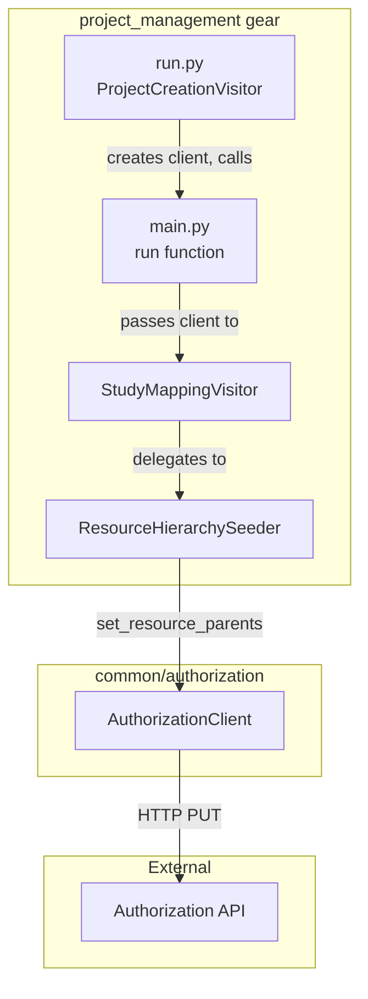

# Design Document

## Overview

The Resource Hierarchy Seeder integrates the `project_management` gear with the NACC Authorization API by calling `set_resource_parents` for every resource (data pipeline, dashboard, page) the gear creates or visits. This establishes the parent relationships that the OpenFGA authorization model uses to compute inherited permissions — study admins get `viewer` on child pipelines, center members get `viewer` on center-scoped dashboards, and community members get `viewer` on community-scoped pages.

### Design Decisions

1. **Seeder as a standalone class**: The `ResourceHierarchySeeder` is a separate class injected into the `StudyMappingVisitor` rather than mixed into the visitor itself. This keeps authorization concerns isolated and testable independently of Flywheel project creation.

2. **Optional client via dependency injection**: The `AuthorizationClient` is passed as `Optional[AuthorizationClient]` to the gear's `run()` function. When `None`, all seeding is skipped with a single startup warning. This matches the existing DI pattern (e.g., `FlywheelProxy`, `admin_permissions`).

3. **Fire-and-forget with error counting**: Each `set_parents` call is wrapped in a try/except that logs the error and increments a failure counter. After all resources are processed, a summary warning is logged if any failures occurred. This satisfies the non-blocking requirement without silently swallowing errors.

4. **Idempotent by design**: The seeder calls `set_parents` unconditionally on every run. The API's PUT semantics replace existing parents, so repeated calls produce identical state. No read-before-write is needed.

5. **Scope derived from existing config**: The `level` field on `DashboardConfig` and `PageConfig` determines scope. Pipelines are always center-scoped (they exist within a center traversal). No new configuration fields are introduced beyond extending `PageConfig.level` to accept `"community"`.

## Architecture



The `ResourceHierarchySeeder` is instantiated in `main.py` and passed to `StudyMappingVisitor`. The visitor calls the seeder at each point where a resource is created or visited — after pipeline creation in `map_center_pipelines`, after dashboard/page creation in `__handle_dashboards_and_pages`, and for study-level/community-level resources in `visit_study`.

## Components and Interfaces

### ResourceHierarchySeeder

```python
class ResourceHierarchySeeder:
    """Seeds resource parent relationships in the Authorization Service.

    Calls set_resource_parents for each resource the gear creates or visits,
    establishing the hierarchy that enables inherited permissions.
    """

    def __init__(self, client: AuthorizationClient) -> None:
        """Initialize with an authorization client.

        Args:
            client: The authorization client for API calls.
        """
        ...

    def seed_center_pipeline(
        self,
        resource_id: str,
        study_id: str,
        center_id: str,
    ) -> None:
        """Set parents for a center-scoped data pipeline.

        Args:
            resource_id: The pipeline resource ID (Flywheel project label).
            study_id: The study identifier.
            center_id: The research center identifier.
        """
        ...

    def seed_center_dashboard(
        self,
        resource_id: str,
        study_id: str,
        center_id: str,
    ) -> None:
        """Set parents for a center-scoped dashboard.

        Args:
            resource_id: The dashboard resource ID.
            study_id: The study identifier.
            center_id: The research center identifier.
        """
        ...

    def seed_center_page(
        self,
        resource_id: str,
        study_id: str,
        center_id: str,
    ) -> None:
        """Set parents for a center-scoped page.

        Args:
            resource_id: The page resource ID.
            study_id: The study identifier.
            center_id: The research center identifier.
        """
        ...

    def seed_study_dashboard(
        self,
        resource_id: str,
        study_id: str,
    ) -> None:
        """Set parents for a study-scoped dashboard.

        Args:
            resource_id: The dashboard resource ID.
            study_id: The study identifier.
        """
        ...

    def seed_study_page(
        self,
        resource_id: str,
        study_id: str,
    ) -> None:
        """Set parents for a study-scoped page.

        Args:
            resource_id: The page resource ID.
            study_id: The study identifier.
        """
        ...

    def seed_community_page(
        self,
        resource_id: str,
    ) -> None:
        """Set parents for a community-scoped page.

        Args:
            resource_id: The page resource ID.
        """
        ...

    @property
    def failure_count(self) -> int:
        """Number of set_parents calls that failed during this run."""
        ...
```

### Modified main.py Signature

```python
def run(
    *,
    proxy: FlywheelProxy,
    admin_group: NACCGroup,
    study_list: List[StudyModel],
    authorization_client: Optional[AuthorizationClient] = None,
) -> None:
    """Runs project pipeline creation/management.

    Args:
        proxy: The proxy for the Flywheel instance.
        admin_group: The administrative group.
        study_list: The list of input study objects.
        authorization_client: Optional authorization client for hierarchy seeding.
    """
    ...
```

### Modified StudyMappingVisitor Constructor

```python
class StudyMappingVisitor(StudyVisitor):
    def __init__(
        self,
        flywheel_proxy: FlywheelProxy,
        admin_permissions: List[AccessPermission],
        hierarchy_seeder: Optional[ResourceHierarchySeeder] = None,
    ) -> None:
        ...
```

### Extended PageConfig

```python
class PageConfig(BaseModel):
    name: str
    level: Literal["center", "study", "community"] = "center"
```

## Data Models

### Parent Relationship Structures

The seeder constructs `ParentRelationship` objects from the `authorization` package:

```python
from authorization import ParentRelationship

# Center-scoped resource (pipeline, dashboard, or page)
center_scoped_parents = [
    ParentRelationship(
        structural_relation="parent_study",
        parent_type="study",
        parent_id=study_id,
    ),
    ParentRelationship(
        structural_relation="parent_center",
        parent_type="research_center",
        parent_id=center_id,
    ),
]

# Study-scoped resource (dashboard or page)
study_scoped_parents = [
    ParentRelationship(
        structural_relation="parent_study",
        parent_type="study",
        parent_id=study_id,
    ),
]

# Community-scoped resource (page)
community_scoped_parents = [
    ParentRelationship(
        structural_relation="parent_community",
        parent_type="community",
        parent_id="nacc",
    ),
]
```

### Resource ID Derivation

Resource IDs are derived from Flywheel project labels using the existing `StudyMapper` label methods:

| Resource Type | Pattern | Example (primary) | Example (affiliated, study_id=`clariti`) |
| --- | --- | --- | --- |
| Data pipeline | `{stage}-{datatype}{suffix}` | `ingest-form` | `ingest-form-clariti` |
| Dashboard | `dashboard-{name}{suffix}` | `dashboard-adrc-reports` | `dashboard-adrc-reports-clariti` |
| Page | `page-{name}{suffix}` | `page-community-resources` | `page-community-resources-clariti` |

Where `suffix` is `""` for primary studies and `"-{study_id}"` for affiliated studies (from `StudyModel.project_suffix()`).

### Scope Determination Logic

| Config Source | Level Value | Scope | Parents Set |
| --- | --- | --- | --- |
| Pipeline (center traversal context) | N/A | center-scoped | `parent_study` + `parent_center` |
| `DashboardConfig.level` | `"center"` | center-scoped | `parent_study` + `parent_center` |
| `DashboardConfig.level` | `"study"` | study-scoped | `parent_study` |
| `PageConfig.level` | `"center"` | center-scoped | `parent_study` + `parent_center` |
| `PageConfig.level` | `"study"` | study-scoped | `parent_study` |
| `PageConfig.level` | `"community"` | community-scoped | `parent_community` |

## Correctness Properties

*A property is a characteristic or behavior that should hold true across all valid executions of a system — essentially, a formal statement about what the system should do. Properties serve as the bridge between human-readable specifications and machine-verifiable correctness guarantees.*

### Property 1: Scope-to-parents mapping correctness

*For any* resource type (data_pipeline, dashboard, page) and scope (center, study, community), the seeder SHALL produce exactly the correct set of parent relationships: center-scoped resources get `parent_study` + `parent_center`, study-scoped resources get only `parent_study`, and community-scoped resources get only `parent_community` with parent_id `"nacc"`. The parent_type and parent_id fields SHALL match the study_id and center_id provided.

**Validates: Requirements 1.1, 2.1, 3.1, 4.1, 4.3, 5.1, 8.1, 8.2, 12.3**

### Property 2: Resource ID derivation follows label pattern

*For any* resource type, name, and study type (primary or affiliated with a given study_id), the resource_id passed to `set_resource_parents` SHALL match the pattern `{prefix}-{name}{suffix}` where prefix is the resource-type-specific prefix (`ingest`/`sandbox` for pipelines, `dashboard` for dashboards, `page` for pages), and suffix is empty for primary studies and `-{study_id}` for affiliated studies.

**Validates: Requirements 1.2, 2.2, 3.2, 4.2, 5.2**

### Property 3: Idempotent execution

*For any* study configuration, executing the seeder N times (N ≥ 1) SHALL produce identical `set_resource_parents` call arguments on each execution — the same set of (resource_type, resource_id, parents) tuples.

**Validates: Requirements 6.1, 6.3**

### Property 4: Non-propagation of client exceptions

*For any* exception raised by the `AuthorizationClient` during a `set_resource_parents` call, the seeder SHALL catch the exception and continue processing subsequent resources without raising.

**Validates: Requirements 7.1, 7.2**

### Property 5: Failure count accuracy

*For any* gear run where K out of N `set_resource_parents` calls raise exceptions (0 ≤ K ≤ N), the seeder's `failure_count` SHALL equal K.

**Validates: Requirements 7.3**

### Property 6: Log messages contain identifying information

*For any* `set_resource_parents` call (successful or failed), the seeder SHALL produce a log message containing the resource type, resource ID, and either the parent relationships (on success) or the exception description (on failure).

**Validates: Requirements 10.1, 10.2**

## Error Handling

### Exception Handling Strategy

The seeder wraps each `set_resource_parents` call in a try/except block:

```python
try:
    self._client.set_resource_parents(
        resource_type=resource_type,
        resource_id=resource_id,
        parents=parents,
    )
    log.debug(
        "Set parents for %s/%s: %s",
        resource_type,
        resource_id,
        [(p.structural_relation, p.parent_type, p.parent_id) for p in parents],
    )
except AuthorizationClientError as error:
    self._failure_count += 1
    log.error(
        "Failed to set parents for %s/%s: %s",
        resource_type,
        resource_id,
        error,
    )
```

After all resources are processed, `main.py` checks the failure count:

```python
if seeder and seeder.failure_count > 0:
    log.warning(
        "Authorization hierarchy seeding completed with %d failure(s)",
        seeder.failure_count,
    )
```

### Client Unavailability

At gear startup in `run.py`, the client creation is wrapped:

```python
authorization_client: Optional[AuthorizationClient] = None
try:
    authorization_client = create_authorization_client()
except ConfigurationError as error:
    log.error(
        "Authorization client creation failed, hierarchy seeding disabled: %s",
        error,
    )
```

If `authorization_client` is `None` (either from failed creation or missing config), `main.py` logs a single warning and skips all seeding:

```python
if authorization_client is None:
    log.warning("Authorization hierarchy seeding is disabled (no client available)")
    seeder = None
else:
    seeder = ResourceHierarchySeeder(client=authorization_client)
```

### Error Categories

| Error Source | Behavior |
| --- | --- |
| `ConfigurationError` during client creation | Log error, set client to None, skip all seeding |
| `ValidationError` from API (400) | Log error, increment failure count, continue |
| `ServiceUnavailableError` (503 after retries) | Log error, increment failure count, continue |
| `UnexpectedError` (other HTTP errors) | Log error, increment failure count, continue |
| `ParseError` (malformed response) | Log error, increment failure count, continue |
| Any other `AuthorizationClientError` | Log error, increment failure count, continue |

## Testing Strategy

### Property-Based Testing

This feature is well-suited for property-based testing because:

- The seeder has clear input/output behavior (configuration → API call arguments)
- Universal properties hold across a wide input space (any valid study_id, center_id, resource name)
- The authorization client is injected, so a mock captures calls without network I/O — cost-effective for 100+ iterations

**Library**: `hypothesis` (already in project dependencies)

**Configuration**:

- Minimum 100 examples per property test
- Each test tagged with: `Feature: authorization-resource-hierarchy, Property {N}: {title}`

**Generators needed**:

- Valid study IDs (non-empty alphanumeric strings with hyphens, e.g., `adrc`, `clariti`, `upenn-ftld`)
- Valid center IDs (non-empty alphanumeric strings with hyphens)
- Valid resource names (non-empty strings matching existing naming patterns)
- Study types (`primary` | `affiliated`)
- Page/dashboard levels (`center` | `study` | `community` for pages; `center` | `study` for dashboards)
- Exception instances from the `AuthorizationClientError` hierarchy

### Unit Tests (Example-Based)

- Client is None → no seeding calls, single warning logged
- Client creation fails → treated as None, error logged
- Inactive center → dashboards/pages in that center are not seeded
- StudyModel with no study-level dashboards → no study-scoped dashboard seeding
- StudyModel with no pages → no page seeding
- PageConfig with level="community" passes Pydantic validation
- Plain string pages default to level="center"
- Co-enrolled affiliated study centers skip aggregation pipelines but still seed hierarchy for distribution pipelines

### Integration Tests

- Full gear run with mock `AuthorizationClient` verifying the complete set of `set_resource_parents` calls for a representative study YAML
- Verify seeding happens within the same gear execution as project creation (no separate invocation)

### Test Organization

```text
gear/project_management/test/python/
├── conftest.py                          # Shared fixtures, mock authorization client
├── test_hierarchy_seeder.py             # Property tests + unit tests for ResourceHierarchySeeder
├── test_hierarchy_seeder_integration.py # Integration tests with StudyMappingVisitor
└── test_main.py                         # Tests for run() with optional client
```

### Property Test Implementation Notes

Each correctness property maps to a single `@given`-decorated test:

- **Property 1** (scope-to-parents): Generate `(resource_type, scope, study_id, center_id)` tuples, call the appropriate `seed_*` method, assert the mock client received the correct parents list.
- **Property 2** (resource ID): Generate `(resource_type, name, study_type, study_id)`, compute expected label, verify it matches what the seeder passes to the client.
- **Property 3** (idempotence): Generate a study config, run seeder twice, assert call lists are identical.
- **Property 4** (non-propagation): Generate random `AuthorizationClientError` subclass instances, configure mock to raise, verify no exception escapes the seeder.
- **Property 5** (failure count): Generate N resources with K configured to fail, verify `failure_count == K`.
- **Property 6** (logging): Generate random resource info, verify log records contain the expected fields using `caplog`.
