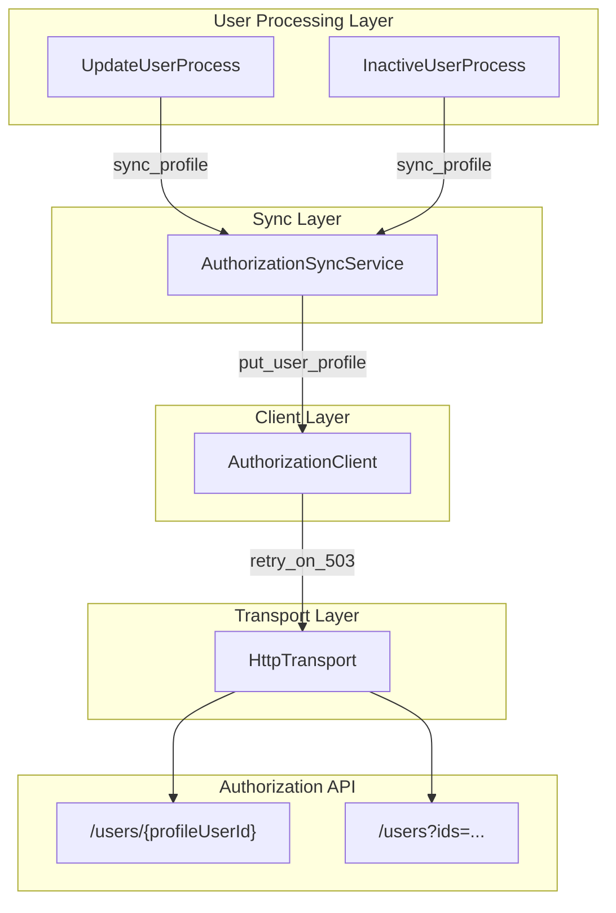

# Design Document: Authorization User Profiles

## Overview

This feature extends the existing authorization client library and user processing pipeline to support user profile CRUD operations against the NACC Authorization API's `/users` endpoints. The design adds:

1. New Pydantic models (`UserProfileRequest`, `UserProfile`, `UserProfileList`) in the authorization models module
2. A new `NotFoundError` exception for 404 responses
3. Four new client methods (`put_user_profile`, `get_user_profile`, `delete_user_profile`, `get_user_profiles`) with Profile_User_ID validation and retry-on-503
4. A `sync_profile` method on `AuthorizationSyncService` for pushing user profiles during processing
5. Integration points in `InactiveUserProcess` and `UpdateUserProcess`/`UpdateCenterUserProcess` for both active and inactive users

The design follows existing patterns in the codebase: Pydantic models with camelCase aliases, `retry_on_503` wrapping, error classification into `ValidationError`/`UnexpectedError`/`ParseError`, and fault-isolated error reporting via `UserEventCollector`.

## Architecture



The profile sync is invoked alongside (but independently of) the existing grant sync. Both operations are fault-isolated: failure of one does not prevent the other from executing.

## Components and Interfaces

### 1. New Exception: `NotFoundError`

Added to `authorization/exceptions.py`:

```python
class NotFoundError(AuthorizationClientError):
    """Raised when the API returns 404 (resource not found)."""

    def __init__(self, message: str) -> None:
        super().__init__(message)
        self.message = message
```

### 2. New Models in `authorization/models.py`

#### UserProfileRequest

```python
class UserProfileRequest(BaseModel):
    """Request model for creating or updating a user profile."""

    model_config = ConfigDict(populate_by_name=True)

    first_name: str = Field(alias="firstName", min_length=1, max_length=256)
    last_name: str = Field(alias="lastName", min_length=1, max_length=256)
    email: str | None = Field(default=None, alias="email")
    auth_email: str = Field(alias="authEmail", min_length=1, max_length=256)
    active: bool | None = Field(default=None, alias="active")

    @field_validator("first_name", "last_name")
    @classmethod
    def must_contain_non_whitespace(cls, v: str) -> str:
        if not v.strip():
            raise ValueError("must contain at least one non-whitespace character")
        return v
```

#### UserProfile

```python
class UserProfile(BaseModel):
    """Response model for a user profile."""

    model_config = ConfigDict(populate_by_name=True)

    user_id: str = Field(alias="userId")
    first_name: str = Field(alias="firstName")
    last_name: str = Field(alias="lastName")
    email: str | None = Field(default=None)
    auth_email: str = Field(alias="authEmail")
    active: bool
```

#### UserProfileList

```python
class UserProfileList(BaseModel):
    """Response model for batch user profile retrieval."""

    model_config = ConfigDict(populate_by_name=True)

    users: list[UserProfile]
```

### 3. Profile_User_ID Validation

A private validation method on `AuthorizationClient`:

```python
import re

_PROFILE_USER_ID_PATTERN = re.compile(r"^Registry\d{6}@naccdata\.org$")

def _validate_profile_user_id(self, profile_user_id: str | None) -> None:
    """Validate a Profile User ID format.

    Args:
        profile_user_id: The ID to validate.

    Raises:
        ValidationError: If the ID is None, empty, or doesn't match the pattern.
    """
    if not profile_user_id:
        raise ValidationError(
            message="A non-empty Profile_User_ID is required",
        )
    if not _PROFILE_USER_ID_PATTERN.match(profile_user_id):
        raise ValidationError(
            message=(
                f"Invalid Profile_User_ID '{profile_user_id}'. "
                f"Expected format: RegistryNNNNNN@naccdata.org"
            ),
        )
```

### 4. New Client Methods on `AuthorizationClient`

All four methods follow the same pattern as existing methods:
- Validate input
- Build request
- Wrap transport call in `retry_on_503`
- Dispatch on status code
- Parse response or raise appropriate exception

#### put_user_profile

```python
def put_user_profile(
    self,
    profile_user_id: str,
    request: UserProfileRequest,
) -> UserProfile:
    """Create or update a user profile.

    Args:
        profile_user_id: The profile user ID (RegistryNNNNNN@naccdata.org).
        request: The profile data to set.

    Returns:
        The created/updated UserProfile.

    Raises:
        ValidationError: If profile_user_id is invalid or API returns 400.
        ServiceUnavailableError: If retries exhausted on 503.
        UnexpectedError: On other unexpected HTTP errors.
        ParseError: If the response body cannot be parsed.
    """
```

#### get_user_profile

```python
def get_user_profile(self, profile_user_id: str) -> UserProfile:
    """Get a user profile.

    Raises:
        ValidationError: If profile_user_id is invalid.
        NotFoundError: If the profile does not exist (404).
        ServiceUnavailableError: If retries exhausted on 503.
        UnexpectedError: On other unexpected HTTP errors.
        ParseError: If the response body cannot be parsed.
    """
```

#### delete_user_profile

```python
def delete_user_profile(self, profile_user_id: str) -> None:
    """Delete a user profile. Returns None on 204 or 404 (idempotent).

    Raises:
        ValidationError: If profile_user_id is invalid.
        ServiceUnavailableError: If retries exhausted on 503.
        UnexpectedError: On other unexpected HTTP errors.
    """
```

#### get_user_profiles

```python
def get_user_profiles(self, profile_user_ids: list[str]) -> list[UserProfile]:
    """Get multiple user profiles by ID.

    Args:
        profile_user_ids: List of profile user IDs to retrieve.

    Returns:
        List of UserProfile models.

    Raises:
        ValidationError: If any ID is invalid or API returns 400.
        ServiceUnavailableError: If retries exhausted on 503.
        UnexpectedError: On other unexpected HTTP errors.
        ParseError: If the response body cannot be parsed.
    """
```

### 5. AuthorizationSyncService.sync_profile

New method on `AuthorizationSyncService`:

```python
def sync_profile(
    self,
    registry_id: str,
    user_entry: UserEntry,
) -> None:
    """Push a user profile to the Authorization API.

    Constructs a UserProfileRequest from the user entry fields and
    calls put_user_profile. Catches AuthorizationClientError and
    reports via the event collector without raising.

    Skips sync if user_entry.auth_email is None (logs warning).

    Args:
        registry_id: The user's registry ID (used as Profile_User_ID).
        user_entry: The user entry containing profile data.
    """
```

The `AuthorizationClientProtocol` will be extended to include `put_user_profile`:

```python
class AuthorizationClientProtocol(Protocol):
    # ... existing methods ...

    def put_user_profile(
        self,
        profile_user_id: str,
        request: "UserProfileRequest",
    ) -> "UserProfile": ...
```

### 6. Integration in User Processes

#### Active Users (UpdateUserProcess / UpdateCenterUserProcess)

Profile sync is called after the existing authorization sync in `UpdateUserProcess.__authorize_user`:

```python
# After existing sync_user call
if sync_service is not None:
    try:
        sync_service.sync_profile(
            registry_id=registry_id,
            user_entry=entry,
        )
    except Exception as error:
        log.error("Profile sync failed for user %s: %s", registry_id, error)
```

Similarly in `UpdateCenterUserProcess.__authorize_user`.

#### Inactive Users (InactiveUserProcess)

A new step is added to `InactiveUserProcess.visit` before the existing steps:

```python
# Step 0: Profile sync (mark inactive)
if entry.registry_id:  # from registry_person if available
    try:
        sync_service = self.__env.authorization_sync
        if sync_service is not None:
            sync_service.sync_profile(
                registry_id=registry_id,
                user_entry=entry,  # entry.active is False
            )
    except Exception as error:
        log.error("Profile sync failed for inactive user %s: %s", entry.email, error)
```

Note: For inactive users, the `UserEntry` does not have a `registry_id` property directly. The registry_id must be resolved from the COmanage lookup (Step 2) or from the entry if it's a `CenterUserEntry` with a known registry person. The design handles this by checking if registry_id is available before attempting sync.

## Data Models

### Field Mapping: UserEntry → UserProfileRequest

| UserEntry field | UserProfileRequest field | Notes |
|---|---|---|
| `name.first_name` | `firstName` | Required, 1-256 chars |
| `name.last_name` | `lastName` | Required, 1-256 chars |
| `email` | `email` | Optional, email format |
| `auth_email` | `authEmail` | Required — skip sync if None |
| `active` | `active` | Boolean |

### Profile_User_ID

The Profile_User_ID is the `registry_id` from the user's COmanage registry person record. It follows the format `RegistryNNNNNN@naccdata.org` (e.g., `Registry000001@naccdata.org`).

### API Response Mapping

| API field (camelCase) | Python field (snake_case) | Type |
|---|---|---|
| `userId` | `user_id` | str |
| `firstName` | `first_name` | str |
| `lastName` | `last_name` | str |
| `email` | `email` | str \| None |
| `authEmail` | `auth_email` | str |
| `active` | `active` | bool |

## Correctness Properties

*A property is a characteristic or behavior that should hold true across all valid executions of a system — essentially, a formal statement about what the system should do. Properties serve as the bridge between human-readable specifications and machine-verifiable correctness guarantees.*

### Property 1: Request routing correctness

*For any* valid Profile_User_ID, calling `put_user_profile` SHALL send a PUT request to `/users/{profileUserId}`, calling `get_user_profile` SHALL send a GET request to `/users/{profileUserId}`, calling `delete_user_profile` SHALL send a DELETE request to `/users/{profileUserId}`, and calling `get_user_profiles` with a list of IDs SHALL send a GET request to `/users` with the IDs joined as a comma-separated `ids` query parameter.

**Validates: Requirements 1.1, 1.2, 1.3, 1.4**

### Property 2: UserProfile response parsing round-trip

*For any* valid UserProfile data (userId, firstName, lastName, email, authEmail, active), serializing to JSON with camelCase keys and then parsing via `UserProfile.model_validate_json` SHALL produce a model whose fields match the original data.

**Validates: Requirements 1.5, 1.11, 1.13, 2.2, 2.4**

### Property 3: UserProfileRequest serialization round-trip

*For any* valid UserProfileRequest constructed with snake_case field names, serializing with `model_dump_json(by_alias=True)` SHALL produce JSON with camelCase keys, and deserializing that JSON back SHALL produce an equivalent model.

**Validates: Requirements 2.1, 2.3**

### Property 4: Profile_User_ID validation

*For any* string, the validation method SHALL accept it if and only if it matches the pattern `^Registry\d{6}@naccdata\.org$`. Strings that do not match (including None and empty string) SHALL cause a ValidationError to be raised before any HTTP request is sent.

**Validates: Requirements 5.1, 5.2, 5.3, 5.4**

### Property 5: Name field validation rejects invalid inputs

*For any* string that is empty or composed entirely of whitespace, or exceeds 256 characters, constructing a `UserProfileRequest` with that string as `first_name` or `last_name` SHALL raise a Pydantic validation error.

**Validates: Requirements 2.5**

### Property 6: Field mapping correctness

*For any* user entry with non-null auth_email, calling `sync_profile` SHALL construct a `UserProfileRequest` where `firstName` equals `entry.name.first_name`, `lastName` equals `entry.name.last_name`, `email` equals `entry.email`, `authEmail` equals `entry.auth_email`, and `active` equals `entry.active`.

**Validates: Requirements 3.3, 6.2**

### Property 7: Unexpected status codes raise UnexpectedError

*For any* HTTP status code not in the set of explicitly handled codes for a given profile method, the method SHALL raise an `UnexpectedError` containing that status code and the error message from the response body.

**Validates: Requirements 1.12**

### Property 8: Idempotent profile sync

*For any* user entry processed N times (N ≥ 1) with the same data, the `sync_profile` method SHALL send the same `UserProfileRequest` body to the same Profile_User_ID endpoint each time, and SHALL not raise exceptions or report errors when the API returns 200.

**Validates: Requirements 6.1, 6.2, 6.3**

## Error Handling

### Client Layer

| HTTP Status | Method | Behavior |
|---|---|---|
| 200 | put, get, get_profiles | Parse and return model |
| 204 | delete | Return None |
| 400 | all | Raise `ValidationError` with error message |
| 404 | get | Raise `NotFoundError` |
| 404 | delete | Return None (idempotent) |
| 503 | all | Retry with exponential backoff; raise `ServiceUnavailableError` if exhausted |
| Other | all | Raise `UnexpectedError` with status code and message |

### Sync Layer

`AuthorizationSyncService.sync_profile` catches all `AuthorizationClientError` exceptions and reports them via the event collector with category `AUTHORIZATION_SYNC`. It does not propagate exceptions.

### Process Layer

Both `UpdateUserProcess` and `InactiveUserProcess` wrap `sync_profile` calls in try/except blocks catching `Exception` as a safety net (matching the existing pattern for `sync_user`). This ensures profile sync failures never block other processing steps.

### Fault Isolation

Profile sync and grant sync are independent operations:
- In `UpdateUserProcess.__authorize_user`: grant sync runs first, then profile sync. Each has its own try/except.
- In `InactiveUserProcess.visit`: profile sync runs as a new independent step alongside existing steps (Flywheel disable, COmanage lookup, REDCap removal, COmanage suspend).

## Testing Strategy

### Property-Based Tests (Hypothesis)

Property-based testing is appropriate for this feature because:
- The models have clear input/output behavior with validation constraints
- Profile_User_ID validation has a well-defined acceptance pattern
- Field mapping is a pure transformation testable across many inputs
- Serialization/deserialization are classic round-trip properties

**Library**: [Hypothesis](https://hypothesis.readthedocs.io/) (already available in the project)

**Configuration**: Minimum 100 iterations per property test.

**Tag format**: `Feature: authorization-user-profiles, Property {number}: {property_text}`

Each correctness property above maps to a single property-based test:

1. **Property 1** — Generate random valid Profile_User_IDs, call each method with a mock transport, assert correct HTTP method and path.
2. **Property 2** — Generate random UserProfile field values, serialize to JSON, parse, assert field equality.
3. **Property 3** — Generate random valid UserProfileRequest inputs, serialize, deserialize, assert equivalence.
4. **Property 4** — Generate random strings (both matching and non-matching the pattern), assert validation accepts/rejects correctly.
5. **Property 5** — Generate empty strings, whitespace-only strings, and strings >256 chars, assert validation rejects.
6. **Property 6** — Generate random user entries with non-null auth_email, call sync_profile with mock client, assert UserProfileRequest fields match mapping.
7. **Property 7** — Generate random unexpected status codes, assert UnexpectedError raised with correct fields.
8. **Property 8** — Generate random user entries, call sync_profile multiple times, assert same request sent each time.

### Unit Tests (Example-Based)

- `delete_user_profile` returns None on 204
- `delete_user_profile` returns None on 404 (idempotent)
- `sync_profile` skips when auth_email is None and logs warning
- `sync_profile` reports error via event collector on AuthorizationClientError
- Profile sync for inactive user with null registry_id is skipped
- Retry-on-503 integration (mock 503 then 200)

### Integration Tests

- Fault isolation: profile sync failure does not block grant sync
- Fault isolation: grant sync failure does not block profile sync
- InactiveUserProcess continues remaining steps after profile sync failure
