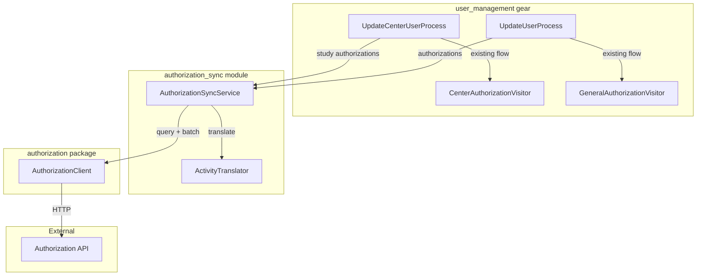

# Design Document

## Overview

The Authorization User Sync integrates the `user_management` gear with the NACC Authorization API by translating the gear's internal authorization vocabulary (`Activity` = action + `Resource`) into the API's grant vocabulary (resource type, relation, resource ID) and synchronizing the user's grants via a diff-based process.

The sync executes after the existing `CenterAuthorizationVisitor` / `GeneralAuthorizationVisitor` processing within `UpdateCenterUserProcess` and `UpdateUserProcess`. It is injected as an optional dependency — when absent, the gear operates exactly as before.

### Design Decisions

1. **Translator as a pure function module**: The `ActivityTranslator` is a stateless module with pure functions. It receives either study authorizations with a center group ID (for center-scoped grants) or general authorizations (for non-center grants such as pages), and returns a set of `Grant` objects. No side effects, no I/O — fully testable without mocks.

2. **Resource IDs from `project_label`**: The translator reads `project_label` directly from the `ProjectMetadata` objects that the `CenterAuthorizationVisitor` already traverses. This is consistent with how the existing visitor resolves projects and matches the labels the resource-hierarchy seeder registers. No label construction from parts is needed.

3. **Mapping as a module-level constant**: The activity-to-relation mapping is a simple dictionary defined at module level. It maps `(action, resource_prefix)` tuples to lists of `(api_type, relation)` pairs. This keeps the mapping co-located, readable, and easy to extend.

4. **AuthorizationSyncService as the orchestrator**: A single class encapsulates the query-diff-apply cycle. It accepts an `AuthorizationClient` and exposes a `sync_user` method. Fault isolation is handled at this layer — all exceptions from the client are caught, logged, and reported via `UserEventCollector`.

5. **Optional field on UserProcessEnvironment**: The `AuthorizationSyncService` is added as an optional field on `UserProcessEnvironment`, following the existing pattern of `domain_config` and `idp_config`. When `None`, processes skip the sync step. This avoids modifying individual process constructors and keeps the service accessible to any process that needs it.

6. **Dedicated EventCategory**: A new `AUTHORIZATION_SYNC` value is added to `EventCategory` so operators can filter sync events separately from Flywheel role assignment errors.

## Architecture



The flow for a center user:
1. `UpdateCenterUserProcess.visit()` applies `CenterAuthorizationVisitor` (existing Flywheel role assignment)
2. After visitor completes, calls `AuthorizationSyncService.sync_user()` for each study authorization with the registry_id, the `StudyAuthorizations`, and the center group ID
3. `AuthorizationSyncService` uses `translate()` to compute desired grants
4. Queries current grants from the API
5. Computes diff and applies via batch

The flow for general authorizations:
1. `UpdateUserProcess.visit()` applies `GeneralAuthorizationVisitor` (existing Flywheel role assignment)
2. After visitor completes, calls `AuthorizationSyncService.sync_user()` with the registry_id, the `Authorizations`, and no center group ID
3. Same query-diff-apply cycle

## Components and Interfaces

### ActivityTranslator

```python
"""Translates gear Activity vocabulary to Authorization API grant vocabulary."""

from dataclasses import dataclass
from typing import Optional

# Module-level mapping constant
ACTIVITY_RELATION_MAP: dict[
    tuple[str, str],  # (action, resource_prefix)
    list[tuple[str, str]],  # [(api_type, relation), ...]
] = {
    ("submit-audit", "datatype"): [
        ("data_pipeline", "submitter"),
        ("data_pipeline", "viewer"),
    ],
    ("view", "datatype"): [("data_pipeline", "viewer")],
    ("view", "dashboard"): [("dashboard", "viewer")],
    ("view", "page"): [("page", "viewer")],
}


@dataclass(frozen=True)
class DesiredGrant:
    """A grant the user should hold in the Authorization API."""

    user_id: str
    resource_type: str
    resource_id: str
    relation: str


def translate(
    registry_id: str,
    authorizations: "Authorizations",
    center_group_id: Optional[str] = None,
) -> set[DesiredGrant]:
    """Translate authorizations to desired grants.

    Iterates activities in the authorizations and maps each to grants
    using ACTIVITY_RELATION_MAP.

    Resource ID scoping depends on center_group_id:
    - When provided: resource_id = "{center_group_id}/{project_label}"
    - When None: resource_id = "{project_label}" (no prefix)

    Works with both Authorizations (general) and StudyAuthorizations
    (center-scoped) since StudyAuthorizations extends Authorizations.

    Args:
        registry_id: The user's registry ID (ePPN).
        authorizations: The authorizations to translate (Authorizations
            or StudyAuthorizations).
        center_group_id: The Flywheel group ID for the center, or None
            for general (non-center) authorizations.

    Returns:
        Set of DesiredGrant objects.
    """
    ...
```

### AuthorizationSyncService

```python
class AuthorizationSyncService:
    """Orchestrates the query-diff-apply cycle for user grant synchronization."""

    def __init__(
        self,
        client: "AuthorizationClient",
        collector: "UserEventCollector",
    ) -> None:
        """Initialize with an authorization client and event collector.

        Args:
            client: The authorization client for API calls.
            collector: Event collector for reporting sync outcomes.
        """
        ...

    def sync_user(
        self,
        registry_id: str,
        authorizations: "Authorizations",
        center_group_id: Optional[str] = None,
    ) -> None:
        """Synchronize grants for a user's authorizations.

        Translates the authorizations to desired grants, queries current
        grants from the API, computes the diff, and applies changes via batch.

        Works for both center-scoped (StudyAuthorizations with center_group_id)
        and general (Authorizations without center_group_id) authorizations.

        Catches all AuthorizationClientError exceptions and reports via
        the event collector without raising.

        Args:
            registry_id: The user's registry ID (ePPN).
            authorizations: The authorizations to sync (Authorizations or
                StudyAuthorizations).
            center_group_id: The Flywheel group ID for the center, or None
                for general authorizations.
        """
        ...

    def _compute_diff(
        self,
        desired: set[DesiredGrant],
        current: set[DesiredGrant],
    ) -> tuple[set[DesiredGrant], set[DesiredGrant]]:
        """Compute grants to add and revoke.

        Args:
            desired: The set of grants the user should have.
            current: The set of grants the user currently has.

        Returns:
            Tuple of (grants_to_add, grants_to_revoke).
        """
        ...

    def _parse_current_grants(
        self,
        user_id: str,
        permissions: "UserPermissions",
    ) -> set[DesiredGrant]:
        """Parse API permissions response into a flat set of grants.

        Args:
            user_id: The user's registry ID.
            permissions: The permissions response from the API.

        Returns:
            Set of DesiredGrant objects representing current state.
        """
        ...
```

### Modified UserProcessEnvironment

```python
class UserProcessEnvironment:
    def __init__(
        self,
        *,
        admin_group: NACCGroup,
        authorization_map: AuthMap,
        proxy: FlywheelProxy,
        registry: UserRegistry,
        notification_client: NotificationClient,
        domain_config: DomainRelationshipConfig | None = None,
        idp_config: IdPDomainConfig | None = None,
        authorization_sync: Optional[AuthorizationSyncService] = None,
    ) -> None:
        ...

    @property
    def authorization_sync(self) -> Optional[AuthorizationSyncService]:
        return self.__authorization_sync
```

Processes access it via `self.__env.authorization_sync`. No changes to process constructors are needed.

### New EventCategory Value

```python
class EventCategory(Enum):
    # ... existing values ...
    AUTHORIZATION_SYNC = "Authorization Sync"
```

## Data Models

### DesiredGrant

A frozen dataclass representing a single grant in the Authorization API:

```python
@dataclass(frozen=True)
class DesiredGrant:
    user_id: str       # registry_id (ePPN)
    resource_type: str # "data_pipeline", "dashboard", or "page"
    resource_id: str   # scoped project label
    relation: str      # "submitter", "viewer", "editor"
```

Two `DesiredGrant` instances are equal when all four fields match (case-sensitive). The frozen dataclass provides `__hash__` and `__eq__` for set operations.

### Activity-to-Grant Mapping

| Gear Action | Resource Type | API Type | API Relation(s) |
| --- | --- | --- | --- |
| `submit-audit` | `DatatypeResource` | `data_pipeline` | `submitter` + `viewer` |
| `view` | `DatatypeResource` | `data_pipeline` | `viewer` |
| `view` | `DashboardResource` | `dashboard` | `viewer` |
| `view` | `PageResource` | `page` | `viewer` |

Unmapped combinations (e.g., `submit-audit` + `DashboardResource`) are logged and skipped.

### Resource ID Scoping

| Context | Resource ID Format | Example |
| --- | --- | --- |
| Center-scoped (study auth) | `{center_group_id}/{project_label}` | `washington/ingest-form` |
| General (page) | `{project_label}` | `page-community-resources` |

The `project_label` comes from the `ProjectMetadata.project_label` field — the same label the resource-hierarchy seeder uses when calling `set_resource_parents`. For center-scoped resources, the center group ID is prepended as a scope prefix to match the hierarchy seeder's registration pattern.

### Grant Diff Model

```python
# Grants to add = desired - current
grants_to_add: set[DesiredGrant] = desired_grants - current_grants

# Grants to revoke = current - desired
grants_to_revoke: set[DesiredGrant] = current_grants - desired_grants
```

### BatchOperation Construction

Each `DesiredGrant` maps directly to a `BatchOperation`:

```python
from authorization import BatchOperation

def grant_to_batch_op(grant: DesiredGrant, action: str) -> BatchOperation:
    return BatchOperation(
        action=action,  # "grant" or "revoke"
        user_id=grant.user_id,
        resource_type=grant.resource_type,
        resource_id=grant.resource_id,
        relation=grant.relation,
    )
```


## Correctness Properties

*A property is a characteristic or behavior that should hold true across all valid executions of a system — essentially, a formal statement about what the system should do. Properties serve as the bridge between human-readable specifications and machine-verifiable correctness guarantees.*

### Property 1: Activity-to-relation mapping correctness

*For any* Activity consisting of an action and a Resource, the translator SHALL produce exactly the set of (resource_type, relation) pairs defined in the ACTIVITY_RELATION_MAP for that (action, resource_prefix) combination, and SHALL produce an empty set for any combination not present in the map. In particular, `submit-audit` on a DatatypeResource always produces both `(data_pipeline, submitter)` and `(data_pipeline, viewer)`.

**Validates: Requirements 1.1, 1.2, 1.3, 1.4, 1.5, 1.7, 10.1, 10.3**

### Property 2: Resource ID scoping

*For any* center-scoped translation (given a center_group_id and project_label), the resource_id in every produced grant SHALL equal `{center_group_id}/{project_label}`. *For any* general (non-center) translation, the resource_id SHALL equal the project_label with no center or study prefix.

**Validates: Requirements 2.1, 2.2, 2.3, 3.1, 3.2**

### Property 3: Output deduplication

*For any* set of input activities (including cases where both `submit-audit` and `view` exist for the same resource), the translator SHALL return a set of DesiredGrant objects with no duplicates — no two grants share the same (user_id, resource_type, resource_id, relation) tuple.

**Validates: Requirements 3.5, 10.2**

### Property 4: Unmapped activities are skipped without error

*For any* Activity whose (action, resource_prefix) combination is not present in the mapping table, or whose context is insufficient to resolve a resource ID, the translator SHALL produce no grant for that activity and SHALL not raise an exception.

**Validates: Requirements 2.5, 3.4**

### Property 5: Permissions response parsing

*For any* valid `UserPermissions` response (permissions grouped by resource type, each entry containing resource_id and relation), parsing SHALL produce a flat set of DesiredGrant objects where each entry corresponds to exactly one (user_id, resource_type, resource_id, relation) tuple from the response.

**Validates: Requirements 4.2**

### Property 6: Diff computation correctness

*For any* two sets of grants (desired and current), the sync SHALL compute grants_to_add as exactly `desired - current` and grants_to_revoke as exactly `current - desired`, using case-sensitive four-field equality (user_id, resource_type, resource_id, relation). When the sets are identical, both diffs SHALL be empty.

**Validates: Requirements 5.1, 5.2, 5.3, 5.4**

### Property 7: Batch construction from diff

*For any* non-empty diff (grants to add or revoke), the sync SHALL submit exactly one batch call to the AuthorizationClient containing one BatchOperation per grant in the diff — each with the correct action ("grant" or "revoke"), user_id, resource_type, resource_id, and relation.

**Validates: Requirements 6.1, 6.2**

### Property 8: Fault isolation with event reporting

*For any* exception raised by the AuthorizationClient during sync (query, batch, or any other call), the sync SHALL catch the exception without re-raising, and SHALL report it via UserEventCollector as a UserProcessEvent with EventType ERROR, EventCategory AUTHORIZATION_SYNC, a UserContext containing the user's Registry_ID, and a message describing the failure.

**Validates: Requirements 4.3, 7.1, 7.3, 7.4, 9.2**

## Error Handling

### Exception Handling Strategy

The `AuthorizationSyncService` wraps all client interactions in try/except at the `sync_user` level:

```python
def sync_user(
    self,
    registry_id: str,
    authorizations: Authorizations,
    center_group_id: Optional[str] = None,
) -> None:
    if not registry_id:
        log.warning("Cannot sync user without registry_id")
        return

    try:
        desired = translate(
            registry_id=registry_id,
            authorizations=authorizations,
            center_group_id=center_group_id,
        )
        permissions = self._client.get_user_permissions(user_id=registry_id)
        current = self._parse_current_grants(registry_id, permissions)

        grants_to_add, grants_to_revoke = self._compute_diff(desired, current)

        if not grants_to_add and not grants_to_revoke:
            log.debug("No grant changes needed for user %s", registry_id)
            return

        operations = [
            grant_to_batch_op(g, "grant") for g in grants_to_add
        ] + [
            grant_to_batch_op(g, "revoke") for g in grants_to_revoke
        ]

        result = self._client.batch(operations)

        log.info(
            "Authorization sync for user %s: %d added, %d revoked, %d failed",
            registry_id,
            len(grants_to_add),
            len(grants_to_revoke),
            result.failed,
        )

        if result.failed > 0:
            self._report_partial_failure(registry_id, result)

    except AuthorizationClientError as error:
        log.error(
            "Authorization sync failed for user %s: %s",
            registry_id,
            error,
        )
        self._report_failure(registry_id, "sync", error)
```

### Error Categories

| Error Source | Behavior |
| --- | --- |
| `registry_id` is None | Log warning, skip sync |
| `AuthorizationClientError` during `get_user_permissions` | Catch, log error, report via collector, skip user |
| `AuthorizationClientError` during `batch` | Catch, log error, report via collector, skip user |
| `BatchResult` with `failed > 0` | Log info for successes, report error events for failures |
| Any unexpected exception | Catch at outer level, log error, report via collector |

### Integration with Existing Error Reporting

The sync uses the same `UserEventCollector` pattern as the rest of the gear:

```python
def _report_failure(
    self, registry_id: str, operation: str, error: Exception
) -> None:
    event = UserProcessEvent(
        event_type=EventType.ERROR,
        category=EventCategory.AUTHORIZATION_SYNC,
        user_context=UserContext(
            registry_id=registry_id,
            email="",  # not always available at this layer
        ),
        message=f"Authorization sync {operation} failed: {error}",
    )
    self._collector.collect(event)
```

### Client Unavailability

At gear startup, the `AuthorizationClient` creation is wrapped:

```python
authorization_client: Optional[AuthorizationClient] = None
try:
    authorization_client = create_authorization_client()
except ConfigurationError as error:
    log.error(
        "Authorization client creation failed, sync disabled: %s", error
    )
```

If `authorization_client` is `None`, the `AuthorizationSyncService` is not created, and the process constructors receive `None` — skipping all sync operations.

## Testing Strategy

### Property-Based Testing

This feature is well-suited for property-based testing because:

- The translator is a pure function with clear input/output behavior (activities → grants)
- Universal properties hold across a wide input space (any valid activity, resource name, center ID)
- The diff computation is a pure set operation
- The `AuthorizationClient` is injected, so a mock captures calls without network I/O — cost-effective for 100+ iterations

**Library**: `hypothesis` (already in project dependencies)

**Configuration**:

- Minimum 100 examples per property test
- Each test tagged with: `Feature: authorization-user-sync, Property {N}: {title}`

**Generators needed**:

- Valid actions (`submit-audit`, `view`)
- Valid Resource instances (`DatatypeResource`, `DashboardResource`, `PageResource` with random names)
- Valid center group IDs (non-empty alphanumeric strings with hyphens)
- Valid study IDs (non-empty alphanumeric strings)
- Valid project labels (non-empty strings matching existing naming patterns)
- Valid registry IDs (non-empty strings representing ePPNs)
- Sets of `DesiredGrant` instances (for diff testing)
- `UserPermissions` response instances (for parsing testing)
- `AuthorizationClientError` subclass instances (for fault isolation testing)

### Unit Tests (Example-Based)

- Translator with empty study_authorizations returns empty set
- Translator with `submit-audit` + `view` on same resource deduplicates viewer
- Sync with `None` client dependency skips all operations
- Sync with identical desired/current makes no batch call
- Sync logs info with correct counts on success
- Partial batch failure reports individual error events
- `AUTHORIZATION_SYNC` EventCategory value is unique

### Integration Tests

- `UpdateCenterUserProcess` with mock sync service verifies sync is called after visitor
- `UpdateUserProcess` with mock sync service verifies general sync is called
- Full sync flow with mock client: translate → query → diff → batch
- Sync failure does not prevent Flywheel role assignment

### Test Organization

```text
common/test/python/authorization_sync_test/
├── __init__.py
├── conftest.py                    # Shared fixtures, generators, mock client
├── test_activity_translator.py    # Property tests for translator (Properties 1-4)
├── test_permissions_parser.py     # Property tests for parsing (Property 5)
├── test_diff_computation.py       # Property tests for diff (Property 6)
├── test_batch_construction.py     # Property tests for batch (Property 7)
├── test_fault_isolation.py        # Property tests for error handling (Property 8)
└── test_sync_integration.py       # Integration tests with process classes
```

### Property Test Implementation Notes

Each correctness property maps to a single `@given`-decorated test:

- **Property 1** (mapping): Generate `(action, Resource)` pairs from the full space, call the mapping function, assert output matches ACTIVITY_RELATION_MAP lookup.
- **Property 2** (scoping): Generate `(center_group_id, project_label)` pairs for center-scoped, and `project_label` for general, verify resource_id format.
- **Property 3** (deduplication): Generate activity lists with intentional duplicates (e.g., submit-audit + view on same resource), verify output set has no duplicate tuples.
- **Property 4** (unmapped skip): Generate invalid `(action, resource_prefix)` combinations, verify empty output and no exception.
- **Property 5** (parsing): Generate `UserPermissions` dicts with random resource types and entries, verify parsed set matches expected flat representation.
- **Property 6** (diff): Generate two random sets of `DesiredGrant`, verify `_compute_diff` returns `(desired - current, current - desired)`.
- **Property 7** (batch): Generate non-empty diffs, mock client, verify batch is called once with correct operations.
- **Property 8** (fault isolation): Generate random `AuthorizationClientError` subclasses, configure mock to raise, verify no exception escapes and collector receives event.
