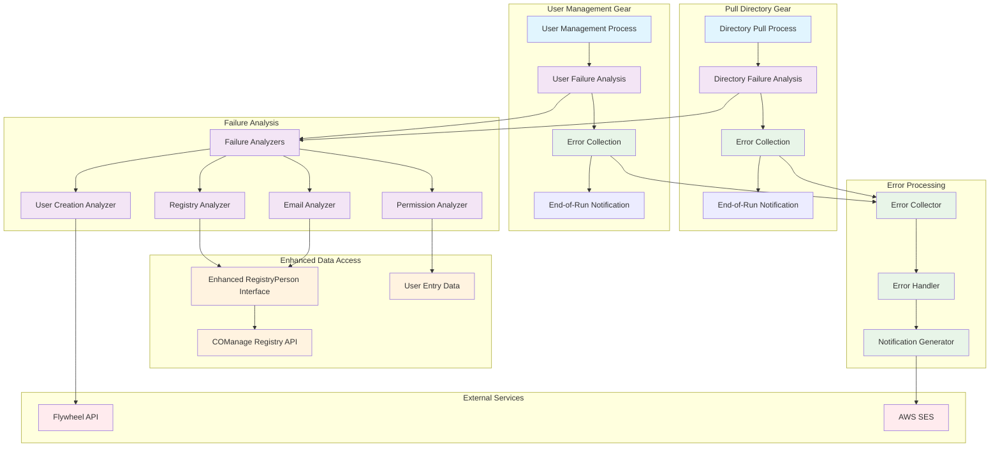

# Design Document: Automated Error Handling for User Management

## Overview

This design document outlines the architecture for a reusable error handling framework that can be integrated into both the pull_directory and user_management gears. The framework provides error capture, categorization, and notification capabilities that each gear can use independently during their execution.

**Framework Usage Pattern:**
- **pull_directory gear**: Captures errors discovered during directory report processing, sends one consolidated notification at the end
- **user_management gear**: Captures errors discovered during user process execution, sends notification at the end of the gear run
- **Framework Integration**: Extends existing user processes and integrates with gear execution patterns

The design builds upon the existing infrastructure including UserProcess classes, COManage registry API, Flywheel API, AWS Parameter Store, and AWS SES while providing a clean framework interface for error handling.

## Architecture

The error handling approach follows a failure-triggered analysis pattern with enhanced RegistryPerson interface for comprehensive COManage data access:



**Enhanced Data Access Pattern:**
- **RegistryPerson Interface**: ✅ **ENHANCED** - Now provides comprehensive access to COManage data including:
  - ✅ Email verification status via `verified_email_addresses` property
  - ✅ Detailed ORCID claim information via enhanced `is_claimed()` method with comprehensive validation logic
  - ✅ Priority-based email selection (organizational → official → verified → any) via `email_address` property
  - ✅ Comprehensive email address comparison via `email_addresses`, `organization_email_addresses`, `official_email_addresses`, `verified_email_addresses`, and `has_email()` methods
  - ✅ OrgIdentity details via `organization_email_addresses` property (uses internal `__get_claim_org()`)
  - ✅ OrgIdentity filtering via `org_identities(predicate)` method with predicate support for identity provider detection
  - ✅ Identifier filtering via `identifiers()` method with predicate support
  - ⚠️ CoPersonRole accessible through underlying `CoPersonMessage` but may need explicit property for error detection
  - ✅ All COManage data structures (EmailAddress, Identifier, OrgIdentity) accessible through clean interface methods
- **UserRegistry Interface**: ✅ **ENHANCED** - Provides methods for incomplete claim detection:
  - ✅ `has_bad_claim(name)` - Check if a person has an incomplete claim (claimed but no email)
  - ✅ `get_bad_claim(name)` - Retrieve list of RegistryPerson objects with incomplete claims for analysis
- **Module-Level Utilities**: ✅ **ADDED** - Helper functions for common predicates:
  - ✅ `org_name_is(name)` - Creates predicate for testing organizational identity names (e.g., "ORCID")
- **User Entry Data**: Direct access to directory information including authorizations for permission checking
- **COManage Registry API**: Accessed through enhanced RegistryPerson interface for consistency

**Failure-Triggered Analysis Pattern:**
1. **Normal Processing**: User processes run as usual
2. **Failure Detection**: When a failure occurs, user process calls appropriate analyzer
3. **Failure Analysis**: Analyzer investigates WHY the failure occurred using enhanced RegistryPerson interface and user entry data
4. **Error Collection**: Analyzer categorizes the failure and adds to error collection
5. **End-of-Run Notification**: All collected errors are sent in one consolidated notification via SES

**Parameter Store Usage:**
- Gear initialization (in run.py) pulls support staff email configuration from Parameter Store
- Notification generator is created with this configuration during gear setup
- No ongoing Parameter Store interaction during error processing

## Components and Interfaces

### Error Collection

Error collection with automatic categorization that integrates directly with existing gear patterns:

**Gear Integration:**
```python
# In gear run.py - gear creates error handling objects as core functionality
class UserManagementVisitor(GearExecutionEnvironment):
    def run(self, context: GearToolkitContext) -> None:
        # Create error handling objects as core functionality
        collector = UserEventCollector()
            
        with ApiClient(configuration=self.__comanage_config) as comanage_client:
            admin_group = self.admin_group(admin_id=self.__admin_id)
            admin_group.set_redcap_param_repo(self.__redcap_param_repo)
            
            user_registry = UserRegistry(
                api_instance=DefaultApi(comanage_client),
                coid=self.__comanage_coid,
            )
            
            # Use existing UserProcess with error handling
            user_process = UserProcess(
                environment=UserProcessEnvironment(
                    admin_group=admin_group,
                    authorization_map=self.__get_auth_map(self.__auth_filepath),
                    notification_client=NotificationClient(...),
                    proxy=self.proxy,
                    registry=user_registry,
                ),
                collector=collector
            )
            
            # Run user processing
            user_process.execute(user_queue)
            
            # Send consolidated notification at end if there are errors
            if collector.has_errors():
                support_emails = self._get_support_staff_emails()
                notification_generator = ErrorNotificationGenerator(
                    email_client=create_ses_client(),
                    configuration_set_name="your-ses-config"
                )
                notification_generator.send_error_notification(
                    collector=collector,
                    gear_name="user_management",
                    support_emails=support_emails
                )

class UserProcess(BaseUserProcess[UserEntry]):
    """Modified to include error handling as core functionality."""
    
    def __init__(self, environment: UserProcessEnvironment,
                 collector: UserEventCollector):
        self._active_queue: UserQueue[ActiveUserEntry] = UserQueue()
        self._inactive_queue: UserQueue[UserEntry] = UserQueue()
        self._env = environment
        
        # Error handling components (immutable)
        self.__collector = collector
    
    @property
    def collector(self) -> UserEventCollector:
        """Read-only access to the event collector."""
        return self.__collector
    
    def execute(self, queue: UserQueue[UserEntry]) -> None:
        """Modified to pass error handling objects to sub-processes."""
        log.info("**Processing directory entries")
        queue.apply(self)

        # Pass error handling objects to sub-processes
        ActiveUserProcess(
            self._env, self.collector
        ).execute(self._active_queue)
        
        InactiveUserProcess().execute(self._inactive_queue)

class UserEventCollector:
    """Event collector that accumulates and categorizes events during gear execution.
    
    The UserEventCollector automatically categorizes events as they are collected,
    maintaining an internal structure grouped by EventCategory. This allows
    efficient querying by category and simplifies notification generation.
    """
    
    def __init__(self):
        """Initialize an empty event collector with categorized storage."""
        self._events: Dict[EventCategory, List[UserProcessEvent]] = defaultdict(list)
    
    def collect(self, event: UserProcessEvent) -> None:
        """Add an event to the collection, automatically categorizing it.
        
        Args:
            event: The event to add to the collection
        """
        # Convert string category back to enum if needed (handles use_enum_values=True)
        if isinstance(event.category, str):
            category_enum = next(
                (cat for cat in EventCategory if cat.value == event.category),
                None,
            )
            if category_enum:
                self._events[category_enum].append(event)
        else:
            self._events[event.category].append(event)
    
    def get_errors(self) -> List[UserProcessEvent]:
        """Get all collected error events as a flat list.
        
        Returns:
            A list of all collected error events
        """
        all_errors = []
        for event_list in self._events.values():
            all_errors.extend([e for e in event_list if e.is_error()])
        return all_errors
    
    def get_errors_by_category(self) -> Dict[ErrorCategory, List[ErrorEvent]]:
        """Get errors grouped by category.
        
        Returns:
            Dictionary mapping error category to list of error events
        """
        return dict(self._errors)
    
    def get_errors_for_category(self, category: ErrorCategory) -> List[ErrorEvent]:
        """Get all errors for a specific category.
        
        Args:
            category: The error category to retrieve
            
        Returns:
            List of error events for the specified category
        """
        return self._errors.get(category, []).copy()
    
    def count_by_category(self) -> Dict[str, int]:
        """Count errors by category.
        
        Returns:
            Dictionary mapping category name (string) to count
        """
        return {
            category.value: len(errors) 
            for category, errors in self._errors.items()
        }
    
    def get_affected_users(self) -> List[str]:
        """Get list of unique user emails affected by errors.
        
        Returns:
            List of unique user email addresses
        """
        users = set()
        for error_list in self._errors.values():
            for error in error_list:
                users.add(error.user_context.email)
        return list(users)
    
    def clear(self) -> None:
        """Clear all collected errors."""
        self._errors.clear()
    
    def has_errors(self) -> bool:
        """Check if there are any collected errors.
        
        Returns:
            True if there are errors, False otherwise
        """
        return len(self._errors) > 0
    
    def error_count(self) -> int:
        """Get the total number of collected errors.
        
        Returns:
            The total number of error events in the collection
        """
        return sum(len(errors) for errors in self._errors.values())


```

### Direct Modification of Existing User Processes

Modify the existing user process classes to add error analysis at existing log points:

**Modified ActiveUserProcess:**
```python
class ActiveUserProcess(BaseUserProcess[ActiveUserEntry]):
    """Modified to include failure analysis at existing log points."""
    
    def __init__(self, environment: UserProcessEnvironment,
                 collector: UserEventCollector):
        super().__init__()
        self._env = environment
        self._claimed_queue: UserQueue[RegisteredUserEntry] = UserQueue()
        self._unclaimed_queue: UserQueue[ActiveUserEntry] = UserQueue()
        
        # Event handling components (immutable)
        self.__collector = collector
    
    @property
    def collector(self) -> UserEventCollector:
        """Read-only access to the event collector."""
        return self.__collector
    
    def visit(self, entry: ActiveUserEntry) -> None:
        """Modified to add failure analysis at existing log points."""
        if not entry.auth_email:
            log.error("User %s must have authentication email", entry.email)
            
            # Create error event for missing auth email
            error_event = ErrorEvent(
                category=ErrorCategory.MISSING_DIRECTORY_PERMISSIONS,
                user_context=UserContext.from_user_entry(entry),
                error_details={
                    "message": "User has no authentication email in directory",
                    "directory_email": entry.email,
                    "action_needed": "update_directory_auth_email"
                }
            )
            self.collector.collect(error_event)
            return
        
        person_list = self._env.user_registry.get(email=entry.auth_email)
        if not person_list:
            bad_claim = self._env.user_registry.get_bad_claim(entry.full_name)
            if bad_claim:
                log.error("Active user has incomplete claim: %s, %s", 
                         entry.full_name, entry.email)
                
                # Analyze incomplete claim to determine if ORCID is the identity provider
                error_event = self.failure_analyzer.detect_incomplete_claim(
                    entry, bad_claim
                )
                if error_event:
                    self.collector.collect(error_event)
                return
            
            # log.info() case - no error event needed, this is normal processing
            log.info("Active user not in registry: %s", entry.email)
            self.__add_to_registry(user_entry=entry)
            self._env.notification_client.send_claim_email(entry)
            log.info("Added user %s to registry using email %s", 
                    entry.email, entry.auth_email)
            return
        
        creation_date = self.__get_creation_date(person_list)
        if not creation_date:
            log.warning("person record for %s has no creation date", entry.email)
            
            # Create error event for missing creation date
            error_event = ErrorEvent(
                category=ErrorCategory.UNCLAIMED_RECORDS,
                user_context=UserContext.from_user_entry(entry),
                error_details={
                    "message": "Registry record exists but has no creation date",
                    "registry_records": len(person_list),
                    "action_needed": "check_registry_record_status"
                }
            )
            self.collector.collect(error_event)
            return
        
        entry.registration_date = creation_date
        claimed = self.__get_claimed(person_list)
        if claimed:
            registry_id = self.__get_registry_id(claimed)
            if not registry_id:
                log.error("User %s has no registry ID", entry.email)
                
                # Create error event for missing registry ID
                error_event = ErrorEvent(
                    category=ErrorCategory.UNCLAIMED_RECORDS,
                    user_context=UserContext.from_user_entry(entry),
                    error_details={
                        "message": "User appears claimed but has no registry ID",
                        "claimed_records": len(claimed),
                        "action_needed": "check_registry_id_assignment"
                    }
                )
                self.collector.collect(error_event)
                return
            
            self._claimed_queue.enqueue(entry.register(registry_id))
            return
        
        self._unclaimed_queue.enqueue(entry)

class ClaimedUserProcess(BaseUserProcess[RegisteredUserEntry]):
    """Modified to include failure analysis at existing log points."""
    
    def __init__(self, environment: UserProcessEnvironment, 
                 claimed_queue: UserQueue[RegisteredUserEntry],
                 collector: UserEventCollector):
        self._failed_count: Dict[str, int] = defaultdict(int)
        self._claimed_queue: UserQueue[RegisteredUserEntry] = claimed_queue
        self._created_queue: UserQueue[RegisteredUserEntry] = UserQueue()
        self._update_queue: UserQueue[RegisteredUserEntry] = UserQueue()
        self._env = environment
        
        # Event handling components (immutable)
        self.__collector = collector
        self.failure_analyzer = FailureAnalyzer(environment)
    
    @property
    def collector(self) -> UserEventCollector:
        """Read-only access to the event collector."""
        return self.__collector
    
    def __add_user(self, entry: RegisteredUserEntry) -> Optional[str]:
        """Modified to add failure analysis at existing log points."""
        try:
            return self._env.proxy.add_user(entry.as_user())
        except FlywheelError as error:
            self._failed_count[entry.registry_id] += 1
            if self._failed_count[entry.registry_id] >= 3:
                log.error("Unable to add user %s with ID %s: %s",
                         entry.email, entry.registry_id, str(error))
                
                # Analyze Flywheel user creation failure to determine root cause
                error_event = self.failure_analyzer.analyze_flywheel_user_creation_failure(entry, error)
                if error_event:
                    self.collector.collect(error_event)
                return None
            
            self._claimed_queue.enqueue(entry)
        return None

class UpdateUserProcess(BaseUserProcess[RegisteredUserEntry]):
    """Modified to include failure analysis at existing log points."""
    
    def __init__(self, environment: UserProcessEnvironment,
                 collector: UserEventCollector):
        self._env = environment
        
        # Event handling components (immutable)
        self.__collector = collector
        self.failure_analyzer = FailureAnalyzer(environment)
    
    @property
    def collector(self) -> UserEventCollector:
        """Read-only access to the event collector."""
        return self.__collector
    
    def visit(self, entry: RegisteredUserEntry) -> None:
        """Modified to add failure analysis at existing log points."""
        registry_person = self._env.user_registry.find_by_registry_id(entry.registry_id)
        
        if not registry_person:
            log.error("Failed to find a claimed user with Registry ID %s and email %s",
                     entry.registry_id, entry.email)
            
            # Analyze why claimed user is missing to determine root cause
            error_event = self.failure_analyzer.analyze_missing_claimed_user(entry)
            if error_event:
                self.collector.collect(error_event)
            return
        
        fw_user = self._env.proxy.find_user(entry.registry_id)
        if not fw_user:
            log.error("Failed to add user %s with ID %s", entry.email, entry.registry_id)
            
            # Create error event for missing Flywheel user - this indicates earlier failure
            # Note: This is not actually the failure point, the real failure occurred earlier
            error_event = ErrorEvent(
                category=ErrorCategory.UNCLAIMED_RECORDS,
                user_context=UserContext.from_user_entry(entry),
                error_details={
                    "message": "User should exist in Flywheel but was not found - indicates earlier creation failure",
                    "registry_id": entry.registry_id,
                    "action_needed": "check_user_creation_process_logs"
                }
            )
            self.collector.collect(error_event)
            return
        
        self.__update_email(user=fw_user, email=entry.email)
        
        registry_address = registry_person.email_address
        if not registry_address:
            log.error("Registry record does not have email address: %s", entry.registry_id)
            
            # Create error event for missing registry email
            error_event = ErrorEvent(
                category=ErrorCategory.UNVERIFIED_EMAIL,
                user_context=UserContext.from_user_entry(entry),
                error_details={
                    "message": "Registry record found but has no email address",
                    "registry_id": entry.registry_id,
                    "action_needed": "check_email_verification_in_comanage"
                }
            )
            self.collector.collect(error_event)
            return
        
        # Check for insufficient permissions based on user entry authorizations
        if not entry.authorizations:
            error_event = ErrorEvent(
                category=ErrorCategory.INSUFFICIENT_PERMISSIONS,
                user_context=UserContext.from_user_entry(entry),
                error_details={
                    "message": "User entry has no authorizations listed",
                    "registry_id": entry.registry_id,
                    "action_needed": "contact_center_administrator_for_permissions"
                }
            )
            self.collector.collect(error_event)
            return
        
        authorizations = {
            authorization.study_id: authorization
            for authorization in entry.authorizations
        }
        self.__authorize_user(
            user=fw_user,
            auth_email=registry_address.mail,
            center_id=entry.adcid,
            authorizations=authorizations,
        )
```

### Failure Analyzers

Analyzer that performs actual investigation for complex failure scenarios. The implementation includes only the three methods that are actively used in the user processes:

**Implemented Failure Analyzer:**
```python
class FailureAnalyzer:
    """Failure analyzer for complex scenarios that require investigation.
    
    This analyzer provides three core methods that are integrated into the user
    management processes:
    1. analyze_flywheel_user_creation_failure - Called when Flywheel user creation fails
    2. analyze_missing_claimed_user - Called when a claimed user can't be found
    3. detect_incomplete_claim - Called when a user has an incomplete claim
    """
    
    def __init__(self, environment: UserProcessEnvironment):
        self.env = environment
    
    def analyze_flywheel_user_creation_failure(
        self, entry: RegisteredUserEntry, error: FlywheelError
    ) -> Optional[ErrorEvent]:
        """Analyze why Flywheel user creation failed after 3 attempts.
        
        Checks for:
        - Duplicate user already exists in Flywheel
        - Permission issues
        - Generic Flywheel errors
        
        Called by: ClaimedUserProcess.__add_user()
        """
        # Check if user already exists (duplicate)
        existing_user = self.env.find_user(entry.registry_id)
        if existing_user:
            return ErrorEvent(
                category=ErrorCategory.DUPLICATE_USER_RECORDS,
                user_context=UserContext.from_user_entry(entry),
                error_details={
                    "message": "User already exists in Flywheel",
                    "existing_user_id": existing_user.id,
                    "registry_id": entry.registry_id,
                    "action_needed": "deactivate_duplicate_and_clear_cache"
                }
            )
        
        # Check if it's a permission issue
        error_str = str(error).lower()
        if "permission" in error_str or "unauthorized" in error_str:
            return ErrorEvent(
                category=ErrorCategory.INSUFFICIENT_PERMISSIONS,
                user_context=UserContext.from_user_entry(entry),
                error_details={
                    "message": "Insufficient permissions to create user in Flywheel",
                    "flywheel_error": str(error),
                    "action_needed": "check_flywheel_service_account_permissions"
                }
            )
        
        # Generic Flywheel error
        return ErrorEvent(
            category=ErrorCategory.FLYWHEEL_ERROR,
            user_context=UserContext.from_user_entry(entry),
            error_details={
                "message": "Flywheel user creation failed after 3 attempts",
                "error": str(error),
                "registry_id": entry.registry_id,
                "action_needed": "check_flywheel_logs_and_service_status"
            }
        )
    
    def analyze_missing_claimed_user(
        self, entry: RegisteredUserEntry
    ) -> Optional[ErrorEvent]:
        """Analyze why we can't find a claimed user by registry_id.
        
        This method is called when find_by_registry_id() returns None for a user
        that should exist (was previously found and claimed). It checks:
        1. If user exists by email (data inconsistency - raises RuntimeError)
        2. If user is in bad claims (incomplete claim)
        3. If user is missing entirely from registry
        
        Called by: UpdateUserProcess.visit()
        
        Raises:
            RuntimeError: If user found by email but not by registry_id
                         (indicates registry data structure inconsistency)
        """
        # Check if user exists by email
        email_to_check = entry.auth_email or entry.email
        person_list = self.env.get_from_registry(email=email_to_check)
        
        if person_list:
            # Data inconsistency - should never happen
            found_ids = [p.registry_id() for p in person_list]
            raise RuntimeError(
                f"Registry data inconsistency: User {email_to_check} found by "
                f"email (registry_ids: {found_ids}) but not by registry_id "
                f"{entry.registry_id}. This indicates a bug in registry indexing."
            )
        
        # Check if it's a bad claim
        full_name = entry.name.as_str() if entry.name else None
        if full_name:
            bad_claim_persons = self.env.user_registry.get_bad_claim(full_name)
            if bad_claim_persons:
                return self.detect_incomplete_claim(entry, bad_claim_persons)
        
        # Not found anywhere
        return ErrorEvent(
            category=ErrorCategory.MISSING_REGISTRY_DATA,
            user_context=UserContext.from_user_entry(entry),
            error_details={
                "message": (
                    "Expected claimed user not found in registry by ID, "
                    "email, or bad claims"
                ),
                "registry_id": entry.registry_id,
                "checked_email": email_to_check,
                "checked_name": full_name,
                "action_needed": "verify_registry_record_exists_or_was_deleted"
            }
        )
    
    def detect_incomplete_claim(
        self, entry: UserEntry, bad_claim_persons: List[RegistryPerson]
    ) -> Optional[ErrorEvent]:
        """Detect incomplete claims and identify if ORCID is the identity provider.
        
        An incomplete claim occurs when a user has claimed their account (logged in
        via an identity provider) but the identity provider did not return complete
        information such as email address. ORCID is a common identity provider that
        requires special configuration and often causes this issue.
        
        Called by: 
        - ActiveUserProcess.visit() when bad claim detected
        - analyze_missing_claimed_user() when checking bad claims
        
        Args:
            entry: The user entry from the directory
            bad_claim_persons: List of RegistryPerson objects with incomplete claims
            
        Returns:
            ErrorEvent with category BAD_ORCID_CLAIMS if ORCID detected,
            or INCOMPLETE_CLAIM otherwise
        """
        from users.user_registry import org_name_is
        
        # Check if any of the bad claim persons have ORCID org identity
        has_orcid = any(
            person.org_identities(predicate=org_name_is("ORCID"))
            for person in bad_claim_persons
        )
        
        if has_orcid:
            return ErrorEvent(
                category=ErrorCategory.BAD_ORCID_CLAIMS,
                user_context=UserContext.from_user_entry(entry),
                error_details={
                    "message": "User has incomplete claim with ORCID identity provider",
                    "full_name": entry.name.as_str() if entry.name else "unknown",
                    "has_orcid_org_identity": True,
                    "action_needed": "delete_bad_record_and_reclaim_with_institutional_idp"
                }
            )
        
        return ErrorEvent(
            category=ErrorCategory.INCOMPLETE_CLAIM,
            user_context=UserContext.from_user_entry(entry),
            error_details={
                "message": "User has incomplete claim (identity provider did not return email)",
                "full_name": entry.name.as_str() if entry.name else "unknown",
                "has_orcid_org_identity": False,
                "action_needed": "verify_identity_provider_configuration_and_reclaim"
            }
        )
```

**Note:** The original design included additional detection methods (detect_email_mismatch, detect_unverified_email, detect_insufficient_permissions, detect_duplicate_user) but these were not integrated into the user processes and have been removed from the implementation. The three methods above represent the actual failure analysis needs discovered during implementation.

### End-of-Run Notification

Notification generation that renders a UserEventCollector into a consolidated email:

**ErrorNotificationGenerator:**
```python
class ErrorNotificationGenerator:
    """Generates notifications for error events using AWS SES templates.
    
    The ErrorNotificationGenerator is a rendering engine that transforms a
    UserEventCollector (which contains categorized events) into a formatted
    email notification and sends it to support staff via AWS SES.
    
    Usage Pattern:
        UserEventCollector → ErrorNotificationGenerator → Email to Support Staff
    """
    
    # Template name mapping for each error category
    CATEGORY_TEMPLATES: ClassVar[Dict[ErrorCategory, str]] = {
        ErrorCategory.UNCLAIMED_RECORDS: "error-unclaimed-records",
        ErrorCategory.EMAIL_MISMATCH: "error-email-mismatch",
        ErrorCategory.UNVERIFIED_EMAIL: "error-unverified-email",
        ErrorCategory.INCOMPLETE_CLAIM: "error-incomplete-claim",
        ErrorCategory.BAD_ORCID_CLAIMS: "error-bad-orcid-claims",
        ErrorCategory.MISSING_DIRECTORY_PERMISSIONS: "error-missing-directory-permissions",
        ErrorCategory.MISSING_DIRECTORY_DATA: "error-missing-directory-data",
        ErrorCategory.MISSING_REGISTRY_DATA: "error-missing-registry-data",
        ErrorCategory.INSUFFICIENT_PERMISSIONS: "error-insufficient-permissions",
        ErrorCategory.DUPLICATE_USER_RECORDS: "error-duplicate-user-records",
        ErrorCategory.FLYWHEEL_ERROR: "error-flywheel-error",
    }
    
    def __init__(self, email_client: EmailClient, configuration_set_name: str):
        """Initialize the error notification generator.
        
        Args:
            email_client: The EmailClient instance for sending notifications
            configuration_set_name: The AWS SES configuration set name
        """
        self.__email_client = email_client
        self.__configuration_set_name = configuration_set_name
    
    def select_template(self, category: ErrorCategory) -> str:
        """Select the appropriate SES template for an error category.
        
        Args:
            category: The error category
            
        Returns:
            The SES template name for the category
        """
        return self.CATEGORY_TEMPLATES.get(category, "error-generic")
    
    def create_notification_data(
        self, collector: UserEventCollector, gear_name: str
    ) -> ConsolidatedNotificationData:
        """Create template data for consolidated notification.
        
        Transforms the categorized errors from the UserEventCollector into a
        structured data model ready for email template rendering.
        
        Args:
            collector: The UserEventCollector with categorized errors
            gear_name: Name of the gear that generated the errors
            
        Returns:
            ConsolidatedNotificationData ready for template rendering
        """
        # Get errors grouped by category from the collector
        grouped = collector.get_errors_by_category()
        
        # Create category-specific data
        category_data = {}
        
        for category, category_errors in grouped.items():
            error_list = []
            for error in category_errors:
                error_dict = {
                    "email": error.user_context.email,
                    "name": (
                        error.user_context.name.as_str()
                        if error.user_context.name
                        else "Unknown"
                    ),
                    "message": error.error_details.get("message", "No details"),
                    "timestamp": error.timestamp.isoformat(),
                }
                
                # Add category-specific fields
                if error.user_context.registry_id:
                    error_dict["registry_id"] = error.user_context.registry_id
                if error.user_context.auth_email:
                    error_dict["auth_email"] = error.user_context.auth_email
                if error.user_context.center_id:
                    error_dict["center_id"] = str(error.user_context.center_id)
                
                # Add action needed if present
                action_needed = error.error_details.get("action_needed")
                if action_needed:
                    error_dict["action_needed"] = action_needed
                
                error_list.append(error_dict)
            
            # Map category to field name
            field_name = self._category_to_field_name(category)
            category_data[field_name] = error_list
        
        # Get all errors as flat list for summaries
        all_errors = collector.get_errors()
        
        return ConsolidatedNotificationData(
            gear_name=gear_name,
            execution_timestamp=datetime.now().isoformat(),
            total_errors=collector.error_count(),
            errors_by_category=collector.count_by_category(),
            error_summaries=[error.to_summary() for error in all_errors],
            affected_users=collector.get_affected_users(),
            **category_data,
        )
    
    def send_consolidated_notification(
        self,
        support_emails: List[str],
        notification_data: ConsolidatedNotificationData,
    ) -> Optional[str]:
        """Send consolidated error notification to support staff.
        
        Args:
            support_emails: List of support staff email addresses
            notification_data: The notification data to send
            
        Returns:
            Message ID if successfully sent, None otherwise
        """
        if not support_emails:
            log.warning("No support staff emails configured, skipping notification")
            return None
        
        destination = DestinationModel(to_addresses=support_emails)
        
        try:
            message_id = self.__email_client.send(
                configuration_set_name=self.__configuration_set_name,
                destination=destination,
                template="error-consolidated",
                template_data=notification_data,
            )
            log.info(
                "Sent consolidated error notification to %d recipients",
                len(support_emails),
            )
            return message_id
        except Exception as error:
            log.error(
                "Failed to send consolidated error notification: %s",
                str(error),
            )
            return None
    
    def send_error_notification(
        self,
        collector: UserEventCollector,
        gear_name: str,
        support_emails: List[str],
    ) -> Optional[str]:
        """Send error notification at end of gear run.
        
        This is the main entry point for sending notifications from gears.
        
        Args:
            collector: The UserEventCollector with categorized errors
            gear_name: Name of the gear that generated the errors
            support_emails: List of support staff email addresses
            
        Returns:
            Message ID if successfully sent, None otherwise
        """
        if not collector.has_errors():
            log.info("No errors to notify about")
            return None
        
        notification_data = self.create_notification_data(collector, gear_name)
        return self.send_consolidated_notification(support_emails, notification_data)
```

**Key Features:**
- **Renders UserEventCollector**: Takes a UserEventCollector object and transforms it into email-ready data
- **Automatic Categorization**: Leverages UserEventCollector's built-in categorization
- **Template Selection**: Maps each error category to specific SES templates
- **Consolidated Output**: One email per gear run, no matter how many errors
- **Graceful Handling**: Returns None if no errors, no support emails, or send fails

## Data Models

### Error Event Model

```python
class ErrorEvent(BaseModel):
    event_id: str = Field(default_factory=lambda: str(uuid.uuid4()))
    timestamp: datetime = Field(default_factory=datetime.now)
    category: ErrorCategory
    user_context: UserContext
    error_details: Dict[str, Any]
    
    def to_summary(self) -> str:
        """Convert to a one-line summary for notifications."""
        return f"{self.category.value}: {self.user_context.email} - {self.error_details.get('message', 'No details')}"

class ErrorCategory(Enum):
    UNCLAIMED_RECORDS = "Unclaimed Records"
    EMAIL_MISMATCH = "Authentication Email Mismatch"
    UNVERIFIED_EMAIL = "Unverified Email"
    INCOMPLETE_CLAIM = "Incomplete Claim"
    BAD_ORCID_CLAIMS = "Bad ORCID Claims"
    MISSING_DIRECTORY_PERMISSIONS = "Missing Directory Permissions"
    MISSING_DIRECTORY_DATA = "Missing Directory Data"
    INSUFFICIENT_PERMISSIONS = "Insufficient Permissions"
    DUPLICATE_USER_RECORDS = "Duplicate/Wrong User Records"
    FLYWHEEL_ERROR = "Flywheel Error"
```

### User Context Model

```python
class UserContext(BaseModel):
    email: str
    name: Optional[PersonName] = None
    center_id: Optional[int] = None
    registry_id: Optional[str] = None
    auth_email: Optional[str] = None
    
    @classmethod
    def from_user_entry(cls, entry: UserEntry) -> "UserContext":
        return cls(
            email=entry.email,
            name=entry.name,
            auth_email=entry.auth_email
        )
    
    @classmethod
    def from_registry_person(cls, person: RegistryPerson) -> "UserContext":
        return cls(
            email=person.email_address.mail if person.email_address else "unknown",
            registry_id=person.registry_id()
        )
```

### Consolidated Notification Data Model

```python
class ConsolidatedNotificationData(BaseTemplateModel):
    """Template data for consolidated error notifications sent to support staff.
    
    Extends BaseTemplateModel to work with existing AWS SES template infrastructure.
    Contains both summary information and category-specific detailed error lists.
    """
    
    gear_name: str
    execution_timestamp: str
    total_errors: int
    errors_by_category: Dict[str, int]
    error_summaries: List[str]
    affected_users: List[str]
    
    # Optional fields for specific error categories
    # Each field contains detailed error information for that category
    unclaimed_records: Optional[List[Dict[str, str]]] = None
    email_mismatches: Optional[List[Dict[str, str]]] = None
    unverified_emails: Optional[List[Dict[str, str]]] = None
    incomplete_claims: Optional[List[Dict[str, str]]] = None
    bad_orcid_claims: Optional[List[Dict[str, str]]] = None
    missing_directory_permissions: Optional[List[Dict[str, str]]] = None
    missing_directory_data: Optional[List[Dict[str, str]]] = None
    missing_registry_data: Optional[List[Dict[str, str]]] = None
    insufficient_permissions: Optional[List[Dict[str, str]]] = None
    duplicate_user_records: Optional[List[Dict[str, str]]] = None
    flywheel_errors: Optional[List[Dict[str, str]]] = None
    
    def format_for_email(self) -> str:
        """Format the data for email template."""
        summary = f"Gear: {self.gear_name}\n"
        summary += f"Execution Time: {self.execution_timestamp}\n"
        summary += f"Total Errors: {self.total_errors}\n\n"
        
        summary += "Errors by Category:\n"
        for category, count in self.errors_by_category.items():
            summary += f"  {category}: {count}\n"
        
        summary += f"\nAffected Users: {', '.join(self.affected_users)}\n\n"
        summary += "Error Details:\n"
        for error_summary in self.error_summaries:
            summary += f"  - {error_summary}\n"
        
        return summary
```

## Correctness Properties

*A property is a characteristic or behavior that should hold true across all valid executions of a system-essentially, a formal statement about what the system should do. Properties serve as the bridge between human-readable specifications and machine-verifiable correctness guarantees.*

### Property Reflection

After completing the prework analysis and incorporating requirement clarifications, I've identified several areas where properties can be consolidated to eliminate redundancy:

**Consolidation Opportunities:**
- Properties 2.1-2.6 (template selection for each category) can be combined into one comprehensive property that tests template mapping for all categories (removed 2.7 and 2.8 per requirement updates)
- Properties 1a.1, 1a.3, 1a.4, 1a.5, 1a.6 (specific log message categorization) can be combined into one property that tests log message to category mapping
- Properties 1b.1-1b.4 (proactive detection mechanisms) represent distinct detection capabilities and should remain separate (removed 1b.5 per requirement updates)

**Final Property Set:**
The following properties provide comprehensive validation while avoiding redundancy and reflecting the updated requirements:

Property 1: Error Event Categorization
*For any* captured error event, the system should assign it to exactly one of the predefined error categories
**Validates: Requirements 1.3**

Property 2: User Context Inclusion
*For any* captured error event, the system should include all available user context information (email, name, center, registry ID)
**Validates: Requirements 1.4**

Property 3: API Failure Handling
*For any* API failure to external services, the system should log the failure for technical staff but not generate support staff notifications
**Validates: Requirements 1.6**

Property 4: Category Template Mapping
*For any* error event with a valid category, there should exist a corresponding notification template that can be retrieved and used
**Validates: Requirements 1.7**

Property 5: Log Message Categorization
*For any* recognized log message pattern from existing failure points, the system should categorize it according to the predefined mapping rules
**Validates: Requirements 1a.2, 1a.7**

Property 6: Existing Logging Preservation
*For any* user processing operation, the system should maintain all existing log messages while adding error event capture
**Validates: Requirements 1a.8**

Property 7: Email Mismatch Detection
*For any* user with different authentication email and directory email, the additional instrumentation system should identify this as an authentication email mismatch
**Validates: Requirements 1b.1**

Property 8: Email Verification Detection
*For any* COManage registry record, the system should correctly identify the email verification status
**Validates: Requirements 1b.2**

Property 9: ORCID Claim Detection
*For any* ORCID identity claim without proper email configuration, the system should detect this as a bad ORCID claim
**Validates: Requirements 1b.3**

Property 10: Authorization Insufficiency Detection
*For any* user entry with no authorizations listed, the system should detect this as insufficient permissions
**Validates: Requirements 1b.4**

Property 11: RegistryPerson Interface Completeness
*For any* COManage data structure needed for error detection (EmailAddress, Identifier, CoPersonRole, OrgIdentity), the RegistryPerson interface should provide clean access methods
**Validates: Requirements 1c.1-1c.7**
**Status:** ✅ **LARGELY SATISFIED** - EmailAddress, Identifier, and OrgIdentity fully accessible through clean interface methods. CoPersonRole accessible through underlying CoPersonMessage but may need explicit property if required for specific error detection scenarios.

Property 12: Consistent Categorization
*For any* error detected through additional instrumentation, the system should use the same categorization system as errors detected from existing failure points
**Validates: Requirements 1b.7**

Property 13: Template Selection by Category
*For any* error event with a specific category, the notification generator should select the correct template that contains appropriate instructions for that category type
**Validates: Requirements 2.1-2.6**

Property 14: User Context in Notifications
*For any* generated notification, the system should include all available user-specific context information in the template data
**Validates: Requirements 2.8**

Property 15: Error Event Batching
*For any* set of multiple error events for the same user, the system should batch them into a single comprehensive notification
**Validates: Requirements 2.9**

Property 16: Success Notification Generation
*For any* successful user creation in Flywheel, the system should generate a success notification containing user details, timestamp, and authorization information
**Validates: Requirements 3.1, 3.2, 3.3, 3.4**

Property 17: Success Notification Template Consistency
*For any* success notification, the system should use the standardized email template format
**Validates: Requirements 3.5**

## Error Handling

The error handling strategy focuses on graceful degradation and maintaining system reliability:

### External Service Failures
- **COManage API Failures**: Log for technical staff, continue with available data, skip additional instrumentation requiring COManage
- **Flywheel API Failures**: Log for technical staff, continue with user processing, skip Flywheel-specific checks
- **AWS SES Failures**: Implement retry logic with exponential backoff, fallback to raw email if templated email fails
- **Parameter Store Failures**: Use cached configuration values, log warnings for missing support staff emails

### Data Validation Errors
- **Invalid User Context**: Use available fields, mark missing fields as "unavailable" in notifications
- **Template Rendering Errors**: Fall back to generic error template, include raw error details
- **Category Mapping Failures**: Use "Unknown Error" category, include original error details in notification

### Performance Safeguards
- **Circuit Breaker Pattern**: Disable additional instrumentation if external services are consistently failing
- **Timeout Handling**: Set reasonable timeouts for all external API calls (30 seconds max)
- **Batch Size Limits**: Limit error event batching to prevent memory issues (max 50 events per user)
- **Rate Limiting**: Implement rate limiting for notification sending to prevent email flooding

## Testing Strategy

The testing strategy follows a test-driven development approach with comprehensive coverage of both unit and property-based testing:

### Test-Driven Development Process
1. **Write Tests First**: All new classes and functionality must have tests written before implementation
2. **Red-Green-Refactor**: Follow TDD cycle of failing test → minimal implementation → refactoring
3. **Test Coverage**: Maintain >90% test coverage for all new error handling components
4. **Mock External Dependencies**: Use mocks for COManage, Flywheel, and AWS SES in unit tests

### Unit Testing Strategy
- **Error Capture Components**: Test error event creation, categorization logic, and user context extraction
- **Additional Detection**: Test each detection mechanism with various user scenarios and edge cases
- **Notification Generation**: Test template selection, variable substitution, and batching logic
- **Integration Points**: Test integration with existing UserProcess classes and NotificationClient

### Property-Based Testing Configuration
- **Testing Framework**: Use Hypothesis for Python property-based testing
- **Test Iterations**: Minimum 100 iterations per property test to ensure comprehensive input coverage
- **Custom Generators**: Create generators for UserEntry, RegistryPerson, and ErrorEvent objects
- **Shrinking Strategy**: Configure Hypothesis to find minimal failing examples for debugging

### Property Test Implementation
Each correctness property will be implemented as a property-based test with the following structure:

```python
@given(error_event=error_event_strategy())
def test_error_event_categorization(error_event):
    """Feature: automated-error-handling, Property 1: Error Event Categorization"""
    # Test that any captured error event gets assigned to exactly one category
    categorizer = ErrorCategorizer()
    category = categorizer.categorize(error_event)
    
    assert category in PREDEFINED_CATEGORIES
    assert isinstance(category, ErrorCategory)
```

### Integration Testing
- **End-to-End Workflows**: Test complete error capture → categorization → notification flow
- **Existing System Integration**: Verify no disruption to current user management processes
- **AWS SES Integration**: Test email delivery using SES test environment
- **Parameter Store Integration**: Test configuration loading and caching

### Performance Testing
- **Load Testing**: Verify system handles high volumes of error events without degradation
- **Memory Usage**: Monitor memory consumption during error event batching
- **API Response Times**: Ensure additional instrumentation doesn't significantly slow user processing
- **Notification Throughput**: Test email sending capacity and rate limiting

The testing strategy ensures that all new functionality is thoroughly validated while maintaining the reliability and performance of existing user management workflows.