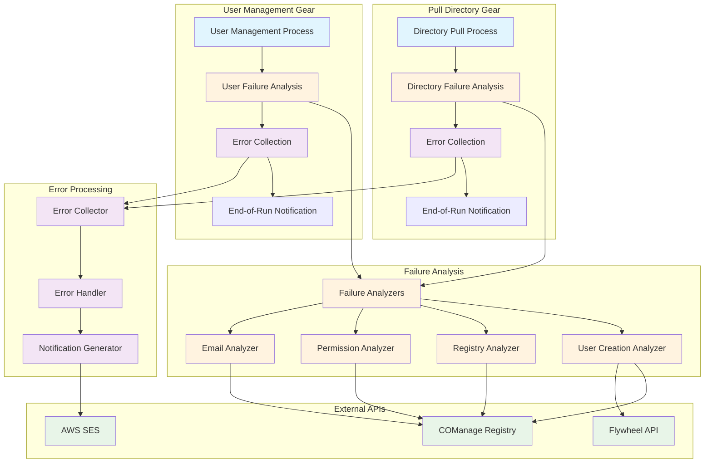

# Design Document: Automated Error Handling for User Management

## Overview

This design document outlines the architecture for a reusable error handling framework that can be integrated into both the pull_directory and user_management gears. The framework provides error capture, categorization, and notification capabilities that each gear can use independently during their execution.

**Framework Usage Pattern:**
- **pull_directory gear**: Captures errors discovered during directory report processing, sends one consolidated notification at the end
- **user_management gear**: Captures errors discovered during user process execution, sends notification at the end of the gear run
- **Framework Integration**: Extends existing user processes and integrates with gear execution patterns

The design builds upon the existing infrastructure including UserProcess classes, COManage registry API, Flywheel API, AWS Parameter Store, and AWS SES while providing a clean framework interface for error handling.

## Architecture

The error handling approach follows a failure-triggered analysis pattern:



**Failure-Triggered Analysis Pattern:**
1. **Normal Processing**: User processes run as usual
2. **Failure Detection**: When a failure occurs, user process calls appropriate analyzer
3. **Failure Analysis**: Analyzer investigates WHY the failure occurred using external APIs
4. **Error Collection**: Analyzer categorizes the failure and adds to error collection
5. **End-of-Run Notification**: All collected errors are sent in one consolidated notification via SES

**Parameter Store Usage:**
- Gear initialization (in run.py) pulls support staff email configuration from Parameter Store
- Notification generator is created with this configuration during gear setup
- No ongoing Parameter Store interaction during error processing

## Components and Interfaces

### Error Collection

Simple error collection that integrates directly with existing gear patterns:

**Gear Integration:**
```python
# In gear run.py - gear creates error handling objects as core functionality
class UserManagementVisitor(GearExecutionEnvironment):
    def run(self, context: GearToolkitContext) -> None:
        # Create error handling objects as core functionality
        error_collector = ErrorCollector()
            
        with ApiClient(configuration=self.__comanage_config) as comanage_client:
            admin_group = self.admin_group(admin_id=self.__admin_id)
            admin_group.set_redcap_param_repo(self.__redcap_param_repo)
            
            user_registry = UserRegistry(
                api_instance=DefaultApi(comanage_client),
                coid=self.__comanage_coid,
            )
            
            # Use existing UserProcess with error handling
            user_process = UserProcess(
                environment=UserProcessEnvironment(
                    admin_group=admin_group,
                    authorization_map=self.__get_auth_map(self.__auth_filepath),
                    notification_client=NotificationClient(...),
                    proxy=self.proxy,
                    registry=user_registry,
                ),
                error_collector=error_collector
            )
            
            # Run user processing
            user_process.execute(user_queue)
            
            # Send consolidated notification at end if there are errors
            if error_collector.get_errors():
                support_emails = self._get_support_staff_emails()
                self._send_error_notification(error_collector.get_errors(), support_emails)

class UserProcess(BaseUserProcess[UserEntry]):
    """Modified to include error handling as core functionality."""
    
    def __init__(self, environment: UserProcessEnvironment,
                 error_collector: ErrorCollector):
        self._active_queue: UserQueue[ActiveUserEntry] = UserQueue()
        self._inactive_queue: UserQueue[UserEntry] = UserQueue()
        self._env = environment
        
        # Error handling components
        self.error_collector = error_collector
    
    def execute(self, queue: UserQueue[UserEntry]) -> None:
        """Modified to pass error handling objects to sub-processes."""
        log.info("**Processing directory entries")
        queue.apply(self)

        # Pass error handling objects to sub-processes
        ActiveUserProcess(
            self._env, self.error_collector
        ).execute(self._active_queue)
        
        InactiveUserProcess().execute(self._inactive_queue)

class ErrorCollector:
    """Simple error collector that accumulates errors during gear execution."""
    
    def __init__(self):
        self._errors: List[ErrorEvent] = []
    
    def collect(self, event: ErrorEvent) -> None:
        """Add an error event to the collection."""
        self._errors.append(event)
    
    def get_errors(self) -> List[ErrorEvent]:
        """Get all collected errors."""
        return self._errors.copy()
    
    def clear(self) -> None:
        """Clear all collected errors."""
        self._errors.clear()

def create_error_event(category: ErrorCategory, user_context: UserContext, 
                      details: Dict[str, Any]) -> ErrorEvent:
    """Create an error event with the provided information."""
    return ErrorEvent(
        category=category,
        user_context=user_context,
        error_details=details
    )
```

### Direct Modification of Existing User Processes

Modify the existing user process classes to add error analysis at existing log points:

**Modified ActiveUserProcess:**
```python
class ActiveUserProcess(BaseUserProcess[ActiveUserEntry]):
    """Modified to include failure analysis at existing log points."""
    
    def __init__(self, environment: UserProcessEnvironment,
                 error_collector: ErrorCollector):
        super().__init__()
        self._env = environment
        self._claimed_queue: UserQueue[RegisteredUserEntry] = UserQueue()
        self._unclaimed_queue: UserQueue[ActiveUserEntry] = UserQueue()
        
        # Error handling components
        self.error_collector = error_collector
    
    def visit(self, entry: ActiveUserEntry) -> None:
        """Modified to add failure analysis at existing log points."""
        if not entry.auth_email:
            log.error("User %s must have authentication email", entry.email)
            
            # Create error event for missing auth email
            error_event = create_error_event(
                category=ErrorCategory.MISSING_DIRECTORY_PERMISSIONS,
                user_context=UserContext.from_user_entry(entry),
                details={
                    "message": "User has no authentication email in directory",
                    "directory_email": entry.email,
                    "action_needed": "update_directory_auth_email"
                }
            )
            self.error_collector.collect(error_event)
            return
        
        person_list = self._env.user_registry.get(email=entry.auth_email)
        if not person_list:
            if self._env.user_registry.has_bad_claim(entry.full_name):
                log.error("Active user has incomplete claim: %s, %s", 
                         entry.full_name, entry.email)
                
                # Create error event for bad claim
                error_event = create_error_event(
                    category=ErrorCategory.BAD_ORCID_CLAIMS,
                    user_context=UserContext.from_user_entry(entry),
                    details={
                        "message": "User has incomplete ORCID claim in registry",
                        "full_name": entry.full_name,
                        "action_needed": "delete_bad_record_and_reclaim"
                    }
                )
                self.error_collector.collect(error_event)
                return
            
            log.info("Active user not in registry: %s", entry.email)
            self.__add_to_registry(user_entry=entry)
            self._env.notification_client.send_claim_email(entry)
            log.info("Added user %s to registry using email %s", 
                    entry.email, entry.auth_email)
            return
        
        creation_date = self.__get_creation_date(person_list)
        if not creation_date:
            log.warning("person record for %s has no creation date", entry.email)
            
            # Create error event for missing creation date
            error_event = create_error_event(
                category=ErrorCategory.UNCLAIMED_RECORDS,
                user_context=UserContext.from_user_entry(entry),
                details={
                    "message": "Registry record exists but has no creation date",
                    "registry_records": len(person_list),
                    "action_needed": "check_registry_record_status"
                }
            )
            self.error_collector.collect(error_event)
            return
        
        entry.registration_date = creation_date
        claimed = self.__get_claimed(person_list)
        if claimed:
            registry_id = self.__get_registry_id(claimed)
            if not registry_id:
                log.error("User %s has no registry ID", entry.email)
                
                # Create error event for missing registry ID
                error_event = create_error_event(
                    category=ErrorCategory.UNCLAIMED_RECORDS,
                    user_context=UserContext.from_user_entry(entry),
                    details={
                        "message": "User appears claimed but has no registry ID",
                        "claimed_records": len(claimed),
                        "action_needed": "check_registry_id_assignment"
                    }
                )
                self.error_collector.collect(error_event)
                return
            
            self._claimed_queue.enqueue(entry.register(registry_id))
            return
        
        self._unclaimed_queue.enqueue(entry)

class ClaimedUserProcess(BaseUserProcess[RegisteredUserEntry]):
    """Modified to include failure analysis at existing log points."""
    
    def __init__(self, environment: UserProcessEnvironment, 
                 claimed_queue: UserQueue[RegisteredUserEntry],
                 error_collector: ErrorCollector):
        self._failed_count: Dict[str, int] = defaultdict(int)
        self._claimed_queue: UserQueue[RegisteredUserEntry] = claimed_queue
        self._created_queue: UserQueue[RegisteredUserEntry] = UserQueue()
        self._update_queue: UserQueue[RegisteredUserEntry] = UserQueue()
        self._env = environment
        
        # Error handling components
        self.error_collector = error_collector
        self.failure_analyzer = FailureAnalyzer(environment)
    
    def __add_user(self, entry: RegisteredUserEntry) -> Optional[str]:
        """Modified to add failure analysis at existing log points."""
        try:
            return self._env.proxy.add_user(entry.as_user())
        except FlywheelError as error:
            self._failed_count[entry.registry_id] += 1
            if self._failed_count[entry.registry_id] >= 3:
                log.error("Unable to add user %s with ID %s: %s",
                         entry.email, entry.registry_id, str(error))
                
                # Analyze Flywheel user creation failure to determine root cause
                error_event = self.failure_analyzer.analyze_flywheel_user_creation_failure(entry, error)
                if error_event:
                    self.error_collector.collect(error_event)
                return None
            
            self._claimed_queue.enqueue(entry)
        return None

class UpdateUserProcess(BaseUserProcess[RegisteredUserEntry]):
    """Modified to include failure analysis at existing log points."""
    
    def __init__(self, environment: UserProcessEnvironment,
                 error_collector: ErrorCollector):
        self._env = environment
        
        # Error handling components
        self.error_collector = error_collector
        self.failure_analyzer = FailureAnalyzer(environment)
    
    def visit(self, entry: RegisteredUserEntry) -> None:
        """Modified to add failure analysis at existing log points."""
        registry_person = self._env.user_registry.find_by_registry_id(entry.registry_id)
        
        if not registry_person or not registry_person.email_address:
            log.error("Failed to find a claimed user with Registry ID %s and email %s",
                     entry.registry_id, entry.email)
            
            # Analyze why claimed user is missing to determine root cause
            error_event = self.failure_analyzer.analyze_missing_claimed_user(entry)
            if error_event:
                self.error_collector.collect(error_event)
            return
        
        fw_user = self._env.proxy.find_user(entry.registry_id)
        if not fw_user:
            log.error("Failed to add user %s with ID %s", entry.email, entry.registry_id)
            
            # Create error event for missing Flywheel user
            error_event = create_error_event(
                category=ErrorCategory.FLYWHEEL_ERROR,
                user_context=UserContext.from_user_entry(entry),
                details={
                    "message": "User should exist in Flywheel but was not found",
                    "registry_id": entry.registry_id,
                    "action_needed": "check_flywheel_user_creation_logs"
                }
            )
            self.error_collector.collect(error_event)
            return
        
        self.__update_email(user=fw_user, email=entry.email)
        
        registry_address = registry_person.email_address
        if not registry_address:
            log.error("Registry record does not have email address: %s", entry.registry_id)
            
            # Create error event for missing registry email
            error_event = create_error_event(
                category=ErrorCategory.UNVERIFIED_EMAIL,
                user_context=UserContext.from_user_entry(entry),
                details={
                    "message": "Registry record found but has no email address",
                    "registry_id": entry.registry_id,
                    "action_needed": "check_email_verification_in_comanage"
                }
            )
            self.error_collector.collect(error_event)
            return
        
        authorizations = {
            authorization.study_id: authorization
            for authorization in entry.authorizations
        }
        self.__authorize_user(
            user=fw_user,
            auth_email=registry_address.mail,
            center_id=entry.adcid,
            authorizations=authorizations,
        )
```

### Failure Analyzers

Analyzer that performs actual investigation for complex failure scenarios:

**Simplified Failure Analyzer:**
```python
class FailureAnalyzer:
    """Failure analyzer for complex scenarios that require investigation."""
    
    def __init__(self, environment: UserProcessEnvironment):
        self.env = environment
    
    def analyze_flywheel_user_creation_failure(self, entry: RegisteredUserEntry, 
                                             error: FlywheelError) -> Optional[ErrorEvent]:
        """Analyze why Flywheel user creation failed after 3 attempts."""
        # Check if user already exists (duplicate) using environment's proxy
        existing_user = self.env.proxy.find_user(entry.registry_id)
        if existing_user:
            return create_error_event(
                category=ErrorCategory.DUPLICATE_USER_RECORDS,
                user_context=UserContext.from_user_entry(entry),
                details={
                    "message": "User already exists in Flywheel",
                    "existing_user_id": existing_user.id,
                    "registry_id": entry.registry_id,
                    "action_needed": "deactivate_duplicate_and_clear_cache"
                }
            )
        
        # Check if it's a permission issue
        if "permission" in str(error).lower() or "unauthorized" in str(error).lower():
            return create_error_event(
                category=ErrorCategory.INSUFFICIENT_PERMISSIONS,
                user_context=UserContext.from_user_entry(entry),
                details={
                    "message": "Insufficient permissions to create user in Flywheel",
                    "flywheel_error": str(error),
                    "action_needed": "check_flywheel_service_account_permissions"
                }
            )
        
        # Generic Flywheel error
        return create_error_event(
            category=ErrorCategory.FLYWHEEL_ERROR,
            user_context=UserContext.from_user_entry(entry),
            details={
                "message": "Flywheel user creation failed after 3 attempts",
                "error": str(error),
                "registry_id": entry.registry_id,
                "action_needed": "check_flywheel_logs_and_service_status"
            }
        )
    
    def analyze_missing_claimed_user(self, entry: RegisteredUserEntry) -> Optional[ErrorEvent]:
        """Analyze why we can't find a claimed user that should exist."""
        # Use environment's user registry to check what's actually there
        person_list = self.env.user_registry.get(email=entry.auth_email or entry.email)
        
        if not person_list:
            return create_error_event(
                category=ErrorCategory.UNCLAIMED_RECORDS,
                user_context=UserContext.from_user_entry(entry),
                details={
                    "message": "Expected claimed user not found in registry",
                    "registry_id": entry.registry_id,
                    "action_needed": "verify_registry_record_exists"
                }
            )
        else:
            # User exists but not claimed properly
            return create_error_event(
                category=ErrorCategory.UNCLAIMED_RECORDS,
                user_context=UserContext.from_user_entry(entry),
                details={
                    "message": "User found in registry but not properly claimed",
                    "registry_records": len(person_list),
                    "registry_id": entry.registry_id,
                    "action_needed": "check_claim_status_and_email_verification"
                }
            )
```

### End-of-Run Notification

Simple notification generation at the end of gear execution:

**Notification Functions:**
```python
def send_error_notification(errors: List[ErrorEvent], gear_name: str, 
                          parameter_store: ParameterStore) -> None:
    """Send consolidated error notification at end of gear run."""
    if not errors:
        return
    
    # Get support staff emails from parameter store
    support_emails = get_support_staff_emails(parameter_store)
    
    # Generate notification content
    notification_data = create_notification_data(errors, gear_name)
    
    # Send via existing email infrastructure
    email_client = create_ses_client()
    send_consolidated_notification(email_client, support_emails, notification_data)

def create_notification_data(errors: List[ErrorEvent], gear_name: str) -> ConsolidatedNotificationData:
    """Create template data for consolidated notification."""
    return ConsolidatedNotificationData(
        gear_name=gear_name,
        execution_timestamp=datetime.now().isoformat(),
        total_errors=len(errors),
        errors_by_category=count_errors_by_category(errors),
        error_summaries=[error.to_summary() for error in errors],
        affected_users=list(set(error.user_context.email for error in errors))
    )
```

## Data Models

### Error Event Model

```python
class ErrorEvent(BaseModel):
    event_id: str = Field(default_factory=lambda: str(uuid.uuid4()))
    timestamp: datetime = Field(default_factory=datetime.now)
    category: ErrorCategory
    user_context: UserContext
    error_details: Dict[str, Any]
    
    def to_summary(self) -> str:
        """Convert to a one-line summary for notifications."""
        return f"{self.category.value}: {self.user_context.email} - {self.error_details.get('message', 'No details')}"

class ErrorCategory(Enum):
    UNCLAIMED_RECORDS = "Unclaimed Records"
    EMAIL_MISMATCH = "Authentication Email Mismatch"
    UNVERIFIED_EMAIL = "Unverified Email"
    BAD_ORCID_CLAIMS = "Bad ORCID Claims"
    MISSING_DIRECTORY_PERMISSIONS = "Missing Directory Permissions"
    INSUFFICIENT_PERMISSIONS = "Insufficient Permissions"
    DUPLICATE_USER_RECORDS = "Duplicate/Wrong User Records"
```

### User Context Model

```python
class UserContext(BaseModel):
    email: str
    name: Optional[PersonName] = None
    center_id: Optional[int] = None
    registry_id: Optional[str] = None
    auth_email: Optional[str] = None
    
    @classmethod
    def from_user_entry(cls, entry: UserEntry) -> "UserContext":
        return cls(
            email=entry.email,
            name=entry.name,
            auth_email=entry.auth_email
        )
    
    @classmethod
    def from_registry_person(cls, person: RegistryPerson) -> "UserContext":
        return cls(
            email=person.email_address.mail if person.email_address else "unknown",
            registry_id=person.registry_id()
        )
```

### Consolidated Notification Data Model

```python
class ConsolidatedNotificationData(BaseTemplateModel):
    """Template data for consolidated error notifications sent to support staff."""
    
    gear_name: str
    execution_timestamp: str
    total_errors: int
    errors_by_category: Dict[str, int]
    error_summaries: List[str]
    affected_users: List[str]
    
    def format_for_email(self) -> str:
        """Format the data for email template."""
        summary = f"Gear: {self.gear_name}\n"
        summary += f"Execution Time: {self.execution_timestamp}\n"
        summary += f"Total Errors: {self.total_errors}\n\n"
        
        summary += "Errors by Category:\n"
        for category, count in self.errors_by_category.items():
            summary += f"  {category}: {count}\n"
        
        summary += f"\nAffected Users: {', '.join(self.affected_users)}\n\n"
        summary += "Error Details:\n"
        for error_summary in self.error_summaries:
            summary += f"  - {error_summary}\n"
        
        return summary
```

## Correctness Properties

*A property is a characteristic or behavior that should hold true across all valid executions of a system-essentially, a formal statement about what the system should do. Properties serve as the bridge between human-readable specifications and machine-verifiable correctness guarantees.*

### Property Reflection

After completing the prework analysis, I've identified several areas where properties can be consolidated to eliminate redundancy:

**Consolidation Opportunities:**
- Properties 2.1-2.7 (template selection for each category) can be combined into one comprehensive property that tests template mapping for all categories
- Properties 1a.1, 1a.3, 1a.4, 1a.5, 1a.6 (specific log message categorization) can be combined into one property that tests log message to category mapping
- Properties 1b.1-1b.5 (proactive detection mechanisms) represent distinct detection capabilities and should remain separate

**Final Property Set:**
The following properties provide comprehensive validation while avoiding redundancy:

Property 1: Error Event Categorization
*For any* captured error event, the system should assign it to exactly one of the predefined error categories
**Validates: Requirements 1.3**

Property 2: User Context Inclusion
*For any* captured error event, the system should include all available user context information (email, name, center, registry ID)
**Validates: Requirements 1.4**

Property 3: API Failure Handling
*For any* API failure to external services, the system should log the failure for technical staff but not generate support staff notifications
**Validates: Requirements 1.6**

Property 4: Category Template Mapping
*For any* error event with a valid category, there should exist a corresponding notification template that can be retrieved and used
**Validates: Requirements 1.7**

Property 5: Log Message Categorization
*For any* recognized log message pattern from existing failure points, the system should categorize it according to the predefined mapping rules
**Validates: Requirements 1a.2, 1a.7**

Property 6: Existing Logging Preservation
*For any* user processing operation, the system should maintain all existing log messages while adding error event capture
**Validates: Requirements 1a.8**

Property 7: Email Mismatch Detection
*For any* user with different authentication email and directory email, the additional instrumentation system should identify this as an authentication email mismatch
**Validates: Requirements 1b.1**

Property 8: Email Verification Detection
*For any* COManage registry record, the system should correctly identify the email verification status
**Validates: Requirements 1b.2**

Property 9: ORCID Claim Detection
*For any* ORCID identity claim without proper email configuration, the system should detect this as a bad ORCID claim
**Validates: Requirements 1b.3**

Property 10: Permission Insufficiency Detection
*For any* user with authorizations that don't match expected permissions for their role/center, the system should detect insufficient permissions
**Validates: Requirements 1b.4**

Property 11: Duplicate User Detection
*For any* set of user records across COManage, directory, and Flywheel systems, the system should identify duplicates based on matching criteria
**Validates: Requirements 1b.5**

Property 12: Consistent Categorization
*For any* error detected through additional instrumentation, the system should use the same categorization system as errors detected from existing failure points
**Validates: Requirements 1b.8**

Property 13: Template Selection by Category
*For any* error event with a specific category, the notification generator should select the correct template that contains appropriate instructions for that category type
**Validates: Requirements 2.1-2.7**

Property 14: User Context in Notifications
*For any* generated notification, the system should include all available user-specific context information in the template data
**Validates: Requirements 2.8**

Property 15: Error Event Batching
*For any* set of multiple error events for the same user, the system should batch them into a single comprehensive notification
**Validates: Requirements 2.9**

Property 16: Success Notification Generation
*For any* successful user creation in Flywheel, the system should generate a success notification containing user details, timestamp, and authorization information
**Validates: Requirements 3.1, 3.2, 3.3, 3.4**

Property 17: Success Notification Template Consistency
*For any* success notification, the system should use the standardized email template format
**Validates: Requirements 3.5**

## Error Handling

The error handling strategy focuses on graceful degradation and maintaining system reliability:

### External Service Failures
- **COManage API Failures**: Log for technical staff, continue with available data, skip additional instrumentation requiring COManage
- **Flywheel API Failures**: Log for technical staff, continue with user processing, skip Flywheel-specific checks
- **AWS SES Failures**: Implement retry logic with exponential backoff, fallback to raw email if templated email fails
- **Parameter Store Failures**: Use cached configuration values, log warnings for missing support staff emails

### Data Validation Errors
- **Invalid User Context**: Use available fields, mark missing fields as "unavailable" in notifications
- **Template Rendering Errors**: Fall back to generic error template, include raw error details
- **Category Mapping Failures**: Use "Unknown Error" category, include original error details in notification

### Performance Safeguards
- **Circuit Breaker Pattern**: Disable additional instrumentation if external services are consistently failing
- **Timeout Handling**: Set reasonable timeouts for all external API calls (30 seconds max)
- **Batch Size Limits**: Limit error event batching to prevent memory issues (max 50 events per user)
- **Rate Limiting**: Implement rate limiting for notification sending to prevent email flooding

## Testing Strategy

The testing strategy follows a test-driven development approach with comprehensive coverage of both unit and property-based testing:

### Test-Driven Development Process
1. **Write Tests First**: All new classes and functionality must have tests written before implementation
2. **Red-Green-Refactor**: Follow TDD cycle of failing test → minimal implementation → refactoring
3. **Test Coverage**: Maintain >90% test coverage for all new error handling components
4. **Mock External Dependencies**: Use mocks for COManage, Flywheel, and AWS SES in unit tests

### Unit Testing Strategy
- **Error Capture Components**: Test error event creation, categorization logic, and user context extraction
- **Additional Detection**: Test each detection mechanism with various user scenarios and edge cases
- **Notification Generation**: Test template selection, variable substitution, and batching logic
- **Integration Points**: Test integration with existing UserProcess classes and NotificationClient

### Property-Based Testing Configuration
- **Testing Framework**: Use Hypothesis for Python property-based testing
- **Test Iterations**: Minimum 100 iterations per property test to ensure comprehensive input coverage
- **Custom Generators**: Create generators for UserEntry, RegistryPerson, and ErrorEvent objects
- **Shrinking Strategy**: Configure Hypothesis to find minimal failing examples for debugging

### Property Test Implementation
Each correctness property will be implemented as a property-based test with the following structure:

```python
@given(error_event=error_event_strategy())
def test_error_event_categorization(error_event):
    """Feature: automated-error-handling, Property 1: Error Event Categorization"""
    # Test that any captured error event gets assigned to exactly one category
    categorizer = ErrorCategorizer()
    category = categorizer.categorize(error_event)
    
    assert category in PREDEFINED_CATEGORIES
    assert isinstance(category, ErrorCategory)
```

### Integration Testing
- **End-to-End Workflows**: Test complete error capture → categorization → notification flow
- **Existing System Integration**: Verify no disruption to current user management processes
- **AWS SES Integration**: Test email delivery using SES test environment
- **Parameter Store Integration**: Test configuration loading and caching

### Performance Testing
- **Load Testing**: Verify system handles high volumes of error events without degradation
- **Memory Usage**: Monitor memory consumption during error event batching
- **API Response Times**: Ensure additional instrumentation doesn't significantly slow user processing
- **Notification Throughput**: Test email sending capacity and rate limiting

The testing strategy ensures that all new functionality is thoroughly validated while maintaining the reliability and performance of existing user management workflows.