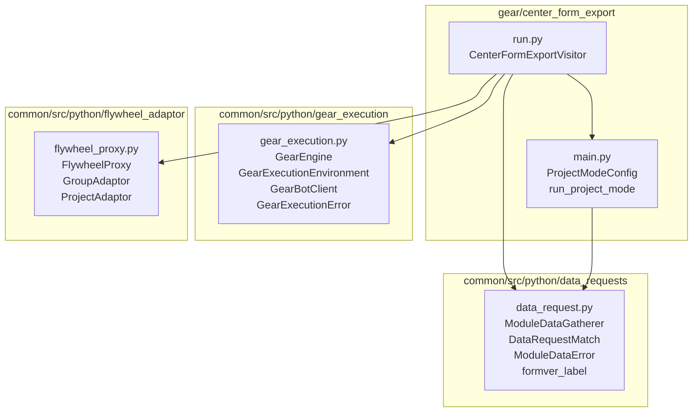
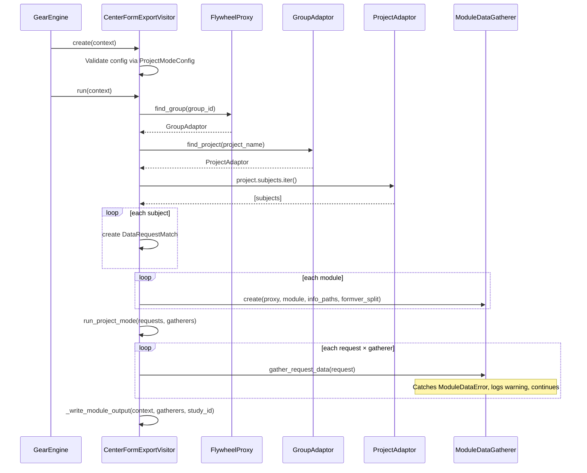

# Design Document: center-form-export

## Overview

This design extracts the "project mode" execution path from the `gather_form_data` gear into a standalone gear called `center_form_export`. The new gear iterates all subjects in a Flywheel group/project and exports form data per module, while the original gear reverts to participant-list-only behavior.

The design follows the existing gear architecture pattern: `run.py` handles Flywheel context and visitor setup, `main.py` contains business logic. The new gear reuses the shared `data_requests` library (`ModuleDataGatherer`, `DataRequestMatch`, `ModuleDataError`, `formver_label`) and the existing `_write_module_output` helper pattern.

### Key Design Decisions

1. **Cookiecutter template for scaffolding**: Use the `templates/gear/` cookiecutter template to generate the initial directory structure, then customize the generated files. This ensures consistency with other gears in the monorepo.

2. **Shared output-writing logic**: The `_write_module_output` function (currently in `gather_form_data_app/run.py`) is duplicated into the new gear rather than extracted to `common/`. It's a short helper tightly coupled to `GearContext.open_output`, and both gears may diverge in behavior over time.

3. **Pydantic validation for config**: Reuse the `ProjectModeConfig` model (currently in `gather_form_data_app/main.py`) by moving it into the new gear's `main.py`. The model validates `group_id` and `project_name` are non-blank and that at least one valid module is specified.

4. **Direct GearEngine usage**: The new gear has a single execution path, so `main()` simply calls `GearEngine().run(gear_type=CenterFormExportVisitor)` — no mode dispatch needed.

## Architecture



### Execution Flow



## Components and Interfaces

### CenterFormExportVisitor (run.py)

The gear's `GearExecutionEnvironment` subclass. Responsible for:
- Extracting and validating config from `GearContext`
- Resolving group and project via `FlywheelProxy`
- Building `DataRequestMatch` list from project subjects
- Creating `ModuleDataGatherer` instances
- Orchestrating execution and writing output

```python
class CenterFormExportVisitor(GearExecutionEnvironment):
    def __init__(
        self,
        client: ClientWrapper,
        group_id: str,
        project_name: str,
        info_paths: list[str],
        modules: set[str],
        study_id: str,
        formver_split: bool = False,
    ): ...

    @classmethod
    def create(
        cls,
        context: GearContext,
        parameter_store: Optional[ParameterStore] = None,
    ) -> "CenterFormExportVisitor": ...

    def run(self, context: GearContext) -> None: ...
```

### ProjectModeConfig (main.py)

Pydantic model validating gear configuration. Rejects blank `group_id`/`project_name` and empty module sets.

```python
class ProjectModeConfig(BaseModel):
    group_id: str
    project_name: str
    modules: set[str]
    info_paths: list[str]
    study_id: str

    @field_validator("group_id", "project_name")
    @classmethod
    def must_not_be_blank(cls, v: str) -> str: ...

    @field_validator("modules")
    @classmethod
    def must_have_valid_modules(cls, v: set[str]) -> set[str]: ...
```

### run_project_mode (main.py)

Pure orchestration function that applies each gatherer to each request with per-subject error resilience.

```python
def run_project_mode(
    *,
    requests: list[DataRequestMatch],
    gatherers: list[ModuleDataGatherer],
) -> bool: ...
```

### _write_module_output (run.py)

Helper that writes CSV output to the gear context, handling both single-file-per-module and formver-split modes.

```python
def _write_module_output(
    context: GearContext,
    gatherers: list[ModuleDataGatherer],
    study_id: str,
) -> None: ...
```

### Shared Library (unchanged)

From `common/src/python/data_requests/data_request.py`:
- `ModuleDataGatherer` — collects form data per module
- `DataRequestMatch` — subject-level match (naccid, subject_id, project_label)
- `ModuleDataError` — raised on per-subject data access failures
- `formver_label(formver)` — normalizes version to filename-safe label

## Data Models

### Gear Manifest Config Fields

| Field | Type | Required | Default | Description |
|-------|------|----------|---------|-------------|
| `group_id` | string | yes | — | Flywheel group ID for the center |
| `project_name` | string | yes | — | Project label to iterate |
| `modules` | string | no | `"UDS,FTLD,LBD"` | Comma-separated module names |
| `study_id` | string | no | `"adrc"` | Study identifier for output filenames |
| `include_derived` | boolean | no | `false` | Include derived variables |
| `formver_split` | boolean | no | `false` | Split output by form version |

### Gear Manifest Inputs

| Input | Base | Description |
|-------|------|-------------|
| `api-key` | `api-key` | Flywheel API key |

No `input_file` input.

### DataRequestMatch (from common)

```python
class DataRequestMatch(BaseModel):
    naccid: str          # Subject label (treated as NACCID)
    subject_id: str      # Flywheel subject ID
    project_label: str   # Resolved project label
```

### ProjectModeConfig

```python
class ProjectModeConfig(BaseModel):
    group_id: str        # Non-blank, stripped
    project_name: str    # Non-blank, stripped
    modules: set[str]    # At least one non-blank entry
    info_paths: list[str]  # Derived from include_derived
    study_id: str        # e.g. "adrc"
```

### Output File Naming

- Default: `{study_id}-{module_name}-{YYYY-MM-DD}.csv`
- Formver split: `{study_id}-{module_name}-{formver_label}-{YYYY-MM-DD}.csv`

### Directory Structure (post-cookiecutter)

```
gear/center_form_export/
├── src/
│   ├── docker/
│   │   ├── BUILD
│   │   ├── Dockerfile
│   │   └── manifest.json
│   └── python/
│       └── center_form_export_app/
│           ├── __init__.py
│           ├── BUILD
│           ├── run.py
│           └── main.py
└── test/
    └── python/
        └── center_form_export_test/
            ├── BUILD
            ├── __init__.py
            ├── conftest.py
            ├── test_project_mode_integration.py
            └── test_run_project_mode.py
```

## gather_form_data Revert Strategy

The revert uses surgical removal rather than a git cherry-pick. This avoids the risk of losing `formver_split` support (which was added alongside project mode) and any other incidental fixes in the same PRs.

### Files Modified

| File | Action |
|------|--------|
| `gear/gather_form_data/src/python/gather_form_data_app/main.py` | Remove `ProjectModeConfig`, `run_project_mode`; keep `run()` |
| `gear/gather_form_data/src/python/gather_form_data_app/run.py` | Remove `ProjectModeVisitor`, mode dispatch in `main()`; simplify `main()` |
| `gear/gather_form_data/src/docker/manifest.json` | Remove `execution_mode`, `group_id`, `project_name` config fields |
| `gear/gather_form_data/test/python/test_backward_compatibility.py` | Delete |
| `gear/gather_form_data/test/python/test_project_mode_integration.py` | Delete (moved to new gear) |
| `gear/gather_form_data/test/python/test_run_project_mode.py` | Delete (moved to new gear) |

### main.py After Revert

```python
"""Defines Gather Form Data."""

import logging
from typing import TextIO

from data_requests.data_request import DataRequestVisitor
from inputs.csv_reader import read_csv
from outputs.error_writer import ErrorWriter

log = logging.getLogger(__name__)


def run(
    *,
    request_file: TextIO,
    request_visitor: DataRequestVisitor,
    error_writer: ErrorWriter,
):
    """Runs the Gather Form Data process."""
    return read_csv(
        input_file=request_file,
        error_writer=error_writer,
        visitor=request_visitor,
    )
```

Removed: `ProjectModeConfig`, `run_project_mode`, `ModuleDataError`/`ModuleDataGatherer`/`DataRequestMatch` imports, `pydantic` import.

### run.py main() After Revert

```python
def main():
    """Main method for Gather Form Data."""
    engine = GearEngine().create_with_parameter_store()
    engine.run(gear_type=GatherFormDataVisitor)


if __name__ == "__main__":
    main()
```

Removed: `ProjectModeVisitor` class, `GearContext` peek for `execution_mode`, conditional dispatch, `sys` import, `run_project_mode` import from main.

### run.py Retained Code

- `_write_module_output` — stays (used by `GatherFormDataVisitor` for formver-split output)
- `GatherFormDataVisitor` — stays unchanged (already reads `formver_split` from config)
- All imports required by `GatherFormDataVisitor` and `_write_module_output`

### Manifest Changes

Remove these config fields from `manifest.json`:
- `execution_mode` (string with default `"participant_list"`)
- `group_id` (string)
- `project_name` (string)

Retain:
- `formver_split` (boolean, default `false`)
- `modules`, `study_id`, `include_derived`, `project_names` — all existing participant-list config

### Test Deletion Rationale

| Test File | Reason for Deletion |
|-----------|-------------------|
| `test_backward_compatibility.py` | Tests the mode dispatch logic which no longer exists |
| `test_project_mode_integration.py` | Tests `ProjectModeVisitor` which moves to new gear |
| `test_run_project_mode.py` | Tests `run_project_mode` which moves to new gear |

After deletion, `gear/gather_form_data/test/python/` will contain only the BUILD file and `.gitkeep`. If participant-list mode has its own tests elsewhere (e.g. in `common/`), those remain untouched.

## Correctness Properties

*A property is a characteristic or behavior that should hold true across all valid executions of a system — essentially, a formal statement about what the system should do. Properties serve as the bridge between human-readable specifications and machine-verifiable correctness guarantees.*

### Property 1: Blank config fields are rejected

*For any* string composed entirely of whitespace characters (including empty string, spaces, tabs, newlines), constructing a `ProjectModeConfig` with that string as either `group_id` or `project_name` SHALL raise a `ValidationError`.

**Validates: Requirements 2.9**

### Property 2: Subject-to-DataRequestMatch mapping preserves identity

*For any* list of subjects (each with a label and an ID) and any project label, the resulting `DataRequestMatch` list SHALL have the same length as the subject list, and each match SHALL have `naccid` equal to the subject's label, `subject_id` equal to the subject's ID, and `project_label` equal to the resolved project label.

**Validates: Requirements 3.2**

### Property 3: All request-gatherer combinations are attempted with resilience

*For any* list of `DataRequestMatch` objects and any list of `ModuleDataGatherer` instances (where any subset may raise `ModuleDataError`), `run_project_mode` SHALL call `gather_request_data` exactly once per (request, gatherer) pair, SHALL return `True`, and SHALL not propagate `ModuleDataError` exceptions.

**Validates: Requirements 3.3, 4.1, 4.2, 4.3**

### Property 4: Output filename conforms to naming pattern

*For any* valid `study_id`, `module_name`, and date, the output filename SHALL match the pattern `{study_id}-{module_name}-{YYYY-MM-DD}.csv`. When `formver_split` is enabled, *for any* valid `formver_label` value, the output filename SHALL match `{study_id}-{module_name}-{formver_label}-{YYYY-MM-DD}.csv`.

**Validates: Requirements 5.1, 5.2**

## Error Handling

### Configuration Errors

| Condition | Behavior | Error Type |
|-----------|----------|------------|
| `group_id` is blank/whitespace | Reject at config validation | `GearExecutionError` (wrapping `ValidationError`) |
| `project_name` is blank/whitespace | Reject at config validation | `GearExecutionError` (wrapping `ValidationError`) |
| `modules` is empty after parsing | Reject at config validation | `GearExecutionError` (wrapping `ValidationError`) |

Configuration validation happens in `CenterFormExportVisitor.create()` before any Flywheel API calls are made. The `ProjectModeConfig` Pydantic model performs the validation, and `ValidationError` is caught and wrapped in `GearExecutionError`.

### Runtime Errors

| Condition | Behavior | Error Type |
|-----------|----------|------------|
| Group not found | Raise error, halt | `GearExecutionError` |
| Project not found in group | Raise error, halt | `GearExecutionError` |
| No subjects in project | Log warning, complete normally | — |
| `ModuleDataError` for a subject | Log warning, continue | — |
| Unexpected exception in gatherer | Propagate, halt | Original exception type |
| Module has no data after gathering | Skip output, log warning | — |
| Formver bucket is empty | Skip output silently | — |

### Error Propagation Strategy

The gear uses a two-tier error model:
1. **Fatal errors** (group/project not found, unexpected exceptions): Propagate immediately to the `GearEngine`, which handles logging and exit code.
2. **Per-subject errors** (`ModuleDataError`): Caught and logged as warnings in `run_project_mode`. Processing continues for all remaining subject-gatherer combinations.

## Testing Strategy

### Property-Based Tests

Property-based testing is appropriate for this feature because the core business logic (config validation, subject mapping, resilient orchestration) involves pure functions with clear input/output behavior and universal properties.

**Library**: [Hypothesis](https://hypothesis.readthedocs.io/) (Python)

**Configuration**: Minimum 100 examples per property test (200 recommended for the resilience property given the combinatorial nature).

Each property test is tagged with:
```python
# Feature: center-form-export, Property {N}: {property_text}
```

| Property | Test Location | Strategy |
|----------|---------------|----------|
| 1: Blank config rejection | `test_run_project_mode.py` | Generate whitespace-only strings, verify `ValidationError` |
| 2: Subject mapping | `test_run_project_mode.py` | Generate (label, id, project_label) tuples, verify DataRequestMatch fields |
| 3: Resilience | `test_run_project_mode.py` | Generate request lists + failure masks, verify all combinations attempted and True returned |
| 4: Filename pattern | `test_project_mode_integration.py` | Generate study_id, module_name, date combos, verify regex match |

### Unit Tests (Example-Based)

| Scenario | Test Location |
|----------|---------------|
| Group not found raises GearExecutionError | `test_project_mode_integration.py` |
| Project not found raises GearExecutionError | `test_project_mode_integration.py` |
| Empty project logs warning, no output | `test_project_mode_integration.py` |
| Module with no data skipped with warning | `test_project_mode_integration.py` |
| Empty formver bucket skipped silently | `test_project_mode_integration.py` |
| UTF-8 encoding on output | `test_project_mode_integration.py` |
| Unexpected exception propagates | `test_run_project_mode.py` |

### Integration Tests

| Scenario | Method |
|----------|--------|
| `pants test gear/center_form_export/test/python::` passes | CI / manual |
| `pants check gear/center_form_export/::` passes | CI / manual |
| `pants lint gear/center_form_export/::` passes | CI / manual |
| `pants package` produces PEX binary | CI / manual |

### Test Dependencies

Tests use:
- `pytest` — test framework
- `hypothesis` — property-based testing
- `unittest.mock` — mocking Flywheel SDK and proxies
- Shared mock fixtures in `conftest.py` for `ClientWrapper`, `FlywheelProxy`, and `GearContext`

