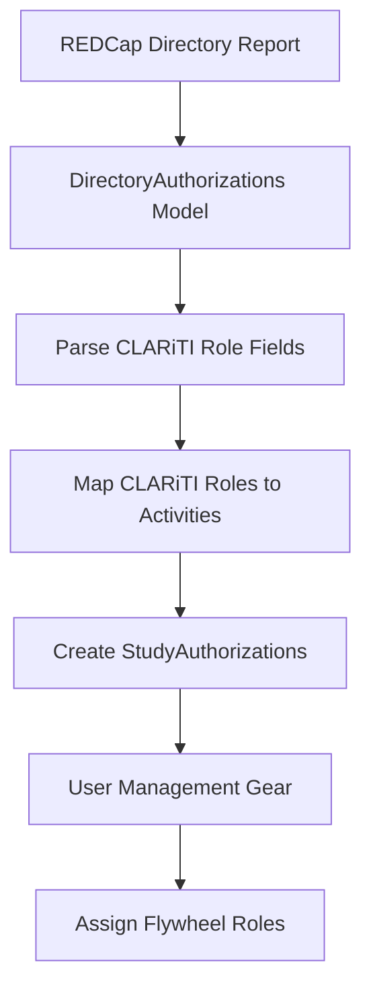
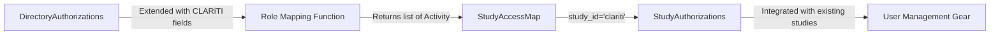

# Design Document: CLARiTI Role Mapping

## Overview

This feature extends the NACC user management system to support CLARiTI (Clinical Research in Alzheimer's and Related Dementias Imaging and Translational Informatics) role-based authorization. The implementation maps CLARiTI organizational and individual roles from REDCap directory reports to Activity objects that grant access to payment tracking and enrollment dashboards.

The design leverages the existing Activity-based authorization system, extending the DirectoryAuthorizations data model with CLARiTI role fields and adding a mapping function to convert these roles into dashboard access permissions. The solution maintains backward compatibility with existing ADRC, NCRAD, NIAGADS, LEADS, and DVCID authorization processing.

### Key Design Principles

1. **Minimal Extension**: Extend existing models and patterns rather than creating new authorization mechanisms
2. **Backward Compatibility**: All CLARiTI fields are optional; existing functionality remains unchanged
3. **Deduplication**: Multiple roles mapping to the same activity produce a single Activity object
4. **Separation of Concerns**: Role parsing in DirectoryAuthorizations, mapping logic in dedicated function, integration in user management gear

## Architecture

### High-Level Flow



### Component Interaction



### Data Flow

1. REDCap report contains CLARiTI role fields (loc_clariti_role___*, ind_clar_core_role___admin, cl_pay_access_level)
2. DirectoryAuthorizations deserializes these fields as optional boolean/string attributes
3. Mapping function examines DirectoryAuthorizations and generates Activity objects
4. Activities are added to StudyAuthorizations with study_id="clariti"
5. User management gear processes CLARiTI StudyAuthorizations alongside other studies

## Components and Interfaces

### 1. DirectoryAuthorizations Model Extension

**Location**: `common/src/python/users/nacc_directory.py`

**Changes**: Add optional fields for CLARiTI roles

```python
class DirectoryAuthorizations(BaseModel):
    # ... existing fields ...
    
    # Organizational roles (14 fields)
    loc_clariti_role___u01copi: Optional[bool] = Field(default=None, alias="loc_clariti_role___u01copi")
    loc_clariti_role___pi: Optional[bool] = Field(default=None, alias="loc_clariti_role___pi")
    loc_clariti_role___piadmin: Optional[bool] = Field(default=None, alias="loc_clariti_role___piadmin")
    loc_clariti_role___copi: Optional[bool] = Field(default=None, alias="loc_clariti_role___copi")
    loc_clariti_role___subawardadmin: Optional[bool] = Field(default=None, alias="loc_clariti_role___subawardadmin")
    loc_clariti_role___addlsubaward: Optional[bool] = Field(default=None, alias="loc_clariti_role___addlsubaward")
    loc_clariti_role___studycoord: Optional[bool] = Field(default=None, alias="loc_clariti_role___studycoord")
    loc_clariti_role___mpi: Optional[bool] = Field(default=None, alias="loc_clariti_role___mpi")
    loc_clariti_role___orecore: Optional[bool] = Field(default=None, alias="loc_clariti_role___orecore")
    loc_clariti_role___crl: Optional[bool] = Field(default=None, alias="loc_clariti_role___crl")
    loc_clariti_role___advancedmri: Optional[bool] = Field(default=None, alias="loc_clariti_role___advancedmri")
    loc_clariti_role___physicist: Optional[bool] = Field(default=None, alias="loc_clariti_role___physicist")
    loc_clariti_role___addlimaging: Optional[bool] = Field(default=None, alias="loc_clariti_role___addlimaging")
    loc_clariti_role___reg: Optional[bool] = Field(default=None, alias="loc_clariti_role___reg")
    
    # Individual role (1 field)
    ind_clar_core_role___admin: Optional[bool] = Field(default=None, alias="ind_clar_core_role___admin")
    
    # Permission field (1 field) - already exists as clariti_dashboard_pay_access_level
    # No additional field needed - we'll use the existing field
```

**Field Validators**: Add validator to convert REDCap checkbox values ("1", "0", "") to boolean

```python
@field_validator(
    "loc_clariti_role___u01copi",
    "loc_clariti_role___pi",
    # ... all 14 organizational roles ...
    "ind_clar_core_role___admin",
    mode="before",
)
def convert_clariti_checkbox(cls, value: Any) -> Optional[bool]:
    """Convert REDCap checkbox values to boolean.
    
    REDCap checkboxes: "1" = checked, "0" or "" = unchecked
    """
    if value is None or value == "":
        return None
    if isinstance(value, bool):
        return value
    if isinstance(value, str):
        return value == "1"
    return None
```

### 2. CLARiTI Role Mapping Function

**Location**: `common/src/python/users/clariti_roles.py` (new module)

**Interface**:

```python
def map_clariti_roles_to_activities(
    directory_auth: DirectoryAuthorizations,
) -> list[Activity]:
    """Map CLARiTI roles from DirectoryAuthorizations to Activity objects.
    
    Mapping rules:
    - Payment roles (7) → payment-tracker dashboard view access
    - All organizational roles (14) → enrollment dashboard view access
    - Admin core member → both payment-tracker and enrollment view access
    - cl_pay_access_level="ViewAccess" → payment-tracker view access
    
    Deduplicates activities when multiple roles map to the same permission.
    
    Args:
        directory_auth: DirectoryAuthorizations object with CLARiTI role fields
        
    Returns:
        List of Activity objects for CLARiTI dashboard access
    """
```

**Implementation Strategy**:

1. Check for payment roles and cl_pay_access_level
2. Check for any organizational roles
3. Check for admin core member role
4. Build set of Activity objects (automatic deduplication)
5. Return list

### 3. Integration with StudyAccessMap

**Location**: `common/src/python/users/nacc_directory.py`

**Changes**: Modify `__parse_fields` method to call CLARiTI mapping function

The existing `__parse_fields` method already handles dashboard resources through the field naming convention. However, CLARiTI roles don't follow this pattern (they're checkbox fields, not access_level fields). We need to add special handling:

```python
def __parse_fields(self) -> StudyAccessMap:
    """Parses the fields of this object for access level permissions..."""
    study_map = StudyAccessMap()
    
    # Existing field parsing logic...
    # (handles *_access_level fields)
    
    # Add CLARiTI role-based activities
    clariti_activities = map_clariti_roles_to_activities(self)
    for activity in clariti_activities:
        study_map.add_study_access(
            study_id="clariti",
            access_level="ViewAccess",  # All CLARiTI role activities are view access
            resource=activity.resource,
        )
    
    return study_map
```

### 4. User Management Gear Integration

**Location**: `gear/user_management/src/python/user_management/`

**No changes required**: The user management gear already processes StudyAuthorizations objects. Once CLARiTI activities are added to StudyAuthorizations with study_id="clariti", the existing gear logic will handle them automatically.

The gear's existing flow:
1. Reads REDCap directory report
2. Deserializes to DirectoryAuthorizations
3. Calls `to_user_entry()` which calls `__parse_fields()`
4. Processes StudyAuthorizations for each study
5. Maps activities to Flywheel roles

## Data Models

### Extended DirectoryAuthorizations

```python
class DirectoryAuthorizations(BaseModel):
    # Existing fields (50+)
    firstname: str
    lastname: str
    email: str
    # ... many more ...
    
    # NEW: CLARiTI organizational roles (14 fields)
    loc_clariti_role___u01copi: Optional[bool] = None
    loc_clariti_role___pi: Optional[bool] = None
    loc_clariti_role___piadmin: Optional[bool] = None
    loc_clariti_role___copi: Optional[bool] = None
    loc_clariti_role___subawardadmin: Optional[bool] = None
    loc_clariti_role___addlsubaward: Optional[bool] = None
    loc_clariti_role___studycoord: Optional[bool] = None
    loc_clariti_role___mpi: Optional[bool] = None
    loc_clariti_role___orecore: Optional[bool] = None
    loc_clariti_role___crl: Optional[bool] = None
    loc_clariti_role___advancedmri: Optional[bool] = None
    loc_clariti_role___physicist: Optional[bool] = None
    loc_clariti_role___addlimaging: Optional[bool] = None
    loc_clariti_role___reg: Optional[bool] = None
    
    # NEW: CLARiTI individual role (1 field)
    ind_clar_core_role___admin: Optional[bool] = None
    
    # EXISTING: Permission field (already in model)
    clariti_dashboard_pay_access_level: AuthorizationAccessLevel
```

### Activity Objects for CLARiTI

```python
# Payment tracker access
Activity(
    resource=DashboardResource(dashboard="payment-tracker"),
    action="view"
)

# Enrollment dashboard access
Activity(
    resource=DashboardResource(dashboard="enrollment"),
    action="view"
)
```

### StudyAuthorizations for CLARiTI

```python
StudyAuthorizations(
    study_id="clariti",
    activities=Activities(activities={
        DashboardResource(dashboard="payment-tracker"): Activity(...),
        DashboardResource(dashboard="enrollment"): Activity(...),
    })
)
```

## Correctness Properties

*A property is a characteristic or behavior that should hold true across all valid executions of a system-essentially, a formal statement about what the system should do. Properties serve as the bridge between human-readable specifications and machine-verifiable correctness guarantees.*


### Property Reflection

After analyzing all acceptance criteria, I identified the following consolidation opportunities:

1. **Payment role parsing (1.1-1.7)**: All 7 payment role fields follow the same pattern. Combined into one property testing any payment role field.

2. **Organizational role parsing (1.8-1.14)**: All 7 organizational role fields follow the same pattern. Combined into one property testing any organizational role field.

3. **Deduplication properties (4.3, 5.2, 6.3, 6.4, 8.6)**: All test the same deduplication behavior. Combined into one comprehensive property.

4. **Mapping function properties (8.2, 8.3, 8.4)**: These duplicate properties 4.1, 5.1, 6.1, and 6.2. Removed duplicates.

5. **Edge cases**: Grouped as edge cases to be handled by property test generators rather than separate properties.

### Property 1: Payment Role Field Parsing

*For any* DirectoryAuthorizations object with at least one payment role field (loc_clariti_role___u01copi, loc_clariti_role___pi, loc_clariti_role___piadmin, loc_clariti_role___copi, loc_clariti_role___subawardadmin, loc_clariti_role___addlsubaward, loc_clariti_role___studycoord) set to True, the field should be parsed correctly as a boolean value.

**Validates: Requirements 1.1, 1.2, 1.3, 1.4, 1.5, 1.6, 1.7**

### Property 2: Organizational Role Field Parsing

*For any* DirectoryAuthorizations object with at least one organizational role field (loc_clariti_role___mpi, loc_clariti_role___orecore, loc_clariti_role___crl, loc_clariti_role___advancedmri, loc_clariti_role___physicist, loc_clariti_role___addlimaging, loc_clariti_role___reg) set to True, the field should be parsed correctly as a boolean value.

**Validates: Requirements 1.8, 1.9, 1.10, 1.11, 1.12, 1.13, 1.14**

### Property 3: Admin Core Member Parsing

*For any* DirectoryAuthorizations object with ind_clar_core_role___admin set to True, the field should be parsed correctly as a boolean value.

**Validates: Requirements 2.1**

### Property 4: Payment Access Level Parsing

*For any* DirectoryAuthorizations object with clariti_dashboard_pay_access_level set to "ViewAccess", the field should be parsed correctly and grant payment tracker access.

**Validates: Requirements 3.1**

### Property 5: Payment Role to Activity Mapping

*For any* DirectoryAuthorizations object with at least one payment role field set to True, the mapping function should return an Activity with action "view" and DashboardResource with dashboard "payment-tracker".

**Validates: Requirements 4.1, 8.2**

### Property 6: Payment Access Level to Activity Mapping

*For any* DirectoryAuthorizations object with clariti_dashboard_pay_access_level set to "ViewAccess", the mapping function should return an Activity with action "view" and DashboardResource with dashboard "payment-tracker".

**Validates: Requirements 4.2**

### Property 7: Activity Deduplication

*For any* DirectoryAuthorizations object with multiple CLARiTI roles that map to the same dashboard, the mapping function should return exactly one Activity for that dashboard, regardless of how many roles grant access to it.

**Validates: Requirements 4.3, 5.2, 6.3, 6.4, 8.6**

### Property 8: Organizational Role to Activity Mapping

*For any* DirectoryAuthorizations object with at least one organizational role field set to True, the mapping function should return an Activity with action "view" and DashboardResource with dashboard "enrollment".

**Validates: Requirements 5.1, 8.3**

### Property 9: Admin Role to Payment Tracker Mapping

*For any* DirectoryAuthorizations object with ind_clar_core_role___admin set to True, the mapping function should return an Activity with action "view" and DashboardResource with dashboard "payment-tracker".

**Validates: Requirements 6.1, 8.4**

### Property 10: Admin Role to Enrollment Mapping

*For any* DirectoryAuthorizations object with ind_clar_core_role___admin set to True, the mapping function should return an Activity with action "view" and DashboardResource with dashboard "enrollment".

**Validates: Requirements 6.2, 8.4**

### Property 11: REDCap Checkbox Deserialization

*For any* valid REDCap report JSON with CLARiTI checkbox fields, deserializing to DirectoryAuthorizations should succeed and produce boolean values for checkbox fields.

**Validates: Requirements 7.4**

### Property 12: Access Level Deserialization

*For any* valid REDCap report JSON with cl_pay_access_level field, deserializing to DirectoryAuthorizations should succeed and produce an AuthorizationAccessLevel value.

**Validates: Requirements 7.5**

### Property 13: CLARiTI Study Authorizations Integration

*For any* DirectoryAuthorizations object with CLARiTI roles, calling to_user_entry() should produce a CenterUserEntry with a StudyAuthorizations object where study_id equals "clariti" and activities contain the mapped CLARiTI activities.

**Validates: Requirements 9.1**

### Property 14: Multi-Study Authorizations

*For any* DirectoryAuthorizations object with both ADRC and CLARiTI roles, calling to_user_entry() should produce a CenterUserEntry with separate StudyAuthorizations objects for both "adrc" and "clariti".

**Validates: Requirements 9.2**

### Property 15: CLARiTI-Only Authorizations

*For any* DirectoryAuthorizations object with CLARiTI roles but no ADRC roles, calling to_user_entry() should produce a CenterUserEntry with only a "clariti" StudyAuthorizations object.

**Validates: Requirements 9.3**

### Property 16: Backward Compatibility

*For any* DirectoryAuthorizations object without CLARiTI role fields, deserialization and processing should succeed without errors, and no CLARiTI StudyAuthorizations should be created.

**Validates: Requirements 10.1**

### Property 17: Independent Study Processing

*For any* DirectoryAuthorizations object with both CLARiTI and other study roles (ADRC, NCRAD, NIAGADS, LEADS, DVCID), calling to_user_entry() should produce StudyAuthorizations for all applicable studies, with each study's activities independent of the others.

**Validates: Requirements 10.3**

## Error Handling

### Deserialization Errors

**Invalid Checkbox Values**: If REDCap report contains invalid checkbox values (not "0", "1", or ""), the field validator should return None and log a warning. Processing should continue with the field treated as unset.

**Missing Fields**: All CLARiTI fields are optional. Missing fields should be treated as None/unset. No errors should be raised for missing CLARiTI fields.

**Type Mismatches**: If a CLARiTI field has an unexpected type (e.g., integer instead of string), Pydantic validation should raise a ValidationError with a clear message indicating which field failed and why.

### Mapping Function Errors

**Invalid DirectoryAuthorizations**: If the mapping function receives None or an invalid object, it should raise a TypeError with a clear message.

**Empty Role Set**: If DirectoryAuthorizations has no CLARiTI roles set, the mapping function should return an empty list (not an error).

**Partial Role Data**: If some CLARiTI fields are set and others are None, the mapping function should process the set fields and ignore the None fields.

### Integration Errors

**Duplicate Activities**: The deduplication logic should prevent duplicate Activity objects. If the same dashboard appears multiple times, only one Activity should be added to StudyAuthorizations.

**Study ID Conflicts**: If a StudyAuthorizations object for "clariti" already exists when adding CLARiTI activities, the activities should be merged (not replaced).

**Missing DashboardResource Support**: If the Activity model doesn't support DashboardResource (shouldn't happen), a ValidationError should be raised during Activity creation.

### Logging Strategy

- **INFO**: Log when CLARiTI roles are successfully parsed and mapped
- **WARNING**: Log when invalid checkbox values are encountered
- **WARNING**: Log when unexpected field types are encountered
- **ERROR**: Log when deserialization fails completely
- **DEBUG**: Log the list of activities generated for each user

## Testing Strategy

### Dual Testing Approach

This feature requires both unit tests and property-based tests to ensure comprehensive coverage:

**Unit Tests**: Focus on specific examples, edge cases, and integration points
- Test DirectoryAuthorizations deserialization with specific REDCap report examples
- Test mapping function with specific role combinations
- Test integration with StudyAccessMap
- Test edge cases: empty strings, "0" values, missing fields, None values

**Property-Based Tests**: Verify universal properties across all inputs
- Generate random DirectoryAuthorizations with various CLARiTI role combinations
- Verify deduplication works for all possible role combinations
- Verify backward compatibility with random non-CLARiTI reports
- Verify multi-study processing with random study combinations

### Property-Based Testing Configuration

**Library**: Use `hypothesis` for Python property-based testing

**Test Configuration**:
- Minimum 100 iterations per property test
- Each property test must reference its design document property
- Tag format: **Feature: clariti-role-mapping, Property {number}: {property_text}**

**Example Property Test Structure**:

```python
from hypothesis import given, strategies as st
import pytest

# Feature: clariti-role-mapping, Property 7: Activity Deduplication
@given(
    payment_roles=st.lists(st.sampled_from([
        'loc_clariti_role___u01copi',
        'loc_clariti_role___pi',
        'loc_clariti_role___piadmin',
        'loc_clariti_role___copi',
        'loc_clariti_role___subawardadmin',
        'loc_clariti_role___addlsubaward',
        'loc_clariti_role___studycoord',
    ]), min_size=1, max_size=7, unique=True),
    admin_role=st.booleans(),
    pay_access=st.sampled_from(['ViewAccess', 'NoAccess'])
)
def test_payment_tracker_deduplication(payment_roles, admin_role, pay_access):
    """Property: Multiple payment sources should produce exactly one payment-tracker activity."""
    # Build DirectoryAuthorizations with multiple payment sources
    auth_dict = {role: True for role in payment_roles}
    if admin_role:
        auth_dict['ind_clar_core_role___admin'] = True
    auth_dict['clariti_dashboard_pay_access_level'] = pay_access
    
    # Add required fields
    auth_dict.update({
        'firstname': 'Test',
        'lastname': 'User',
        'email': 'test@example.com',
        'auth_email': 'test@example.com',
        'inactive': False,
        'org_name': 'Test Org',
        'adcid': 1,
        # ... other required fields
    })
    
    directory_auth = DirectoryAuthorizations(**auth_dict)
    activities = map_clariti_roles_to_activities(directory_auth)
    
    # Count payment-tracker activities
    payment_activities = [
        a for a in activities 
        if isinstance(a.resource, DashboardResource) 
        and a.resource.dashboard == 'payment-tracker'
    ]
    
    # Should have exactly one payment-tracker activity if any source grants access
    has_payment_access = (
        len(payment_roles) > 0 or 
        admin_role or 
        pay_access == 'ViewAccess'
    )
    
    if has_payment_access:
        assert len(payment_activities) == 1
    else:
        assert len(payment_activities) == 0
```

### Test Organization

**Unit Tests Location**: `common/test/python/users_test/`
- `test_clariti_roles.py` - Tests for mapping function
- `test_nacc_directory_clariti.py` - Tests for DirectoryAuthorizations CLARiTI fields

**Property Tests Location**: `common/test/python/users_test/`
- `test_clariti_roles_properties.py` - Property-based tests for all correctness properties

**Integration Tests Location**: `gear/user_management/test/python/`
- Test that user management gear correctly processes CLARiTI roles end-to-end

### Test Data

**Fixtures**: Create reusable fixtures for common test scenarios
- `clariti_payment_user` - User with payment roles
- `clariti_org_user` - User with organizational roles
- `clariti_admin_user` - User with admin role
- `clariti_mixed_user` - User with multiple role types
- `non_clariti_user` - User without CLARiTI roles

**Generators**: Create Hypothesis strategies for generating test data
- `clariti_role_strategy` - Generates random CLARiTI role combinations
- `directory_auth_strategy` - Generates random DirectoryAuthorizations objects
- `multi_study_strategy` - Generates users with multiple study roles

### Coverage Goals

- 100% line coverage for new code (clariti_roles.py module)
- 100% branch coverage for mapping function
- All 17 correctness properties must have passing property tests
- All edge cases must have unit tests

## Implementation Notes

### Phase 1: Data Model Extension

1. Add CLARiTI role fields to DirectoryAuthorizations
2. Add field validator for checkbox conversion
3. Write unit tests for deserialization

### Phase 2: Mapping Function

1. Create clariti_roles.py module
2. Implement map_clariti_roles_to_activities function
3. Write unit tests for mapping logic
4. Write property tests for all correctness properties

### Phase 3: Integration

1. Modify __parse_fields to call mapping function
2. Test integration with StudyAccessMap
3. Test end-to-end with user management gear

### Phase 4: Testing and Validation

1. Run all unit tests
2. Run all property tests (minimum 100 iterations each)
3. Verify backward compatibility with existing REDCap reports
4. Manual testing with sample CLARiTI users

### Dependencies

**No new dependencies required**: All functionality uses existing models and patterns

**Existing dependencies**:
- pydantic (for data models and validation)
- hypothesis (for property-based testing)
- pytest (for unit testing)

### Performance Considerations

**Deserialization**: Adding 15 optional fields to DirectoryAuthorizations has negligible performance impact (fields are only processed if present in JSON)

**Mapping Function**: O(1) complexity - checks fixed number of fields regardless of input size

**Deduplication**: Using set for Activity objects provides O(1) deduplication

**Memory**: Each Activity object is small (~100 bytes), maximum 2 activities per user (payment-tracker + enrollment)

### Security Considerations

**Input Validation**: All CLARiTI fields are validated by Pydantic. Invalid values are rejected or converted to None.

**Authorization Bypass**: The mapping function only grants "view" access, never "submit-audit". This prevents privilege escalation.

**Field Injection**: REDCap report fields are explicitly defined in the model. Unknown fields are ignored.

**Role Verification**: The user management gear should verify that CLARiTI roles in REDCap match the user's actual organizational roles (out of scope for this feature, but important for production deployment).

### Migration Strategy

**No migration required**: All CLARiTI fields are optional. Existing REDCap reports without CLARiTI fields will continue to work.

**Rollout Plan**:
1. Deploy code changes to staging environment
2. Test with sample CLARiTI users
3. Verify existing non-CLARiTI users are unaffected
4. Deploy to production
5. Monitor logs for any deserialization errors

### Future Enhancements

**Additional Dashboards**: If new CLARiTI dashboards are added, extend the mapping function to include them

**Role Hierarchy**: If CLARiTI roles gain hierarchical relationships (e.g., admin implies all other roles), update mapping logic

**Cross-Site Permissions**: Currently all CLARiTI activities are site-level. If cross-site permissions are needed, extend the StudyAccessMap logic

**Audit Logging**: Add detailed audit logging for CLARiTI role assignments and changes
