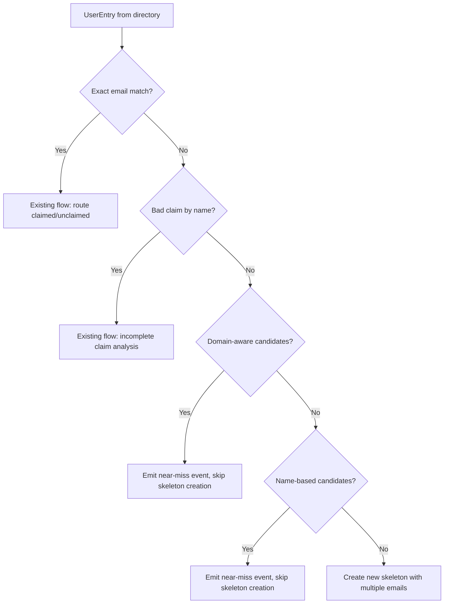
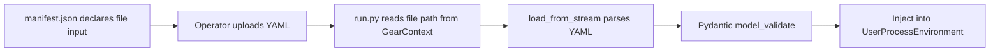

# Design Document: COManage Registry Resilience

## Overview

This design addresses the COManage UserRegistry's inability to match users when institutional IdPs return email addresses that differ from skeleton records. The current exact-match-only lookup causes duplicate skeleton creation for ~800 production records exhibiting systematic email transformation patterns (subdomain variation, affiliated domains, username aliasing).

The solution adds three complementary capabilities:

1. **Domain-aware fallback lookup** — a secondary index keyed by parent domain that finds candidate records when exact email match fails, driven entirely by an external `DomainRelationshipConfig`.
2. **Name-based duplicate detection** — a normalized-name index over all registry records that surfaces potential duplicates for operator review (never auto-match).
3. **Incomplete claim as first-class state** — new additive methods on `RegistryPerson` (`is_incomplete_claim()`, `is_unclaimed()`) that make the claimed-but-no-email state queryable without changing `is_claimed()` semantics.

Supporting changes include multi-email skeleton creation, wrong-IdP detection in `FailureAnalyzer`, new diagnostic event categories, and two new Pydantic config models (`DomainRelationshipConfig`, `IdPDomainConfig`) loaded from YAML following the existing `AuthMap` pattern.

All domain-specific rules (parent-child mappings, affiliated domains, IdP mappings, fallback IdP identity, name normalization) are external configuration parameters — nothing is hardcoded.

## Architecture

The changes are layered onto the existing architecture without altering the fundamental flow. The enrollment pipeline remains: directory entry → `ActiveUserProcess.visit()` → registry lookup → route to claimed/unclaimed/new-skeleton.



### Configuration Loading

New configs follow the established `AuthMap` pattern exactly:



### Key Design Decisions

1. **Near-misses flag only, never auto-match.** False positives (merging different people) are far worse than false negatives (creating a duplicate). Domain-aware and name-based candidates emit diagnostic events for operator review. The `ActiveUserProcess` does NOT create a skeleton when candidates are found — it flags and stops processing that entry.

2. **`is_claimed()` unchanged.** New state methods are additive. `is_incomplete_claim()` and `is_unclaimed()` are new; `is_claimed()` continues to require active + verified email + oidcsub.

3. **All domain logic is config-driven.** No hardcoded domain names, IdP names, or normalization rules. The `DomainRelationshipConfig` defines parent-child and affiliated-domain groupings. The `IdPDomainConfig` maps domains to expected IdPs and specifies the fallback IdP identity. A default parent-domain extraction (last two segments) applies only when no explicit mapping exists.

4. **Name normalization is injectable.** The `UserRegistry` accepts a `Callable[[str], str]` for name normalization. A default implementation (lowercase, strip, collapse whitespace, "first last" ordering) is provided, but operators can supply a custom function via config.


## Components and Interfaces

### 1. Configuration Models (`common/src/python/users/domain_config.py` — new file)

#### Domain Value Type

All domain strings in the config models are canonicalized on load via a shared `Domain` annotated type:

```python
def canonicalize_domain(value: str) -> str:
    """Lowercase, strip whitespace, remove trailing dots."""
    return value.lower().strip().rstrip(".")

Domain = Annotated[str, AfterValidator(canonicalize_domain)]
```

This ensures that `Med.Umich.EDU`, `med.umich.edu`, and ` med.umich.edu ` all resolve to the same canonical key `med.umich.edu` regardless of how they appear in the YAML.

#### Explicit Relationship Models

Rather than using raw `dict[str, str]` with unvalidated keys, domain relationships are represented as explicit Pydantic models:

```python
class ParentChildMapping(BaseModel):
    """A single parent-child domain relationship."""
    child: Domain       # e.g. "med.umich.edu"
    parent: Domain      # e.g. "umich.edu"

class AffiliatedDomainGroup(BaseModel):
    """A group of affiliated domains that share users."""
    name: str                  # e.g. "pitt" — human-readable group label
    domains: list[Domain]      # e.g. ["pitt.edu", "upmc.edu"]
    
    @field_validator("domains")
    @classmethod
    def at_least_two_domains(cls, v: list[str]) -> list[str]:
        if len(v) < 2:
            raise ValueError("affiliated group must contain at least 2 domains")
        return v
```

#### `DomainRelationshipConfig` (Pydantic BaseModel)

Loaded from YAML. Defines how email domains relate to each other. All domain fields are canonicalized on load.

```python
class DomainRelationshipConfig(BaseModel):
    """Configuration for domain parent-child and affiliation relationships.
    
    Loaded from YAML following the AuthMap pattern.
    All domain strings are canonicalized (lowercased, stripped) on load.
    """
    parent_child: list[ParentChildMapping] = []
    affiliated_groups: list[AffiliatedDomainGroup] = []
    
    def resolve_parent(self, domain: str) -> str:
        """Resolve a domain to its parent domain.
        
        1. Canonicalize the input domain
        2. Check explicit parent_child mappings
        3. Fall back to default extraction (last two segments)
        """
        ...
    
    def get_domain_group(self, domain: str) -> set[str]:
        """Get all domains related to the given domain.
        
        Returns the union of:
        - The domain itself (canonicalized)
        - Its parent domain (and siblings sharing that parent)
        - Any affiliated domains from affiliated_groups
        """
        ...
    
    @model_validator(mode="after")
    def validate_no_contradictions(self) -> Self:
        """Ensure no domain appears in multiple affiliated groups
        or as both a parent and child in contradictory ways."""
        ...
    
    @model_validator(mode="after")
    def build_lookup_indexes(self) -> Self:
        """Build internal dicts from the list-of-models representation
        for efficient lookup. Called once on load."""
        ...
```

#### Explicit IdP Mapping Models

```python
class InstitutionalIdPMapping(BaseModel):
    """Maps an email domain to its expected institutional IdP."""
    domain: Domain      # e.g. "umich.edu"
    idp_name: str       # e.g. "University of Michigan"
```

#### `IdPDomainConfig` (Pydantic BaseModel)

Loaded from YAML. Maps email domains to expected identity providers. All domain fields are canonicalized on load.

```python
class IdPDomainConfig(BaseModel):
    """Configuration mapping email domains to expected IdPs.
    
    Loaded from YAML following the AuthMap pattern.
    All domain strings are canonicalized (lowercased, stripped) on load.
    """
    # Domains with institutional IdPs
    institutional_idp: list[InstitutionalIdPMapping] = []
    
    # Domains that use the fallback IdP (no institutional IdP available)
    fallback_domains: list[Domain] = []
    
    # Identity of the fallback IdP (configurable, not hardcoded)
    fallback_idp: str = "ORCID"
    
    def get_expected_idp(
        self, domain: str, domain_config: DomainRelationshipConfig
    ) -> str | None:
        """Get the expected IdP for an email domain.
        
        Canonicalizes input, resolves subdomains via DomainRelationshipConfig.
        Returns None if domain is not mapped.
        """
        ...
    
    def is_fallback_domain(
        self, domain: str, domain_config: DomainRelationshipConfig
    ) -> bool:
        """Check if a domain is expected to use the fallback IdP.
        
        Canonicalizes input before lookup.
        """
        ...
    
    @model_validator(mode="after")
    def validate_no_overlap(self) -> Self:
        """Ensure no domain is listed in both institutional_idp and fallback_domains."""
        ...
    
    @model_validator(mode="after")
    def build_lookup_indexes(self) -> Self:
        """Build internal dicts from the list-of-models representation
        for efficient lookup. Called once on load."""
        ...
```

### 2. `RegistryPerson` Changes (`user_registry.py`)

New additive methods — no changes to existing method signatures or return values.

```python
class RegistryPerson:
    # EXISTING — unchanged
    def is_claimed(self) -> bool: ...
    
    # NEW — additive state methods
    def is_incomplete_claim(self) -> bool:
        """True if record has oidcsub identifier but no verified email.
        
        This represents a user who logged in via an IdP but the IdP
        did not return an email address (common with ORCID).
        """
        ...
    
    def is_unclaimed(self) -> bool:
        """True if record has no oidcsub identifier at all.
        
        The user has never logged in to claim their account.
        """
        ...
    
    # MODIFIED — accept list of emails
    @classmethod
    def create(
        cls,
        *,
        firstname: str,
        lastname: str,
        email: str | list[str],  # was: str
        coid: int,
    ) -> "RegistryPerson":
        """Creates a skeleton record. Accepts single email (backward compat)
        or list of emails."""
        ...
```

### 3. `UserRegistry` Changes (`user_registry.py`)

New indexes and lookup methods. Existing `get()` and `find_by_registry_id()` behavior unchanged.

```python
class UserRegistry:
    def __init__(
        self,
        api_instance: DefaultApi,
        coid: int,
        domain_config: DomainRelationshipConfig | None = None,
        name_normalizer: Callable[[str], str] | None = None,
    ):
        # Existing indexes
        self.__registry_map: dict[str, list[RegistryPerson]] = {}
        self.__bad_claims: dict[str, list[RegistryPerson]] = {}
        self.__registry_map_by_id: dict[str, RegistryPerson] = {}
        
        # NEW indexes
        self.__parent_domain_map: dict[str, list[RegistryPerson]] = {}
        self.__name_map: dict[str, list[RegistryPerson]] = {}
        
        # NEW config
        self.__domain_config = domain_config or DomainRelationshipConfig()
        self.__name_normalizer = name_normalizer or default_name_normalizer
    
    # EXISTING — unchanged signatures
    def get(self, email: str) -> list[RegistryPerson]: ...
    def find_by_registry_id(self, registry_id: str) -> RegistryPerson | None: ...
    def get_bad_claim(self, name: str) -> list[RegistryPerson]: ...
    
    # NEW methods
    def get_by_parent_domain(self, email: str) -> list[DomainCandidate]:
        """Fallback lookup: find candidates sharing the same parent domain.
        
        Returns DomainCandidate objects with the matched email and
        domain relationship info for caller assessment.
        """
        ...
    
    def get_by_name(self, full_name: str) -> list[RegistryPerson]:
        """Lookup candidates by normalized full name."""
        ...
```

#### `DomainCandidate` (dataclass)

Returned by `get_by_parent_domain()` to give callers match-quality context.

```python
@dataclass
class DomainCandidate:
    """A candidate record found via domain-aware lookup."""
    person: RegistryPerson
    matched_email: str          # The email on the candidate that matched
    query_domain: str           # The domain from the query email
    candidate_domain: str       # The domain from the candidate email
    parent_domain: str          # The shared parent domain
```

### 4. `ActiveUserProcess` Changes (`user_processes.py`)

The `visit()` method gains two new fallback steps between "bad claim check" and "create skeleton":

```python
def visit(self, entry: ActiveUserEntry) -> None:
    # Step 1: Exact email match (unchanged)
    person_list = self.__env.user_registry.get(email=entry.auth_email)
    if person_list:
        # ... existing claimed/unclaimed routing ...
        return
    
    # Step 2: Bad claim check (unchanged)
    bad_claim = self.__env.user_registry.get_bad_claim(entry.full_name)
    if bad_claim:
        # ... existing incomplete claim handling ...
        return
    
    # Step 3: NEW — Domain-aware candidate check
    domain_candidates = self.__env.user_registry.get_by_parent_domain(entry.auth_email)
    
    # Step 4: NEW — Name-based candidate check
    name_candidates = self.__env.user_registry.get_by_name(entry.full_name)
    
    # Step 5: NEW — Emit near-miss events if candidates found
    if domain_candidates or name_candidates:
        self.__emit_near_miss_events(entry, domain_candidates, name_candidates)
        return  # Do NOT create skeleton — flag for review
    
    # Step 6: Create skeleton (modified to pass multiple emails)
    self.__add_to_registry(user_entry=entry)
    ...
```

### 5. `FailureAnalyzer` Changes (`failure_analyzer.py`)

Extended to accept `IdPDomainConfig` and `DomainRelationshipConfig` for wrong-IdP detection.

```python
class FailureAnalyzer:
    def __init__(
        self,
        environment: UserProcessEnvironment,
        idp_config: IdPDomainConfig | None = None,
        domain_config: DomainRelationshipConfig | None = None,
    ):
        ...
    
    def detect_incomplete_claim(
        self, entry: ActiveUserEntry, bad_claim_persons: list[RegistryPerson]
    ) -> UserProcessEvent | None:
        """Extended: now also checks for wrong-IdP selection when
        idp_config is available."""
        ...
    
    def _detect_wrong_idp(
        self, entry: ActiveUserEntry, bad_claim_persons: list[RegistryPerson]
    ) -> UserProcessEvent | None:
        """Check if user's email domain maps to an institutional IdP
        but they claimed via a different IdP (e.g., the fallback IdP).
        
        Uses DomainRelationshipConfig to resolve subdomains.
        Uses IdPDomainConfig to look up expected IdP.
        """
        ...
```

### 6. New Event Categories (`event_models.py`)

```python
class EventCategory(Enum):
    # ... existing categories ...
    
    # NEW near-miss categories
    DOMAIN_NEAR_MISS = "Domain Near-Miss"
    NAME_NEAR_MISS = "Name Near-Miss"
    COMBINED_NEAR_MISS = "Combined Signal Near-Miss"
    
    # NEW wrong-IdP category
    WRONG_IDP_SELECTION = "Wrong IdP Selection"
```

### 7. `UserProcessEnvironment` Changes (`user_process_environment.py`)

Add config references so they're available to `ActiveUserProcess` and `FailureAnalyzer`.

```python
class UserProcessEnvironment:
    def __init__(
        self,
        *,
        admin_group: NACCGroup,
        authorization_map: AuthMap,
        proxy: FlywheelProxy,
        registry: UserRegistry,
        notification_client: NotificationClient,
        # NEW — optional, backward compatible
        domain_config: DomainRelationshipConfig | None = None,
        idp_config: IdPDomainConfig | None = None,
    ):
        ...
```

### 8. Gear Entry Point Changes (`run.py`)

New `__get_domain_config()` and `__get_idp_config()` methods following the `__get_auth_map()` pattern. The `UserRegistry` and `UserProcessEnvironment` constructors receive the loaded configs.

### 9. Gear Manifest Changes (`manifest.json`)

New optional file input:

```json
{
    "inputs": {
        "domain_config_file": {
            "base": "file",
            "description": "Domain relationship and IdP configuration YAML file",
            "type": { "enum": ["source code"] },
            "optional": true
        }
    }
}
```

### 10. Helper Function

```python
def default_name_normalizer(name: str) -> str:
    """Default name normalization: lowercase, strip, collapse whitespace."""
    return " ".join(name.lower().split())
```


## Data Models

### Configuration YAML Schemas

#### Domain Relationship Config (`domain_config.yaml`)

```yaml
# Explicit parent-child domain mappings
parent_child:
  - child: med.umich.edu
    parent: umich.edu
  - child: health.ucdavis.edu
    parent: ucdavis.edu
  - child: cumc.columbia.edu
    parent: columbia.edu
  - child: loni.usc.edu
    parent: usc.edu
  - child: pennmedicine.upenn.edu
    parent: upenn.edu
  - child: medicine.wisc.edu
    parent: wisc.edu
  - child: u.northwestern.edu
    parent: northwestern.edu
  - child: mednet.ucla.edu
    parent: ucla.edu
  - child: mgh.harvard.edu
    parent: harvard.edu
  - child: neurology.ufl.edu
    parent: ufl.edu
  - child: phhp.ufl.edu
    parent: ufl.edu
  - child: med.unc.edu
    parent: unc.edu
  - child: neurology.unc.edu
    parent: unc.edu
  - child: hs.uci.edu
    parent: uci.edu
  - child: med.usc.edu
    parent: usc.edu
  - child: jh.edu
    parent: jhu.edu
  - child: jhmi.edu
    parent: jhu.edu

# Affiliated domain groups (separate institutions sharing users)
affiliated_groups:
  - name: pitt
    domains:
      - pitt.edu
      - upmc.edu
```

#### IdP Domain Config (`idp_config.yaml`)

```yaml
# The fallback IdP identity (configurable, not hardcoded)
fallback_idp: ORCID

# Domains with institutional IdPs
institutional_idp:
  - domain: umich.edu
    idp_name: University of Michigan
  - domain: columbia.edu
    idp_name: Columbia University
  - domain: ucdavis.edu
    idp_name: UC Davis
  - domain: upenn.edu
    idp_name: University of Pennsylvania
  - domain: wisc.edu
    idp_name: UW-Madison
  - domain: emory.edu
    idp_name: Emory University
  # ... additional mappings ...

# Domains that legitimately use the fallback IdP
fallback_domains:
  - advocatehealth.org
  - bannerhealth.com
  - ccf.org
  - vumc.org
```

### New/Modified Pydantic Models

| Model | File | Type | Purpose |
| ----- | ---- | ---- | ------- |
| `Domain` | `domain_config.py` (new) | Annotated type | Canonicalized domain string (lowercased, stripped, trailing dot removed) |
| `ParentChildMapping` | `domain_config.py` (new) | Pydantic BaseModel | Single parent-child domain relationship with canonicalized fields |
| `AffiliatedDomainGroup` | `domain_config.py` (new) | Pydantic BaseModel | Named group of affiliated domains with canonicalized fields |
| `InstitutionalIdPMapping` | `domain_config.py` (new) | Pydantic BaseModel | Single domain-to-IdP mapping with canonicalized domain |
| `DomainRelationshipConfig` | `domain_config.py` (new) | Pydantic BaseModel | Parent-child and affiliated domain mappings |
| `IdPDomainConfig` | `domain_config.py` (new) | Pydantic BaseModel | Domain-to-IdP mappings and fallback IdP identity |
| `DomainCandidate` | `user_registry.py` | dataclass | Domain-aware lookup result with match context |

### Index Data Structures in `UserRegistry`

| Index | Key | Value | Purpose |
|-------|-----|-------|---------|
| `__registry_map` (existing) | email string | `list[RegistryPerson]` | Exact email lookup |
| `__registry_map_by_id` (existing, fixed) | registry ID | `RegistryPerson` | ID lookup — now includes records without email |
| `__bad_claims` (existing) | primary name | `list[RegistryPerson]` | Incomplete claim lookup |
| `__parent_domain_map` (new) | parent domain | `list[RegistryPerson]` | Domain-aware fallback lookup |
| `__name_map` (new) | normalized name | `list[RegistryPerson]` | Name-based duplicate detection |

### Modified `__add_person` Logic

The `__add_person` method is the core indexing function. Current behavior skips records without email unless they are claimed (routes to `__bad_claims`). New behavior:

```
For every person record:
  1. If has registry_id → add to __registry_map_by_id (ALWAYS, regardless of email)
  2. If has primary_name → add to __name_map (normalized key)
  3. If has email_addresses:
     a. For each email → add to __registry_map (existing)
     b. For each email → extract parent domain → add to __parent_domain_map
  4. If no email_addresses AND is_claimed (has oidcsub):
     a. Add to __bad_claims by primary_name (existing behavior)
```


## Correctness Properties

*A property is a characteristic or behavior that should hold true across all valid executions of a system — essentially, a formal statement about what the system should do. Properties serve as the bridge between human-readable specifications and machine-verifiable correctness guarantees.*

### Property 1: Domain-aware lookup returns correct candidates with context

*For any* email address and any set of registry records, calling `get_by_parent_domain(email)` shall return only `DomainCandidate` objects whose `parent_domain` matches the parent domain of the query email (as resolved by the `DomainRelationshipConfig`), and each returned candidate shall have non-empty `matched_email`, `query_domain`, `candidate_domain`, and `parent_domain` fields. Furthermore, for any domain explicitly mapped in the config's `parent_child` dict, `resolve_parent` shall return the configured parent rather than the default two-segment extraction.

**Validates: Requirements 1.1, 1.2, 1.3, 1.6**

### Property 2: Registry indexing invariant

*For any* set of CoPerson records loaded into the `UserRegistry`, a record appears in the registry-ID index if and only if it has a registry ID (regardless of whether it has email addresses), and a record appears in the email index if and only if it has at least one email address. Formally: `find_by_registry_id(id) is not None` iff the record has that registry ID, and `get(email)` contains the record iff the record has that email.

**Validates: Requirements 2.1, 2.3**

### Property 3: Claim state trichotomy

*For any* active `RegistryPerson`, exactly one of the following is true: `is_claimed()`, `is_incomplete_claim()`, or `is_unclaimed()`. Specifically: `is_claimed()` returns True iff the record is active, has at least one verified email, and has an `oidcsub` identifier from `cilogon.org`; `is_incomplete_claim()` returns True iff the record has an `oidcsub` identifier but no verified email; `is_unclaimed()` returns True iff the record has no `oidcsub` identifier.

**Validates: Requirements 3.1, 3.2, 3.3**

### Property 4: Multi-email skeleton creation

*For any* non-empty list of email address strings, calling `RegistryPerson.create(email=emails, ...)` shall produce a `RegistryPerson` whose `email_addresses` contains exactly one `EmailAddress` entry per input string, each with `type="official"`. When a single string is provided (not a list), the result shall have exactly one `EmailAddress` entry.

**Validates: Requirements 4.1, 4.2**

### Property 5: Name-based index completeness

*For any* set of registry records (claimed, unclaimed, or incomplete-claim) that have a primary name, after indexing, `get_by_name(normalized_name)` shall return all records whose normalized primary name equals the query, without filtering by claim state. The returned list shall contain every matching record and no non-matching records.

**Validates: Requirements 5.1, 5.2, 5.3, 5.4**

### Property 6: Skeleton creation decision

*For any* `ActiveUserEntry` processed by `ActiveUserProcess.visit()`, a new skeleton record is created if and only if all of the following are true: (a) exact email lookup returns no results, (b) bad-claim lookup returns no results, (c) domain-aware candidate lookup returns no results, and (d) name-based candidate lookup returns no results. When any candidate lookup returns results, a diagnostic event is emitted and no skeleton is created.

**Validates: Requirements 6.1, 6.2, 6.3**

### Property 7: Near-miss event categorization

*For any* near-miss scenario in `ActiveUserProcess`, the emitted `UserProcessEvent` category shall be `COMBINED_NEAR_MISS` if at least one candidate appears in both the domain-aware and name-based results, `DOMAIN_NEAR_MISS` if only domain-aware candidates exist, and `NAME_NEAR_MISS` if only name-based candidates exist. Every near-miss event shall include the user context (email, name, center ID) and candidate record details (email, name, registry ID).

**Validates: Requirements 7.1, 7.2, 7.3, 7.4**

### Property 8: Wrong-IdP detection

*For any* incomplete claim record analyzed by `FailureAnalyzer`, a `WRONG_IDP_SELECTION` event is emitted if and only if the user's skeleton email domain (resolved to parent domain via `DomainRelationshipConfig`) maps to an institutional IdP in the `IdPDomainConfig` and the claim was made through a different IdP. When the domain is listed in `fallback_domains` or maps to the fallback IdP, no wrong-IdP event shall be emitted.

**Validates: Requirements 8.1, 8.2, 8.3**

### Property 9: Configuration round-trip and canonicalization

*For any* valid `DomainRelationshipConfig` or `IdPDomainConfig` instance, serializing to a dictionary and deserializing via `model_validate` shall produce an equivalent configuration object. Furthermore, *for any* domain string containing uppercase characters, leading/trailing whitespace, or trailing dots, after loading through any config model, the stored domain value shall equal the canonicalized form (lowercased, stripped, trailing dot removed). Two config instances that differ only in domain casing/whitespace shall be equivalent after loading.

**Validates: Requirements 9.1**

### Property 10: Default domain resolution

*For any* email domain not explicitly listed in the `DomainRelationshipConfig.parent_child` mapping, `resolve_parent` shall return the last two segments of the domain (e.g., `med.umich.edu` → `umich.edu`, `foo.bar.baz.edu` → `baz.edu`). For two-segment domains (e.g., `umich.edu`), it shall return the domain itself.

**Validates: Requirements 9.5**

### Property 11: Configuration validation rejects contradictions

*For any* configuration where a domain appears in both `IdPDomainConfig.institutional_idp` and `IdPDomainConfig.fallback_domains`, `model_validate` shall raise a `ValidationError`. Similarly, for any `DomainRelationshipConfig` where a domain appears in multiple `affiliated_groups`, validation shall raise an error.

**Validates: Requirements 9.6**


## Error Handling

### Configuration Errors

| Scenario | Behavior |
|----------|----------|
| Domain config YAML is malformed | `GearExecutionError` raised during gear startup with clear message |
| Domain in both `institutional_idp` and `fallback_domains` | `ValidationError` raised by Pydantic `model_validator` on load |
| Domain in multiple `affiliated_groups` | `ValidationError` raised by Pydantic `model_validator` on load |
| No domain config file provided (optional input) | System uses default `DomainRelationshipConfig()` and `IdPDomainConfig()` — feature is functional with default parent-domain extraction and no IdP detection |

### Registry Errors

| Scenario | Behavior |
|----------|----------|
| COManage API failure during `__list()` | `RegistryError` raised (existing behavior, unchanged) |
| COManage API failure during `add()` | `RegistryError` raised (existing behavior, unchanged) |
| Record has no primary name | Record is excluded from `__name_map` but still indexed by email and registry ID |
| Record has no email and no oidcsub | Record is excluded from email and bad-claims indexes but still indexed by registry ID (if present) and name |

### Process Errors

| Scenario | Behavior |
|----------|----------|
| `ActiveUserProcess.visit()` encounters near-miss candidates | Diagnostic event emitted via `UserEventCollector`, entry processing stops (no skeleton created), batch continues |
| `FailureAnalyzer` detects wrong IdP | `WRONG_IDP_SELECTION` event emitted with actionable message, batch continues |
| `FailureAnalyzer` has no `IdPDomainConfig` | Falls back to existing behavior (ORCID detection by org identity name only) |
| Name normalizer function raises exception | Catch, log warning, skip name indexing for that record, continue |

### Backward Compatibility

- `RegistryPerson.create(email="single@example.com")` continues to work — single string is auto-wrapped in a list internally.
- `UserRegistry.__init__()` without `domain_config` or `name_normalizer` uses defaults.
- `UserProcessEnvironment.__init__()` without `domain_config` or `idp_config` works — new parameters are optional with `None` default.
- `FailureAnalyzer.__init__()` without config parameters falls back to existing ORCID-name-based detection.

## Testing Strategy

### Property-Based Testing

**Library:** [Hypothesis](https://hypothesis.readthedocs.io/) (Python's standard PBT library, already available in the project's test dependencies).

**Configuration:** Each property test runs a minimum of 100 examples (`@settings(max_examples=100)`).

**Tag format:** Each test is annotated with a comment: `# Feature: comanage-registry-resilience, Property {N}: {title}`

Each correctness property from the design maps to exactly one property-based test:

| Property | Test Target | Generator Strategy |
|----------|-------------|-------------------|
| P1: Domain-aware lookup | `UserRegistry.get_by_parent_domain()` | Generate random email addresses with related domains, random `DomainRelationshipConfig` with parent-child and affiliated mappings |
| P2: Registry indexing invariant | `UserRegistry.__add_person()` via public interface | Generate `CoPersonMessage` objects with random combinations of emails, registry IDs, and oidcsub identifiers |
| P3: Claim state trichotomy | `RegistryPerson` state methods | Generate `CoPersonMessage` objects with random combinations of status, verified emails, and oidcsub identifiers |
| P4: Multi-email skeleton creation | `RegistryPerson.create()` | Generate random lists of 1-5 email strings |
| P5: Name-based index completeness | `UserRegistry.get_by_name()` | Generate records with random names (including duplicates, whitespace variations) |
| P6: Skeleton creation decision | `ActiveUserProcess.visit()` | Generate `ActiveUserEntry` objects with mocked registry returning various combinations of empty/non-empty results for each lookup |
| P7: Near-miss event categorization | `ActiveUserProcess.__emit_near_miss_events()` | Generate combinations of domain candidates and name candidates with overlapping/non-overlapping persons |
| P8: Wrong-IdP detection | `FailureAnalyzer._detect_wrong_idp()` | Generate email domains, IdP configs, and incomplete claim records with various org identities |
| P9: Config round-trip | `DomainRelationshipConfig`, `IdPDomainConfig` | Generate random valid config instances, serialize, deserialize |
| P10: Default domain resolution | `DomainRelationshipConfig.resolve_parent()` | Generate random domain strings with 2-5 segments |
| P11: Config validation | `IdPDomainConfig`, `DomainRelationshipConfig` | Generate configs with intentional contradictions |

### Unit Tests

Unit tests complement property tests by covering specific examples, edge cases, and integration points:

- **Edge cases from requirements:** Incomplete claim records with no name, records with empty email lists, single-segment domains, domains with many sublevels.
- **Specific examples from production data:** The known email transformation patterns (e.g., `med.umich.edu` → `umich.edu`, `upmc.edu` ↔ `pitt.edu` affiliation).
- **Integration tests:** `ActiveUserProcess.visit()` end-to-end with mocked registry and collector, verifying the full decision flow.
- **Backward compatibility:** `RegistryPerson.create()` with single email string, `UserRegistry` without config parameters, `FailureAnalyzer` without IdP config.
- **Error conditions:** Malformed YAML, contradictory config entries, API failures during registry operations.

### Test File Organization

```
common/test/python/user_test/
├── test_domain_config.py          # P9, P10, P11 + unit tests for config models
├── test_registry_person_state.py  # P3, P4 + unit tests for new state methods
├── test_user_registry_indexes.py  # P1, P2, P5 + unit tests for new indexes
├── test_active_user_process.py    # P6, P7 + integration tests for decision logic
├── test_failure_analyzer.py       # P8 + unit tests for wrong-IdP detection
```

