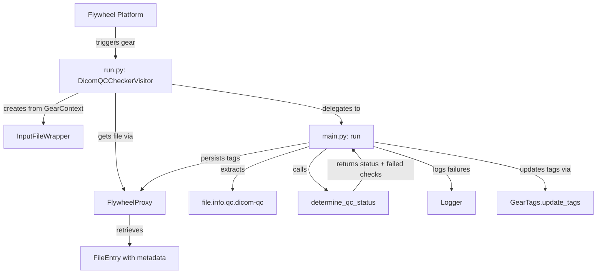

# Design Document: dicom-qc-checker

## Overview

The dicom-qc-checker gear is a Flywheel gear that reads DICOM QC check results from a file's metadata, determines an aggregate pass/fail status, logs details of any failures, and tags the file with the outcome. It follows the project's `GearExecutionEnvironment` pattern for Flywheel integration and separates pure business logic (status determination) from platform interactions (SDK calls for metadata retrieval and tag persistence).

The gear is intentionally simple: its core algorithm is a pure function over a metadata dictionary, making it straightforward to test and reason about.

## Architecture



### Data Flow

1. Flywheel invokes the gear container with a file input
2. `run.py` builds the execution environment from `GearContext`, retrieving the `FileEntry` via the Flywheel SDK
3. `run.py` calls `main.run()` passing the `FileEntry` and `FlywheelProxy`
4. `main.run()` extracts the `dicom-qc` metadata dict from `file.info.qc`
5. `main.run()` calls `determine_qc_status()` — a pure function that returns the status and list of failed/invalid check names
6. If the metadata is absent or empty, the gear logs a warning and exits successfully (exit code 0)
7. If there are failures, the gear logs each failed/invalid check name at WARNING level
8. The gear updates the file's tags using `GearTags.update_tags()` and persists via the SDK

## Components and Interfaces

### run.py — DicomQCCheckerVisitor

```python
class DicomQCCheckerVisitor(GearExecutionEnvironment):
    """Gear execution environment for the dicom-qc-checker gear."""

    def __init__(
        self,
        client: ClientWrapper,
        *,
        file_input: InputFileWrapper,
    ) -> None: ...

    @classmethod
    def create(
        cls,
        context: GearContext,
        parameter_store: ParameterStore | None = None,
    ) -> "DicomQCCheckerVisitor": ...

    def run(self, context: GearContext) -> None:
        """Retrieves the FileEntry and delegates to main.run()."""
        ...


def main() -> None:
    """Entry point: calls GearEngine().run(gear_type=DicomQCCheckerVisitor)."""
    ...
```

**Responsibilities:**
- Builds `ClientWrapper` and `InputFileWrapper` from `GearContext`
- Retrieves the full `FileEntry` via `FlywheelProxy.get_file()`
- Delegates all business logic to `main.run()`
- Raises `GearExecutionError` on infrastructure failures

### main.py — Business Logic

```python
def run(*, file: FileEntry, proxy: FlywheelProxy) -> None:
    """Execute the dicom-qc-checker logic.

    Args:
        file: The Flywheel file entry with metadata
        proxy: FlywheelProxy for persisting tag updates

    Raises:
        GearExecutionError: If tag persistence fails
    """
    ...


def determine_qc_status(
    dicom_qc: dict[str, Any],
) -> tuple[str, list[str]]:
    """Determine overall QC status from dicom-qc metadata.

    Args:
        dicom_qc: The file.info.qc.dicom-qc dictionary

    Returns:
        Tuple of (status, problem_checks) where:
          - status is "PASS" or "FAIL"
          - problem_checks is list of check names that failed or had invalid state
    """
    ...
```

**Responsibilities of `run()`:**
- Extracts `file.info.qc.dicom-qc` from the file entry
- Handles the "no metadata" and "only job_info" early-exit cases (log warning, return)
- Calls `determine_qc_status()` for the status decision
- Logs failed/invalid check names at WARNING level
- Updates tags via `GearTags.update_tags()` and persists via proxy

**Responsibilities of `determine_qc_status()`:**
- Pure function: no side effects, no SDK calls
- Filters out `job_info` key
- Identifies check results (dict entries with a `state` field)
- Returns FAIL if any check has state != "PASS" or if no check results remain
- Returns PASS only if all check results have state == "PASS"

### GearTags (from nacc_common.error_models)

Existing class, used as-is:

```python
gear_tags = GearTags("dicom-qc-checker")
# gear_tags.pass_tag == "dicom-qc-checker-PASS"
# gear_tags.fail_tag == "dicom-qc-checker-FAIL"
updated_tags = gear_tags.update_tags(existing_tags, status)
```

## Data Models

### Input: DICOM QC Metadata Structure

The metadata at `file.info.qc.dicom-qc` is a dictionary with this shape:

```python
{
    "job_info": {                    # Always present, excluded from evaluation
        "job_id": "abc123",
        "gear_name": "dicom-qc",
        ...
    },
    "check_name_1": {               # Check result entry
        "state": "PASS" | "FAIL",
        ...                          # Other fields ignored
    },
    "check_name_2": {
        "state": "PASS" | "FAIL",
        ...
    },
    ...
}
```

**Rules for identifying check results:**
- Key is not `"job_info"`
- Value is a dict containing a `"state"` field

### Output: Status Determination

| Condition | Overall Status | Problem Checks |
|-----------|---------------|----------------|
| All check results have state "PASS" | PASS | [] |
| Any check result has state "FAIL" | FAIL | [names with "FAIL"] |
| Any check result has invalid state | FAIL | [names with invalid state] |
| No check results after filtering | FAIL | [] |

### File Tags

| Status | Tag Applied |
|--------|-------------|
| PASS | `dicom-qc-checker-PASS` |
| FAIL | `dicom-qc-checker-FAIL` |

Previous pass/fail tags are always removed before applying the new tag.

## Correctness Properties

*A property is a characteristic or behavior that should hold true across all valid executions of a system — essentially, a formal statement about what the system should do. Properties serve as the bridge between human-readable specifications and machine-verifiable correctness guarantees.*

### Property 1: Status determination correctness

*For any* DICOM QC metadata dictionary containing at least one check result entry (non-`job_info` dict with a `state` field), the overall status SHALL be PASS if and only if every check result has `state` equal to `"PASS"`. If any check result has `state` not equal to `"PASS"` (including `"FAIL"` or any other value), the overall status SHALL be FAIL.

**Validates: Requirements 2.3, 2.4, 2.6**

### Property 2: Job_info and non-check entry exclusion

*For any* DICOM QC metadata dictionary and any modification to the `job_info` entry or any entry that does not contain a `state` field, the overall status determination SHALL produce the same result as it would without those modifications.

**Validates: Requirements 2.1, 2.2**

### Property 3: Failure reporting completeness

*For any* DICOM QC metadata dictionary that produces an overall status of FAIL, the list of problem check names returned by `determine_qc_status` SHALL include every check result key whose `state` is not equal to `"PASS"`.

**Validates: Requirements 3.1, 3.2**

### Property 4: Tag update removes old status tags

*For any* initial tag list (possibly containing `"dicom-qc-checker-PASS"` and/or `"dicom-qc-checker-FAIL"`) and any status value, applying `GearTags("dicom-qc-checker").update_tags(tags, status)` SHALL produce a list that contains exactly one tag matching the new status and does not contain the opposite status tag.

**Validates: Requirements 4.2, 4.3, 4.4**

## Error Handling

| Scenario | Behavior |
|----------|----------|
| `file.info.qc.dicom-qc` is absent or empty | Log warning, exit with code 0 (success — nothing to check) |
| Metadata contains only `job_info` | Log warning, exit with code 0 |
| No valid check results after filtering | Status = FAIL, tag applied, exit with code 0 |
| Tag persistence fails (API error) | Log error, raise `GearExecutionError` (exit code 1) |
| File retrieval fails (API error) | Raise `GearExecutionError` (exit code 1) |

**Design rationale:** When QC metadata is absent, the gear treats it as "nothing to do" rather than a failure. The dicom-qc gear simply hasn't run yet (or was configured to skip checks), so tagging the file as FAIL would be misleading. However, if metadata is present but contains no valid check results after filtering, that's unexpected and results in FAIL since we can't confirm the file passed.

## Testing Strategy

### Property-Based Tests

The `determine_qc_status` function is a pure function with a large input space (arbitrary dict structures, varying numbers of checks, various state values). This makes it an excellent candidate for property-based testing.

**Library:** [Hypothesis](https://hypothesis.readthedocs.io/) (Python PBT library)

**Configuration:**
- Minimum 100 iterations per property test
- Each test tagged with: `Feature: dicom-qc-checker, Property {N}: {description}`

**Generators needed:**
- Random DICOM QC metadata dicts with:
  - A `job_info` entry with arbitrary content
  - 0–10 check result entries with `state` values drawn from `{"PASS", "FAIL"}` plus occasional invalid values
  - Optional non-check entries (dicts without `state`, non-dict values)

### Unit Tests (Example-Based)

- **No metadata case:** `file.info.qc.dicom-qc` absent → warning logged, no tags changed
- **Empty metadata case:** `{}` → warning logged
- **Only job_info case:** `{"job_info": {...}}` → warning logged
- **Single PASS:** `{"job_info": {...}, "check1": {"state": "PASS"}}` → PASS tag
- **Single FAIL:** `{"job_info": {...}, "check1": {"state": "FAIL"}}` → FAIL tag, check1 logged
- **Mixed:** Multiple checks, some PASS some FAIL → FAIL tag, failed checks logged
- **Tag persistence failure:** Mock API exception → GearExecutionError raised

### Integration Points

- `run.py` correctly wires `GearContext` → `InputFileWrapper` → `FileEntry` → `main.run()`
- Tag update correctly calls `file.update(tags=...)` on the proxy

### Test Structure

```
gear/dicom_qc_checker/test/python/
└── dicom_qc_checker_app_test/
    ├── BUILD
    ├── __init__.py
    ├── conftest.py          # Shared fixtures and generators
    ├── test_determine_status.py  # Property tests + unit tests for determine_qc_status
    └── test_main.py         # Unit tests for main.run() with mocked proxy
```
