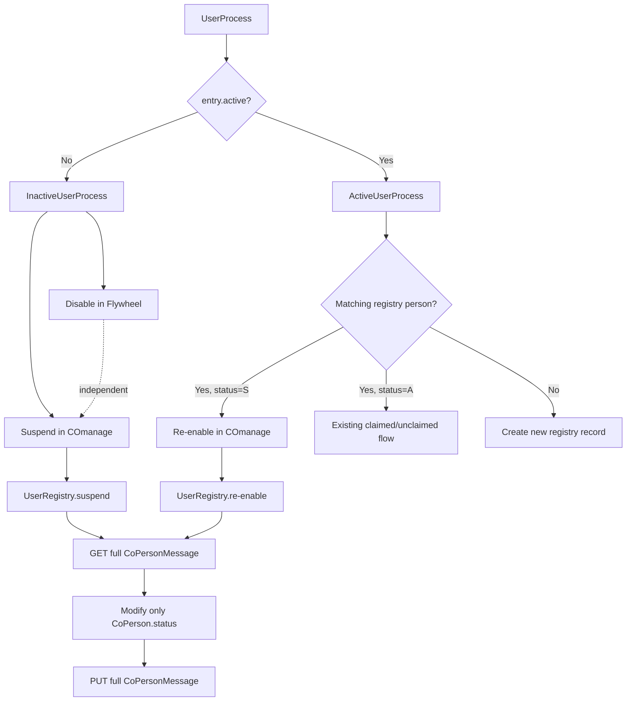
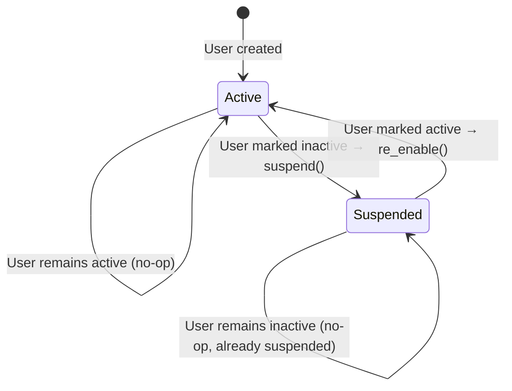

# Design Document: Disable Inactive COmanage Users

## Overview

This feature extends the existing inactive user workflow to suspend users in the COmanage registry when they are marked inactive in the NACC directory. Currently, `InactiveUserProcess` only disables users in Flywheel. After this change, it will also set the CO Person status to `"S"` (Suspended) in COmanage, revoking downstream OIDC authorization. A complementary re-enable path in `ActiveUserProcess` restores suspended users who become active again, avoiding duplicate record creation.

The design follows the existing codebase patterns:
- `UserRegistry` gains update capability (currently only has `add` and `get`)
- `InactiveUserProcess` gains COmanage suspension (currently only disables in Flywheel)
- `ActiveUserProcess` gains re-enable detection (currently only creates new records or routes to claimed/unclaimed queues)
- All new write operations respect the existing dry-run mode pattern from `FlywheelProxy`

## Architecture

The feature integrates into the existing user management gear architecture without introducing new services or dependencies.



### Key Design Decisions

1. **Read-modify-write pattern**: The COmanage Core API PUT endpoint does not support patch semantics. Omitting related models causes the API to delete them. The update flow must always: GET the full `CoPersonMessage`, modify only the status field, PUT the entire record back.

2. **Service independence**: Flywheel disable and COmanage suspend are independent operations. A failure in one does not prevent the other. This matches the existing error-handling philosophy where individual user processing errors are logged but don't stop batch processing.

3. **Dry-run at the registry level**: Rather than adding dry-run awareness to `InactiveUserProcess` and `ActiveUserProcess`, the `UserRegistry` itself accepts a `dry_run` flag. This mirrors how `FlywheelProxy` handles dry-run — the proxy/registry layer decides whether to execute writes. Read operations (GET) still execute in dry-run mode to validate records exist.

4. **Re-enable scope**: Only users matched by the same email address are re-enabled. Users who moved to a new institution get new records. This avoids false matches.

## Components and Interfaces

### UserRegistry (modified)

New constructor parameter and methods added to the existing `UserRegistry` class.

```python
class UserRegistry:
    def __init__(
        self,
        api_instance: DefaultApi,
        coid: int,
        name_normalizer: Callable[[str], str],
        domain_config: Optional[DomainRelationshipConfig] = None,
        dry_run: bool = False,  # NEW
    ):
        ...

    # NEW: Suspend a CO Person
    def suspend(self, registry_id: str) -> None:
        """Suspend a CO Person by setting status to 'S'.

        Retrieves the full CoPersonMessage, sets CoPerson.status to 'S',
        and PUTs the entire record back. In dry-run mode, logs the
        intended action without calling PUT.

        Args:
            registry_id: the NACC registry ID (naccid identifier)

        Raises:
            RegistryError: if the person cannot be found, has no registry ID,
                          or the API call fails
        """

    # NEW: Re-enable a suspended CO Person
    def re_enable(self, registry_id: str) -> None:
        """Re-enable a suspended CO Person by setting status to 'A'.

        Retrieves the full CoPersonMessage, sets CoPerson.status to 'A',
        and PUTs the entire record back. In dry-run mode, logs the
        intended action without calling PUT.

        Args:
            registry_id: the NACC registry ID (naccid identifier)

        Raises:
            RegistryError: if the person cannot be found or the API call fails
        """

    # PRIVATE: Shared update logic
    def __update_status(self, registry_id: str, target_status: str) -> None:
        """Retrieve the full CoPersonMessage, change only the status, PUT it back.

        Args:
            registry_id: the NACC registry ID
            target_status: the target CoPerson status ('S' or 'A')

        Raises:
            RegistryError: on API errors or missing records
        """

    # PRIVATE: Fetch a single CoPersonMessage by identifier
    def __get_person_message(self, registry_id: str) -> CoPersonMessage:
        """Retrieve the full CoPersonMessage for a registry ID via GET.

        Uses the DefaultApi.get_co_person with the identifier parameter
        to fetch a single record.

        Args:
            registry_id: the NACC registry ID

        Returns:
            The full CoPersonMessage

        Raises:
            RegistryError: if the API call fails or no record is found
        """
```

### InactiveUserProcess (modified)

The `visit` method is extended to suspend in COmanage after disabling in Flywheel.

```python
class InactiveUserProcess(BaseUserProcess[UserEntry]):
    def visit(self, entry: UserEntry) -> None:
        """Process an inactive user entry.

        1. Look up and disable matching Flywheel users (existing behavior)
        2. Look up and suspend matching COmanage registry persons (NEW)

        The two operations are independent — failure of either does not
        prevent the other.
        """
```

### ActiveUserProcess (modified)

The `visit` method is extended to detect suspended registry persons and re-enable them.

```python
class ActiveUserProcess(BaseUserProcess[ActiveUserEntry]):
    def visit(self, entry: ActiveUserEntry) -> None:
        """Process an active user entry.

        When a matching registry person is found with status 'S' (Suspended),
        re-enable them instead of treating them as a new user. This prevents
        duplicate record creation for returning users.

        The re-enable check happens after the email lookup but before the
        existing claimed/unclaimed routing.
        """
```

### RegistryPerson (modified)

A new method to check suspended status.

```python
class RegistryPerson:
    def is_suspended(self) -> bool:
        """Indicates whether the CoPerson record is suspended.

        Returns:
            True if the CoPerson status is 'S' (Suspended). False otherwise.
        """
```

### UserProcessEnvironment (no changes)

Already provides access to `user_registry` via its `user_registry` property. No new wiring needed.

### Gear Entry Point — run.py (modified)

The `UserRegistry` constructor call in `run.py` needs to pass the `dry_run` flag from the `FlywheelProxy`.

```python
registry=UserRegistry(
    api_instance=DefaultApi(comanage_client),
    coid=self.__comanage_coid,
    name_normalizer=normalize_person_name,
    domain_config=domain_config,
    dry_run=self.proxy.dry_run,  # NEW: pass dry_run from proxy
)
```

## Data Models

### COmanage API Models (no changes)

The existing generated SDK models are used as-is:

- **`CoPersonMessage`**: The full record containing `CoPerson` and all related models (`Name`, `EmailAddress`, `CoPersonRole`, `Identifier`, `OrgIdentity`, `CoGroupMember`, `SshKey`, `Url`). This is the unit of read and write for the Core API.
- **`CoPerson`**: Contains the `status` field. Valid statuses include `"A"` (Active) and `"S"` (Suspended).
- **`DefaultApi`**: Provides `get_co_person(coid, identifier=...)` for fetching by registry ID and `update_co_person(coid, identifier, co_person_message)` for updating.

### Event Models (no changes)

The existing `EventCategory.USER_DISABLED` is reused for COmanage suspension events. Event messages distinguish between Flywheel disable and COmanage suspend:

- Flywheel: `"User {user_id} disabled in Flywheel"` (existing)
- COmanage: `"User {registry_id} suspended in COmanage"` (new)
- COmanage re-enable: `"User {registry_id} re-enabled in COmanage"` (new, uses a success event)

### Status Flow



## Correctness Properties

*A property is a characteristic or behavior that should hold true across all valid executions of a system — essentially, a formal statement about what the system should do. Properties serve as the bridge between human-readable specifications and machine-verifiable correctness guarantees.*

### Property 1: Status update round-trip preserves all non-status fields

*For any* valid `CoPersonMessage` retrieved from the COmanage API and *for any* target status (`"S"` or `"A"`), performing a status update (GET → modify status → PUT) SHALL preserve all non-status fields and all related models (`Name`, `EmailAddress`, `CoPersonRole`, `Identifier`, `OrgIdentity`, `CoGroupMember`, `SshKey`, `Url`) unchanged. Only the `CoPerson.status` field SHALL differ between the original and updated messages.

**Validates: Requirements 1.1, 1.2, 2.1, 2.2, 6.1, 6.2, 6.3, 6.4**

### Property 2: Flywheel disable and COmanage suspend are independent

*For any* inactive user entry and *for any* combination of Flywheel and COmanage operation outcomes (success or failure), the failure of one service operation SHALL NOT prevent the other from being attempted. Specifically: if Flywheel disable raises an error, COmanage suspend is still attempted; if COmanage suspend raises an error, the Flywheel disable result is unaffected.

**Validates: Requirements 3.1, 3.3, 3.4**

### Property 3: Active process re-enables suspended users instead of creating duplicates

*For any* active user entry whose email matches a `RegistryPerson` with status `"S"` (Suspended), the `ActiveUserProcess` SHALL call re-enable on that person rather than creating a new registry record. The registry `add` method SHALL NOT be called for that entry.

**Validates: Requirements 4.1, 4.2**

### Property 4: Dry-run mode skips writes but performs reads

*For any* status update operation (suspend or re-enable) and *for any* valid registry ID, when dry-run mode is enabled, the `UserRegistry` SHALL call the GET endpoint to retrieve the record but SHALL NOT call the PUT endpoint. The intended action (registry ID and target status) SHALL be logged.

**Validates: Requirements 5.1, 5.2, 5.3**

## Error Handling

### UserRegistry errors

| Scenario | Behavior |
|---|---|
| Registry ID is `None` or empty | Raise `RegistryError("Cannot update person: no registry ID")` |
| GET returns no matching record | Raise `RegistryError("No COmanage record found for registry ID {id}")` |
| GET API call fails (`ApiException`) | Raise `RegistryError("API get_co_person call failed: {error}")` |
| PUT API call fails (`ApiException`) | Raise `RegistryError("API update_co_person call failed: {error}")` |

### InactiveUserProcess errors

| Scenario | Behavior |
|---|---|
| No matching Flywheel users | Log info, continue to COmanage suspend |
| Flywheel `disable_user` fails | Log error, collect `FLYWHEEL_ERROR` event, continue to COmanage suspend |
| No matching COmanage registry persons | Log info, continue without error |
| COmanage `suspend` fails (`RegistryError`) | Log error, collect error event with COmanage-specific message |
| Both Flywheel and COmanage fail | Both errors logged and collected independently |

### ActiveUserProcess errors

| Scenario | Behavior |
|---|---|
| Re-enable fails (`RegistryError`) | Log error, collect error event, continue processing remaining users |
| Multiple suspended persons for same email | Re-enable the first match (consistent with existing `get` behavior returning a list) |

## Testing Strategy

### Property-Based Tests (Hypothesis)

Property-based testing is appropriate for this feature because:
- The core logic (status update round-trip) is a pure transformation with clear input/output behavior
- The input space is large (arbitrary `CoPersonMessage` structures with varying related models)
- Universal properties hold across all valid inputs

**Library**: [Hypothesis](https://hypothesis.readthedocs.io/) (already used in the project — see `test_inactive_user_process.py`)

**Configuration**: Minimum 100 iterations per property test.

**Tag format**: `Feature: disable-inactive-comanage-users, Property {number}: {property_text}`

Each correctness property maps to a single property-based test:

1. **Property 1 test**: Generate random `CoPersonMessage` objects with varying related models. Mock the API GET to return the generated message. Call `suspend` or `re_enable`. Capture the `CoPersonMessage` passed to the PUT mock. Assert all fields except `CoPerson.status` are identical.

2. **Property 2 test**: Generate random inactive `UserEntry` objects and random Flywheel user lists. Parameterize Flywheel and COmanage to succeed or fail independently. Assert that each service's operation is attempted regardless of the other's outcome.

3. **Property 3 test**: Generate random `ActiveUserEntry` objects and matching suspended `RegistryPerson` objects. Assert `re_enable` is called and `add` is not called.

4. **Property 4 test**: Generate random registry IDs and target statuses. Enable dry-run. Assert GET is called but PUT is not called.

### Unit Tests (pytest)

Example-based tests for specific scenarios and edge cases:

- Suspend with no registry ID raises `RegistryError`
- Suspend when GET returns no record raises `RegistryError`
- Suspend when PUT fails raises `RegistryError` with API error details
- Re-enable when GET fails raises `RegistryError`
- `RegistryPerson.is_suspended()` returns correct values for each status
- `InactiveUserProcess` collects `USER_DISABLED` event with COmanage-specific message on success
- `InactiveUserProcess` collects error event on COmanage failure
- `InactiveUserProcess` logs and continues when no COmanage record found
- `ActiveUserProcess` collects success event on re-enable
- `ActiveUserProcess` collects error event on re-enable failure

### Integration Points

- The gear entry point (`run.py`) passes `dry_run` from `FlywheelProxy` to `UserRegistry`
- `UserProcessEnvironment` already exposes `user_registry` — no new wiring needed
- The generated `DefaultApi` client's `get_co_person` and `update_co_person` methods are used directly
