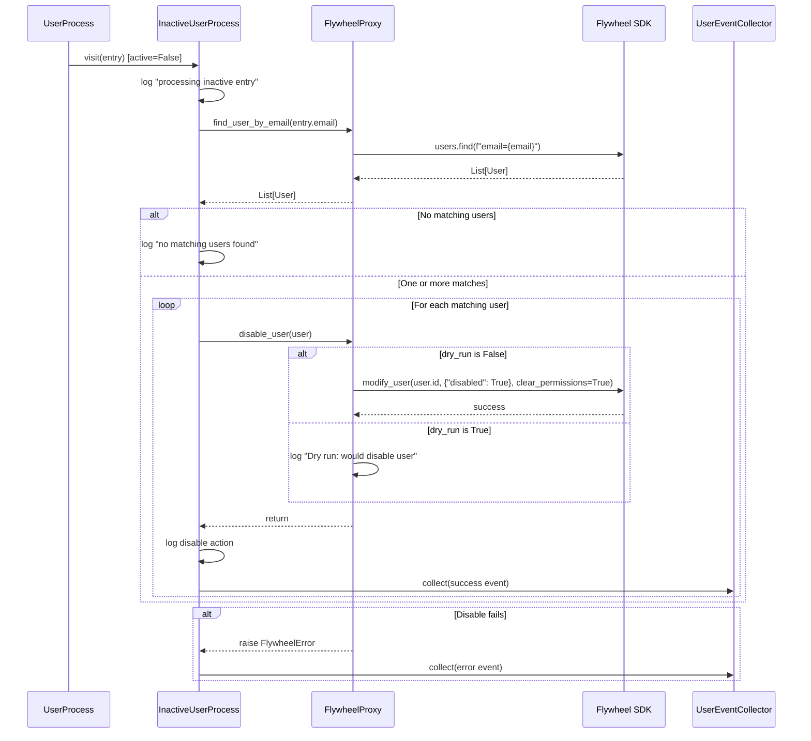

# Design Document: Disable Inactive Users

## Overview

This feature updates the `InactiveUserProcess` in the user management gear to disable matching Flywheel users when a directory entry is marked inactive. Currently, `InactiveUserProcess` is a no-op that logs and skips inactive entries. The new behavior looks up Flywheel users by email, disables each match via the Flywheel SDK, and captures events through the existing `UserEventCollector` pattern.

The changes are scoped to four areas:

1. **FlywheelProxy** — add `find_user_by_email` and `disable_user` methods
2. **InactiveUserProcess** — accept `UserProcessEnvironment`, use proxy to look up and disable users, collect events
3. **UserProcess** — pass environment to `InactiveUserProcess`
4. **Type stub** — update `modify_user` signature to accept `bool` values and `clear_permissions`

Registry cleanup (COManage) and REDCap removal are explicitly out of scope.

## Architecture

The feature fits within the existing gear architecture with no new services or infrastructure. The data flow for inactive entries changes from:

```
UserProcess → InactiveUserProcess → log and skip
```

to:

```
UserProcess → InactiveUserProcess → FlywheelProxy.find_user_by_email
                                  → FlywheelProxy.disable_user (per match)
                                  → UserEventCollector.collect (success/error)
```



### Design Decisions

1. **Environment injection via constructor**: `InactiveUserProcess.__init__` gains a `UserProcessEnvironment` parameter. This follows the same pattern used by `UpdateUserProcess`, `ActiveUserProcess`, and `ClaimedUserProcess`. The environment provides access to `FlywheelProxy` without coupling `InactiveUserProcess` to the proxy directly.

2. **Email-based lookup**: The directory entry's `email` field is used for the Flywheel lookup (not `auth_email`). The `email` field is the contact email that corresponds to the Flywheel user's email. The `auth_email` is the authentication email used for registry lookups and may differ.

3. **Per-user error handling**: If disabling one user fails, the error is collected and processing continues with the next match. This follows the existing batch-processing pattern where individual failures don't halt the run.

4. **Dry run for disable, not for lookup**: `find_user_by_email` executes the lookup even in dry-run mode (read-only operation). `disable_user` respects the dry-run flag and only logs the intended action.

## Components and Interfaces

### FlywheelProxy (modified)

Two new public methods:

```python
def find_user_by_email(self, email: str) -> List[flywheel.User]:
    """Find Flywheel users matching the given email address.

    Executes the lookup regardless of dry_run mode (read-only operation).

    Args:
        email: email address to search for

    Returns:
        List of matching User objects. Empty list if none found.
    """

def disable_user(self, user: flywheel.User) -> None:
    """Disable a Flywheel user account and clear permissions.

    In dry_run mode, logs the intended action without calling the API.

    Args:
        user: the Flywheel user to disable

    Raises:
        FlywheelError: if the Flywheel SDK call fails
    """
```

### InactiveUserProcess (modified)

Constructor signature changes:

```python
class InactiveUserProcess(BaseUserProcess[UserEntry]):
    def __init__(
        self,
        environment: UserProcessEnvironment,
        collector: UserEventCollector,
    ) -> None:
```

The `visit` method changes from a no-op log to:

1. Log that the inactive entry is being processed (preserves existing log)
2. Call `environment.proxy.find_user_by_email(entry.email)`
3. If no matches: log and return
4. For each match: call `environment.proxy.disable_user(user)`, log, collect success event
5. On failure: collect error event, continue with next user

### UserProcess (modified)

The `execute` method changes to pass the environment when constructing `InactiveUserProcess`:

```python
# Before
InactiveUserProcess(self.collector).execute(self.__inactive_queue)

# After
InactiveUserProcess(self.__env, self.collector).execute(self.__inactive_queue)
```

### EventCategory (modified)

Add a new enum member:

```python
class EventCategory(Enum):
    # ... existing members ...
    USER_DISABLED = "User Disabled"
```

### Flywheel Client Type Stub (modified)

```python
def modify_user(
    self,
    user_id: str,
    body: Dict[str, str | bool],
    clear_permissions: bool = False,
) -> None: ...
```

## Data Models

### Existing Models (unchanged)

- **UserEntry**: Base directory entry with `name`, `email`, `auth_email`, `active`, `approved` fields. The `active` field determines routing to `InactiveUserProcess`.
- **UserProcessEnvironment**: Aggregates `FlywheelProxy`, `UserRegistry`, `NotificationClient`, `NACCGroup`, `AuthMap`. Already passed to active-side processes; now also passed to `InactiveUserProcess`.
- **UserProcessEvent**: Event model with `event_type`, `category`, `user_context`, `message`, `action_needed`. Used for both success and error events.
- **UserContext**: Context attached to events with `email`, `name`, `center_id`, `registry_id`, `auth_email`.

### New Enum Value

- **EventCategory.USER_DISABLED**: New category `"User Disabled"` for disable success events. Error events during disable use `EventCategory.FLYWHEEL_ERROR`.

### UserContext Construction for Inactive Entries

`UserContext.from_user_entry` currently requires an `ActiveUserEntry`. For inactive entries (plain `UserEntry`), the `InactiveUserProcess` will construct `UserContext` directly:

```python
UserContext(
    email=entry.email,
    name=entry.name.as_str(),
    center_id=entry.adcid if isinstance(entry, CenterUserEntry) else None,
)
```

This avoids modifying the existing `UserContext.from_user_entry` class method, which is typed for `ActiveUserEntry`.


## Correctness Properties

*A property is a characteristic or behavior that should hold true across all valid executions of a system — essentially, a formal statement about what the system should do. Properties serve as the bridge between human-readable specifications and machine-verifiable correctness guarantees.*

### Property 1: Inactive entry processing disables all matching Flywheel users

*For any* inactive `UserEntry` and *for any* list of Flywheel users returned by `find_user_by_email(entry.email)`, `InactiveUserProcess.visit` SHALL call `disable_user` exactly once per matching user. When the match list is empty, `disable_user` SHALL not be called.

**Validates: Requirements 1.1, 1.2, 1.4, 2.2**

### Property 2: Email lookup returns matches regardless of dry-run mode

*For any* email string and *for any* dry-run setting (True or False), `FlywheelProxy.find_user_by_email(email)` SHALL return the list of users from the underlying Flywheel client's `users.find` call without modification.

**Validates: Requirements 3.1, 3.2, 3.3**

### Property 3: Disable user calls SDK if and only if not in dry-run mode

*For any* Flywheel `User` object, `FlywheelProxy.disable_user(user)` SHALL call `modify_user(user.id, {"disabled": True}, clear_permissions=True)` when `dry_run` is False, and SHALL NOT call `modify_user` when `dry_run` is True.

**Validates: Requirements 4.1, 4.2**

### Property 4: Disable user wraps SDK errors in FlywheelError

*For any* Flywheel `User` object, if the underlying `modify_user` call raises an `ApiException`, then `FlywheelProxy.disable_user` SHALL raise a `FlywheelError` containing a descriptive message.

**Validates: Requirements 4.3**

### Property 5: Successful disable produces correctly-shaped success event

*For any* inactive `UserEntry` and *for any* successfully disabled Flywheel user, the `UserEventCollector` SHALL receive a success event with category `USER_DISABLED` and a `UserContext` containing the entry's email, name, and center ID (when the entry is a `CenterUserEntry`).

**Validates: Requirements 6.1, 6.4**

### Property 6: Failed disable produces error event

*For any* inactive `UserEntry` and *for any* Flywheel user whose disable operation raises a `FlywheelError`, the `UserEventCollector` SHALL receive an error event with a descriptive message and the entry's email in the `UserContext`.

**Validates: Requirements 6.3**

## Error Handling

### FlywheelProxy.find_user_by_email

- If the Flywheel SDK `users.find` call raises `ApiException`, the method raises `FlywheelError`. This is consistent with other proxy methods like `find_groups`.

### FlywheelProxy.disable_user

- If `modify_user` raises `ApiException`, the method wraps it in `FlywheelError` with a message including the user ID and the original error.
- The caller (`InactiveUserProcess`) catches `FlywheelError` per-user and collects an error event, then continues with the next match.

### InactiveUserProcess.visit

- Errors from `find_user_by_email` propagate up to `UserQueue.apply`, which catches `FlywheelError` and logs it (existing batch-processing pattern).
- Errors from `disable_user` are caught within the per-user loop inside `visit`, collected as error events, and processing continues.
- If `entry.email` is None or empty, the lookup returns an empty list and no action is taken (no special handling needed).

### Existing Error Boundaries

The `UserQueue.apply` method already catches `FlywheelError`, `ValueError`, `KeyError`, and `AttributeError` per entry, logging the error and continuing. This ensures a single bad entry doesn't halt the entire inactive queue.

## Testing Strategy

### Property-Based Testing

This feature is suitable for property-based testing because:
- The core logic (lookup → disable → collect events) is pure function-like behavior with clear inputs and outputs
- Input variation (different emails, different numbers of matches, dry-run vs not) reveals edge cases
- The proxy methods are thin wrappers around SDK calls with clear contracts

**Library**: [Hypothesis](https://hypothesis.readthedocs.io/) (Python PBT library, already available in the project ecosystem)

**Configuration**: Minimum 100 iterations per property test.

**Tag format**: `Feature: disable-inactive-users, Property {number}: {property_text}`

Each correctness property maps to a single property-based test.

### Unit Tests (Example-Based)

- **Constructor acceptance** (Req 2.1): Verify `InactiveUserProcess` accepts both `UserProcessEnvironment` and `UserEventCollector`.
- **Environment wiring** (Req 2.3): Verify `UserProcess.execute` passes environment to `InactiveUserProcess`.
- **Log preservation** (Req 7.1): Verify the "processing inactive entry" log message appears before disable attempts.
- **Log content** (Req 1.3): Verify disable log includes user ID and email.
- **EventCategory member** (Req 6.2): Verify `EventCategory.USER_DISABLED` exists with value `"User Disabled"`.
- **Type stub** (Req 5.1, 5.2): Verified by `pants check` (mypy). No runtime test needed.

### Test Organization

Tests go in `common/test/python/user_test/` following the existing test directory structure. Property tests and unit tests can coexist in the same test file or be split by component:

- `test_inactive_user_process.py` — property tests for Properties 1, 5, 6 and unit tests for InactiveUserProcess
- `test_flywheel_proxy_disable.py` — property tests for Properties 2, 3, 4 and unit tests for FlywheelProxy new methods

### Mocking Strategy

- **FlywheelProxy**: Mock the Flywheel `Client` (specifically `users.find` and `modify_user`) using `unittest.mock`. The proxy is constructed with the mock client.
- **InactiveUserProcess**: Mock `FlywheelProxy` methods (`find_user_by_email`, `disable_user`) on a real or mock `UserProcessEnvironment`. Use a real `UserEventCollector` to verify collected events.
- **Hypothesis generators**: Generate random `UserEntry` objects (with `active=False`), random email strings, and random lists of mock `flywheel.User` objects.
