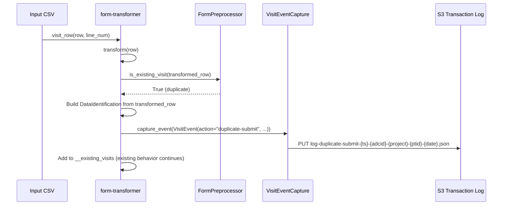
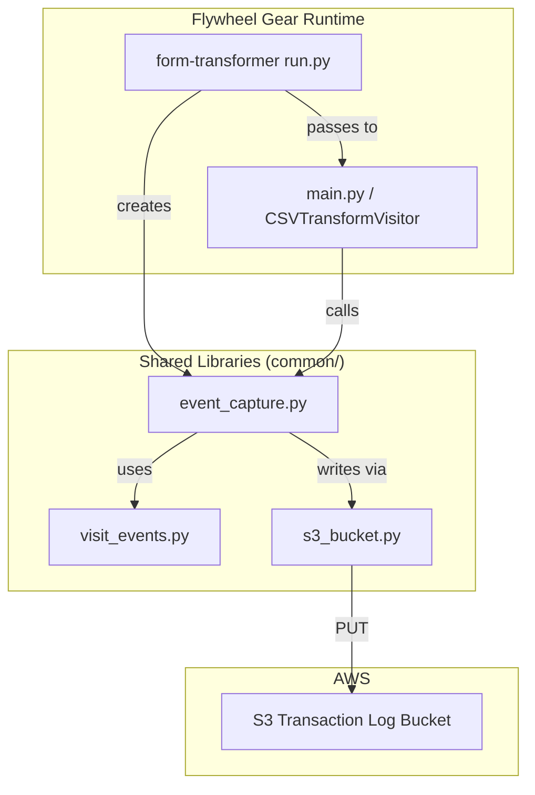

# Design Document: Duplicate Submit Event Capture

## Overview

This feature adds a `"duplicate-submit"` event type to the NACC transaction log system and integrates it into the form-transformer gear. When form-transformer detects that a CSV row is an identical resubmission (via `FormPreprocessor.is_existing_visit()`), it captures a `"duplicate-submit"` VisitEvent to S3. This gives downstream reporting deterministic signal to distinguish orphaned submit events (duplicates that were intentionally dropped) from legitimately unfinalized submissions still in progress.

The change touches three layers:
1. **Event model** — extend `VisitEventType` with the new action literal
2. **Gear manifest** — add optional S3 configuration to form-transformer
3. **Gear logic** — wire `VisitEventCapture` into form-transformer and emit events at the duplicate detection point

No changes are needed to `VisitEvent` model validation, `VisitEventCapture.capture_event()`, or the S3 filename generation — these are generic over the action string.

## Architecture



### Deployment Topology



### Design Rationale

- **Event at detection point, not during batch processing**: The event is captured in `visit_row()` immediately when `is_existing_visit()` returns True. This ensures exactly one event per duplicate row regardless of what happens later (metadata copy success/failure, re-addition to batch).
- **Optional configuration**: Event capture is gated behind manifest config options. When not configured, the gear behaves identically to before — zero behavioral change for existing deployments.
- **Failure isolation**: Event capture is wrapped in try/except. S3 failures do not affect the gear's processing outcome. The existing `@retry_with_backoff` handles transient issues; only after retries are exhausted does the exception propagate to the catch block.

## Components and Interfaces

### Modified Components

#### 1. `common/src/python/event_capture/visit_events.py`

**Change**: Extend `VisitEventType` literal and add constant.

```python
# Before
VisitEventType = Literal["submit", "delete", "not-pass-qc", "pass-qc"]

# After
VisitEventType = Literal["submit", "delete", "not-pass-qc", "pass-qc", "duplicate-submit"]

# New constant
ACTION_DUPLICATE_SUBMIT: VisitEventType = "duplicate-submit"
```

No changes to `VisitEvent` model, serializer, or validator. The `validate_datatype_consistency` validator already handles `datatype="form"` with `FormIdentification`, which is all that `"duplicate-submit"` events will use.

#### 2. `gear/form_transformer/src/docker/manifest.json`

**Change**: Add two optional config fields.

```json
{
  "config": {
    "event_bucket": {
      "description": "S3 bucket for visit event transaction log",
      "type": "string",
      "optional": true
    },
    "event_environment": {
      "description": "Environment prefix for event log files (prod or dev)",
      "type": "string",
      "optional": true,
      "enum": ["prod", "dev"]
    }
  }
}
```

#### 3. `gear/form_transformer/src/python/form_csv_app/run.py`

**Change**: Create `VisitEventCapture` from config and pass to `run()`.

```python
# In FormCSVtoJSONTransformer.run():

# After getting gear_name and before calling run()
event_capture: Optional[VisitEventCapture] = None
event_bucket = context.config.opts.get("event_bucket", "")
event_environment = context.config.opts.get("event_environment", "")

if event_bucket and event_environment:
    try:
        s3_bucket = S3BucketInterface.create_from_environment(event_bucket)
        event_capture = VisitEventCapture(
            s3_bucket=s3_bucket, environment=event_environment
        )
        log.info(
            "Visit event capture initialized for environment "
            f"'{event_environment}' with bucket '{event_bucket}'"
        )
    except (S3InterfaceError, ClientError) as error:
        raise GearExecutionError(
            f"Failed to initialize visit event capture: "
            f"Unable to access S3 bucket '{event_bucket}'. Error: {error}"
        ) from error
elif event_bucket or event_environment:
    log.warning(
        "Both event_bucket and event_environment are required for event capture. "
        f"Got event_bucket='{event_bucket}', event_environment='{event_environment}'. "
        "Event capture will be disabled."
    )

# Pass to run() along with file timestamp and project context
file_entry = self.__file_input.file_entry(context)
timestamp = file_entry.created

success = run(
    input_file=csv_file,
    ...,  # existing params
    event_capture=event_capture,
    center_label=prj_adaptor.group,
    project_label=prj_adaptor.label,
    timestamp=timestamp,
)
```

#### 4. `gear/form_transformer/src/python/form_csv_app/main.py`

**Changes**:
- `run()` function gains `event_capture`, `center_label`, `project_label`, `timestamp` parameters
- `CSVTransformVisitor.__init__()` gains those parameters
- `visit_row()` captures event after `is_existing_visit()` returns True

##### `run()` function signature change:

```python
def run(
    *,
    input_file: TextIO,
    id_column: str,
    module: str,
    destination: ProjectAdaptor,
    transformer_factory: TransformerFactory,
    preprocessor: FormPreprocessor,
    module_configs: ModuleConfigs,
    error_writer: ListErrorWriter,
    gear_name: str,
    downstream_gears: Optional[List[str]] = None,
    # New parameters
    event_capture: Optional[VisitEventCapture] = None,
    center_label: str = "",
    project_label: str = "",
    timestamp: Optional[datetime] = None,
) -> bool:
```

##### `CSVTransformVisitor.__init__()` additions:

```python
def __init__(
    self,
    *,
    # ... existing params ...
    event_capture: Optional[VisitEventCapture] = None,
    center_label: str = "",
    project_label: str = "",
    timestamp: Optional[datetime] = None,
) -> None:
    # ... existing assignments ...
    self.__event_capture = event_capture
    self.__center_label = center_label
    self.__project_label = project_label
    self.__timestamp = timestamp
```

##### Event capture in `visit_row()`:

```python
# In visit_row(), after is_existing_visit() returns True:
if (
    self.__module_configs.preprocess_checks
    and PreprocessingChecks.DUPLICATE_RECORD
    in self.__module_configs.preprocess_checks
    and self.__preprocessor.is_existing_visit(input_record=transformed_row)
):
    # Capture duplicate-submit event BEFORE adding to existing_visits
    self.__capture_duplicate_event(transformed_row)
    
    transformed_row["linenumber"] = line_num
    self.__existing_visits[subject_lbl].append(transformed_row)
    return True
```

##### New private method for event capture:

```python
def __capture_duplicate_event(self, transformed_row: Dict[str, Any]) -> None:
    """Capture a duplicate-submit event for the given row.
    
    Failures are logged as warnings and do not interrupt processing.
    """
    if not self.__event_capture or not self.__timestamp:
        return

    try:
        data_id = DataIdentification.from_form_record(
            transformed_row, self.__date_field
        )
    except (EmptyFieldError, InvalidDateError, ValidationError) as error:
        ptid = transformed_row.get(FieldNames.PTID, "unknown")
        date = transformed_row.get(self.__date_field, "unknown")
        log.warning(
            f"Cannot construct DataIdentification for duplicate event "
            f"(ptid={ptid}, date={date}): {error}. Skipping event capture."
        )
        return

    event = VisitEvent(
        action=ACTION_DUPLICATE_SUBMIT,
        project_label=self.__project_label,
        center_label=self.__center_label,
        gear_name=self.__gear_name,
        data_identification=data_id,
        datatype="form",
        timestamp=self.__timestamp,
    )

    try:
        self.__event_capture.capture_event(event)
    except Exception as error:
        ptid = transformed_row.get(FieldNames.PTID, "unknown")
        date = transformed_row.get(self.__date_field, "unknown")
        log.warning(
            f"Failed to capture duplicate-submit event for "
            f"ptid={ptid}, date={date}: {error}. Continuing processing."
        )
```

### Unchanged Components

- **`event_capture.py` (`VisitEventCapture`)**: No changes. `create_event_filename()` interpolates the action string directly into the filename, so `"duplicate-submit"` naturally produces `log-duplicate-submit-...` filenames. The `capture_event()` method is action-agnostic.
- **`csv_capture_visitor.py`**: Not modified. identifier-lookup continues to emit `"submit"` events as before.
- **`preprocessor.py` (`FormPreprocessor`)**: Not modified. `is_existing_visit()` is called exactly as before.

## Data Models

### VisitEventType (extended)

```python
VisitEventType = Literal["submit", "delete", "not-pass-qc", "pass-qc", "duplicate-submit"]
```

### VisitEvent (unchanged structure)

A `"duplicate-submit"` event uses the existing model with:

| Field | Source |
|-------|--------|
| `action` | `"duplicate-submit"` (constant) |
| `study` | `"adrc"` (default) |
| `project_label` | From `ProjectAdaptor.label` |
| `center_label` | From `ProjectAdaptor.group` |
| `gear_name` | `"form-transformer"` (from manifest) |
| `data_identification` | Constructed from transformed CSV row via `DataIdentification.from_form_record()` |
| `datatype` | `"form"` (constant) |
| `timestamp` | Input file's `created` timestamp (same as identifier-lookup's source) |

### Serialized Event JSON (example)

```json
{
  "action": "duplicate-submit",
  "study": "adrc",
  "project_label": "ingest-form",
  "center_label": "adrc42",
  "gear_name": "form-transformer",
  "ptid": "110001",
  "naccid": "NACC000001",
  "pipeline_adcid": 42,
  "visit_number": "2",
  "visit_date": "2024-03-15",
  "module": "UDS",
  "packet": "F",
  "datatype": "form",
  "timestamp": "2024-03-15T11:00:00Z"
}
```

### S3 Filename

```
prod/log-duplicate-submit-20240315-110000-42-ingest-form-110001-2024-03-15.json
```

Generated by existing `create_event_filename()` — no special handling needed.

## Correctness Properties

*A property is a characteristic or behavior that should hold true across all valid executions of a system — essentially, a formal statement about what the system should do. Properties serve as the bridge between human-readable specifications and machine-verifiable correctness guarantees.*

### Prework Analysis

**Acceptance Criteria Testing Prework:**

1.1 THE VisitEventType literal SHALL include "duplicate-submit" as a valid action value
  Thoughts: This is a static type definition. We can test that creating a VisitEvent with action="duplicate-submit" succeeds.
  Classification: EXAMPLE
  Test Strategy: Create a VisitEvent with action="duplicate-submit" and verify it validates.

1.2 THE visit_events module SHALL export an ACTION_DUPLICATE_SUBMIT constant
  Thoughts: This is a simple constant definition check.
  Classification: EXAMPLE
  Test Strategy: Import and assert the constant value.

1.3 WHEN a VisitEvent is created with action "duplicate-submit", it SHALL accept the same required fields and apply validate_datatype_consistency
  Thoughts: This tests model validation behavior across different inputs. We can generate random valid DataIdentification objects and verify the model validates them correctly with datatype="form".
  Classification: PROPERTY
  Test Strategy: Generate random valid DataIdentification with FormIdentification data, create VisitEvent with action="duplicate-submit" and datatype="form", verify it passes validation.

1.4 WHEN a VisitEvent with action "duplicate-submit" is serialized, it SHALL produce the same flattened structure
  Thoughts: This is a serialization property. We can generate random VisitEvents with action="duplicate-submit" and verify the serialized output contains renamed fields and flattened data_identification. This is a round-trip-adjacent property.
  Classification: PROPERTY
  Test Strategy: Generate random valid VisitEvents with "duplicate-submit" action, serialize them, verify output contains pipeline_adcid, visit_date, visit_number and all pass-through fields.

2.1 WHEN is_existing_visit() returns True, THE Form_Transformer SHALL capture a "duplicate-submit" VisitEvent
  Thoughts: This tests behavior that varies with input — different CSV rows may or may not be duplicates. We can mock the preprocessor and event capture, generate random transformed rows, and verify that when is_existing_visit returns True, capture_event is called exactly once.
  Classification: PROPERTY
  Test Strategy: Generate random transformed rows, mock is_existing_visit to return True, verify capture_event is called with action="duplicate-submit".

2.2 THE captured event SHALL contain DataIdentification from the transformed record
  Thoughts: This is about correct data flow. We can verify that the data_identification in the captured event matches what from_form_record would produce from the same row.
  Classification: PROPERTY
  Test Strategy: Generate random transformed rows with valid dates/modules, verify the captured event's data_identification matches DataIdentification.from_form_record(row, date_field).

2.3-2.6 THE captured event SHALL use "form" datatype, gear name, timestamp, project/center labels
  Thoughts: These are specific field value checks that should hold for all captured events.
  Classification: PROPERTY (combined with 2.1/2.2)
  Test Strategy: Verify all fields in captured event match expected constants.

2.7 IF DataIdentification cannot be constructed, THEN skip event capture and log warning
  Thoughts: This is an error handling case. We can generate rows with missing/invalid date fields.
  Classification: EDGE_CASE
  Test Strategy: Provide rows with empty date fields, verify no event is captured and processing continues.

2.8 WHEN duplicate-submit event is captured, continue existing behavior
  Thoughts: This verifies the event capture doesn't interfere with existing logic.
  Classification: PROPERTY
  Test Strategy: Verify that after event capture, the row is still added to __existing_visits.

3.1-3.4 VisitEventCapture dependency injection (config handling)
  Thoughts: These test config parsing and initialization. The behavior varies with config combinations.
  Classification: EXAMPLE (config parsing is a finite set of cases)
  Test Strategy: Test the 4 config states: both present, only bucket, only env, neither.

4.1-4.3 Filename pattern for duplicate-submit
  Thoughts: The filename generation is a pure function of the VisitEvent fields. We can generate random events and verify the filename matches the expected pattern.
  Classification: PROPERTY
  Test Strategy: Generate random VisitEvents with action="duplicate-submit", verify create_event_filename produces filenames matching the expected regex pattern.

5.1-5.4 Manifest configuration
  Thoughts: These are static configuration checks.
  Classification: EXAMPLE
  Test Strategy: Parse manifest.json and verify config options exist with correct types.

6.1 Exactly one event per duplicate row at detection point
  Thoughts: This is a cardinality property. For any duplicate row, exactly one event should be captured. We can mock and count calls.
  Classification: PROPERTY
  Test Strategy: Process multiple duplicate rows, verify capture_event call count equals duplicate row count.

6.2 No events for non-duplicate rows
  Thoughts: This is the complement of 6.1.
  Classification: PROPERTY
  Test Strategy: Process non-duplicate rows, verify capture_event is never called.

6.3 No second event during batch reprocessing
  Thoughts: When metadata copy fails and row is re-added to batch, no second event should fire.
  Classification: EXAMPLE
  Test Strategy: Mock metadata copy failure, verify event count remains 1.

7.1-7.3 Event capture failure isolation
  Thoughts: When capture_event raises, processing continues unchanged.
  Classification: PROPERTY
  Test Strategy: Mock capture_event to raise, verify visit_row still returns True and row is added to __existing_visits.

### Reflection on Properties

Reviewing the identified properties for redundancy:

- Properties 2.1, 2.2, 2.3-2.6, and 2.8 all test aspects of the same operation (event capture on duplicate detection). They can be consolidated: "For any valid duplicate row, the captured event has correct fields AND processing continues." However, the field correctness (2.2) and the continuation guarantee (2.8) test distinct behaviors. I'll combine 2.1 + 2.3-2.6 into one property about field correctness, keep 2.2 as a separate property about DataIdentification round-trip, and keep 2.8 as a separate property about non-interference.

- Properties 6.1 and 6.2 are two sides of the same coin (events for duplicates, no events for non-duplicates). These can be combined: "The number of captured events equals the number of duplicate rows."

- Property 4.1-4.3 (filename pattern) is already covered by the existing `create_event_filename` tests — the function is action-agnostic. However, it's worth a property test to confirm the hyphenated action passes through correctly.

**Final consolidated properties:**

1. VisitEvent serialization with "duplicate-submit" (from 1.3 + 1.4)
2. DataIdentification round-trip in captured event (from 2.2)
3. Captured event field correctness (from 2.1 + 2.3-2.6)
4. Event count equals duplicate count (from 6.1 + 6.2)
5. Event capture failure does not alter processing (from 7.1-7.3 + 2.8)
6. Filename pattern for duplicate-submit action (from 4.1-4.3)

### Property 1: VisitEvent serialization round-trip for duplicate-submit

*For any* valid `DataIdentification` containing `FormIdentification` data with a non-None module, creating a `VisitEvent` with `action="duplicate-submit"` and `datatype="form"` SHALL produce a valid model that serializes to a flat dictionary containing `pipeline_adcid`, `visit_date`, `visit_number`, `module`, and `ptid` fields with values matching the input DataIdentification.

**Validates: Requirements 1.3, 1.4**

### Property 2: DataIdentification construction from transformed row

*For any* dictionary containing valid `ptid`, `adcid`, `visitnum`, `module`, `packet`, and a valid date string in a given `date_field`, calling `DataIdentification.from_form_record(row, date_field)` SHALL produce a `DataIdentification` whose participant, visit, and form fields match the input dictionary values.

**Validates: Requirements 2.2**

### Property 3: Captured event contains correct metadata

*For any* transformed CSV row where `is_existing_visit()` returns True, the captured `VisitEvent` SHALL have `action="duplicate-submit"`, `datatype="form"`, the configured `gear_name`, the file's `created` timestamp, and `project_label`/`center_label` matching the destination project.

**Validates: Requirements 2.1, 2.3, 2.4, 2.5, 2.6**

### Property 4: Event count equals duplicate row count

*For any* input CSV containing N rows where `is_existing_visit()` returns True and M rows where it returns False, the total number of `capture_event()` calls SHALL equal N (one per duplicate row, zero for non-duplicates).

**Validates: Requirements 6.1, 6.2**

### Property 5: Event capture failure does not alter processing outcome

*For any* transformed CSV row where `is_existing_visit()` returns True and `capture_event()` raises an exception, `visit_row()` SHALL still return True and the row SHALL be added to the existing-visits collection, preserving identical behavior to when event capture is not configured.

**Validates: Requirements 7.1, 7.2, 7.3, 2.8**

### Property 6: Filename generation for hyphenated actions

*For any* `VisitEvent` with action `"duplicate-submit"`, `create_event_filename()` SHALL produce a filename matching the regex pattern `^.*/log-duplicate-submit-\d{8}-\d{6}-\d+-[^/]+-[^/]+-\d{4}-\d{2}-\d{2}\.json$`.

**Validates: Requirements 4.1, 4.2, 4.3**

## Error Handling

### Event Capture Failures

| Failure Mode | Handling | Impact |
|---|---|---|
| S3 bucket inaccessible at startup | `GearExecutionError` raised in `run.py` | Gear fails to start (fail-fast) |
| S3 write failure during processing | `@retry_with_backoff` retries 3 times with exponential backoff. If still fails, exception caught in `__capture_duplicate_event()`, logged as warning | Processing continues, event is lost |
| `DataIdentification` construction fails (missing/invalid date) | Caught in `__capture_duplicate_event()`, logged as warning | Event skipped, duplicate still processed normally |
| `VisitEvent` validation error (shouldn't occur with valid data) | Caught by the outer try/except in `__capture_duplicate_event()` | Event skipped, processing continues |

### Configuration Edge Cases

| Config State | Behavior |
|---|---|
| Both `event_bucket` and `event_environment` provided | Event capture enabled |
| Neither provided | Event capture disabled silently (backward-compatible) |
| Only one provided | Warning logged, event capture disabled |
| `event_bucket` is invalid S3 bucket | `GearExecutionError` raised at startup |

### Idempotency Considerations

Each duplicate resubmission produces a unique S3 event file (because `timestamp` comes from the file's `created` time). This is intentional — it mirrors how identifier-lookup produces unique submit events. The downstream lambda uses `timestamp` as part of the identity key, so multiple `"duplicate-submit"` events for the same visit are treated as distinct records if they occur at different times.

## Testing Strategy

### Unit Tests (example-based)

- **visit_events.py**: Verify `ACTION_DUPLICATE_SUBMIT` constant exists and equals `"duplicate-submit"`. Verify `VisitEvent` accepts the new action with valid form data.
- **manifest.json**: Parse and verify `event_bucket` and `event_environment` config options are present with correct types and constraints.
- **run.py config handling**: Test the four config states (both, neither, only bucket, only environment).
- **Edge case**: Row with missing date field does not capture event and does not raise.
- **Edge case**: Metadata copy failure does not trigger a second event capture.

### Property-Based Tests (hypothesis)

Property-based testing is appropriate here because:
- `VisitEvent` serialization/validation is a pure function with clear input/output
- `DataIdentification.from_form_record()` is a pure function with structured inputs
- Event capture behavior varies with row content (duplicate vs. non-duplicate)
- The input space (CSV rows with various field combinations) is large

**Library**: `hypothesis` (already used in this project)

**Configuration**: Minimum 100 iterations per property test.

Each property test references its design document property:
- **Feature: duplicate-submit-event-capture, Property 1**: VisitEvent serialization for duplicate-submit
- **Feature: duplicate-submit-event-capture, Property 2**: DataIdentification construction round-trip
- **Feature: duplicate-submit-event-capture, Property 3**: Captured event metadata correctness
- **Feature: duplicate-submit-event-capture, Property 4**: Event count equals duplicate count
- **Feature: duplicate-submit-event-capture, Property 5**: Failure isolation
- **Feature: duplicate-submit-event-capture, Property 6**: Filename pattern for hyphenated actions

### Integration Tests

- End-to-end test with mocked S3: process a CSV with a mix of duplicate and non-duplicate rows, verify the correct number of events are written with correct content.
- Test with `VisitEventCapture` set to None (event capture disabled): verify gear processes CSV identically to current behavior.

### Test File Organization

```
common/test/python/event_capture_test/
├── test_visit_events_duplicate_submit.py     # Property 1, 6 + unit tests
gear/form_transformer/test/python/
├── test_duplicate_event_capture.py           # Properties 2, 3, 4, 5 + unit tests
```
