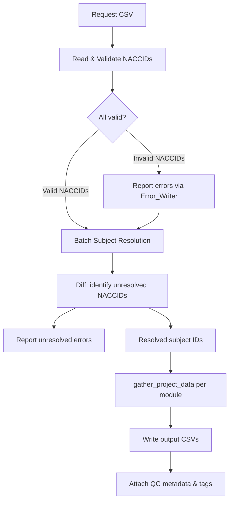

# Design Document: Gather Form Data Performance

## Overview

This design refactors `gather_form_data` from sequential per-NACCID processing to a two-phase batch approach:

1. **Phase 1 — Batch Resolution**: Read all NACCIDs from the CSV, validate them, then resolve to Flywheel subject IDs using OR-list queries (`label=|[id1,id2,...]`) scoped to expected projects.
2. **Phase 2 — Batched Data Gathering**: Pass the resolved subject IDs to `ModuleDataGatherer.gather_project_data`, which already implements batched file queries with concurrent reload.

The existing `gather_project_data` method (proven in `center_form_export`) handles Phase 2 unchanged. The main new code is Phase 1: a batch subject resolver that replaces the row-by-row `DataRequestVisitor.visit_row` → `get_subject_by_label` path.

### Design Rationale

The current implementation issues one `subjects.find(f"label={naccid}")` call per NACCID per row, then one `get_files(...)` call per matched subject per module. For a 2,000-participant request with 3 modules, that's ~2,000 subject lookups + ~6,000 file queries — each a round-trip to the Flywheel API. Batching both phases reduces this to ~20 subject queries + ~60 file queries (at batch_size=100), a ~100x reduction in API calls.

## Architecture



### Two-Phase Processing Flow

**Phase 1** runs entirely in the new `main.py`. It replaces the `read_csv` + `DataRequestVisitor` pattern with direct CSV reading and batch resolution.

**Phase 2** reuses `ModuleDataGatherer.gather_project_data` unchanged — the same method `center_form_export` uses.

## Components and Interfaces

### Files Modified

| File | Change |
|------|--------|
| `gear/gather_form_data/src/python/gather_form_data_app/main.py` | Rewrite: two-phase batch logic |
| `gear/gather_form_data/src/python/gather_form_data_app/run.py` | Update `GatherFormDataVisitor.run()` to call new `main.run()` signature |
| `gear/gather_form_data/src/docker/manifest.json` | Add `batch_size` and `reload_workers` config fields |
| `common/src/python/flywheel_adaptor/flywheel_proxy.py` | Add `find_subjects_by_labels` batch method |

### Files Unchanged

- `common/src/python/data_requests/data_request.py` — `ModuleDataGatherer.gather_project_data` is reused as-is
- `common/src/python/inputs/csv_reader.py` — not used in the new path (replaced by direct DictReader usage)
- Output writing logic in `run.py` (`_write_module_output`) — unchanged
- QC metadata and file tagging — unchanged

### New Method: `FlywheelProxy.find_subjects_by_labels`

```python
def find_subjects_by_labels(
    self,
    labels: list[str],
    project_id: str,
    batch_size: int = 100,
) -> list[Subject]:
    """Resolve multiple subject labels in batches using OR-list syntax.

    Args:
      labels: subject labels (NACCIDs) to resolve
      project_id: Flywheel project ID to scope the query
      batch_size: max labels per query batch
    Returns:
      flat list of all matched Subject objects across all batches
    """
    results: list[Subject] = []
    for start in range(0, len(labels), batch_size):
        batch = labels[start:start + batch_size]
        query = f"label=|[{','.join(batch)}],parents.project={project_id}"
        results.extend(self.__fw.subjects.find(query))
    return results
```

This method is placed on `FlywheelProxy` because:
- It mirrors the existing `get_subject_by_label` method
- It uses the private `self.__fw` client
- It's reusable by other gears that need batch subject resolution

### New `main.py` Signature

```python
def run(
    *,
    request_file: TextIO,
    proxy: FlywheelProxy,
    study_id: str,
    project_names: list[str],
    modules: set[str],
    info_paths: list[str],
    error_writer: ErrorWriter,
    batch_size: int = 100,
    reload_workers: int = 10,
    formver_split: bool = False,
) -> tuple[bool, list[ModuleDataGatherer]]:
    """Runs the two-phase gather form data process.

    Phase 1: Read CSV, validate NACCIDs, batch-resolve to subject IDs.
    Phase 2: Call gather_project_data on each module gatherer.

    Returns:
        Tuple of (success, gatherers) where success is False if any
        NACCID failed validation/resolution, and gatherers contain
        the collected data.
    """
```

The function returns both success status and the gatherers (with data), so `run.py` can write output and attach QC metadata the same way it does today.

### Updated `run.py` Integration

`GatherFormDataVisitor.run()` changes from:

```python
# OLD: CSVVisitor pattern
request_visitor = DataRequestVisitor(...)
success = run(request_file=request_file, request_visitor=request_visitor, ...)
gatherers = request_visitor.gatherers
```

To:

```python
# NEW: Two-phase batch pattern
success, data_gatherers = run(
    request_file=request_file,
    proxy=self.proxy,
    study_id=self.__study_id,
    project_names=self.__project_names,
    modules=self.__modules,
    info_paths=self.__info_paths,
    error_writer=error_writer,
    batch_size=self.__batch_size,
    reload_workers=self.__reload_workers,
    formver_split=self.__formver_split,
)
```

Output writing, QC metadata, and file tagging remain unchanged — they operate on `data_gatherers` and `success` the same way.

## Data Models

### No New Data Models

The existing `DataRequest` pydantic model is reused for per-row NACCID validation. The existing `FileError`, `CSVLocation`, and `ErrorWriter` are reused for error reporting.

### Data Flow

```
Input:  CSV rows → list[str] (validated NACCIDs)
                 → list[FileError] (validation failures)

Resolution: list[str] (NACCIDs) × list[str] (project_ids)
            → list[Subject] (matched)
            → set[str] (unresolved NACCIDs = input - matched labels)

Gathering: list[str] (subject IDs from matched subjects)
           → ModuleDataGatherer.gather_project_data(subject_ids, batch_size, reload_workers)
```

## Batch Resolution Algorithm

### Step 1: Read and Validate

```python
reader = DictReader(request_file)
# Validate header has 'naccid' column (case-insensitive)
valid_naccids: list[str] = []
for line_num, row in enumerate(reader, start=1):
    try:
        request = DataRequest.model_validate(row)
        valid_naccids.append(request.naccid)
    except ValidationError as error:
        error_writer.write(malformed_file_error(str(error)))
```

Duplicates in the CSV are preserved in `valid_naccids` — each occurrence will be resolved independently (matching current behavior where each row triggers its own lookup).

### Step 2: Look Up Project IDs

```python
project_matcher = create_project_matcher(study_id, project_names)
all_projects = proxy.find_projects_with_pattern(
    "|".join(project_names + [f"{name}-{study_id}" for name in project_names])
)
project_ids = [p.id for p in all_projects if project_matcher.match(p.label)]
```

Project IDs are looked up once, then used to scope every batch query. This replaces the per-subject `get_container_by_id(subject.parents.project)` check.

### Step 3: Batch Resolve

For each project ID, query subjects in batches:

```python
all_subjects: list[Subject] = []
for project_id in project_ids:
    subjects = proxy.find_subjects_by_labels(
        labels=deduplicated_naccids,  # unique set for querying
        project_id=project_id,
        batch_size=batch_size,
    )
    all_subjects.extend(subjects)
```

Note: We query with **deduplicated** NACCIDs (the unique set) for efficiency — even if the CSV has duplicates. After resolution, we map back to all occurrences.

### Step 4: Error Attribution

```python
resolved_labels = {subject.label for subject in all_subjects}
unresolved = set(valid_naccids) - resolved_labels
for naccid in unresolved:
    error_writer.write(FileError(
        error_code="no-participant",
        error_type="error",
        location=CSVLocation(line=naccid_line_map[naccid], column_name="naccid"),
        message=f"no participant {naccid} with data for {','.join(expected_studies)}",
    ))
```

A `naccid_line_map` (built during Step 1) records the first line number where each NACCID appeared, used for error location reporting.

### Step 5: Collect Subject IDs

```python
subject_ids = [subject.id for subject in all_subjects]
```

If a NACCID matched in multiple projects, it contributes multiple subject IDs. If the CSV had duplicate NACCIDs, the query was deduplicated but the matches cover all projects — so a NACCID appearing twice in the CSV that matches one subject in one project contributes that subject ID once (from the query), not twice. This is a slight behavioral difference from the current code (where each CSV row independently queries), but acceptable because `gather_project_data` processes by subject ID, not by CSV row — gathering data for the same subject twice would just duplicate output rows.

**Design decision**: Deduplicate NACCIDs before querying (fewer API calls), accept that duplicate CSV rows for the same NACCID won't produce duplicate output rows. If exact row-for-row duplication is required, we can preserve duplicates in the subject_ids list by repeating IDs per occurrence. For now, deduplicated query + flat result is the simpler approach and matches how `center_form_export` works.

### manifest.json Additions

```json
{
  "config": {
    "batch_size": {
      "description": "Number of NACCIDs per batch for OR-list queries (subject resolution and file queries)",
      "type": "integer",
      "default": 100
    },
    "reload_workers": {
      "description": "Number of concurrent threads for reloading file metadata",
      "type": "integer",
      "default": 10
    }
  }
}
```

## Correctness Properties

*A property is a characteristic or behavior that should hold true across all valid executions of a system — essentially, a formal statement about what the system should do. Properties serve as the bridge between human-readable specifications and machine-verifiable correctness guarantees.*

### Property 1: NACCID Validation Separates Valid from Invalid

*For any* CSV containing a mix of strings matching `NACC\d{6}` and strings not matching that pattern, the batch resolution phase SHALL collect exactly those matching the pattern into the valid set, and produce exactly one error per non-matching string.

**Validates: Requirements 1.1**

### Property 2: Batching Correctness

*For any* list of N NACCIDs and a positive batch_size B, the resolver SHALL issue exactly `ceil(N/B)` queries, each containing at most B labels in the OR-list.

**Validates: Requirements 1.2**

### Property 3: Error Attribution Completeness

*For any* set of requested NACCIDs where a subset resolves to subjects and the remainder does not, the error writer SHALL contain exactly one "no-participant" error for each NACCID in the unresolved set, and zero errors for resolved NACCIDs.

**Validates: Requirements 1.3, 5.1**

### Property 4: Resolution Preserves Multiplicity

*For any* NACCID that matches subjects in K distinct expected projects, the resolved subject ID list SHALL contain exactly K entries for that NACCID.

**Validates: Requirements 1.4**

### Property 5: Non-Positive Config Parameters Rejected

*For any* non-positive integer value (zero or negative) assigned to either `batch_size` or `reload_workers`, the gear SHALL raise a gear execution error before any processing begins.

**Validates: Requirements 3.3, 3.4**

## Error Handling

### Validation Errors (Phase 1, Step 1)

- Rows that fail `DataRequest.model_validate` produce a `malformed_file_error` — same as current behavior.
- Processing continues past invalid rows (they are skipped for resolution).

### Resolution Errors (Phase 1, Step 4)

- NACCIDs with no matching subject produce a "no-participant" `FileError` — same error code and message format as the current `DataRequestVisitor.__get_matches` path.
- Resolution errors do NOT stop processing — data is gathered for all resolved subjects.

### Config Validation (Startup)

- `batch_size <= 0` or `reload_workers <= 0` raises `GearExecutionError` in `GatherFormDataVisitor.create()`, before any processing.

### Gathering Errors (Phase 2)

- Per-file `ModuleDataError` exceptions during `gather_project_data` are caught and logged as warnings — unchanged behavior from the existing method.

### Success Semantics

- `success = True` if all NACCIDs resolved (no validation or resolution errors).
- `success = False` if any NACCID failed validation or resolution.
- QC metadata state is "PASS" if `success`, "FAIL" otherwise — same as current behavior.

## Testing Strategy

### Property-Based Tests (Hypothesis)

Property-based testing applies to this feature because the core logic (validation, batching, error attribution) involves pure functions with clear input/output behavior and universal properties that hold across a wide input space.

**Library**: [Hypothesis](https://hypothesis.readthedocs.io/) (already available in the project)

**Configuration**: Minimum 100 examples per property test.

Each property test maps to a design property:

| Property | Test Focus | Mocking |
|----------|-----------|---------|
| Property 1 | `_validate_and_collect_naccids` function | None (pure function) |
| Property 2 | `find_subjects_by_labels` batching | Mock `self.__fw.subjects.find` |
| Property 3 | Error attribution diff logic | Mock resolution results |
| Property 4 | Multi-project match aggregation | Mock subjects with varying project matches |
| Property 5 | Config validation in `create()` | None (raises before API calls) |

### Unit Tests (pytest)

- Verify end-to-end integration with mocked FlywheelProxy
- Test the "happy path" (all NACCIDs resolve, correct output)
- Test mixed path (some resolve, some don't, correct QC state)
- Test empty CSV
- Test CSV with only invalid NACCIDs
- Verify output writing is unchanged (golden file comparison)

### Integration Tests

- Verify `gather_project_data` is called with correct subject IDs (mock-based)
- Verify config parameters (`batch_size`, `reload_workers`) are threaded through
- Verify backward compatibility of all existing config fields

### What's NOT Tested by This Spec

- `ModuleDataGatherer.gather_project_data` internals — already tested in `common/test/python/data_requests/test_data_request.py`
- Output CSV format — unchanged code path
- Flywheel SDK behavior — external service
