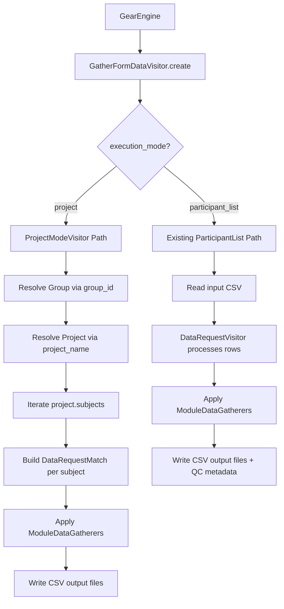

# Design Document: Gather Form Data — Project Mode

## Overview

This design adds a project-based execution mode to the gather-form-data gear. The current gear reads NACCIDs from a CSV participant list and gathers form data for each. The new project mode iterates all subjects in a specified Flywheel project, constructs `DataRequestMatch` objects from each subject, and applies the existing `ModuleDataGatherer` pipeline — reusing the per-subject gathering logic without duplication.

The design follows the existing gear architecture: `run.py` handles Flywheel context, project resolution, subject iteration, and file I/O; `main.py` remains focused on testable business logic without Flywheel SDK imports.

## Architecture



### Design Decisions

1. **Separate visitor class for project mode**: Rather than adding conditional branches inside the existing `GatherFormDataVisitor.run()`, a new `ProjectModeVisitor` class (also extending `GearExecutionEnvironment`) handles the project mode path. A factory in `run.py` selects the appropriate visitor based on `execution_mode`. This keeps each mode's logic cohesive and independently testable.

2. **Reuse `ModuleDataGatherer.gather_request_data`**: The existing method accepts a `DataRequestMatch` and queries acquisitions by subject_id and module label. Project mode constructs `DataRequestMatch` from each subject and calls the same method — no duplication of gathering logic.

3. **Orchestration function in main.py**: A new `run_project_mode` function in `main.py` accepts a list of `DataRequestMatch` objects and a list of `ModuleDataGatherer` instances, orchestrating the per-subject gathering loop. This keeps the orchestration testable without Flywheel dependencies.

4. **Subject iteration stays in run.py**: The Flywheel SDK call `project.subjects.iter()` lives in `run.py` since it requires the SDK. The visitor converts each subject into a `DataRequestMatch` before passing to `main.py`.

## Components and Interfaces

### Modified: `gear/gather_form_data/src/docker/manifest.json`

Add new config options and make `input_file` optional:

```json
{
  "inputs": {
    "input_file": {
      "description": "A participant list CSV file",
      "base": "file",
      "optional": true,
      "type": { "enum": ["tabular data"] }
    }
  },
  "config": {
    "execution_mode": {
      "description": "Execution mode: participant_list or project",
      "type": "string",
      "default": "participant_list",
      "enum": ["participant_list", "project"]
    },
    "group_id": {
      "description": "Flywheel group ID for the center (required in project mode)",
      "type": "string",
      "optional": true
    },
    "project_name": {
      "description": "Project label to iterate (required in project mode)",
      "type": "string",
      "optional": true
    }
  }
}
```

### New: `ProjectModeVisitor` (in `run.py`)

```python
class ProjectModeVisitor(GearExecutionEnvironment):
    """Visitor for project-mode execution of Gather Form Data."""

    def __init__(
        self,
        client: ClientWrapper,
        group_id: str,
        project_name: str,
        info_paths: list[str],
        modules: set[str],
        study_id: str,
    ): ...

    @classmethod
    def create(
        cls,
        context: GearContext,
        parameter_store: Optional[ParameterStore] = None,
    ) -> "ProjectModeVisitor": ...

    def run(self, context: GearContext) -> None:
        """Resolves group/project, iterates subjects, gathers data, writes output."""
        ...
```

### New: `run_project_mode` (in `main.py`)

```python
def run_project_mode(
    *,
    requests: list[DataRequestMatch],
    gatherers: list[ModuleDataGatherer],
) -> bool:
    """Orchestrates per-subject data gathering for project mode.

    Applies each gatherer to each request. Logs warnings for failures
    and continues processing all subjects.

    Args:
        requests: DataRequestMatch objects for each subject
        gatherers: ModuleDataGatherer instances for configured modules

    Returns:
        True if processing completed (even with individual failures)
    """
    ...
```

### Modified: `run.py` entry point

```python
def main():
    """Main method for Gather Form Data."""
    context = GearEngine().create_with_parameter_store()
    execution_mode = context.config.opts.get("execution_mode", "participant_list")
    
    if execution_mode == "project":
        context.run(gear_type=ProjectModeVisitor)
    else:
        context.run(gear_type=GatherFormDataVisitor)
```

### Existing (reused without modification)

- **`ModuleDataGatherer`**: Collects form file info for a module from acquisitions labeled by module name. Called via `gather_request_data(request: DataRequestMatch)`.
- **`DataRequestMatch`**: Pydantic model with `naccid`, `subject_id`, `project_label` fields.
- **`GearExecutionEnvironment`**: Abstract base providing `proxy`, `client`, and `run()` interface.

## Data Models

### `ProjectModeConfig` (new Pydantic model in `main.py`)

```python
from pydantic import BaseModel, field_validator

class ProjectModeConfig(BaseModel):
    """Validated configuration for project mode execution."""
    group_id: str
    project_name: str
    modules: set[str]
    info_paths: list[str]
    study_id: str

    @field_validator("group_id", "project_name")
    @classmethod
    def must_not_be_blank(cls, v: str) -> str:
        if not v.strip():
            raise ValueError("must not be empty or whitespace-only")
        return v.strip()

    @field_validator("modules")
    @classmethod
    def must_have_valid_modules(cls, v: set[str]) -> set[str]:
        valid = {"UDS", "FTLD", "LBD"}
        filtered = v & valid
        if not filtered:
            raise ValueError("no valid modules specified")
        return filtered
```

### `DataRequestMatch` (existing, reused)

```python
class DataRequestMatch(BaseModel):
    naccid: str
    subject_id: str
    project_label: str
```

### Subject-to-DataRequestMatch mapping

For each subject in the project:
```python
DataRequestMatch(
    naccid=subject.label,
    subject_id=subject.id,
    project_label=project.label,
)
```

## Correctness Properties

*A property is a characteristic or behavior that should hold true across all valid executions of a system — essentially, a formal statement about what the system should do. Properties serve as the bridge between human-readable specifications and machine-verifiable correctness guarantees.*

### Property 1: Execution mode validation

*For any* string value provided as `execution_mode`, the gear SHALL accept it if and only if it is one of `{"participant_list", "project"}`; all other values SHALL produce a configuration error.

**Validates: Requirements 1.1, 1.4**

### Property 2: Required string config rejection of blank values

*For any* string composed entirely of whitespace characters (including the empty string), providing it as `group_id` or `project_name` in project mode SHALL produce a validation error and prevent processing.

**Validates: Requirements 2.3, 2.4**

### Property 3: Subject-to-DataRequestMatch mapping correctness

*For any* subject with a label and id in a project with a given label, the constructed `DataRequestMatch` SHALL have `naccid` equal to the subject label, `subject_id` equal to the subject id, and `project_label` equal to the project label.

**Validates: Requirements 5.2**

### Property 4: All subjects processed with resilience

*For any* project containing N subjects where some subset of gatherer calls raise errors, the gear SHALL attempt data gathering for all N subjects and all configured modules, logging warnings for failures without halting.

**Validates: Requirements 4.2, 5.1, 5.3, 5.4, 8.2**

### Property 5: Module config parsing

*For any* comma-separated string of module names, the gear SHALL create `ModuleDataGatherer` instances only for names in the valid set `{UDS, FTLD, LBD}`, excluding and warning about any names not in that set.

**Validates: Requirements 6.1, 6.4**

### Property 6: Output filename format

*For any* study_id string and valid module_name, the output CSV filename SHALL match the pattern `{study_id}-{module_name}-{YYYY-MM-DD}.csv` where the date is the current date in ISO 8601 format.

**Validates: Requirements 6.3, 7.1**

### Property 7: Empty gatherers produce no output file

*For any* `ModuleDataGatherer` whose `content` property returns empty/falsy after processing, the gear SHALL not write an output file for that module.

**Validates: Requirements 7.2**

### Property 8: Per-subject-module warning for missing data

*For any* subject that has no acquisitions matching a requested module, the gear SHALL log a warning that includes both the subject label (NACCID) and the module name.

**Validates: Requirements 8.1, 8.3**

## Error Handling

| Condition | Behavior | Exit Status |
|-----------|----------|-------------|
| Invalid `execution_mode` value | Log error with invalid value | Failed |
| `group_id` missing/blank in project mode | Log error identifying missing group_id | Failed |
| `project_name` missing/blank in project mode | Log error identifying missing project_name | Failed |
| Group not found for `group_id` | Log error: group not found | Failed |
| Project not found for `project_name` in group | Log error: project not found | Failed |
| Project has zero subjects | Log warning: no subjects | Success (no output) |
| `modules` config empty or no valid modules | Log error: no valid modules | Failed |
| `input_file` missing in participant_list mode | Log error: missing input file | Failed |
| `ModuleDataGatherer` raises error for a subject | Log warning (subject + module), skip, continue | Success |
| Subject has no acquisitions for a module | Log warning (subject label + module name), continue | Success |

### Error handling strategy

- **Fail-fast for configuration errors**: Invalid mode, missing required config, unresolvable group/project all cause immediate exit before any processing begins.
- **Fail-soft for per-subject errors**: Individual subject or module failures are logged as warnings and processing continues for remaining subjects. This ensures partial results are still produced.
- **Consistent with existing behavior**: The participant_list path's error handling remains unchanged.

## Testing Strategy

### Unit Tests (pytest)

- **Config validation**: Test `ProjectModeConfig` Pydantic model with valid/invalid inputs
- **Subject-to-DataRequestMatch mapping**: Test the mapping function with mock subject data
- **`run_project_mode` orchestration**: Test with mock gatherers that succeed/fail in various patterns
- **Output filename generation**: Test filename construction with various study_id and module values
- **Module parsing**: Test comma-separated module string parsing and filtering

### Property-Based Tests (Hypothesis)

Property-based testing is appropriate for this feature because:
- Config validation has a clear input space (arbitrary strings) with well-defined acceptance criteria
- The subject-to-match mapping is a pure transformation
- Module parsing operates over combinatorial input (subsets of valid/invalid names)
- Resilience properties can be tested with generated failure patterns

**Library**: [Hypothesis](https://hypothesis.readthedocs.io/) for Python  
**Minimum iterations**: 100 per property  
**Tag format**: `Feature: gather-form-data-project-mode, Property {N}: {title}`

Each correctness property above maps to a single property-based test:
1. Execution mode validation — generate random strings, verify accept/reject
2. Blank string rejection — generate whitespace strings, verify rejection
3. DataRequestMatch mapping — generate (label, id, project_label) tuples, verify fields
4. Resilience — generate subject lists with random failure masks, verify all attempted
5. Module parsing — generate module name lists (mix of valid/invalid), verify filtering
6. Filename format — generate study_id and module_name, verify pattern match
7. Empty content skipping — generate gatherers with/without content, verify output decisions
8. Warning logging — generate subjects with missing acquisitions, verify per-combination warnings

### Integration Tests

- **End-to-end project mode**: Mock Flywheel SDK, run full visitor with a project containing subjects, verify CSV output files
- **Backward compatibility**: Verify participant_list mode still works identically with existing test patterns
- **Error paths**: Test group-not-found, project-not-found, empty-project scenarios with mocked SDK
