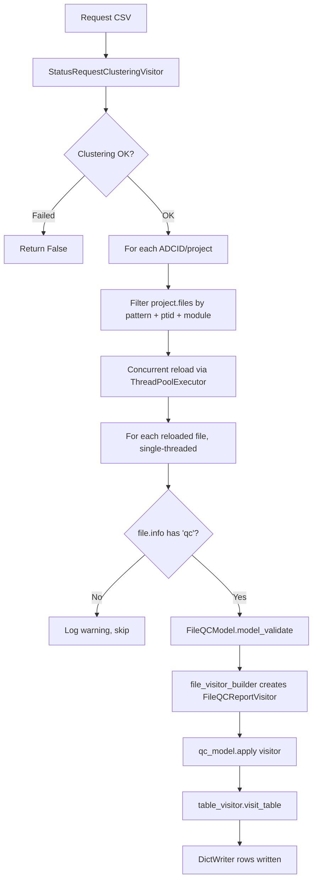

# Design Document: Gather Submission Status Performance

## Overview

This design refactors `gather_submission_status`'s file-processing phase from sequential per-file `reload()` calls to concurrent reloading using a `ThreadPoolExecutor`. The clustering phase (CSV reading + project resolution) is unchanged.

The key change is in `main.py`: instead of delegating to `ProjectReportVisitor.visit_project()` (which reloads files one-at-a-time), the gear directly iterates project files, filters them, reloads matching files concurrently, then processes each reloaded file single-threaded through the existing `FileQCModel` → `FileQCReportVisitor` → `WriterTableVisitor` path.

### Design Rationale

The current implementation has three layers of sequential `file.reload()`:
1. `ProjectReportVisitor.visit_project()` reloads each file to check `file.info.qc`
2. `ProjectReportVisitor.visit_file()` reloads the file again
3. `FileQCModel.create()` reloads the file a third time

For a center with 500 QC log files per project across 3 projects, that's up to 4,500 sequential API round-trips. The refactored version reloads each file exactly once concurrently, reducing API calls to ~1,500 but with 10x concurrency — a net ~30x walltime improvement on the reload-dominated phase.

### Why Not Modify nacc-common?

`ProjectReportVisitor` is used by other gears (it's a general-purpose project-file visitor). Modifying it to support concurrency would require careful API design affecting all consumers. Since this gear's usage pattern is straightforward (filter → reload → process), it's simpler and safer to replicate the filtering logic locally and orchestrate concurrency in the gear itself.

## Architecture



### Processing Flow

**Phase 1: Clustering** (unchanged)
- `read_csv` + `StatusRequestClusteringVisitor` reads the CSV, validates rows, clusters by ADCID, and resolves projects. This phase makes ~1 API call per unique ADCID and is not a bottleneck.

**Phase 2: File gathering** (refactored)
- For each ADCID's projects, filter `project.project.files` by filename pattern + ptid_set + modules (no API calls — file list is already in memory from project resolution)
- Reload all matching files concurrently with `ThreadPoolExecutor(max_workers=reload_workers)`
- Process each successfully-reloaded file single-threaded: validate QC info, build `FileQCModel`, create `FileQCReportVisitor`, apply model, write results

## Components and Interfaces

### Files Modified

| File | Change |
|------|--------|
| `gear/gather_submission_status/src/python/gather_submission_status_app/main.py` | Rewrite: concurrent reload orchestration replaces `ProjectReportVisitor` |
| `gear/gather_submission_status/src/python/gather_submission_status_app/run.py` | Add `reload_workers` to `__init__`, `create()`, and pass to `main.run()` |
| `gear/gather_submission_status/src/docker/manifest.json` | Add `reload_workers` config field |

### Files Unchanged

- `common/src/python/data_requests/status_request.py` — `StatusRequestClusteringVisitor` is reused as-is
- `nacc-common/src/python/nacc_common/qc_report.py` — all classes reused without modification
- `nacc-common/src/python/nacc_common/visit_submission_status.py` — builder reused as-is
- `nacc-common/src/python/nacc_common/visit_submission_error.py` — builder reused as-is
- `nacc-common/src/python/nacc_common/error_models.py` — `FileQCModel` reused as-is

### New `main.py` Signature

```python
def run(
    *,
    input_file: TextIO,
    modules: set[str],
    clustering_visitor: StatusRequestClusteringVisitor,
    file_visitor_builder: FileQCReportVisitorBuilder,
    writer: DictWriter,
    error_writer: ErrorWriter,
    reload_workers: int = 10,
) -> bool:
    """Runs the Gather Submission Status process with concurrent file reloading.

    Phase 1: Reads and clusters the input CSV by ADCID (unchanged).
    Phase 2: For each ADCID's projects, filters QC log files, reloads them
    concurrently, then processes each single-threaded.

    Args:
        input_file: the input CSV stream
        modules: set of module names to include
        clustering_visitor: the CSV visitor that clusters requests by ADCID
        file_visitor_builder: factory for creating FileQCReportVisitors
        writer: the DictWriter for output rows
        error_writer: collects per-request errors
        reload_workers: number of concurrent threads for file.reload() calls

    Returns:
        True if processing completed successfully, False otherwise.
    """
```

The signature adds only `reload_workers`. All other parameters remain the same.

### Updated `run.py` Integration

`GatherSubmissionStatusVisitor` changes:

```python
# __init__ adds:
self.__reload_workers = reload_workers

# create() adds:
reload_workers = int(options.get("reload_workers", 10))
if reload_workers <= 0:
    raise GearExecutionError(
        f"reload_workers must be a positive integer, got {reload_workers}"
    )

# run() call changes from:
success = run(
    input_file=csv_file,
    modules=self.__modules,
    clustering_visitor=clustering,
    file_visitor_builder=self.__file_visitor_builder,
    writer=writer,
    error_writer=error_writer,
)

# To:
success = run(
    input_file=csv_file,
    modules=self.__modules,
    clustering_visitor=clustering,
    file_visitor_builder=self.__file_visitor_builder,
    writer=writer,
    error_writer=error_writer,
    reload_workers=self.__reload_workers,
)
```

### manifest.json Addition

```json
{
  "config": {
    "reload_workers": {
      "description": "Number of concurrent threads for reloading QC file metadata",
      "type": "integer",
      "default": 10
    }
  }
}
```

## Detailed Processing Algorithm

### File Filtering (replicated from ProjectReportVisitor)

The filtering logic in the new `main.py` replicates what `ProjectReportVisitor.visit_project()` and `ProjectReportVisitor.__should_process_file()` do:

```python
QC_FILENAME_PATTERN = r"^([!-~]{1,10})_(\d{4}-\d{2}-\d{2})_(\w+)_qc-status.log$"

def _should_process_file(
    filename: str,
    matcher: re.Pattern[str],
    ptid_set: set[str],
    modules: set[str],
) -> bool:
    """Check if a file should be processed based on ptid and module filters.

    Replicates ProjectReportVisitor.__should_process_file logic.
    """
    match = matcher.match(filename)
    if not match:
        return False

    ptid = match.group(1)
    if ptid not in ptid_set:
        return False

    module = match.group(3).upper()
    return module.upper() in modules
```

**Design detail not in requirements:** The current `ProjectReportVisitor.__should_process_file` treats `ptid_set=None` as "accept all ptids" and `modules=None` as "accept all modules". In our gear's usage, both are always non-None (ptid_set comes from the CSV request list, modules from config). The new `_should_process_file` function therefore requires both to be non-empty sets, matching the gear's actual usage rather than the library's generalized interface. This simplification is safe because `run.py` always passes non-empty module sets and the clustering visitor always produces non-empty ptid_sets.

### Concurrent Reload

```python
with ThreadPoolExecutor(max_workers=reload_workers) as pool:
    for project in project_list:
        candidate_files = [
            f for f in project.project.files
            if _should_process_file(f.name, matcher, ptid_set, modules)
        ]

        # Submit all reloads concurrently
        futures = {pool.submit(f.reload): f for f in candidate_files}

        for future in as_completed(futures):
            original_file = futures[future]
            try:
                reloaded_file = future.result()
            except Exception as error:
                log.warning(
                    "Failed to reload file %s: %s", original_file.name, error
                )
                continue

            _process_reloaded_file(
                file=reloaded_file,
                adcid=request_adcid,
                file_visitor_builder=file_visitor_builder,
                table_visitor=table_visitor,
            )
```

**Design detail not in requirements:** We use `concurrent.futures.as_completed` rather than `pool.map` for two reasons:
1. It allows individual reload failures to be caught and logged without aborting the entire batch
2. It processes results as they arrive rather than waiting for all to complete, reducing memory pressure (file info objects are released after processing)

The tradeoff is that output row ordering becomes non-deterministic (files are processed in completion order rather than iteration order). Requirement 2.2 explicitly allows this: "independent of row ordering."

### Single-Threaded File Processing

```python
def _process_reloaded_file(
    *,
    file: FileEntry,
    adcid: int,
    file_visitor_builder: FileQCReportVisitorBuilder,
    table_visitor: ReportTableVisitor,
) -> None:
    """Process a single reloaded QC log file.

    Replicates the logic from ProjectReportVisitor.visit_file but operates
    on an already-reloaded file.
    """
    if not file.info or not file.info.get("qc"):
        log.warning("file does not have qc: %s", file.name)
        return

    try:
        qc_model = FileQCModel.model_validate(file.info, by_alias=True)
    except ValidationError as error:
        log.warning("Failed to load QC data for %s: %s", file.name, error)
        return

    file_visitor = file_visitor_builder(file, adcid)
    if file_visitor.visit_details is None:
        log.warning("Could not extract visit details from %s", file.name)
        return

    try:
        qc_model.apply(file_visitor)
    except QCTransformerError as error:
        log.error(
            "Unexpected QC transformation error for file %s: %s", file.name, error
        )
        return

    table_visitor.visit_table(file_visitor.table)
```

**Design detail not in requirements:** We call `FileQCModel.model_validate(file.info, by_alias=True)` directly instead of `FileQCModel.create(file)`. The reason: `FileQCModel.create()` calls `file_entry.reload()` internally — but we've already reloaded the file. Calling `model_validate` on the already-populated `file.info` avoids a redundant API call. This is a deliberate divergence from using the `create()` factory to eliminate the triple-reload problem.

**Design detail not in requirements:** The `WriterTableVisitor` and its underlying `DictWriter` are not thread-safe. All calls to `table_visitor.visit_table()` happen in the main thread (inside the `as_completed` loop), never from within the worker threads. The worker threads only perform `file.reload()` — pure I/O with no shared mutable state.

### ThreadPoolExecutor Scope

The `ThreadPoolExecutor` is created once for the entire `run()` call and shared across all ADCID/project iterations. This avoids the overhead of creating and destroying thread pools per-project while still respecting the `reload_workers` concurrency limit globally.

```python
def run(...):
    # Phase 1: clustering (unchanged)
    ...

    table_visitor = WriterTableVisitor(DictReportWriter(writer))
    matcher = re.compile(QC_FILENAME_PATTERN)

    with ThreadPoolExecutor(max_workers=reload_workers) as pool:
        for pipeline_adcid, project_list in project_map.items():
            ...
            for project in project_list:
                # filter, reload concurrently, process single-threaded
                ...

    return True
```

**Design detail not in requirements:** A single pool across all projects means that if one project has 1,000 files and another has 10, the pool naturally load-balances between them. It also means the `reload_workers` limit applies globally (not per-project), which matches the intent of capping concurrent connections to the Flywheel API.

## Data Models

### No New Data Models

No new pydantic models or dataclasses are introduced. The existing `StatusRequest`, `FileQCModel`, `FileQCReportVisitor`, `WriterTableVisitor`, and `DictReportWriter` are reused unchanged.

## Correctness Properties

### Property 1: Filter Equivalence

*For any* project file list and (ptid_set, modules) pair, the set of filenames accepted by `_should_process_file` SHALL be identical to the set that would be accepted by `ProjectReportVisitor.__should_process_file` when constructed with the same ptid_set and modules.

**Validates: Requirements 2.1, 2.2, 6.3**

### Property 2: No Shared Mutable State in Worker Threads

*For any* execution, the `ThreadPoolExecutor` worker threads SHALL only execute `file.reload()` — a method that returns a new/updated `FileEntry` and does not mutate the `DictWriter`, `WriterTableVisitor`, or any shared collection.

**Validates: Requirements 1.2, 1.3, 2.2**

### Property 3: Reload Failure Isolation

*For any* file whose `reload()` raises an exception, the processing of all other files SHALL continue unaffected, and a warning SHALL be logged identifying the failed file.

**Validates: Requirements 1.4**

### Property 4: QC Validation Equivalence

*For any* reloaded file with `file.info.qc` populated, the report rows produced by `_process_reloaded_file` SHALL be identical to those produced by `ProjectReportVisitor.visit_file` for the same file and adcid (given the same `file_visitor_builder` and `table_visitor`).

**Validates: Requirements 2.1, 2.2, 6.2**

### Property 5: Non-Positive reload_workers Rejected

*For any* non-positive integer value assigned to `reload_workers`, the gear SHALL raise a `GearExecutionError` before any processing begins.

**Validates: Requirements 5.2**
