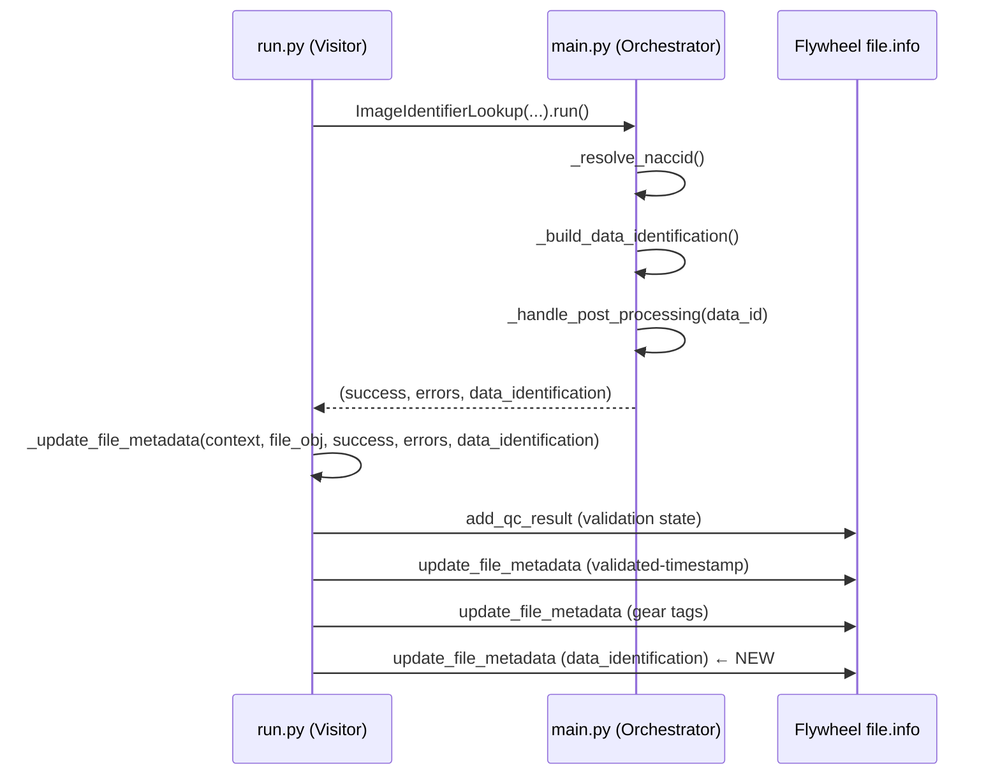

# Design Document: Write DataIdentification to File Metadata

## Overview

This feature modifies the `image_identifier_lookup` gear to persist the `DataIdentification` object it builds during processing to `file.info.data_identification` on the input file. This enables the downstream `pipeline_event_logger` gear to read visit/file identification directly from the file without reconstructing it from subject metadata and DICOM data.

The change touches two files:
- **`main.py`**: `ImageIdentifierLookup.run()` returns the built `DataIdentification` alongside the existing `(success, errors)` tuple.
- **`run.py`**: `ImageIdentifierLookupVisitor._update_file_metadata()` writes the serialized `DataIdentification` to `file.info.data_identification` using `context.metadata.update_file_metadata`.

The serialization format uses `DataIdentification.model_dump()`, which produces a flat dictionary (via the model's custom `model_serializer`) that `DataIdentification.from_visit_metadata()` can reconstruct — the same pattern the `pipeline_event_logger` already uses to read `file.info.data_identification`.

## Architecture

The change is minimal and follows the existing gear architecture pattern where `main.py` handles business logic and `run.py` handles Flywheel context and metadata writes.



### Design Decisions

1. **Return value extension (Option A from reference doc)**: Extending the `run()` return tuple to `(bool, FileErrorList, Optional[DataIdentification])` is the simplest approach and consistent with how the gear already returns results to `run.py`. A callback or output sink pattern would add unnecessary complexity for a single additional value.

2. **Serialization via `model_dump()`**: `DataIdentification` has a custom `model_serializer` that flattens the nested structure (participant, visit, data) into a flat dict with keys like `ptid`, `adcid`, `date`, `modality`, `visitnum`. This is exactly the format that `from_visit_metadata(**dict)` accepts, ensuring round-trip compatibility. The `pipeline_event_logger` already uses this pattern: `DataIdentification.from_visit_metadata(**file_entry.info["data_identification"])`.

3. **Write ordering**: The `data_identification` write is appended after the existing three metadata writes (QC result, timestamp, tags) to minimize risk to existing behavior.

4. **Error handling**: Metadata write failures are logged but do not fail the gear, consistent with how the existing `_update_file_metadata` method handles `FlywheelError`.

## Components and Interfaces

### Modified: `ImageIdentifierLookup.run()` (main.py)

**Current signature:**
```python
def run(self) -> tuple[bool, FileErrorList]:
```

**New signature:**
```python
def run(self) -> tuple[bool, FileErrorList, Optional[DataIdentification]]:
```

The method already builds `DataIdentification` via `_build_data_identification()` and stores it in a local variable. The only change is including it in the return tuple.

### Modified: `ImageIdentifierLookupVisitor._update_file_metadata()` (run.py)

**Current signature:**
```python
def _update_file_metadata(
    self,
    *,
    context: GearContext,
    file_obj,
    success: bool,
    errors: FileErrorList,
) -> None:
```

**New signature:**
```python
def _update_file_metadata(
    self,
    *,
    context: GearContext,
    file_obj,
    success: bool,
    errors: FileErrorList,
    data_identification: Optional[DataIdentification] = None,
) -> None:
```

New behavior added at the end of the method:
- If `data_identification` is not `None`, serialize it via `model_dump()` and write to `file.info.data_identification` using `context.metadata.update_file_metadata`.
- If `data_identification` is `None`, skip the write (no-op).
- Failures are caught and logged, consistent with existing error handling.

### Modified: `ImageIdentifierLookupVisitor.run()` (run.py)

The call site unpacks the new three-element tuple and passes `data_identification` to `_update_file_metadata`:

```python
success, errors, data_identification = ImageIdentifierLookup(...).run()

self._update_file_metadata(
    context=context,
    file_obj=file_obj,
    success=success,
    errors=errors,
    data_identification=data_identification,
)
```

### Downstream Consumer: `PipelineEventLogger._read_data_identification()` (unchanged)

The `pipeline_event_logger` already reads `file.info.data_identification` and reconstructs it via:
```python
DataIdentification.from_visit_metadata(**data_identification_dict)
```

No changes needed in the downstream consumer.

## Data Models

### Serialized DataIdentification Format

`DataIdentification.model_dump()` produces a flat dictionary via the model's custom `model_serializer`. For an imaging `DataIdentification` built by this gear, the output looks like:

```python
{
    "ptid": "110001",
    "adcid": 42,
    "naccid": "NACC123456",  # or None
    "date": "2024-01-15",
    "modality": "MR",
    "visitnum": None,
}
```

Key characteristics:
- The nested `participant`, `visit`, and `data` fields are flattened into top-level keys by the custom serializer.
- `visitnum` is always `None` for imaging data (no visit number in DICOM).
- `naccid` may be `None` if the NACCID lookup failed but processing continued.
- `date` is in ISO format (`YYYY-MM-DD`), converted from DICOM format (`YYYYMMDD`) during `DataIdentification` construction.

### Round-Trip Contract

The serialization must satisfy:
```python
original = DataIdentification.from_visit_metadata(ptid=..., date=..., modality=..., adcid=..., naccid=..., visitnum=None)
serialized = original.model_dump()
reconstructed = DataIdentification.from_visit_metadata(**serialized)
assert reconstructed.model_dump() == serialized
```

This is guaranteed by the existing `DataIdentification` implementation — `model_dump()` produces the flat dict that `from_visit_metadata()` accepts as kwargs.

