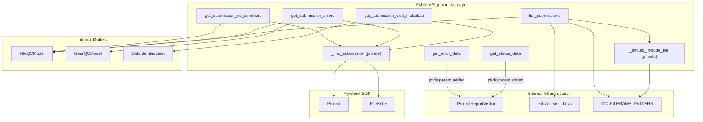

# Design Document

## Overview

This feature extends the `nacc-common` public API in `error_data.py` with submission-oriented data access functions that expose existing internal capabilities through simple, dict-returning interfaces. The goal is to let Alzheimer's Disease Research Centers query per-submission QC summaries, error details, visit metadata, and submission listings without touching Flywheel SDK objects or internal QC model classes.

Centers think in terms of **submissions** — identified by PTID, date, and module — not implementation-specific storage details. The public API uses an opaque `Submission_Identifier` (a `str`) that centers receive from `list_submissions` and pass to detail functions. Internally, this identifier currently maps to a QC status log filename, but this mapping is an implementation detail hidden behind a private helper.

The changes fall into two categories:

1. **Backward-compatible parameter additions**: Adding an optional `ptids` parameter to `get_error_data` and `get_status_data`, passing it through to `ProjectReportVisitor` as `ptid_set`.
2. **New functions**: Four new public functions (`get_submission_qc_summary`, `get_submission_errors`, `get_submission_visit_metadata`, `list_submissions`) that wrap existing internals and return plain dicts using the submission abstraction.

All functions live in `error_data.py` to keep the public API in one module. A shared private helper `_find_submission` resolves an opaque identifier to the underlying storage object.

## Architecture



### Design Decisions

1. **Submission abstraction over file-based API**: The public interface uses `identifier` (an opaque string) rather than `filename`. Centers don't need to know that submissions are stored as QC status log files. This allows the underlying storage to change without breaking center scripts.

2. **`_find_submission` helper**: Resolves an opaque identifier to the underlying `FileEntry`. Currently this does a filename lookup in `project.files`, but the abstraction allows future changes (e.g., database-backed storage). Returns `Optional[FileEntry]` — callers handle `None` per their return type contract. Calls `file.reload()` to ensure `.info` is populated.

3. **All functions in `error_data.py`**: Keeps the public API surface in one module. Centers import from one place.

4. **Standalone `_should_include_file` for filtering**: `list_submissions` needs the same PTID/module filtering logic as `ProjectReportVisitor.__should_process_file`, but doesn't need the full visitor machinery. A standalone private function reuses `QC_FILENAME_PATTERN` and applies the same filter logic.

5. **`FileQCModel.create()` handles reload**: The factory method calls `file_entry.reload()` internally, so the new functions don't need to reload before calling it. However, `_find_submission` calls `file.reload()` once to ensure `.info` is populated for functions that read `file.info.visit` directly.

6. **Plain dict returns**: All functions return `dict`, `list[dict]`, or `Optional[dict]` — never Pydantic models or Flywheel objects. This matches the existing pattern and keeps the interface serialization-friendly.

7. **Return `"identifier"` not `"filename"`**: Public-facing dicts use the key `"identifier"` to refer to the submission identifier. The value happens to be the QC log filename today, but centers should treat it as opaque.

## Components and Interfaces

### Modified Functions

#### `get_error_data(project, modules=None, ptids=None)`

```python
def get_error_data(
    project: Project,
    modules: Optional[set[str]] = None,
    ptids: Optional[set[str]] = None,
) -> list[dict[str, Any]]:
```

- Adds optional `ptids` parameter
- Passes `ptids` to `ProjectReportVisitor` as `ptid_set`
- Backward compatible: existing calls without `ptids` behave identically

#### `get_status_data(project, modules=None, ptids=None)`

```python
def get_status_data(
    project: Project,
    modules: Optional[set[str]] = None,
    ptids: Optional[set[str]] = None,
) -> list[dict[str, Any]]:
```

- Same change as `get_error_data`

### New Private Helpers

#### `_find_submission(project, identifier)`

```python
def _find_submission(project: Project, identifier: str) -> Optional[FileEntry]:
```

- Resolves an opaque submission identifier to the underlying storage object
- Currently: iterates `project.files` looking for a file with matching `.name`
- Returns the `FileEntry` (reloaded) if found, `None` otherwise
- Calls `file.reload()` to ensure `.info` is populated
- Implementation detail: the identifier is currently the QC log filename

#### `_should_include_file(filename, modules=None, ptids=None)`

```python
def _should_include_file(
    filename: str,
    modules: Optional[set[str]] = None,
    ptids: Optional[set[str]] = None,
) -> bool:
```

- Matches `filename` against `QC_FILENAME_PATTERN`
- If `ptids` is provided, checks that the extracted PTID is in the set
- If `modules` is provided, checks that the extracted module (upper-cased) is in the set
- Returns `False` if the filename doesn't match the pattern at all

### New Public Functions

#### `get_submission_qc_summary(project, identifier)`

```python
def get_submission_qc_summary(
    project: Project, identifier: str
) -> Optional[dict[str, Any]]:
```

- Uses `_find_submission` to resolve the identifier to a `FileEntry`
- Builds `FileQCModel.create(file_entry)`
- Returns `None` if identifier doesn't resolve or QC model has empty `qc` dict
- Returns:

  ```python
  {
      "identifier": "PTID_2024-01-15_UDS_qc-status.log",
      "overall_status": "FAIL",
      "stages": {
          "form_qc_checker": {"status": "FAIL", "error_count": 3},
          "form_validator": {"status": "PASS", "error_count": 0}
      }
  }
  ```

#### `get_submission_errors(project, identifier)`

```python
def get_submission_errors(
    project: Project, identifier: str
) -> list[dict[str, Any]]:
```

- Uses `_find_submission` to resolve the identifier
- Builds `FileQCModel.create(file_entry)`
- Iterates all gears, collects errors via `gear_model.get_errors()`
- Returns flat list of dicts, each with `"stage"` key plus all `FileError` fields (serialized with `by_alias=True`)
- Returns empty list if identifier doesn't resolve or no errors

#### `get_submission_visit_metadata(project, identifier)`

```python
def get_submission_visit_metadata(
    project: Project, identifier: str
) -> Optional[dict[str, Any]]:
```

- Uses `_find_submission` to resolve the identifier
- Calls `DataIdentification.from_visit_info(file_entry)`
- Returns `data_id.model_dump()` (flattened dict) if successful
- Returns `None` if identifier doesn't resolve or no visit metadata

#### `list_submissions(project, modules=None, ptids=None)`

```python
def list_submissions(
    project: Project,
    modules: Optional[set[str]] = None,
    ptids: Optional[set[str]] = None,
) -> list[dict[str, Any]]:
```

- Iterates `project.files`, filters with `_should_include_file`
- For each matching file, extracts PTID, date, module from the filename via `extract_visit_keys`
- Attempts to build `FileQCModel` for `overall_status`; sets to `None` on failure
- Returns list of dicts:

  ```python
  {
      "identifier": "PTID_2024-01-15_UDS_qc-status.log",
      "ptid": "PTID",
      "date": "2024-01-15",
      "module": "UDS",
      "overall_status": "PASS"  # or None if no QC data
  }
  ```

## Data Models

No new Pydantic models are introduced. All functions return plain Python dicts and lists.

### Return Type Summary

| Function | Return Type | On Missing/Error |
| --- | --- | --- |
| `get_error_data` | `list[dict[str, Any]]` | `ReportError` if no ADCID |
| `get_status_data` | `list[dict[str, Any]]` | `ReportError` if no ADCID |
| `get_submission_qc_summary` | `Optional[dict[str, Any]]` | `None` |
| `get_submission_errors` | `list[dict[str, Any]]` | `[]` |
| `get_submission_visit_metadata` | `Optional[dict[str, Any]]` | `None` |
| `list_submissions` | `list[dict[str, Any]]` | `[]` |

### Dict Schemas

**QC Summary dict** (`get_submission_qc_summary`):

- `identifier: str` — the opaque submission identifier
- `overall_status: str` — one of `"PASS"`, `"FAIL"`, `"IN REVIEW"`
- `stages: dict[str, dict]` — maps stage name to `{"status": Optional[str], "error_count": int}`

**Error detail dict** (`get_submission_errors`):

- `stage: str` — stage (gear) name
- `type: str` — error type (alias of `error_type`)
- `code: str` — error code (alias of `error_code`)
- `message: str`
- `location: Optional[dict]` — CSV or JSON location
- `container_id: Optional[str]`
- `flywheel_path: Optional[str]`
- `value: Optional[str]`
- `expected: Optional[str]`
- `timestamp: Optional[str]`
- `ptid: Optional[str]`
- `visitnum: Optional[str]`
- `date: Optional[str]`
- `naccid: Optional[str]`

**Visit metadata dict** (`get_submission_visit_metadata`):

- Flattened output from `DataIdentification.model_dump()`:
  - `adcid: Optional[int]`
  - `ptid: str`
  - `naccid: Optional[str]`
  - `date: str`
  - `visitnum: Optional[str]`
  - `module: str` (for form data) or `modality: str` (for image data)
  - `packet: Optional[str]` (for form data)

**Submission listing dict** (`list_submissions`):

- `identifier: str` — the opaque submission identifier
- `ptid: str`
- `date: str`
- `module: str`
- `overall_status: Optional[str]` — one of `"PASS"`, `"FAIL"`, `"IN REVIEW"`, or `None`

## Correctness Properties

*A property is a characteristic or behavior that should hold true across all valid executions of a system — essentially, a formal statement about what the system should do. Properties serve as the bridge between human-readable specifications and machine-verifiable correctness guarantees.*

### Property 1: QC summary faithfully represents FileQCModel

*For any* valid `FileQCModel` with at least one gear, `get_submission_qc_summary` SHALL return a dict where:

- `"identifier"` equals the input identifier
- `"overall_status"` equals `FileQCModel.get_file_status()`
- `"stages"` contains an entry for every gear in the model, where each entry's `"status"` matches `gear_model.get_status()` and `"error_count"` equals `len(gear_model.get_errors())`

**Validates: Requirements 3.1, 3.2, 3.3**

### Property 2: Error details faithfully represent FileQCModel errors

*For any* `FileQCModel` with errors across one or more gears, each dict returned by `get_submission_errors` SHALL contain a `"stage"` key matching the gear name and SHALL be a superset of the corresponding `FileError.model_dump(by_alias=True)` output. The total number of dicts returned SHALL equal the sum of `len(gear_model.get_errors())` across all gears.

**Validates: Requirements 4.1, 4.2, 4.5**

### Property 3: Visit metadata round trip

*For any* file with valid visit metadata in `file.info.visit`, `get_submission_visit_metadata` SHALL return a dict equal to `DataIdentification.from_visit_info(file_entry).model_dump()`.

**Validates: Requirements 5.1**

### Property 4: Submission listing filter correctness

*For any* set of QC log files and any combination of `modules` and `ptids` filters, every dict in the list returned by `list_submissions` SHALL have a `"ptid"` value in the `ptids` set (when provided) AND a `"module"` value (compared case-insensitively) in the `modules` set (when provided). When neither filter is provided, the result SHALL include all QC log files.

**Validates: Requirements 6.1, 6.2, 6.3, 6.4**

### Property 5: Submission listing output structure matches identifier

*For any* QC log file included in the `list_submissions` result, the dict SHALL contain `"identifier"`, `"ptid"`, `"date"`, and `"module"` values where the ptid, date, and module match the regex capture groups from `QC_FILENAME_PATTERN`, and `"overall_status"` SHALL equal `FileQCModel.get_file_status()` when QC data exists or `None` otherwise.

**Validates: Requirements 6.5, 6.6**

### Property 6: All return values are JSON-serializable plain dicts

*For any* valid input to any public data access function, the return value SHALL be directly serializable via `json.dumps()` without custom encoders, and SHALL not contain any Pydantic `BaseModel` instances or Flywheel SDK objects.

**Validates: Requirements 8.1, 8.2, 8.3**

## Error Handling

### Existing Error Behavior (Preserved)

- `get_error_data` and `get_status_data` raise `ReportError` if the project has no `pipeline_adcid` in `project.info`. This behavior is unchanged.
- `FileQCModel.create()` raises `pydantic.ValidationError` if the QC data structure is malformed. The new functions handle this gracefully.

### New Function Error Handling

| Scenario | Function | Behavior |
| --- | --- | --- |
| Identifier doesn't resolve | `get_submission_qc_summary` | Returns `None` |
| Identifier doesn't resolve | `get_submission_errors` | Returns `[]` |
| Identifier doesn't resolve | `get_submission_visit_metadata` | Returns `None` |
| Submission has no QC data (empty `qc` dict) | `get_submission_qc_summary` | Returns `None` |
| Submission has no QC data | `get_submission_errors` | Returns `[]` |
| Submission has no visit metadata | `get_submission_visit_metadata` | Returns `None` |
| `FileQCModel.create()` raises `ValidationError` | `get_submission_qc_summary` | Returns `None` |
| `FileQCModel.create()` raises `ValidationError` | `get_submission_errors` | Returns `[]` |
| `FileQCModel.create()` raises `ValidationError` | `list_submissions` | Sets `overall_status` to `None` for that entry |
| `DataIdentification.from_visit_info()` returns `None` | `get_submission_visit_metadata` | Returns `None` |
| Filename doesn't match QC pattern | `list_submissions` | File is skipped (not included in results) |

### Design Rationale

- Per-submission functions return `None` or `[]` rather than raising exceptions because "submission not found" and "no data" are expected conditions in center workflows, not exceptional errors.
- `list_submissions` gracefully handles individual submission failures (malformed QC data) by setting `overall_status` to `None` rather than failing the entire listing.
- The existing `ReportError` for missing ADCID is preserved because it indicates a misconfigured project, which is a genuine error condition.

## Testing Strategy

### Testing Approach

This feature is well-suited for a dual testing approach:

- **Property-based tests** (using [Hypothesis](https://hypothesis.readthedocs.io/)): Verify the 6 correctness properties above across randomly generated `FileQCModel` configurations, identifiers, and filter combinations. These test the pure logic of dict construction, filtering, and data transformation.
- **Example-based unit tests**: Verify edge cases (identifier not found, no QC data, no visit metadata, `ValidationError` handling), backward compatibility, and specific wiring (ptids parameter pass-through).

### Property-Based Testing Configuration

- **Library**: Hypothesis (already available in the Python ecosystem; add to test dependencies)
- **Minimum iterations**: 100 per property test
- **Tag format**: `Feature: nacc-common-data-access, Property {number}: {property_text}`
- Each correctness property is implemented as a single property-based test

### What to Mock

All tests mock Flywheel objects since the functions under test wrap Flywheel SDK calls:

- **`Project`**: Mock with a `.files` list of mock `FileEntry` objects and `.info` dict with `pipeline_adcid`
- **`FileEntry`**: Mock with `.name`, `.info` (containing `qc` and/or `visit` dicts), and `.reload()` returning self
- **`FileQCModel`**: For property tests, construct directly from generated data (no mock needed — it's a Pydantic model). For integration-style tests, mock the `FileEntry` that `FileQCModel.create()` reads from.

Follow the existing pattern in `test_file_qc_model.py` which constructs `FileQCModel`, `GearQCModel`, and `ValidationModel` directly without mocks.

### Test Organization

Tests go in `nacc-common/test/python/`:

- `test_error_data_ptid_filter.py` — Example tests for ptids parameter on `get_error_data` and `get_status_data`
- `test_submission_qc_summary.py` — Property + example tests for `get_submission_qc_summary`
- `test_submission_errors.py` — Property + example tests for `get_submission_errors`
- `test_submission_visit_metadata.py` — Property + example tests for `get_submission_visit_metadata`
- `test_list_submissions.py` — Property + example tests for `list_submissions`
- `test_json_serializable.py` — Property test for JSON serialization contract (Property 6)

### Property Test to Correctness Property Mapping

| Test File | Properties Covered |
| --- | --- |
| `test_submission_qc_summary.py` | Property 1 |
| `test_submission_errors.py` | Property 2 |
| `test_submission_visit_metadata.py` | Property 3 |
| `test_list_submissions.py` | Property 4, Property 5 |
| `test_json_serializable.py` | Property 6 |

### Example Test Coverage

| Requirement | Test Type | What's Verified |
| --- | --- | --- |
| 1.1–1.4 (PTID filter for errors) | Example | ptids passed through, filtering works |
| 2.1–2.4 (PTID filter for status) | Example | ptids passed through, filtering works |
| 3.4–3.5 (QC summary edge cases) | Example | None returned for missing identifier / no QC data |
| 4.3–4.4 (Error detail edge cases) | Example | Empty list for missing identifier / no errors |
| 5.2–5.3 (Visit metadata edge cases) | Example | None returned for missing identifier / no metadata |
| 7.1–7.4 (Backward compatibility) | Example | Old signatures still work, same output structure |
