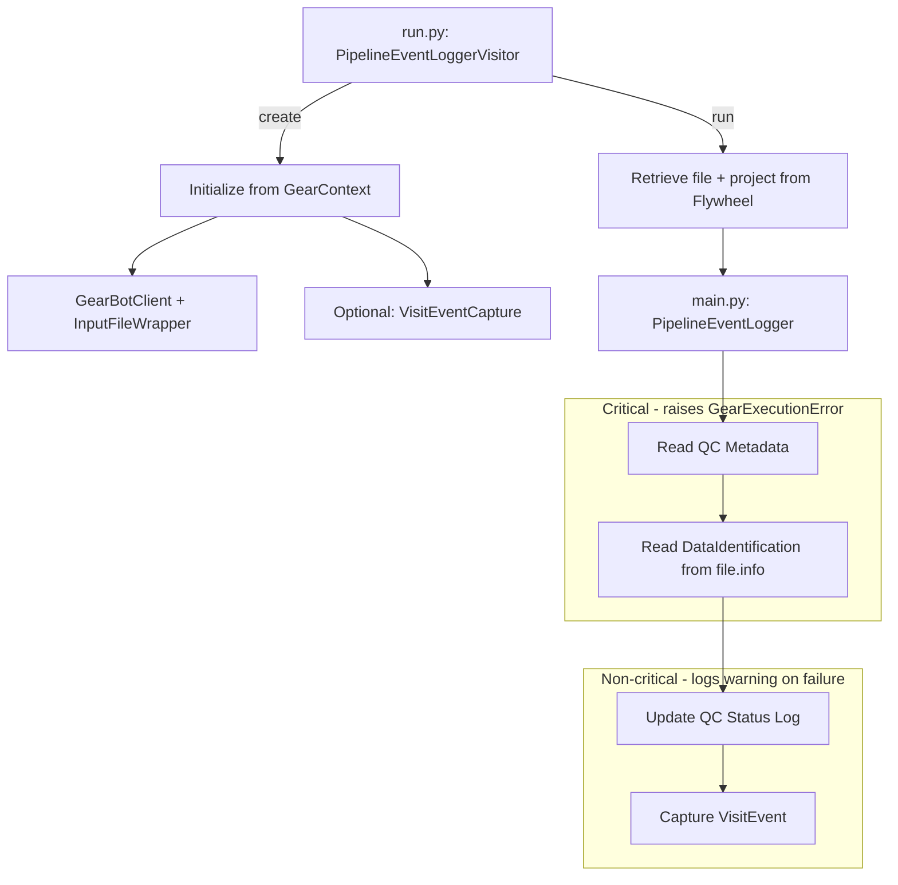
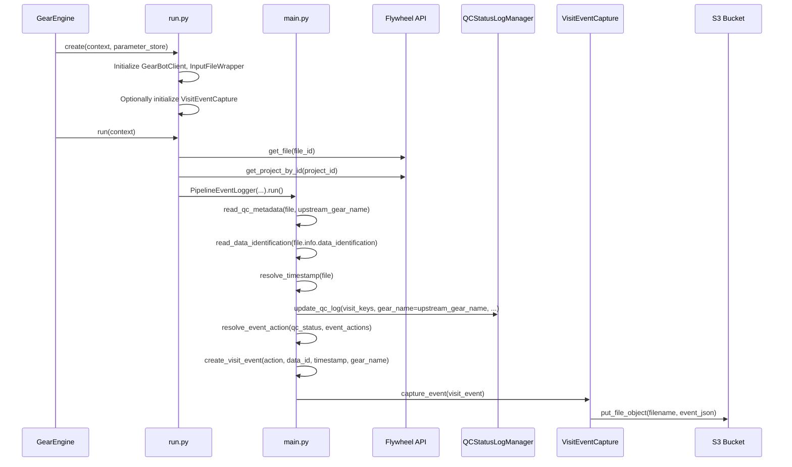
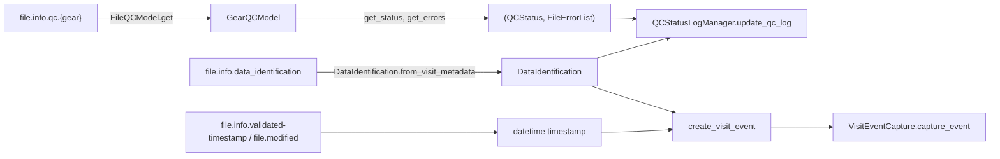

# Design Document: Pipeline Event Logger

## Overview

The Pipeline Event Logger is a Flywheel gear that bridges upstream pipeline gears (which write QC results to file metadata via `context.metadata.add_qc_result`) and NACC's project-level QC status logging and S3 event capture systems. It reads QC outcomes from `file.info.qc.{upstream_gear_name}`, updates the project-level QC status log attributing the entry to the upstream gear, and optionally captures a `VisitEvent` to the S3 transaction log.

The gear is designed for the imaging pipeline, where preexisting Flywheel gears process files and write QC results but have no knowledge of NACC's QC status logs or event capture infrastructure. It follows the same patterns established in the `image_identifier_lookup` gear.

### Key Design Decisions

- **Gear name attribution**: QC log entries are attributed to the upstream gear name, not to `pipeline-event-logger`. This is critical because downstream systems key on gear name.
- **Single upstream gear per invocation**: The upstream gear name is a config parameter. One invocation handles one upstream gear's results.
- **Outcome-based event actions**: The `event_actions` config parameter is an object mapping QC outcome keys (`"pass"`, `"fail"`, `"in-review"`) to event action strings. The gear normalizes the QC status to a key, looks it up in the map, and captures an event if a match is found. Any outcome not present in the map produces no event.
- **Single identification source**: The gear reads `DataIdentification` from `file.info.data_identification`. Upstream gears are responsible for writing this metadata. No strategy selection needed.
- **Non-critical side effects**: QC log updates and event captures are wrapped in try/except — failures log warnings but don't fail the gear. This follows the `image_identifier_lookup` pattern.

### Dependencies / Prerequisites

- **Upstream gears must write `file.info.data_identification`**: This gear expects a serialized `DataIdentification` dict at `file.info.data_identification` on the input file. Upstream gears (or earlier pipeline stages) are responsible for writing this.
  - **Form pipeline**: Form gears already write `file.info.visit` — these need to be updated to also write `file.info.data_identification` (or the gear can fall back to `file.info.visit` for backward compatibility).
  - **Imaging pipeline**: The `image_identifier_lookup` gear currently writes identification data to `subject.info` but not to `file.info`. **TODO**: Modify `image_identifier_lookup` to write the serialized `DataIdentification` to `file.info.data_identification` after building it. This is a separate change tracked outside this spec.

## Architecture

The gear follows the standard NACC gear architecture with `run.py` handling Flywheel context and `main.py` containing business logic.



### Workflow Sequence



## Components and Interfaces

### run.py — `PipelineEventLoggerVisitor`

Extends `GearExecutionEnvironment`. Handles Flywheel context management and dependency initialization.

```python
class PipelineEventLoggerVisitor(GearExecutionEnvironment):
    """Gear execution environment for Pipeline Event Logger."""

    def __init__(
        self,
        *,
        client: ClientWrapper,
        file_input: InputFileWrapper,
        upstream_gear_name: str,
        event_capture: Optional[VisitEventCapture],
        event_actions: dict[str, str],
    ): ...

    @classmethod
    def create(
        cls,
        context: GearContext,
        parameter_store: Optional[ParameterStore] = None,
    ) -> "PipelineEventLoggerVisitor": ...

    def run(self, context: GearContext) -> None: ...
```

**`create()` responsibilities:**

- Initialize `GearBotClient` from context and parameter store
- Create `InputFileWrapper` for `input_file`
- Read config parameters: `upstream_gear_name`, `apikey_path_prefix`
- Read optional config: `event_actions`, `event_environment`, `event_bucket`
- Parse `event_actions` as a `dict[str, str]` mapping QC outcome keys to event action strings. If not provided, default to `{}`.
- If event capture is configured (`event_actions` is non-empty and both `event_environment` and `event_bucket` present), initialize `VisitEventCapture` with `S3BucketInterface.create_from_environment(event_bucket)`.
- If `event_actions` is non-empty but `event_environment` or `event_bucket` is missing, raise `GearExecutionError`.
- If `event_actions` is empty, set `event_capture = None`

**`run()` responsibilities:**

- Retrieve the input file via `proxy.get_file(file_input.file_id)`
- Retrieve the parent project via `proxy.get_project_by_id(file.parents.project)`
- Wrap project as `ProjectAdaptor`
- Delegate to `PipelineEventLogger(...).run()`

### main.py — `PipelineEventLogger`

Contains the core business logic, free of direct Flywheel context dependencies.

```python
class PipelineEventLogger:
    """Orchestrates QC log update and event capture for an upstream gear."""

    def __init__(
        self,
        *,
        file_entry: FileEntry,
        project: ProjectAdaptor,
        upstream_gear_name: str,
        event_capture: Optional[VisitEventCapture],
        event_actions: dict[str, str],
    ): ...

    def run(self) -> None: ...
```

**`run()` workflow:**

1. `_read_qc_metadata()` — Extract QC status and errors from `file.info.qc.{upstream_gear_name}`
2. `_read_data_identification()` — Read `DataIdentification` from `file.info.data_identification`
3. `_resolve_timestamp()` — Determine the event timestamp
4. `_update_qc_status_log()` — Update the project-level QC status log (non-critical)
5. `_capture_event()` — Capture a `VisitEvent` to S3 based on QC outcome (non-critical, skipped if not configured or no matching action)

### Internal Methods

#### `_read_qc_metadata()`

```python
def _read_qc_metadata(self) -> tuple[QCStatus, FileErrorList]:
    """Read QC outcome from file.info.qc.{upstream_gear_name}.

    Returns:
        Tuple of (qc_status, error_list)

    Raises:
        GearExecutionError: If QC metadata is missing or invalid
    """
```

Implementation:
1. Reload the file entry to get fresh metadata
2. Check `file_entry.info` exists — raise `GearExecutionError` if not
3. Check `file_entry.info.get("qc")` exists — raise `GearExecutionError` if not
4. Parse with `FileQCModel.model_validate(file_entry.info)` — raise `GearExecutionError` on `ValidationError`
5. Call `file_qc_model.get(upstream_gear_name)` — raise `GearExecutionError` if `None`
6. Extract `gear_qc_model.get_status()` and `gear_qc_model.get_errors()`
7. Return `(status, FileErrorList(errors=errors))`

#### `_read_data_identification()`

```python
def _read_data_identification(self) -> DataIdentification:
    """Read DataIdentification from file.info.data_identification.

    Returns:
        DataIdentification for the input file

    Raises:
        GearExecutionError: If data_identification is missing or invalid
    """
```

Implementation:

1. Check `file_entry.info.get("data_identification")` exists — raise `GearExecutionError` if not
2. Call `DataIdentification.from_visit_metadata(**data_identification_dict)` to deserialize
3. Raise `GearExecutionError` on `ValidationError` or `ValueError`
4. Return the `DataIdentification`

The gear expects upstream gears (or earlier pipeline stages) to have written a serialized `DataIdentification` to `file.info.data_identification`. The serialized form is a flat dict with keys like `ptid`, `adcid`, `date`, `module`/`modality`, `visitnum`, etc.

#### `_resolve_timestamp()`

```python
def _resolve_timestamp(self) -> datetime:
    """Resolve the event timestamp from file metadata.

    Returns:
        datetime: The resolved timestamp
    """
```

Implementation:
1. Check `file_entry.info.get("validated-timestamp")`
2. If present, parse it using `datetime.strptime(ts, DEFAULT_DATE_TIME_FORMAT)`
3. If not present, use `file_entry.modified` (a `datetime` from the Flywheel SDK)

#### `_update_qc_status_log()`

```python
def _update_qc_status_log(
    self,
    data_identification: DataIdentification,
    qc_status: QCStatus,
    errors: FileErrorList,
) -> None:
    """Update project-level QC status log. Non-critical — logs warning on failure."""
```

Implementation:
1. Create `ErrorLogTemplate()` (default suffix/extension)
2. Create `FileVisitAnnotator(project=self._project)`
3. Create `QCStatusLogManager(error_log_template, visit_annotator)`
4. Call `qc_log_manager.update_qc_log(visit_keys=data_identification, project=self._project, gear_name=self._upstream_gear_name, status=qc_status, errors=errors, add_visit_metadata=True)`
5. Wrap in try/except — log warning on failure, do not raise

Note: `gear_name` is set to `self._upstream_gear_name`, not to `"pipeline-event-logger"`. This is the key attribution requirement.

#### `_capture_event()`

```python
def _capture_event(
    self,
    qc_status: QCStatus,
    data_identification: DataIdentification,
    timestamp: datetime,
) -> None:
    """Capture VisitEvent to S3 based on QC outcome. Non-critical — logs warning on failure.
    Skipped if event_capture is None or no matching action for the QC status."""
```

Implementation:

1. If `self._event_capture is None`, return immediately
2. Normalize QC status to outcome key: `"PASS"` → `"pass"`, `"FAIL"` → `"fail"`, `"IN REVIEW"` → `"in-review"`
3. Look up `outcome_key` in `self._event_actions` — if not found, log info and return (no event for this outcome)
4. Call `create_visit_event(action=event_action, visit_metadata=data_identification, project=self._project, completion_time=timestamp, gear_name=self._upstream_gear_name)`
5. If `create_visit_event` returns `None` (invalid project label), log warning and return
6. Call `self._event_capture.capture_event(visit_event)`
7. Wrap in try/except — log warning on failure, do not raise

### Configuration Parameters

| Parameter | Type | Required | Default | Description |
|-----------|------|----------|---------|-------------|
| `upstream_gear_name` | string | Yes | — | Name of the upstream gear whose QC results to read from `file.info.qc` |
| `apikey_path_prefix` | string | Yes | `"/prod/flywheel/gearbot"` | AWS parameter path prefix for Flywheel API key |
| `event_actions` | object | No | `{}` | Maps QC outcome keys (`"pass"`, `"fail"`, `"in-review"`) to event action strings (e.g., `"pass-qc"`, `"not-pass-qc"`) |
| `event_environment` | string (enum) | No | — | Environment for event capture: `"prod"` or `"dev"`. Required if `event_actions` is non-empty |
| `event_bucket` | string | No | — | S3 bucket name for event capture. Required if `event_actions` is non-empty |
| `dry_run` | boolean | No | `false` | Skip all write operations |

Event capture is enabled when `event_actions` is non-empty and both `event_environment` and `event_bucket` are provided. If `event_actions` is non-empty without `event_environment`/`event_bucket`, the gear raises `GearExecutionError` during `create()`.

### Manifest Structure

```json
{
  "name": "pipeline-event-logger",
  "label": "Pipeline Event Logger",
  "description": "Reads QC results from upstream gears and propagates them to NACC QC status logs and S3 event capture",
  "version": "0.1.0",
  "inputs": {
    "api-key": { "base": "api-key" },
    "input_file": {
      "description": "The file processed by the upstream gear",
      "base": "file"
    }
  },
  "config": {
    "upstream_gear_name": {
      "description": "Name of the upstream gear whose QC results to read",
      "type": "string"
    },
    "event_actions": {
      "description": "Maps QC outcome keys (pass, fail, in-review) to event action strings. Example: {\"pass\": \"pass-qc\", \"fail\": \"not-pass-qc\"}",
      "type": "object",
      "optional": true
    },
    "event_environment": {
      "description": "Environment for event capture (prod or dev). Required if event_actions is non-empty.",
      "type": "string",
      "enum": ["prod", "dev"],
      "optional": true
    },
    "event_bucket": {
      "description": "S3 bucket name for event capture. Required if event_actions is non-empty.",
      "type": "string",
      "optional": true
    },
    "apikey_path_prefix": {
      "description": "AWS parameter path prefix for gearbot API key",
      "type": "string",
      "default": "/prod/flywheel/gearbot"
    },
    "dry_run": {
      "description": "Skip all write operations",
      "type": "boolean",
      "default": false
    }
  }
}
```

## Data Models

The gear uses existing data models from the monorepo. No new models are introduced.

### Existing Models Used

| Model | Package | Purpose |
|-------|---------|---------|
| `FileQCModel` | `nacc_common.error_models` | Parse `file.info.qc` to extract per-gear QC results |
| `GearQCModel` | `nacc_common.error_models` | Access QC status and error list for a specific gear |
| `QCStatus` | `nacc_common.error_models` | Type alias: `Literal["PASS", "FAIL", "IN REVIEW"]` |
| `FileErrorList` | `nacc_common.error_models` | Container for QC error objects |
| `DataIdentification` | `nacc_common.data_identification` | Identifies a visit/file by participant, date, visit number, and data type |
| `VisitEvent` | `event_capture.visit_events` | Pydantic model for pipeline events captured to S3 |
| `VisitEventType` | `event_capture.visit_events` | Type alias: `Literal["submit", "delete", "not-pass-qc", "pass-qc"]` |

### Data Flow



## Correctness Properties

*A property is a characteristic or behavior that should hold true across all valid executions of a system — essentially, a formal statement about what the system should do. Properties serve as the bridge between human-readable specifications and machine-verifiable correctness guarantees.*

### Property 1: Upstream gear name attribution

*For any* valid upstream gear name string, when the Pipeline Event Logger updates the QC status log, the `gear_name` parameter passed to `QCStatusLogManager.update_qc_log` SHALL be the upstream gear name, never `"pipeline-event-logger"`.

**Validates: Requirements 3.3**

### Property 2: Event action selected by QC outcome

*For any* valid combination of upstream gear name, QC status, and `event_actions` mapping, when the Pipeline Event Logger captures a `VisitEvent`, the event's `action` field SHALL equal the value mapped to the normalized QC outcome key in `event_actions`, and the event's `gear_name` field SHALL equal the upstream gear name. If the QC outcome key is not present in `event_actions`, no event SHALL be captured.

**Validates: Requirements 4.1, 4.2, 4.4, 3.3**

### Property 3: Timestamp resolution prefers validated-timestamp

*For any* file entry, if `file.info.validated-timestamp` is present and parseable, the resolved timestamp SHALL equal the parsed `validated-timestamp` value. If `validated-timestamp` is absent, the resolved timestamp SHALL equal `file.modified`.

**Validates: Requirements 5.1, 5.2**

### Property 4: QC metadata extraction round-trip

*For any* valid `FileQCModel` containing a gear entry for the upstream gear name, extracting the QC status and error list via `_read_qc_metadata` SHALL return the same status and errors that were stored in the model.

**Validates: Requirements 1.1, 1.2**

## Error Handling

### Critical Errors (raise `GearExecutionError`)

These terminate the gear because without the data, there is no work to perform:

| Condition | Error Message |
|-----------|---------------|
| Input file not retrievable from Flywheel | `"Failed to find the input file: {error}"` |
| Parent project not found | `"Failed to retrieve parent project for file {filename}"` |
| `file.info.qc` section missing | `"QC metadata not found on input file {filename}: file.info.qc section is missing"` |
| `file.info.qc.{upstream_gear_name}` missing | `"QC results for gear '{upstream_gear_name}' not found in file.info.qc on {filename}"` |
| `FileQCModel` validation fails | `"Invalid QC metadata structure on file {filename}: {error}"` |
| DataIdentification cannot be read | `"file.info.data_identification not found on input file {filename}"` |
| Event capture partially configured | `"event_actions is non-empty but event_environment and event_bucket are required"` |

### Non-Critical Errors (log warning, continue)

These are downstream side effects where the upstream gear's QC result is already safely stored in `file.info.qc`:

| Condition | Behavior |
|-----------|----------|
| `QCStatusLogManager.update_qc_log` fails | Log warning: `"Failed to update QC status log (non-critical): {error}"` |
| `create_visit_event` returns `None` | Log warning: `"Failed to create visit event (non-critical): invalid project label"` |
| `VisitEventCapture.capture_event` fails | Log warning: `"Failed to capture event to S3 (non-critical): {error}"` |

### Logging Strategy

Informational log messages at each major step:
1. `"Reading QC metadata for gear '{upstream_gear_name}' from file {filename}"`
2. `"QC status: {status}, errors: {count}"`
3. `"Reading data identification from file.info.data_identification"`
4. `"Resolved timestamp: {timestamp}"`
5. `"Updating QC status log"`
6. `"Capturing event: action={action} (QC outcome: {outcome})"`

## Testing Strategy

### Testing Approach

The Pipeline Event Logger is primarily an **orchestration gear** — it reads data from Flywheel file metadata and writes it to QC status logs and S3 using existing, well-tested infrastructure (`QCStatusLogManager`, `VisitEventCapture`, `create_visit_event`). The testing strategy reflects this:

- **Unit tests** verify the gear's own logic: QC metadata extraction, identification strategy selection, timestamp resolution, error handling, and correct parameter passing to infrastructure components.
- **Property-based tests** verify the correctness properties above using Hypothesis, focusing on the gear's parameter-passing correctness across a range of inputs.
- **Integration tests** are not included in the gear's test suite — the infrastructure components have their own tests.

### Property-Based Testing

Library: **Hypothesis** (already used in the monorepo)

Each property test runs a minimum of 100 iterations and is tagged with the design property it validates.

```
# Feature: pipeline-event-logger, Property 1: Upstream gear name attribution
# Feature: pipeline-event-logger, Property 2: Event action selected by QC outcome
# Feature: pipeline-event-logger, Property 3: Timestamp resolution prefers validated-timestamp
# Feature: pipeline-event-logger, Property 4: QC metadata extraction round-trip
```

### Unit Test Coverage

| Test Area | What's Tested | Approach |
|-----------|---------------|----------|
| QC metadata reading | Valid extraction, missing `qc` section, missing gear section, invalid structure | Example-based with mocked `FileEntry` |
| Identification reading | Valid `data_identification` in file.info, missing `data_identification`, invalid structure | Example-based with mocked `FileEntry` |
| Timestamp resolution | `validated-timestamp` present, `validated-timestamp` absent (fallback to `file.modified`) | Example-based |
| QC log update | Correct parameters passed, failure handling (non-critical) | Mock `QCStatusLogManager` |
| Event capture | Correct action selected per QC outcome, skip when no matching key, skip when not configured, failure handling (non-critical) | Mock `VisitEventCapture` |
| Gear name attribution | Upstream gear name used (not `pipeline-event-logger`) in QC log and events | Example + property-based |
| Error handling | All critical error paths raise `GearExecutionError`, all non-critical paths log warnings | Example-based |
| Configuration validation | Partial event config raises error, missing required params raise error | Example-based |

### Test File Structure

```
gear/pipeline_event_logger/test/python/
├── pipeline_event_logger_test/
│   ├── BUILD
│   ├── __init__.py
│   ├── conftest.py              # Shared fixtures: mock FileEntry, ProjectAdaptor, etc.
│   ├── test_main.py             # Tests for PipelineEventLogger business logic
│   └── test_run.py              # Tests for PipelineEventLoggerVisitor create/run
```

### Mock Strategy

Following the project's coding style guidelines, mocks are centralized in `conftest.py`:

- `mock_file_entry(qc_info, info)` — Factory for `FileEntry` with configurable `info` dict
- `mock_project_adaptor(label, group)` — Factory for `ProjectAdaptor`
- `mock_qc_status_log_manager()` — Mock `QCStatusLogManager` with configurable return values
- `mock_event_capture()` — Mock `VisitEventCapture`
