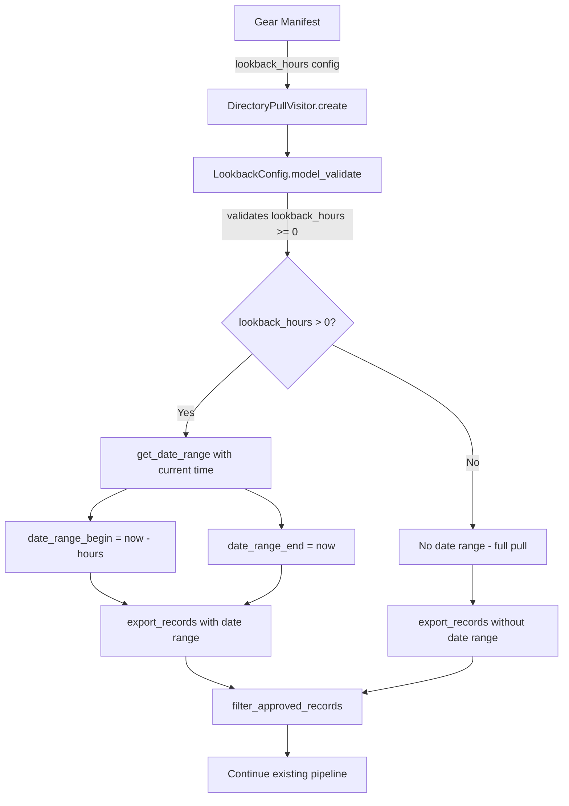

# Design Document: Pull Directory Date Range

> **Note**: This spec is finalized. The implementation renamed `lookback_hours` to `preceding_hours` and `LookbackConfig` to `TimeWindowConfig` after this spec was written. The source code is the authoritative reference for current naming. Do not modify code to match this document.

## Overview

This feature adds an optional `lookback_hours` configuration parameter to the pull-directory gear, enabling incremental pulls of recently modified records from the NACC REDCap directory. When `lookback_hours` is set to a positive value, the gear computes a relative time window (`now - lookback_hours` to `now`) and passes it to `REDCapProject.export_records()` via the existing `date_range_begin` and `date_range_end` parameters. When `lookback_hours` is 0 (the default) or omitted, the gear behaves exactly as it does today — pulling all records with no date filtering.

The change is minimal and localized:
1. A new Pydantic config model (`LookbackConfig`) encapsulates validation and date computation.
2. `DirectoryPullVisitor.create()` reads the config, computes the date range, and passes it to `export_records()`.
3. The gear manifest gains one new optional field.

No changes are needed to `main.py`, the YAML output logic, or the downstream user management pipeline.

## Architecture

The feature follows the existing gear architecture pattern where `run.py` handles Flywheel context and I/O, while business logic (date computation, validation) lives in a testable config model.



### Key Design Decisions

1. **Pydantic config model over raw dict access**: Follows the `TransactionalEventScraperConfig` pattern already established in the codebase. Centralizes validation and provides a typed interface.

2. **`lookback_hours` as a relative window rather than absolute dates**: Simpler for operators — they specify "last 6 hours" rather than computing timestamps. The gear computes absolute timestamps at runtime.

3. **Dependency injection of current time**: The `get_date_range()` method accepts a `now` parameter (defaulting to `datetime.now()`) so tests can inject a fixed time without mocking.

4. **Default of 0 means "no filtering"**: Zero is a natural sentinel — it means "look back zero hours" which semantically means "don't filter by time." This avoids `Optional[int]` complexity and keeps the manifest config simple.

## Components and Interfaces

### New: `LookbackConfig` (Pydantic Model)

**File**: `gear/pull_directory/src/python/directory_app/config.py` (new file)

```python
class LookbackConfig(BaseModel):
    """Configuration model for the lookback window."""
    
    lookback_hours: float = Field(
        default=0,
        description="Hours to look back for modified records. 0 = full pull."
    )
    
    @field_validator("lookback_hours")
    @classmethod
    def validate_non_negative(cls, value: float) -> float:
        """Validate lookback_hours is not negative."""
        ...
    
    def get_date_range(
        self, now: Optional[datetime] = None
    ) -> Optional[Tuple[str, str]]:
        """Compute (dateRangeBegin, dateRangeEnd) or None if no filtering."""
        ...
```

**Interface**:
- **Input**: `lookback_hours` (float, >= 0, default 0)
- **Output of `get_date_range(now)`**: `Optional[Tuple[str, str]]` — a pair of `"YYYY-MM-DD HH:MM:SS"` strings, or `None` when `lookback_hours` is 0.

### Modified: `DirectoryPullVisitor.create()` in `run.py`

Changes to the `create()` classmethod:
1. Read `lookback_hours` from `context.config.opts` and construct `LookbackConfig`.
2. Call `config.get_date_range()` to get the optional date range.
3. Pass `date_range_begin` and `date_range_end` to `export_records()` when the date range is present.
4. Add logging for the active mode (incremental vs. full pull).

The method signature and return type remain unchanged.

### Modified: `manifest.json`

Add one new config field:

```json
"lookback_hours": {
    "description": "Number of hours to look back from the current time for filtering records by last modification time. 0 means no filtering (full pull).",
    "type": "number",
    "default": 0
}
```

### Unchanged Components

- **`main.py`**: No changes. `filter_approved_records()` and `run()` operate on the record list regardless of how it was fetched.
- **`REDCapProject.export_records()`**: Already supports `date_range_begin` and `date_range_end` parameters in `redcap_api` 0.1.5.
- **YAML output**: Produced by `main.py` — format is independent of the fetch strategy.

## Data Models

### LookbackConfig

| Field | Type | Default | Validation |
|-------|------|---------|------------|
| `lookback_hours` | `float` | `0` | Must be >= 0 (Pydantic field validator) |

### Date Range Output

The `get_date_range()` method returns:
- `None` when `lookback_hours == 0` (no filtering)
- `(begin_str, end_str)` when `lookback_hours > 0`, where:
  - `begin_str` = `(now - timedelta(hours=lookback_hours)).strftime("%Y-%m-%d %H:%M:%S")`
  - `end_str` = `now.strftime("%Y-%m-%d %H:%M:%S")`

### REDCap API Parameters

The `export_records()` call changes from:

```python
# Before (always)
project.export_records(fields=get_directory_field_names())

# After (when lookback_hours > 0)
project.export_records(
    fields=get_directory_field_names(),
    date_range_begin=begin_str,
    date_range_end=end_str,
)

# After (when lookback_hours == 0, same as before)
project.export_records(fields=get_directory_field_names())
```

## Correctness Properties

*A property is a characteristic or behavior that should hold true across all valid executions of a system — essentially, a formal statement about what the system should do. Properties serve as the bridge between human-readable specifications and machine-verifiable correctness guarantees.*

### Property 1: Non-negative validation accepts if and only if non-negative

*For any* numeric value, `LookbackConfig(lookback_hours=value)` succeeds if and only if the value is non-negative (>= 0). Negative values must raise a `ValidationError`.

**Validates: Requirements 2.1, 2.2, 5.2**

### Property 2: Date range computation correctness

*For any* positive `lookback_hours` value and *any* reference datetime `now`, `LookbackConfig(lookback_hours=value).get_date_range(now)` returns a tuple `(begin, end)` where `begin` equals `(now - timedelta(hours=value)).strftime("%Y-%m-%d %H:%M:%S")` and `end` equals `now.strftime("%Y-%m-%d %H:%M:%S")`. When `lookback_hours` is 0, the method returns `None`.

**Validates: Requirements 3.1, 3.2, 5.3**

## Error Handling

| Error Condition | Behavior | Error Type |
|----------------|----------|------------|
| `lookback_hours` is negative | Pydantic validation rejects the value | `ValidationError` (caught in `create()`, wrapped in `GearExecutionError`) |
| `lookback_hours` is non-numeric | Pydantic type coercion fails | `ValidationError` (caught in `create()`, wrapped in `GearExecutionError`) |
| REDCap API rejects date range | Existing `REDCapConnectionError` handling applies | `GearExecutionError` (already handled) |
| `lookback_hours` missing from config | Defaults to 0 — full pull, no error | N/A |

The error wrapping follows the existing pattern in `DirectoryPullVisitor.create()` where `ParameterError` and `REDCapConnectionError` are caught and re-raised as `GearExecutionError`. The new `ValidationError` from `LookbackConfig` will be handled the same way.

## Testing Strategy

### Property-Based Tests (Hypothesis)

Property-based tests use the [Hypothesis](https://hypothesis.readthedocs.io/) library, which is already available in the project's test dependencies.

- **Minimum 100 iterations** per property test (Hypothesis default is 100 examples).
- Each test references its design property with a tag comment.
- Tag format: **Feature: pull-directory-date-range, Property {number}: {property_text}**

Two property-based tests covering the `LookbackConfig` model:

1. **Property 1 test**: Generate random floats. Non-negative values should construct successfully; negative values should raise `ValidationError`.
2. **Property 2 test**: Generate random positive floats for `lookback_hours` and random datetimes for `now`. Verify the returned tuple matches the expected formatted strings. Also verify that `lookback_hours=0` returns `None`.

### Unit Tests (Example-Based)

- **`export_records` called with date range** (Req 3.3): Mock `REDCapProject.export_records`, set `lookback_hours=6`, verify `date_range_begin` and `date_range_end` kwargs are passed.
- **`export_records` called without date range** (Req 3.4, 4.1): Mock `REDCapProject.export_records`, set `lookback_hours=0`, verify no date range kwargs.
- **`filter_approved_records` always applied** (Req 4.2): Verify the filter is called regardless of lookback setting.
- **Logging for incremental pull** (Req 6.1): Capture logs, verify message includes lookback_hours and date range.
- **Logging for full pull** (Req 6.2): Capture logs, verify message indicates no date filtering.
- **Negative lookback raises GearExecutionError** (Req 2.2): Verify the `create()` method wraps the `ValidationError` in `GearExecutionError`.
- **Default config backward compatibility** (Req 4.4): Verify existing config options are still read correctly when `lookback_hours` is absent.

### Smoke Tests

- **Manifest field exists** (Req 1.1, 1.2): Verify `manifest.json` contains `lookback_hours` with correct type, default, and description.

### Test File Organization

- `gear/pull_directory/test/python/test_lookback_config.py` — Property-based and unit tests for `LookbackConfig`.
- `gear/pull_directory/test/python/test_directory_pull_visitor_create.py` — Extended with new tests for date range passing and logging (follows existing test structure).
