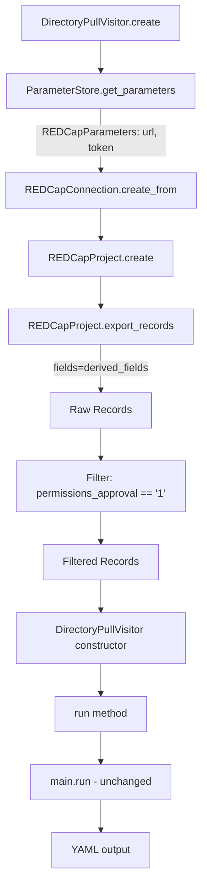

# Design Document: Pull Directory Export Records

## Overview

This design describes the refactoring of the `pull_directory` gear to replace report-based data retrieval (`REDCapReportConnection.get_report_records()`) with field-based export (`REDCapProject.export_records()`). The change ensures all fields required by `DirectoryAuthorizations` are explicitly requested, including CLARiTI role checkbox fields and `signed_agreement_status_num_ct` that may be missing from the pre-configured REDCap report.

The refactoring involves three coordinated changes:

1. **Connection setup**: Switch from `REDCapReportConnection` (requires report ID) to `REDCapConnection` + `REDCapProject` (requires only URL and token).
2. **Data retrieval**: Replace `get_report_records()` with `export_records(fields=...)` using a field list derived from the `DirectoryAuthorizations` model.
3. **Client-side filtering**: Filter exported records to retain only those with `permissions_approval == '1'`, since the report-level filter is no longer available.

The `main.py` processing logic and YAML output format remain unchanged.

## Architecture



### Current Flow (Before)

```
ParameterStore.get_redcap_report_parameters(param_path)
  → REDCapReportParameters {url, token, reportid}
  → REDCapReportConnection.create_from(params)
  → connection.get_report_records()
  → records passed to DirectoryPullVisitor
```

### New Flow (After)

```
ParameterStore.get_parameters(param_type=REDCapParameters, parameter_path=param_path)
  → REDCapParameters {url, token}
  → REDCapConnection.create_from(params)
  → REDCapProject.create(connection)
  → project.export_records(fields=get_directory_field_names())
  → filter records where permissions_approval == '1'
  → filtered records passed to DirectoryPullVisitor
```

## Components and Interfaces

### 1. Field Name Derivation Function

A new function `get_directory_field_names()` in `common/src/python/users/nacc_directory.py` that derives the list of REDCap field names from the `DirectoryAuthorizations` Pydantic model definition.

```python
def get_directory_field_names() -> list[str]:
    """Derives the list of REDCap field names from DirectoryAuthorizations model.

    Resolves Pydantic alias, validation_alias, and AliasChoices to determine
    the correct REDCap field name for each model field.

    Returns:
        List of REDCap field names corresponding to all DirectoryAuthorizations fields.
    """
```

**Alias resolution logic:**
- If a field has `validation_alias` with `AliasChoices`, use the first alias choice string.
- If a field has `alias`, use the alias.
- Otherwise, use the Python field name.

This approach ensures the field list stays in sync with the model. When a new field is added to `DirectoryAuthorizations`, the derived list automatically includes it.

### 2. Record Filtering Function

A new function `filter_approved_records()` in `gear/pull_directory/src/python/directory_app/run.py` (or as a local helper) that filters records by `permissions_approval`.

```python
def filter_approved_records(
    records: list[dict[str, str]],
) -> list[dict[str, str]]:
    """Filters records to retain only those with permissions_approval == '1'.

    Args:
        records: Raw records from REDCap export.

    Returns:
        Records where permissions_approval field equals '1'.
    """
```

### 3. Modified DirectoryPullVisitor.create()

The `create` classmethod changes:
- Uses `ParameterStore.get_parameters(param_type=REDCapParameters, ...)` instead of `get_redcap_report_parameters()`.
- Creates `REDCapConnection` instead of `REDCapReportConnection`.
- Creates `REDCapProject` from the connection.
- Calls `export_records(fields=get_directory_field_names())`.
- Filters records with `filter_approved_records()`.
- Passes filtered records to the constructor.

### 4. Unchanged Components

- `main.py` `run()` function: receives `list[dict[str, str]]` as before, no changes needed.
- `DirectoryAuthorizations` model: no structural changes (only the new utility function is added alongside it).
- YAML output format: identical for equivalent input data.
- Error handling in `main.py`: continues to check `permissions_approval` and `signed_user_agreement` on individual records (defense-in-depth, since pre-filtering removes unapproved records).
- `UserEventCollector`, CSV export, and email notifications: unchanged.

## Data Models

### REDCapParameters (existing, no changes)

```python
class REDCapParameters(TypedDict):
    url: str
    token: str
```

Used instead of `REDCapReportParameters` which additionally requires `reportid`.

### DirectoryAuthorizations (existing, no structural changes)

The model already defines all field aliases. The new `get_directory_field_names()` function reads these definitions at runtime via `DirectoryAuthorizations.model_fields`.

**Field alias resolution mapping** (derived from model):

| Python Field Name | REDCap Field Name (alias) | Alias Type |
|---|---|---|
| `firstname` | `firstname` | field name |
| `lastname` | `lastname` | field name |
| `email` | `email` | field name |
| `auth_email` | `fw_email` | `alias` |
| `inactive` | `archive_contact` | `alias` |
| `org_name` | `contact_company_name` | `alias` |
| `adcid` | `adcid` | `alias` |
| `general_page_community_resources_access_level` | `web_report_access` | `validation_alias` (AliasChoices) |
| `adrc_dashboard_reports_access_level` | `web_report_access` | `validation_alias` (AliasChoices) |
| `study_selections` | `study_selections` | field name |
| `adrc_datatype_enrollment_access_level` | `p30_naccid_enroll_access_level` | `alias` |
| ... (remaining access level fields) | ... | `alias` |
| `loc_clariti_role___*` (14 fields) | `loc_clariti_role___*` | `alias` |
| `ind_clar_core_role___admin` | `ind_clar_core_role___admin` | `alias` |
| `signed_user_agreement` | `signed_agreement_status_num_ct` | `alias` |
| `permissions_approval` | `permissions_approval` | field name |
| `permissions_approval_date` | `permissions_approval_date` | field name |
| `permissions_approval_name` | `permissions_approval_name` | field name |

Note: `web_report_access` maps to two Python fields (`general_page_community_resources_access_level` and `adrc_dashboard_reports_access_level`). The derived field list must deduplicate this so `web_report_access` appears only once.

### Record Filter

Input: `list[dict[str, str]]` — raw records from `export_records()`.
Output: `list[dict[str, str]]` — records where `permissions_approval == '1'`.


## Correctness Properties

*A property is a characteristic or behavior that should hold true across all valid executions of a system — essentially, a formal statement about what the system should do. Properties serve as the bridge between human-readable specifications and machine-verifiable correctness guarantees.*

### Property 1: Field derivation covers all model fields with correct aliases

*For any* field defined in the `DirectoryAuthorizations` Pydantic model, the output of `get_directory_field_names()` should contain the correct REDCap field name — resolving `alias`, `validation_alias` (including `AliasChoices`), or falling back to the Python field name. The resulting list should have no duplicates and should contain exactly the set of unique REDCap field names needed to populate every field in the model.

**Validates: Requirements 1.2, 4.1, 4.3**

### Property 2: Filtering retains only approved records

*For any* list of record dictionaries with arbitrary `permissions_approval` values, applying `filter_approved_records()` should produce a list where every record has `permissions_approval == '1'`, and no record with `permissions_approval != '1'` is present in the output. The output should be a subset of the input, preserving record order and content.

**Validates: Requirements 2.1, 2.2**

## Error Handling

### REDCap Connection Errors

When `REDCapProject.create()` or `export_records()` raises `REDCapConnectionError`, the `DirectoryPullVisitor.create()` method catches it and raises `GearExecutionError` with a descriptive message including the original error details. This matches the existing pattern.

### Parameter Store Errors

When `ParameterStore.get_parameters()` raises `ParameterError` (e.g., missing `url` or `token`), the visitor catches it and raises `GearExecutionError`. The only change is the parameter type: `REDCapParameters` instead of `REDCapReportParameters`, so a missing `reportid` no longer causes an error.

### Validation Errors in main.py

The `main.py` `run()` function continues to handle `ValidationError` from `DirectoryAuthorizations.model_validate()` and records errors via `UserEventCollector`. Records that fail validation are skipped. This is unchanged.

### Defense-in-Depth for permissions_approval

Although records are pre-filtered to `permissions_approval == '1'` before reaching `main.py`, the existing check in `main.py` for `dir_record.permissions_approval` remains as defense-in-depth. This ensures that even if the filtering logic is bypassed or changed, unapproved records are still excluded.

## Testing Strategy

### Unit Tests

Unit tests verify specific examples and edge cases:

- `get_directory_field_names()` returns the expected list of known REDCap field names (snapshot test against the current model).
- `get_directory_field_names()` deduplicates `web_report_access` (which maps to two Python fields).
- `filter_approved_records()` with an empty list returns an empty list.
- `filter_approved_records()` with records missing the `permissions_approval` key excludes those records.
- `DirectoryPullVisitor.create()` uses `REDCapConnection` (not `REDCapReportConnection`) — verified via mocking.
- `DirectoryPullVisitor.create()` calls `export_records()` with the derived field list — verified via mocking.
- `DirectoryPullVisitor.create()` wraps `REDCapConnectionError` in `GearExecutionError`.
- End-to-end: given a set of mixed records (approved and unapproved), the gear produces the same YAML output as the current implementation for the approved subset.

### Property-Based Tests

Property-based tests verify universal properties across randomly generated inputs. Use the `hypothesis` library (already available in the project).

Each property test must run a minimum of 100 iterations and be tagged with a comment referencing the design property.

- **Feature: pull-directory-export-records, Property 1: Field derivation covers all model fields with correct aliases**
  - Generate: iterate over all fields in `DirectoryAuthorizations.model_fields`
  - Assert: each field's resolved REDCap name is present in `get_directory_field_names()` output
  - Assert: no duplicates in the output list
  - Note: This property is deterministic (the model is fixed), so it functions as a comprehensive assertion over all fields rather than a randomized test. However, it validates the universal quantification "for all fields in the model."

- **Feature: pull-directory-export-records, Property 2: Filtering retains only approved records**
  - Generate: random lists of dictionaries with `permissions_approval` values drawn from `{'0', '1', '', 'Yes', 'No', None}` and other arbitrary string values
  - Assert: every record in the output has `permissions_approval == '1'`
  - Assert: the output is a subsequence of the input (order preserved, no records added)
  - Assert: the count of output records equals the count of input records where `permissions_approval == '1'`

### Test Configuration

- Library: `hypothesis` (Python property-based testing)
- Minimum iterations: 100 per property test (`@settings(max_examples=100)`)
- Tag format: comment referencing design property number and text
