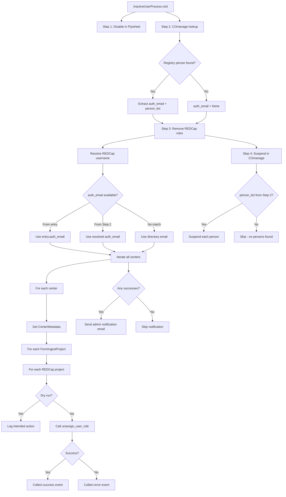
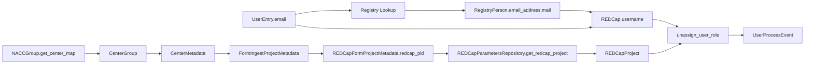

# Design Document: REDCap User Disable

## Overview

This feature adds REDCap user role removal to the `InactiveUserProcess` disable flow and reorders the steps so that COmanage suspension happens last. When a user is marked inactive in the NACC directory, the system currently disables them in Flywheel and suspends them in COmanage. This design extends that flow to also unassign the user's role from all REDCap projects they may have access to, and sends a notification email to administrators for manual REDCap account suspension (which is not available via the REDCap API).

The new step order is: (1) Flywheel disable, (2) COmanage lookup (resolve auth_email), (3) REDCap role removal, (4) COmanage suspend. This ensures all service-level access is removed before the identity-provider-level suspension.

The design follows the existing patterns in `InactiveUserProcess`: best-effort processing, independent steps, dry-run support, and event collection via `UserEventCollector`.

### Key Design Decisions

1. **Local wrapper, not library modification**: A local helper function wraps `REDCapProject.assign_user_role(username, "")` rather than modifying the external `redcap_api` library. This keeps the change self-contained.
2. **Visitor pattern for center iteration**: A new `REDCapDisableVisitor` implements `AbstractCenterMetadataVisitor` to traverse center metadata and find all REDCap projects, consistent with how `CenterAuthorizationVisitor` grants access.
3. **Auth email resolution reuses COmanage lookup**: The COmanage registry lookup is separated from the suspend action. The lookup runs early (Step 2) to resolve `auth_email` for the REDCap step, while the actual suspend runs last (Step 4) so that COmanage suspension happens after all other services have been disabled.
4. **Notification per user, not per project**: A single notification email is sent per user listing all affected REDCap projects, rather than one email per project.
5. **COmanage suspend runs last**: COmanage suspension is deferred to Step 4 so that Flywheel and REDCap are disabled first. This ensures the user's COmanage record remains active while the other services are being cleaned up, and places the identity-provider-level action last in the sequence.

## Architecture

The disable flow in `InactiveUserProcess.visit()` is restructured into four steps. The COmanage registry lookup (Step 2) is separated from the COmanage suspend (Step 4) so that the `auth_email` is available for the REDCap step (Step 3) while the actual suspension happens last. Each step remains independent — failure of one does not block the others.

1. **Step 1: Disable in Flywheel** — find and disable matching Flywheel users
2. **Step 2: COmanage lookup** — look up registry persons to resolve `auth_email` (no suspend yet)
3. **Step 3: Remove REDCap roles** — unassign user roles from all REDCap projects, send admin notification
4. **Step 4: Suspend in COmanage** — suspend the registry persons found in Step 2



## Components and Interfaces

### 1. Local Helper Function: `unassign_user_role`

**Location**: `common/src/python/users/redcap_user_operations.py` (new file)

```python
def unassign_user_role(redcap_project: REDCapProject, username: str) -> int:
    """Unassign a user from their role in a REDCap project.

    Calls assign_user_role with an empty role string, which removes the
    user's role-based permissions without deleting the user record.

    Args:
        redcap_project: The REDCap project instance
        username: The REDCap username (typically the auth_email)

    Returns:
        Number of user-role assignments updated

    Raises:
        REDCapConnectionError: If the underlying API call fails
    """
```

This is a thin wrapper that calls `redcap_project.assign_user_role(username, "")` and returns the result. It does not catch `REDCapConnectionError` — that is left to the caller.

### 2. REDCapDisableVisitor

**Location**: `common/src/python/users/redcap_disable_visitor.py` (new file)

Implements `AbstractCenterMetadataVisitor` to traverse center metadata and collect all REDCap project PIDs associated with form ingest projects.

```python
class REDCapDisableVisitor(AbstractCenterMetadataVisitor):
    """Visitor that collects REDCap project PIDs from center metadata."""

    @property
    def redcap_pids(self) -> list[int]:
        """Returns the list of REDCap project PIDs found."""
```

The visitor walks the center metadata tree:
- `visit_center` → iterates studies
- `visit_study` → iterates ingest projects
- `visit_form_ingest_project` → collects `redcap_pid` from each `REDCapFormProjectMetadata`
- All other visit methods are no-ops

### 3. REDCap Disable Logic in InactiveUserProcess

**Location**: Modified `common/src/python/users/user_processes.py`

New private method `__disable_in_redcap` added to `InactiveUserProcess`:

```python
def __disable_in_redcap(
    self,
    entry: UserEntry,
    user_context: UserContext,
    auth_email: Optional[str],
) -> None:
    """Step 3: Remove user roles from all REDCap projects.

    Args:
        entry: The inactive user entry
        user_context: The user context for event collection
        auth_email: The resolved auth_email from COmanage lookup in Step 2 (if found)
    """
```

**Username resolution logic**:

1. If `entry.auth_email` is set, use it directly (no additional lookup needed)
2. Else if `auth_email` parameter is provided (from Step 2's COmanage lookup), use it
3. Else fall back to `entry.email` (directory email)

**Iteration logic**:
1. Get center map from `self.__env.admin_group.get_center_map()`
2. For each center, call `self.__env.admin_group.get_center(adcid)` to get `CenterGroup`
3. If center cannot be retrieved, log and continue
4. Get `CenterMetadata` via `center_group.get_project_info()`
5. Apply `REDCapDisableVisitor` to collect REDCap PIDs
6. For each PID, get `REDCapProject` via `center_group.get_redcap_project(pid)`
7. If project unavailable, log and continue
8. Call `unassign_user_role(redcap_project, username)`
9. Collect success or error event with `REDCAP_USER_DISABLED` category
10. Track successes for notification

**Dry-run support**: Check `self.__env.proxy.dry_run` before calling `unassign_user_role`. In dry-run mode, log the intended action and collect a success event noting it was a dry run.

### 4. Notification Email

After iterating all centers, if any role unassignments succeeded, send a notification email using `EmailClient.send_raw`:

- **To**: Support email addresses (passed to `InactiveUserProcess` at construction)
- **Subject**: `[REDCap] inactive users to suspend`
- **Body**: Plain text containing:
  - User's directory email
  - Resolved REDCap username
  - List of REDCap projects where roles were removed (title and PID)
  - Note that manual suspension is required

### 5. Updated InactiveUserProcess Constructor

`InactiveUserProcess` needs access to:
- **Support email addresses**: Passed as a new constructor parameter `support_emails: list[str]`
- **EmailClient**: Passed as a new constructor parameter `email_client: Optional[EmailClient]`

These are wired in `gear/user_management/src/python/user_app/run.py` where the `EmailClient` and support emails are already available.

### 6. New EventCategory

**Location**: Modified `common/src/python/users/event_models.py`

```python
class EventCategory(Enum):
    # ... existing categories ...
    REDCAP_USER_DISABLED = "REDCap User Disabled"
```

### 7. Updated UserProcessEnvironment

No changes needed to `UserProcessEnvironment` itself — `InactiveUserProcess` already has access to `admin_group` (which provides `NACCGroup` with center map and REDCap param repo) and `proxy` (which provides `dry_run`). The email client and support emails are passed directly to `InactiveUserProcess` as constructor parameters to avoid broadening the `UserProcessEnvironment` interface unnecessarily.

## Data Models

### Existing Models (No Changes)

- **`REDCapProject`**: Used as-is. `assign_user_role(username, "")` performs role unassignment.
- **`REDCapParametersRepository`**: Used as-is. Provides `get_redcap_project(pid)` to obtain `REDCapProject` instances.
- **`CenterMetadata`** / **`FormIngestProjectMetadata`** / **`REDCapFormProjectMetadata`**: Used as-is for traversal.
- **`UserContext`**: Used as-is for event collection.
- **`UserProcessEvent`**: Used as-is for event collection.

### Modified Models

- **`EventCategory`**: Add `REDCAP_USER_DISABLED = "REDCap User Disabled"` enum member.

### New Models

No new data models are needed. The `REDCapDisableVisitor` collects PIDs as a simple `list[int]` and the notification email is built from plain strings.

### Data Flow



## Correctness Properties

*A property is a characteristic or behavior that should hold true across all valid executions of a system — essentially, a formal statement about what the system should do. Properties serve as the bridge between human-readable specifications and machine-verifiable correctness guarantees.*

### Property 1: Auth email resolution correctness

*For any* inactive user entry and any COmanage registry person with an `email_address`, when the registry lookup returns that person, the REDCap username used for role unassignment should equal the registry person's primary email address (auth_email). When no registry person is found and the entry has no `auth_email`, the directory email should be used instead.

**Validates: Requirements 2.2, 2.3, 2.4**

### Property 2: Complete REDCap project iteration

*For any* set of centers in the NACCGroup, each containing an arbitrary number of studies with form ingest projects referencing REDCap projects, the disable step should attempt role unassignment in every REDCap project found across all centers (where API credentials are available).

**Validates: Requirements 3.1, 3.3**

### Property 3: Step independence

*For any* combination of failures across the four disable steps (Flywheel disable, COmanage lookup, REDCap role removal, COmanage suspend), each step that does not itself fail should still execute successfully. Specifically, a failure in any one step should not prevent the other steps from running. The COmanage lookup (Step 2) feeds data to both the REDCap step (Step 3) and the COmanage suspend step (Step 4), but a lookup failure should result in graceful fallback (directory email for REDCap, skip for suspend) rather than blocking those steps.

**Validates: Requirements 3.6**

### Property 4: Event correctness

*For any* REDCap project (with a title and PID) and any user (with email, name, and center ID), when a role unassignment is attempted, the collected `UserProcessEvent` should have category `REDCAP_USER_DISABLED`, the message should contain the project title and PID, and the `UserContext` should contain the user's email, name, and center ID.

**Validates: Requirements 4.2, 4.3, 4.4**

### Property 5: Notification email content completeness

*For any* user directory email, resolved REDCap username, and non-empty list of REDCap projects where roles were successfully removed, the notification email body should contain the directory email, the REDCap username, and every project's title and PID from the success list.

**Validates: Requirements 5.2**

### Property 6: Summary accuracy

*For any* combination of successful and failed REDCap project role unassignments, the summary used for notification and event reporting should accurately reflect which projects succeeded and which failed, with no projects missing or miscategorized.

**Validates: Requirements 7.4**

## Error Handling

### Error Categories

| Error Scenario | Handling | Event |
|---|---|---|
| CenterGroup cannot be retrieved | Log warning, skip center, continue | No event (not a user-specific error) |
| CenterMetadata parse failure | Log warning, skip center, continue | No event |
| No form ingest projects in center | Log info, skip center, continue | No event |
| REDCap project credentials unavailable | Log warning, skip project, continue | Error event (REDCAP_USER_DISABLED) |
| `assign_user_role` raises `REDCapConnectionError` | Log error, collect error event, continue | Error event (REDCAP_USER_DISABLED) |
| Notification email fails to send | Log error, continue processing | No event (notification is best-effort) |
| No registry person found for email | Use directory email as fallback | No event |

### Error Propagation

- Errors within the REDCap disable step are caught and logged per-project. They do not propagate to the caller.
- The REDCap step does not raise exceptions that would prevent subsequent users from being processed.
- `REDCapConnectionError` from the helper function is caught by the `__disable_in_redcap` method.
- `EmailSendError` from the notification email is caught and logged.

### Dry-Run Mode

When `self.__env.proxy.dry_run` is `True`:
- `unassign_user_role` is **not** called
- A log message is emitted: `"DRY RUN: Would unassign role for {username} in REDCap project {title} (PID {pid})"`
- A success event is still collected (with a dry-run note in the message) so the notification email reflects what *would* happen
- The notification email is still sent (so admins can review the dry-run results)

## Testing Strategy

### Property-Based Tests

Property-based testing is appropriate for this feature because the core logic involves:
- Username resolution with multiple fallback paths (varies with input)
- Iteration over arbitrary center/project configurations (varies with structure)
- Event collection with varying user and project data

**Library**: [Hypothesis](https://hypothesis.readthedocs.io/) (already available in the project's test dependencies)

**Configuration**: Minimum 100 iterations per property test.

**Tag format**: `Feature: redcap-user-disable, Property {number}: {property_text}`

Each correctness property from the design should be implemented as a single property-based test.

### Unit Tests (Example-Based)

| Test | Validates |
|---|---|
| `test_unassign_user_role_calls_assign_with_empty_role` | Req 1.1 |
| `test_unassign_user_role_returns_count` | Req 1.2 |
| `test_unassign_user_role_propagates_connection_error` | Req 1.3 |
| `test_registry_lookup_uses_directory_email` | Req 2.1 |
| `test_entry_auth_email_skips_registry_lookup` | Req 2.4 |
| `test_fallback_to_directory_email_when_no_registry_match` | Req 2.3 |
| `test_skip_center_with_no_form_ingest_projects` | Req 3.2 |
| `test_skip_project_with_unavailable_credentials` | Req 3.4 |
| `test_continue_after_unassignment_failure` | Req 3.5 |
| `test_dry_run_skips_api_calls` | Req 3.7 |
| `test_redcap_user_disabled_event_category_exists` | Req 4.1 |
| `test_notification_sent_on_success` | Req 5.1 |
| `test_notification_subject` | Req 5.3 |
| `test_notification_uses_send_raw` | Req 5.4 |
| `test_no_notification_when_no_unassignments` | Req 5.5 |
| `test_notification_failure_does_not_raise` | Req 5.6 |
| `test_continue_after_center_retrieval_failure` | Req 7.2 |

### Integration Points

- The `REDCapDisableVisitor` should be tested against realistic `CenterMetadata` structures (using the existing test fixtures for center metadata if available).
- The wiring in `run.py` should be verified to ensure `EmailClient` and `support_emails` are passed to `InactiveUserProcess`.

### Test File Locations

Following the project's test directory conventions:
- `common/test/python/user_test/test_redcap_user_operations.py` — tests for the helper function
- `common/test/python/user_test/test_redcap_disable_visitor.py` — tests for the visitor
- `common/test/python/user_test/test_inactive_user_process_redcap.py` — tests for the REDCap disable step in `InactiveUserProcess`
