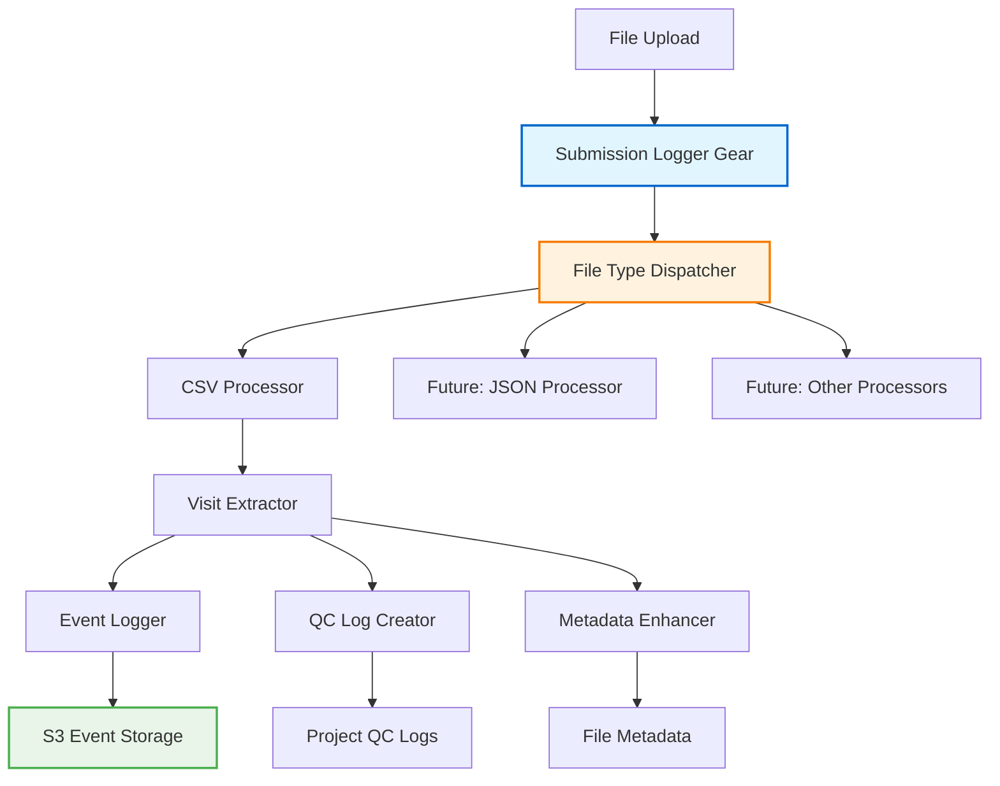

# Submission Logger Gear Design

## Overview

The submission-logger gear implements a Flywheel gear that captures "submit" events when a single file is uploaded to NACC projects. It processes exactly one input file per gear execution, using a dynamic dispatch pattern to support multiple file formats, extracts visit information from the uploaded data, logs submit events to S3, and creates initial QC status logs for downstream pipeline processing.

The design follows established gear patterns from the identifier-lookup gear while integrating with the existing event logging infrastructure. The gear's single-file processing model is clearly reflected in the code structure and metrics to avoid confusion.

## Architecture

### High-Level Architecture



### Component Architecture

The gear leverages existing infrastructure with composition pattern:

1. **SubmissionLoggerVisitor**: Main execution environment extending `GearExecutionEnvironment`
2. **CSVLoggingVisitor**: Existing component from `common.event_logging` for CSV processing and event creation
3. **QCStatusLogCSVVisitor**: New visitor for creating QC status logs during CSV processing
4. **QCStatusLogCreator**: Creates initial QC status logs using `ErrorLogTemplate`
5. **FileVisitAnnotator**: Annotates QC status log files with visit metadata
6. **AggregateCSVVisitor**: Composition pattern to combine multiple CSV visitors
7. **File Type Detection**: Uses existing `InputFileWrapper.validate_file_extension()` for CSV detection

**Key Design Decision**: Use composition over inheritance with `AggregateCSVVisitor` to combine `CSVLoggingVisitor` (for event creation) and `QCStatusLogCSVVisitor` (for QC log creation) without tight coupling.

## Implementation Constraints

### Gear Execution Conventions

The implementation MUST follow established gear execution patterns from the identifier-lookup gear to ensure consistency across the NACC gear ecosystem:

1. **GearEngine Pattern**: The implementation SHALL use `GearEngine.create_with_parameter_store().run(gear_type=SubmissionLoggerVisitor)` for proper parameter store integration
2. **Error Writer Integration**: The implementation SHALL create a `ListErrorWriter` with proper container ID and Flywheel path for error tracking
3. **QC Result Reporting**: The implementation SHALL call `context.metadata.add_qc_result()` with:
    - File input reference: `self.__file_input.file_input`
    - Validation name: `"validation"`
    - State: `"PASS"` if successful, `"FAIL"` if errors occurred
    - Error data: `error_writer.errors().model_dump(by_alias=True)`
4. **File Tagging**: The implementation SHALL call `context.metadata.add_file_tags()` with:
    - File input reference: `self.__file_input.file_input`
    - Tags: `tags=self.__gear_name`
5. **Success Status Tracking**: The main processing function SHALL return a boolean success status for QC result determination
6. **Error Writer Parameter**: The main processing function SHALL accept an `error_writer: ListErrorWriter` parameter for consistent error handling

### S3 Event Logging Conventions

1. **S3BucketInterface Creation**: The implementation SHALL use `S3BucketInterface.create_from_environment(bucket_name)` for S3 bucket access
2. **Bucket Validation**: The implementation SHALL validate S3 bucket access and raise `GearExecutionError` if unavailable
3. **VisitEventLogger Integration**: The implementation SHALL pass the S3BucketInterface directly to `VisitEventLogger(s3_bucket=s3_bucket, environment=environment)`

These conventions ensure consistency with existing gears and proper integration with the Flywheel platform's metadata and error reporting systems.

## Components and Interfaces

### Core Components

```python
# Use existing infrastructure with composition pattern
from event_logging.csv_logging_visitor import CSVLoggingVisitor
from event_logging.event_logging import VisitEventLogger
from nacc_common.error_models import VisitKeys
from configs.ingest_configs import ErrorLogTemplate
from inputs.csv_reader import AggregateCSVVisitor

# Implemented components:
class QCStatusLogCreator:
    """Creates initial QC status logs using ErrorLogTemplate."""
    
    def __init__(self, error_log_template: ErrorLogTemplate, visit_annotator: FileVisitAnnotator):
        self.__template = error_log_template
        self.__visit_annotator = visit_annotator
    
    def create_qc_log(self, visit_keys: VisitKeys, project: ProjectAdaptor, gear_name: str, error_writer: ListErrorWriter) -> bool:
        """Creates QC status log file at project level with visit metadata."""
        # Uses model_dump() for proper Pydantic serialization
        # Maps VisitKeys.date to ErrorLogTemplate.visitdate field
        pass

class QCStatusLogCSVVisitor(CSVVisitor):
    """CSV visitor that creates QC status logs for each visit."""
    
    def __init__(self, qc_log_creator: QCStatusLogCreator, project: ProjectAdaptor, gear_name: str, error_writer: ListErrorWriter):
        self.__qc_log_creator = qc_log_creator
        self.__project = project
        self.__gear_name = gear_name
        self.__error_writer = error_writer
    
    def visit_row(self, row: dict[str, Any], visit_keys: VisitKeys) -> None:
        """Creates QC status log for each CSV row/visit."""
        self.__qc_log_creator.create_qc_log(visit_keys, self.__project, self.__gear_name, self.__error_writer)

class FileVisitAnnotator:
    """Annotates QC status log files with visit metadata."""
    
    def annotate_file(self, file_wrapper: FileWrapper, visit_keys: VisitKeys) -> None:
        """Adds visit metadata to QC status log file.info.visit structure."""
        # Uses VisitKeys.model_dump(exclude_none=True) for proper serialization
        # Stores metadata in file.info.visit structure for individual QC log files

# Architecture uses AggregateCSVVisitor for composition over inheritance
event_visitor = CSVLoggingVisitor(...)
qc_visitor = QCStatusLogCSVVisitor(...)
csv_visitor = AggregateCSVVisitor([event_visitor, qc_visitor])
```

### Main Execution Component

```python
class SubmissionLoggerVisitor(GearExecutionEnvironment):
    """Main gear execution visitor for submission logging."""
    
    def __init__(
        self,
        *,
        client: ClientWrapper,
        file_input: InputFileWrapper,
        gear_name: str,
        event_logger: VisitEventLogger,
        processor_dispatcher: FileProcessorDispatcher,
    ):
        super().__init__(client=client)
        self.__file_input = file_input
        self.__gear_name = gear_name
        self.__event_logger = event_logger
        self.__processor_dispatcher = processor_dispatcher
    
    def run(self, context: GearToolkitContext):
        """Main execution method following identifier-lookup pattern."""
        # Process file using dynamic dispatch
        # Extract visits
        # Log submit events
        # Create QC status logs
        # Enhance file metadata
```

### Actual Processing Logic

```python
class SubmissionLoggerVisitor(GearExecutionEnvironment):
    """Main gear execution visitor using composition pattern."""
    
    def run(self, context: GearToolkitContext):
        """Main execution method using AggregateCSVVisitor composition."""
        
        # 1. Check if file is CSV using existing pattern
        if not self.__file_input.validate_file_extension(["csv"]):
            log.warning(f"Unsupported file type: {self.__file_input.filename}")
            return
        
        # 2. Create event logging visitor
        event_visitor = CSVLoggingVisitor(
            center_label=project.group,
            project_label=project.label,
            gear_name=self.__gear_name,
            event_logger=self.__event_logger,
            module_configs=module_configs,
            error_writer=error_writer,
            timestamp=self.__file_input.file_entry(context).created,
            action="submit",  # Key difference from other uses
            datatype="form"
        )
        
        # 3. Create QC status log visitor
        qc_visitor = QCStatusLogCSVVisitor(
            qc_log_creator=self.__qc_log_creator,
            project=project,
            gear_name=self.__gear_name,
            error_writer=error_writer
        )
        
        # 4. Combine visitors using composition
        csv_visitor = AggregateCSVVisitor([event_visitor, qc_visitor])
        
        # 5. Process CSV file (creates submit events AND QC logs)
        success = run_csv_processing(
            input_file=open(self.__file_input.filepath),
            csv_visitor=csv_visitor,
            error_writer=error_writer
        )
        
        # Note: NO visit metadata is added to uploaded CSV files
```

## Data Models

### Visit Information Model

```python
# Use existing VisitKeys from nacc_common.error_models instead of creating new model
from nacc_common.error_models import VisitKeys

# VisitKeys already provides the core visit identification:
# - ptid: Optional[str] 
# - date: Optional[str] (visit date)
# - module: Optional[str] 
# - visitnum: Optional[str] (visit number)
# - adcid: Optional[int]

# Additional context will be provided by project/gear context
```

### Processing Result Model

```python
class ProcessingResult(BaseModel):
    """Result of file processing operation."""
    visits_found: int
    events_logged: int
    qc_logs_created: int
    errors: List[FileError]
    success: bool
```

## Correctness Properties

*A property is a characteristic or behavior that should hold true across all valid executions of a system-essentially, a formal statement about what the system should do. Properties serve as the bridge between human-readable specifications and machine-verifiable correctness guarantees.*

### Property Analysis

Based on the requirements analysis, the following properties ensure correctness:

**Property 1: Visit Event Creation Completeness**
*For any* uploaded file containing visit data, the number of submit events logged should equal the number of valid visits extracted from the file
**Validates: Requirements 1.2, 2.5**

**Property 2: QC Status Log Creation Consistency**  
*For any* visit identified in an uploaded file, a corresponding QC status log file should be created at the project level using the ErrorLogTemplate naming pattern
**Validates: Requirements 3.1, 3.2**

**Property 3: Event Timestamp Accuracy**
*For any* submit event created, the event timestamp should match the file upload timestamp within acceptable precision bounds
**Validates: Requirements 1.4**

**Property 4: QC Status Log Metadata Enhancement**
*For any* QC status log file created, the file should be annotated with visit metadata in file.info.visit structure while uploaded CSV files remain completely unchanged
**Validates: Requirements 3.4** (Note: Requirements 4.1, 4.2 removed per user request)

**Property 5: Error Handling Robustness**
*For any* processing error encountered, the gear should log detailed error information and continue processing remaining visits without failing execution
**Validates: Requirements 6.1, 6.3, 6.4**

**Property 6: Dynamic Dispatch Correctness**
*For any* supported file type, the dispatcher should select exactly one appropriate processor that can handle that file type
**Validates: Technical Architecture Constraint 1**

**Property 7: Single-File Processing Metrics Consistency**
*For any* processing execution, the metrics should focus on visit-level statistics without misleading file-level counters, since exactly one file is processed per execution
**Validates: Requirements 8.2, 8.3**

**Property 8: Metrics Dictionary Structure**
*For any* metrics dictionary returned by the system, it should contain visit-level metrics (visits_found, visits_processed_successfully, events_created, qc_logs_created) and should not contain file-level counters
**Validates: Requirements 8.1, 8.4**

## Error Handling

### Error Categories

1. **File Access Errors**: File not readable, permissions issues
2. **Format Errors**: Malformed CSV, missing required columns
3. **Data Validation Errors**: Invalid PTID, date formats, missing required fields
4. **Infrastructure Errors**: S3 connectivity, Flywheel API failures
5. **Processing Errors**: Visit extraction failures, event logging failures

### Error Handling Strategy

Following the identifier-lookup pattern:

```python
class SubmissionErrorHandler:
    """Handles errors during submission processing."""
    
    def __init__(self, error_writer: ListErrorWriter):
        self.__error_writer = error_writer
    
    def handle_file_error(self, error: Exception, file_path: Path):
        """Handles file-level errors."""
        # Log error but don't fail gear execution
        # Add to error writer for reporting
    
    def handle_visit_error(self, error: Exception, visit_data: Dict[str, Any]):
        """Handles visit-level errors."""
        # Continue processing other visits
        # Record specific visit error
```

## Testing Strategy

### Unit Testing Approach

- **File Processor Tests**: Test each processor type independently
- **Visit Extraction Tests**: Verify correct parsing of visit data
- **Event Creation Tests**: Validate VisitEvent object creation
- **Error Handling Tests**: Ensure robust error recovery

### Property-Based Testing Approach

Using **Hypothesis** for Python property-based testing:

- **Minimum 100 iterations** per property test
- **Property tags**: Each test tagged with format `**Feature: submission-logger, Property {number}: {property_text}**`
- **Generator strategies**: Smart generators for CSV data, visit information, file paths

**Property Test Examples:**

```python
@given(csv_data=csv_visit_generator())
def test_visit_event_creation_completeness(csv_data):
    """**Feature: submission-logger, Property 1: Visit Event Creation Completeness**"""
    # Generate CSV with known visit count
    # Process through submission logger
    # Assert events_logged == visits_extracted

@given(visit_info=visit_info_generator())
def test_qc_status_log_creation_consistency(visit_info):
    """**Feature: submission-logger, Property 2: QC Status Log Creation Consistency**"""
    # Generate visit information
    # Create QC status log using QCStatusLogCreator
    # Assert file exists with correct ErrorLogTemplate naming
    # Assert QC log file has visit metadata in file.info.visit

@given(processing_execution=processing_execution_generator())
def test_single_file_processing_metrics_consistency(processing_execution):
    """**Feature: submission-logger, Property 7: Single-File Processing Metrics Consistency**"""
    # Generate processing execution with various visit counts
    # Process through submission logger
    # Assert metrics focus on visit-level statistics
    # Assert no misleading file-level counters are present

@given(metrics_data=metrics_data_generator())
def test_metrics_dictionary_structure(metrics_data):
    """**Feature: submission-logger, Property 8: Metrics Dictionary Structure**"""
    # Generate metrics data from processing
    # Get metrics dictionary from ProcessingMetrics
    # Assert contains visit-level keys (visits_found, visits_processed_successfully, etc.)
    # Assert does not contain file-level counters (files_processed)
```

### Integration Testing

- **End-to-End Processing**: Full file upload to event logging pipeline
- **Flywheel Integration**: Test with actual Flywheel project context
- **S3 Integration**: Verify event storage in S3 bucket

## Implementation Plan

### Phase 1: Basic Gear Setup
1. Set up gear execution framework following identifier-lookup pattern
2. Create SubmissionLoggerVisitor extending GearExecutionEnvironment
3. Add file type detection using existing InputFileWrapper.validate_file_extension()

### Phase 2: CSV Processing Integration  
1. Integrate existing CSVLoggingVisitor from common.event_logging
2. Configure CSVLoggingVisitor with action="submit" for submission events
3. Handle ModuleConfigs loading for field validation

### Phase 3: QC Status Log Creation
1. Implement QCStatusLogCreator using ErrorLogTemplate
2. Extract visit information from CSVLoggingVisitor processing
3. Create initial QC status logs at project level

### Phase 4: File Metadata and Testing
1. Add visit metadata to file.info.visit structure  
2. Add property-based tests for correctness validation
3. Integration testing with existing event logging infrastructure

**Key Advantage**: By reusing CSVLoggingVisitor, we eliminate the need to implement CSV parsing, visit extraction, and VisitEvent creation - significantly reducing implementation complexity.
2. Add property-based tests for correctness validation
3. Integration testing with Flywheel and S3 infrastructure

## Configuration

### Gear Configuration Schema

```yaml
config:
  # Event logging configuration
  event_bucket: "nacc-event-logs"
  environment: "prod"  # or "dev"
  
  # Processing configuration  
  supported_formats: ["csv"]
  required_columns: ["ptid", "visitdate"]
  optional_columns: ["visitnum", "packet", "module"]
  
  # Error handling configuration
  continue_on_error: true
  max_errors_per_file: 100
```

### Environment Integration

- **Parameter Store**: AWS credentials and configuration
- **Flywheel Context**: Project and center information
- **S3 Bucket**: Event storage configuration

## Leveraging Existing Infrastructure

### Existing Components to Reuse

1. **CSVLoggingVisitor** (`common.event_logging.csv_logging_visitor`):
   - Already handles CSV parsing and VisitEvent creation
   - Includes proper error handling and field validation
   - Uses ModuleConfigs for required field checking
   - Perfect for submission event logging

2. **VisitKeys Model** (`nacc_common.error_models`):
   - Standard model for visit identification across the system
   - Used by form-scheduler and other gears
   - Provides consistent visit metadata structure

3. **Visit Extraction Functions** (`nacc_common.qc_report`):
   - `extract_visit_keys()` function for parsing visit information
   - Used by form-scheduler for QC log processing
   - Could be enhanced for CSV data extraction

### Potential Code Movement

Consider moving these components from `gear/form_scheduler` to `common`:

1. **Visit Event Creation Functions**:
   - `create_visit_event_from_error()`
   - `create_visit_event_from_status()`
   - `create_visit_event()` - Generic factory function

2. **Event Transformers**:
   - `event_status_transformer()`
   - Could be generalized for different event types

This would allow both submission-logger and form-scheduler to share common event creation logic.

## Dependencies

### External Dependencies
- `flywheel-gear-toolkit`: Gear execution framework
- `common.event_logging`: Event logging infrastructure and CSVLoggingVisitor
- `common.configs.ingest_configs`: ErrorLogTemplate for QC log naming
- `nacc_common.error_models`: VisitKeys model for visit identification
- `gear_execution.gear_execution`: Base execution classes

### Internal Components
- Reuse CSVLoggingVisitor for CSV processing instead of creating new logic
- Leverage existing VisitKeys model instead of creating new visit data structures
- Use established Flywheel adaptor patterns for project interaction

## Deployment Considerations

### Flywheel Integration
- Gear rules configuration for automatic triggering on file uploads
- Project-level permissions for QC log creation
- Integration with existing form processing pipeline

### Monitoring and Observability
- Gear execution logging following established patterns
- Metrics collection for processing statistics
- Error reporting integration with existing monitoring systems