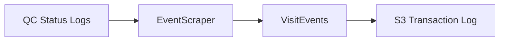

# Design Document: Transactional Event Scraper

## Overview

The Transactional Event Scraper is a Flywheel gear designed to backfill historical event data by analyzing existing QC status log files within a project. It extracts submission and pass-qc events from error logs and generates corresponding VisitEvent objects using the established event capture infrastructure.

The gear operates as a one-time or occasional-use tool to approximate the event capture functionality that will be provided by the identifier-lookup and form-scheduling gears going forward. It leverages existing shared utilities for consistency with future event logging.

## Architecture

The gear follows the standard NACC gear framework with a simple processing pipeline:



### Key Components

- **EventScraper**: Main orchestrator that discovers log files, extracts event data, and captures events
- **LogFileProcessor**: Parses individual QC status log files 
- **EventGenerator**: Creates VisitEvent objects from extracted data
- **VisitEventCapture**: Shared utility for storing events to S3

## Components and Interfaces

### Framework Classes

#### TransactionalEventScraperVisitor
Extends GearExecutionEnvironment to handle gear execution framework integration.

```python
class TransactionalEventScraperVisitor(GearExecutionEnvironment):
    def __init__(
        self,
        client: ClientWrapper,
        event_capture: Optional[VisitEventCapture] = None,
        dry_run: bool = False,
        date_filter: Optional[DateRange] = None
    )
    
    @classmethod
    def create(
        cls,
        context: GearToolkitContext,
        parameter_store: Optional[ParameterStore] = None
    ) -> "TransactionalEventScraperVisitor"
    
    def run(self, context: GearToolkitContext) -> None
```

### Core Business Logic Classes

#### EventScraper
Main orchestrator class that coordinates the scraping process.

```python
class EventScraper:
    def __init__(
        self,
        project: ProjectAdaptor,
        event_capture: Optional[VisitEventCapture] = None,
        dry_run: bool = False,
        date_filter: Optional[DateRange] = None
    )
    
    def scrape_events(self) -> ScrapingResults
```

#### LogFileProcessor
Processes individual QC status log files to extract event data.

```python
class LogFileProcessor:
    def __init__(self, error_log_template: ErrorLogTemplate)
    
    def extract_events(self, log_file: FileEntry) -> List[EventData]
    def parse_visit_metadata(self, log_file: FileEntry) -> Optional[VisitMetadata]
    def determine_qc_status(self, log_file: FileEntry) -> Optional[QCStatus]
```

#### EventGenerator
Creates VisitEvent objects from extracted log data.

```python
class EventGenerator:
    def __init__(self, project: ProjectAdaptor)
    
    def create_submission_event(self, event_data: EventData) -> Optional[VisitEvent]
    def create_pass_qc_event(self, event_data: EventData) -> Optional[VisitEvent]
```

### Data Models

#### EventData
Intermediate data structure for extracted event information.

```python
class EventData(BaseModel):
    log_file: FileEntry
    visit_metadata: VisitMetadata
    qc_status: Optional[QCStatus]
    submission_timestamp: datetime
    qc_completion_timestamp: Optional[datetime]
```

#### ScrapingResults
Summary of scraping operation results.

```python
class ScrapingResults(BaseModel):
    files_processed: int
    submission_events_created: int
    pass_qc_events_created: int
    errors_encountered: int
    skipped_files: int
```

#### DateRange
Optional configuration for filtering files by date.

```python
class DateRange(BaseModel):
    start_date: Optional[datetime] = None
    end_date: Optional[datetime] = None
    
    def includes_file(self, file_timestamp: datetime) -> bool:
        """Check if file timestamp falls within the date range."""
        if self.start_date and file_timestamp < self.start_date:
            return False
        if self.end_date and file_timestamp > self.end_date:
            return False
        return True
```

### Interfaces

#### GearExecutionEnvironment Integration
Uses the standard NACC gear framework:
- **ClientWrapper**: For Flywheel API access through proxy
- **GearToolkitContext**: For configuration and input handling
- **ParameterStore**: For AWS parameter access
- **GearExecutionError**: For error handling and reporting

#### ProjectAdaptor Integration
Uses existing ProjectAdaptor interface for:
- Discovering QC status log files
- Extracting project metadata (pipeline ADCID, center label)
- Accessing file contents and timestamps

#### Event Capture Integration
Uses existing VisitEventCapture interface for:
- Storing events to S3 transaction log
- Maintaining consistent event format and naming

### Configuration Integration

The gear integrates with the existing manifest.json configuration:

```json
{
    "config": {
        "dry_run": {
            "description": "Whether to perform a dry run without capturing events",
            "type": "boolean",
            "default": false
        },
        "event_bucket": {
            "description": "S3 bucket name for event storage",
            "type": "string",
            "default": "nacc-transaction-log"
        },
        "event_environment": {
            "description": "Environment prefix for event storage (prod/dev)",
            "type": "string",
            "default": "prod"
        },
        "start_date": {
            "description": "Start date for filtering files (YYYY-MM-DD format)",
            "type": "string",
            "optional": true
        },
        "end_date": {
            "description": "End date for filtering files (YYYY-MM-DD format)", 
            "type": "string",
            "optional": true
        },
        "apikey_path_prefix": {
            "description": "AWS parameter path prefix for API key",
            "type": "string",
            "default": "/prod/flywheel/gearbot"
        }
    }
}
```

## Data Models

### Visit Metadata Extraction

The scraper extracts visit metadata using the same patterns as existing gears:

1. **From QC Status Log Filename**: Uses ErrorLogTemplate to parse PTID, visit date, and module
2. **From File Custom Info**: Extracts VisitMetadata from file.info.visit if available
3. **From Log Content**: Parses visit information from log entries as fallback

### Event Creation Strategy

#### Submission Events
- **Action**: "submit"
- **Timestamp**: QC status log file creation time
- **Gear Name**: "transactional-event-scraper"
- **Metadata**: Extracted from log filename and project context

#### Pass-QC Events
- **Action**: "pass-qc"
- **Timestamp**: QC status log file modification time
- **Condition**: Only created when overall QC status is PASS
- **Gear Name**: "transactional-event-scraper"

### Project Context Extraction

Uses PipelineLabel parsing to extract:
- Study ID
- Datatype (form, dicom, etc.)
- Pipeline stage information

## Error Handling

### Resilient Processing
- Continue processing remaining files when individual files fail
- Log errors with sufficient detail for debugging
- Provide summary statistics of successes and failures

### Error Categories
1. **File Access Errors**: Log file cannot be read
2. **Parsing Errors**: Log content or metadata is malformed
3. **Validation Errors**: Extracted data fails validation
4. **Event Creation Errors**: VisitEvent creation fails
5. **Capture Errors**: Event storage to S3 fails

### Fallback Strategies
- Use file modification time when creation time unavailable
- Skip events when required metadata is missing
- Continue processing when non-critical errors occur

## Testing Strategy

### Unit Tests
- Test individual component functionality
- Mock external dependencies (S3, Flywheel API)
- Verify error handling and edge cases
- Test configuration parsing and validation

### Integration Tests
- Test end-to-end scraping workflow
- Use test projects with known QC status logs
- Verify event creation and storage
- Test with various project configurations

### Property-Based Tests
Property-based testing will validate universal correctness properties across randomized inputs to ensure robust behavior.

*A property is a characteristic or behavior that should hold true across all valid executions of a system-essentially, a formal statement about what the system should do. Properties serve as the bridge between human-readable specifications and machine-verifiable correctness guarantees.*

## Correctness Properties

### Converting EARS to Properties

Based on the prework analysis, the following core properties ensure the scraper operates correctly:

**Property 1: Complete File Processing**
*For any* project containing QC status log files, the Event_Scraper should discover and process all QC status log files that match the configured date range
**Validates: Requirements 1.1, 7.1, 7.2**

**Property 2: Event Creation from Valid Logs**
*For any* valid QC status log with submission or PASS status entries, the Event_Scraper should create corresponding VisitEvent objects with all required fields populated
**Validates: Requirements 2.1, 2.2, 2.4**

**Property 3: Timestamp Extraction**
*For any* QC status log file, the Event_Scraper should use file creation time for submission events and file modification time for pass-qc events
**Validates: Requirements 4.1, 4.2**

**Property 4: Error Resilience**
*For any* batch of QC status log files containing some malformed files, the Event_Scraper should continue processing remaining valid files and provide accurate summary statistics
**Validates: Requirements 1.4, 6.2, 6.4**

**Property 5: Dry Run Behavior**
*For any* scraping operation in dry-run mode, the Event_Scraper should log what events would be created without actually capturing them to S3
**Validates: Requirements 7.3**