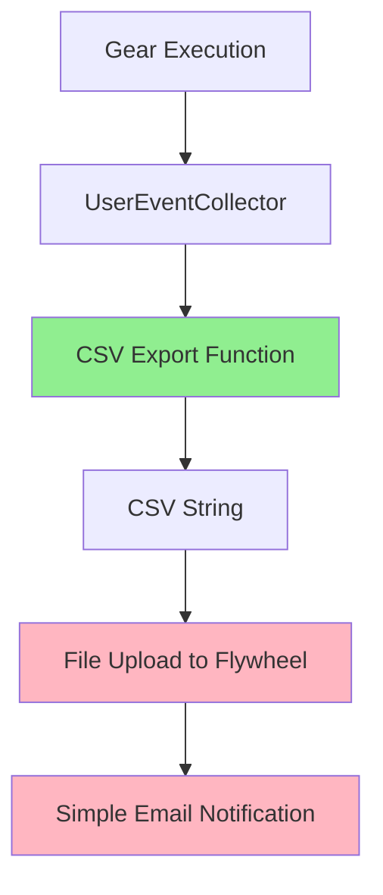

# Design Document: User Error CSV Export

## Overview

This design refactors the user error handling system in the pull-directory and user-management gears to replace complex AWS SES email templates with a simpler approach: exporting errors to CSV files stored in Flywheel and sending simple notification emails.

### Current System

The current implementation uses:
- `UserEventCollector` to accumulate errors during gear execution
- `UserEventNotificationGenerator` to send errors via AWS SES templates
- `ConsolidatedNotificationData` model for template rendering
- Complex batching logic to handle large error sets within SES limits
- The "error-consolidated" SES template for formatting emails

### New System

The new implementation will:
- Export `UserEventCollector` errors to CSV format using a reusable function
- Save CSV files to Flywheel in the same project as input files
- Send simple notification emails without complex templates
- Maintain all error information currently captured
- Simplify the codebase by removing template complexity

### Design Goals

1. **Simplicity**: Replace complex template system with straightforward CSV export
2. **Accessibility**: Store errors in human-readable CSV format for spreadsheet tools
3. **Traceability**: Keep error files alongside input files in Flywheel
4. **Consistency**: Use the same approach in both gears
5. **Completeness**: Preserve all error information from the current system

## Architecture

### Component Overview



**Legend:**
- Green: New common library function
- Pink: Gear-specific logic (in run.py)

### Separation of Concerns

**Common Library (`common/src/python/users/`):**
- CSV export function (reusable across gears)
- Error data models (existing `UserEventCollector`, `UserProcessEvent`)

**Gear-Specific (`gear/*/src/python/*/run.py`):**
- File upload logic using gear context
- Email notification sending
- Integration with gear execution flow

This separation ensures:
- CSV export logic is reusable and testable
- File operations use gear-specific context (required for Flywheel API)
- Each gear maintains control over its file management

## Components and Interfaces

### 1. CSV Export Function

**Location:** `common/src/python/users/csv_export.py`

**Function Signature:**
```python
def export_errors_to_csv(collector: UserEventCollector) -> str:
    """Export errors from UserEventCollector to CSV format.
    
    Args:
        collector: The UserEventCollector containing errors
        
    Returns:
        CSV-formatted string with all error information
        
    Raises:
        ValueError: If collector is empty or invalid
    """
```

**CSV Format:**

The CSV will have the following columns (in order):
1. `email` - User email address
2. `name` - User full name
3. `center_id` - Center identifier (may be empty)
4. `registry_id` - Registry identifier (may be empty)
5. `auth_email` - Authentication email (may be empty)
6. `category` - Human-readable category name (from EventCategory enum)
7. `message` - Error message text
8. `action_needed` - Recommended action (may be empty)
9. `timestamp` - ISO 8601 formatted timestamp
10. `event_id` - Unique identifier for the event

**Implementation Notes:**
- Use Python's `csv` module with `csv.DictWriter`
- Set `quoting=csv.QUOTE_MINIMAL` to handle special characters
- Use `lineterminator='\n'` for consistent line endings
- Convert `None` values to empty strings
- Format timestamps using `.isoformat()`
- Extract category value using `category.value` from enum

**Example Output:**
```csv
email,name,center_id,registry_id,auth_email,category,message,action_needed,timestamp,event_id
user@example.com,John Doe,42,,user@auth.com,Unclaimed Records,User record not claimed in directory,Contact user to claim record,2024-01-15T10:30:00,abc-123
jane@example.com,Jane Smith,,,jane@example.com,Missing Directory Data,Missing required directory information,Update directory entry,2024-01-15T10:31:00,def-456
```

### 2. File Upload Integration

**Location:** Gear-specific `run.py` files

**Approach:**

Both gears already use `context.open_output()` for file writing. This method:
- Writes files to the gear's output directory
- Automatically uploads files to the Flywheel destination
- Handles file naming and path management

**Implementation Pattern:**
```python
# In gear run() method, after processing
if collector.has_errors():
    # Generate CSV content
    csv_content = export_errors_to_csv(collector)
    
    # Determine error filename (gear-specific)
    # For user-management: derive from input file
    # For pull-directory: use fixed name
    error_filename = determine_error_filename()  # Gear-specific logic
    
    # Write CSV to Flywheel using gear context
    with context.open_output(error_filename, mode="w", encoding="utf-8") as error_file:
        error_file.write(csv_content)
    
    log.info(f"Wrote {collector.error_count()} errors to {error_filename}")
```

**File Naming by Gear:**

**user-management gear:**
- Derives filename from input file
- Input: `users.yaml` → Error file: `users-errors.csv`
- Input: `directory-2024-01.yaml` → Error file: `directory-2024-01-errors.csv`

**pull-directory gear:**
- Uses fixed filename (no input file exists)
- Error file: `directory-pull-errors.csv`

**Rationale for Different Naming:**
- `pull-directory` has no input file (pulls from REDCap), so uses a fixed descriptive name
- `user-management` has an input file, so derives the error filename to match
- This avoids naming conflicts since `pull-directory` output becomes `user-management` input

### 3. Simple Email Notification

**Location:** Gear-specific `run.py` files

**Approach:**

Replace the complex `UserEventNotificationGenerator.send_event_notification()` call with a simple email using the existing `EmailClient`.

**Implementation Pattern:**
```python
# After writing error CSV
if support_emails:
    email_client = EmailClient(
        client=create_ses_client(),
        source=email_source
    )
    
    # Build simple notification message
    subject = f"[{gear_name}] User Processing Errors"
    body = f"""User processing completed with {collector.error_count()} errors.

Error details have been saved to: {error_filename}

Location: {context.config.destination['type']} {context.config.destination['id']}

To access the error file:
1. Navigate to the project in Flywheel
2. Look for the file: {error_filename}
3. Download and review the errors in a spreadsheet application

Affected users: {len(collector.get_affected_users())}

Error breakdown by category:
{format_category_breakdown(collector.count_by_category())}
"""
    
    # Send simple text email (no template)
    email_client.send_simple_email(
        to_addresses=support_emails,
        subject=subject,
        body=body
    )
```

**Note:** The `EmailClient` may need a new `send_simple_email()` method if it doesn't already exist. This method would send plain text emails without templates.

### 4. Integration Points

**pull-directory gear:**
- Current: Writes YAML output using `context.open_output()`
- New: After YAML write, if errors exist, write CSV using same pattern
- Location: `gear/pull_directory/src/python/directory_app/run.py`

**user-management gear:**
- Current: Sends notification at end of `run()` method
- New: Write CSV before sending notification, update notification content
- Location: `gear/user_management/src/python/user_app/run.py`

## Data Models

### Existing Models (No Changes Required)

**UserProcessEvent:**
```python
class UserProcessEvent(BaseModel):
    event_id: str
    timestamp: datetime
    event_type: EventType
    category: EventCategory
    user_context: UserContext
    message: str
    action_needed: Optional[str]
```

**UserContext:**
```python
class UserContext(BaseModel):
    email: str
    name: str
    center_id: Optional[int]
    registry_id: Optional[str]
    auth_email: Optional[str]
```

**UserEventCollector:**
- Provides `get_errors()` to retrieve all error events
- Provides `get_errors_by_category()` for categorized access
- Provides `count_by_category()` for summary statistics
- Provides `get_affected_users()` for user list

### CSV Row Mapping

Each `UserProcessEvent` maps to one CSV row:

| CSV Column | Source | Transformation |
|------------|--------|----------------|
| email | event.user_context.email | Direct |
| name | event.user_context.name | Direct |
| center_id | event.user_context.center_id | str() or "" if None |
| registry_id | event.user_context.registry_id | Direct or "" if None |
| auth_email | event.user_context.auth_email | Direct or "" if None |
| category | event.category | .value (enum to string) |
| message | event.message | Direct (CSV escaping handled by csv module) |
| action_needed | event.action_needed | Direct or "" if None |
| timestamp | event.timestamp | .isoformat() |
| event_id | event.event_id | Direct |

## Error Handling

### CSV Export Errors

**Empty Collector:**
- Check: `if not collector.has_errors()`
- Action: Skip CSV export and notification
- Log: Info-level message "No errors to export"

**CSV Generation Failure:**
- Catch: `Exception` during CSV writing
- Action: Log error, continue gear execution
- Rationale: Don't fail the entire gear run if error reporting fails

**Special Characters in Data:**
- Handled by: Python `csv` module with `QUOTE_MINIMAL`
- Newlines in messages: Automatically quoted by csv module
- Commas in messages: Automatically quoted by csv module

### File Upload Errors

**Upload Failure:**
- Catch: Exceptions from `context.open_output()`
- Action: Log error with details
- Fallback: Continue to send email notification (mention upload failure)

**Filename Conflicts:**
- Behavior: `context.open_output()` overwrites existing files
- Acceptable: Each gear run should produce fresh error file

### Email Notification Errors

**Send Failure:**
- Catch: `ClientError` from SES
- Action: Log error with details
- Rationale: Don't fail gear run if notification fails
- Current behavior: Same as existing implementation

**Missing Configuration:**
- Check: `if not support_emails`
- Action: Log warning, skip notification
- Current behavior: Same as existing implementation

## Testing Strategy

### Unit Tests

**CSV Export Function:**
- Test with single error event
- Test with multiple error events across categories
- Test with None/empty optional fields
- Test with special characters in messages (commas, quotes, newlines)
- Test with empty collector (should raise ValueError)
- Test timestamp formatting
- Test category enum conversion

**File Upload Integration:**
- Test filename generation from various input filenames
- Test CSV content written to context.open_output()
- Mock context.open_output() to verify calls

**Email Notification:**
- Test email content formatting
- Test with various error counts
- Test category breakdown formatting
- Mock email client to verify calls

### Integration Tests

**End-to-End Flow:**
- Create collector with sample errors
- Export to CSV
- Verify CSV content matches input errors
- Verify all fields present and correctly formatted

**Gear Integration:**
- Test pull-directory gear with errors
- Test user-management gear with errors
- Verify CSV files created in output
- Verify notification emails sent (mocked)

### Property-Based Tests

Property-based tests will be defined in the Correctness Properties section below.


## Correctness Properties

*A property is a characteristic or behavior that should hold true across all valid executions of a system—essentially, a formal statement about what the system should do. Properties serve as the bridge between human-readable specifications and machine-verifiable correctness guarantees.*

### Property 1: CSV Export Round-Trip Preservation

*For any* UserEventCollector containing errors, when errors are exported to CSV and parsed back, all essential error information (event_id, timestamp, category, email, name, message) should be preserved.

**Validates: Requirements 1.1, 1.2, 1.3, 5.1**

### Property 2: None Field Representation

*For any* UserProcessEvent with None or empty optional fields (center_id, registry_id, auth_email, action_needed), the CSV export should represent these fields as empty strings in the output.

**Validates: Requirements 1.5**

### Property 3: Error Filename Generation Pattern

*For any* input filename, the generated error filename should follow the pattern `{basename}-errors.csv` where basename is the input filename without its extension.

**Validates: Requirements 2.2**

### Property 4: Notification Sent for Errors

*For any* UserEventCollector containing at least one error, the gear should send an error notification to configured support email addresses.

**Validates: Requirements 3.1**

### Property 5: Notification Content Completeness

*For any* error notification generated, the notification content should include the gear name, total error count, error CSV filename, and Flywheel location information.

**Validates: Requirements 3.2, 3.3, 3.4, 3.5**

### Property 6: Consistent CSV Format Across Gears

*For any* identical UserEventCollector, both pull-directory and user-management gears should produce CSV output with identical structure and content.

**Validates: Requirements 4.6**

### Property 7: Category Enum String Conversion

*For any* UserProcessEvent with an EventCategory, the CSV export should contain the category's human-readable string value (from category.value), not the enum name.

**Validates: Requirements 5.2**

### Property 8: ISO 8601 Timestamp Formatting

*For any* UserProcessEvent with a timestamp, the CSV export should format the timestamp in ISO 8601 format (using .isoformat()).

**Validates: Requirements 5.3**

### Property 9: Special Character Handling

*For any* UserProcessEvent with special characters (commas, quotes, newlines) in the message or other text fields, the CSV export should preserve the data without corruption and produce valid CSV output.

**Validates: Requirements 5.5**

