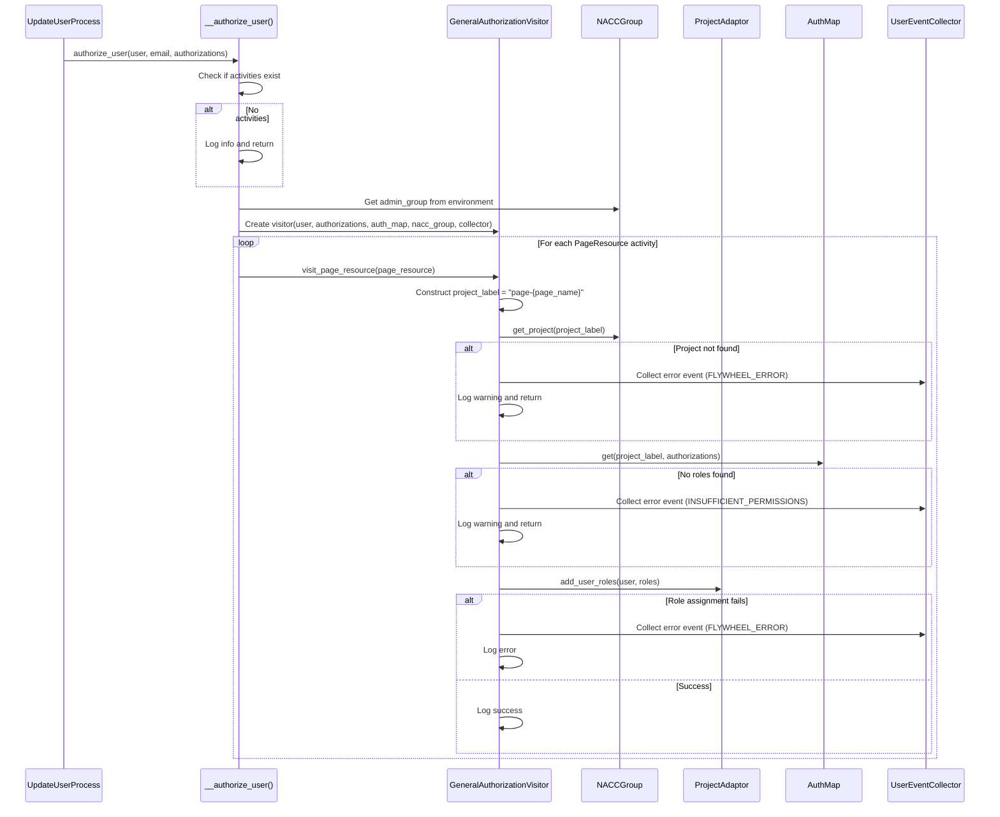

# Design Document: General Authorization Support

## Overview

This design implements general authorization support in the user management gear to enable users to receive Flywheel project access for general (non-center-specific) resources such as ADRC Portal pages. The ADRC Portal uses Flywheel's authorization system where stub projects are created manually in the nacc admin group, and users are granted roles on these stub projects to control access to portal pages. The portal checks Flywheel permissions on these projects to determine access.

The implementation leverages existing infrastructure:
- `UserProcessEnvironment.admin_group` property (provides access to NACCGroup)
- `NACCGroup.get_project()` method (inherited from CenterAdaptor)
- `PageProjectMetadata` class (already exists in center metadata)
- Visitor pattern established by `CenterAuthorizationVisitor`

The main work involves:
1. Implementing the empty `UpdateUserProcess.__authorize_user()` method
2. Creating a new `GeneralAuthorizationVisitor` class following the existing visitor pattern

### Key Design Decisions

1. **Visitor Pattern**: Follow the established visitor pattern used by `CenterAuthorizationVisitor` for consistency and maintainability
2. **Error Handling**: Continue processing on errors (missing projects, missing roles, role assignment failures) to ensure one failure doesn't block other authorizations
3. **Event Collection**: Collect detailed error events for notification and troubleshooting using the existing `UserEventCollector` infrastructure
4. **Separation of Concerns**: Keep general authorization logic separate from center authorization logic while sharing common patterns

## Architecture

### Component Interaction Flow



### Integration with User Processing Flow

The general authorization method integrates into the existing user processing flow:

1. `UserProcess` splits entries into active/inactive queues
2. `ActiveUserProcess` splits into claimed/unclaimed queues
3. `ClaimedUserProcess` creates Flywheel users and queues for update
4. `UpdateUserProcess.visit()` is called for each active user entry:
   - Finds or creates Flywheel user
   - **Calls `__authorize_user()` for general authorizations** (NEW)
   - Updates user email
   - Queues center users for center authorization
5. `UpdateCenterUserProcess` handles center-specific authorizations

## Components and Interfaces

### 1. UpdateUserProcess.__authorize_user()

**Location**: `common/src/python/users/user_processes.py` (line 348)

**Purpose**: Apply general authorizations to users for non-center-specific resources

**Signature**:
```python
def __authorize_user(
    self, *, user: User, email: str, authorizations: Authorizations
) -> None:
    """Applies authorizations to give access to general resources.
    
    Args:
        user: The Flywheel user object
        email: The user's email address
        authorizations: The general authorizations containing page activities
    """
```

**Implementation Logic**:
1. Check if `authorizations.activities` is empty
   - If empty: log info message and return early
2. Retrieve `admin_group` from `self.__env.admin_group`
3. Create `GeneralAuthorizationVisitor` with:
   - user
   - authorizations
   - `self.__env.authorization_map`
   - admin_group (NACCGroup)
   - `self.collector` (UserEventCollector)
4. Iterate through `authorizations.activities.values()`
5. For each activity with a `PageResource`:
   - Call `visitor.visit_page_resource(activity.resource)`
6. Handle any unexpected exceptions by logging error

**Error Handling**:
- Empty activities: Log info, return early (not an error)
- Exceptions from visitor: Log error, continue processing (don't raise)

### 2. GeneralAuthorizationVisitor

**Location**: `common/src/python/users/authorization_visitor.py` (new class)

**Purpose**: Visitor class that applies general authorizations to users following the established visitor pattern

**Class Definition**:
```python
class GeneralAuthorizationVisitor:
    """Assigns roles to a user for general (non-center) resources based on authorizations.
    
    Follows the visitor pattern established by CenterAuthorizationVisitor.
    Handles page resources by assigning roles on page projects in the nacc admin group.
    """
    
    def __init__(
        self,
        user: User,
        authorizations: Authorizations,
        auth_map: AuthMap,
        nacc_group: NACCGroup,
        collector: UserEventCollector,
    ) -> None:
        """Initialize the general authorization visitor.
        
        Args:
            user: The Flywheel user to authorize
            authorizations: The general authorizations containing activities
            auth_map: The authorization map for looking up roles
            nacc_group: The NACC admin group containing page projects
            collector: Event collector for error tracking
        """
        self.__user = user
        self.__authorizations = authorizations
        self.__auth_map = auth_map
        self.__nacc_group = nacc_group
        self.__collector = collector
```

**Methods**:

#### visit_page_resource()

```python
def visit_page_resource(self, page_resource: PageResource) -> None:
    """Assigns user roles for a page resource.
    
    Constructs the project label as "page-{page_name}", retrieves the project
    from the NACC admin group, queries the authorization map for roles, and
    assigns the roles to the user.
    
    Args:
        page_resource: The page resource to process
    """
```

**Implementation Logic**:
1. Construct `project_label = f"page-{page_resource.name}"`
2. Call `project = self.__nacc_group.get_project(project_label)`
3. If project is None:
   - Log warning: `f"Page project not found: {self.__nacc_group.id}/{project_label}"`
   - Create error event with category `FLYWHEEL_ERROR`
   - Call `self.__collector.collect(error_event)`
   - Return early
4. Create a temporary `StudyAuthorizations` object with study_id="general" and the activities from `self.__authorizations`
5. Call `roles = self.__auth_map.get(project_label=project_label, authorizations=study_authorizations)`
6. If roles is empty:
   - Log warning: `f"No roles found for user {self.__user.id} in page project {project_label}"`
   - Create error event with category `INSUFFICIENT_PERMISSIONS`
   - Call `self.__collector.collect(error_event)`
   - Return early
7. Try to call `project.add_user_roles(user=self.__user, roles=roles)`
8. On success:
   - Log info: `f"Added roles for user {self.__user.id} to page project {self.__nacc_group.id}/{project_label}"`
9. On `ProjectError`:
   - Log error with exception details
   - Create error event with category `FLYWHEEL_ERROR`
   - Call `self.__collector.collect(error_event)`

**Error Event Creation**:

For missing project:
```python
error_event = UserProcessEvent(
    event_type=EventType.ERROR,
    category=EventCategory.FLYWHEEL_ERROR,
    user_context=UserContext(
        email=self.__user.email,
        name=self.__user.firstname + " " + self.__user.lastname if self.__user.firstname else "Unknown",
        registry_id=self.__user.id,
    ),
    message=f"Page project not found: {self.__nacc_group.id}/{project_label}",
    action_needed="create_page_project_or_update_authorization_config",
)
```

For missing roles:
```python
error_event = UserProcessEvent(
    event_type=EventType.ERROR,
    category=EventCategory.INSUFFICIENT_PERMISSIONS,
    user_context=UserContext(
        email=self.__user.email,
        name=self.__user.firstname + " " + self.__user.lastname if self.__user.firstname else "Unknown",
        registry_id=self.__user.id,
    ),
    message=f"No roles found for user {self.__user.id} in page project {project_label}",
    action_needed="update_authorization_map_for_page_project",
)
```

For role assignment failure:
```python
error_event = UserProcessEvent(
    event_type=EventType.ERROR,
    category=EventCategory.FLYWHEEL_ERROR,
    user_context=UserContext(
        email=self.__user.email,
        name=self.__user.firstname + " " + self.__user.lastname if self.__user.firstname else "Unknown",
        registry_id=self.__user.id,
    ),
    message=f"Failed to assign roles to page project {project_label}: {str(error)}",
    action_needed="check_flywheel_permissions_and_project_state",
)
```

### 3. Integration Points

#### UserProcessEnvironment.admin_group

**Location**: `common/src/python/users/user_process_environment.py` (line 147-149)

**Status**: Already exists

**Type**: Property returning `NACCGroup`

**Usage**: Accessed via `self.__env.admin_group` in `UpdateUserProcess`

#### NACCGroup.get_project()

**Location**: Inherited from `CenterAdaptor`

**Signature**: `def get_project(self, label: str) -> Optional[ProjectAdaptor]`

**Usage**: Called by `GeneralAuthorizationVisitor` to retrieve page projects

**Returns**: `ProjectAdaptor` if project exists, `None` otherwise

#### AuthMap.get()

**Location**: `common/src/python/users/authorizations.py`

**Signature**: `def get(self, *, project_label: str, authorizations: StudyAuthorizations) -> list[RoleOutput]`

**Usage**: Called by `GeneralAuthorizationVisitor` to retrieve roles for a page project

**Note**: Requires `StudyAuthorizations` object, so we create a temporary one with study_id="general"

#### UserEventCollector

**Location**: `common/src/python/users/event_models.py`

**Usage**: Passed to `GeneralAuthorizationVisitor` constructor, used to collect error events

**Methods Used**:
- `collect(event: UserProcessEvent)`: Add an error event to the collection

## Data Models

### Authorizations

**Location**: `common/src/python/users/authorizations.py`

**Structure**:
```python
class Authorizations(BaseModel):
    activities: Activities = Activities()
```

**Usage**: Contains the activities dictionary mapping `Resource` to `Activity`

### PageResource

**Location**: `common/src/python/users/authorizations.py`

**Structure**:
```python
class PageResource(Resource):
    page: str
    
    @property
    def name(self) -> str:
        return self.page
```

**String Format**: `"page-{page_name}"` (e.g., "page-web")

### Activity

**Location**: `common/src/python/users/authorizations.py`

**Structure**:
```python
class Activity(BaseModel):
    resource: Resource
    action: ActionType  # Literal["submit-audit", "view"]
```

**Usage**: Represents an authorization activity (e.g., "view-page-web")

### StudyAuthorizations

**Location**: `common/src/python/users/authorizations.py`

**Structure**:
```python
class StudyAuthorizations(Authorizations):
    study_id: str
    activities: Activities
```

**Usage**: Required by `AuthMap.get()` method. For general authorizations, we create a temporary instance with `study_id="general"` and copy the activities from the general `Authorizations` object.

### UserProcessEvent

**Location**: `common/src/python/users/event_models.py`

**Structure**:
```python
class UserProcessEvent(BaseModel):
    event_id: str
    timestamp: datetime
    event_type: EventType  # SUCCESS or ERROR
    category: EventCategory
    user_context: UserContext
    message: str
    action_needed: Optional[str] = None
```

**Categories Used**:
- `EventCategory.FLYWHEEL_ERROR`: For missing projects and role assignment failures
- `EventCategory.INSUFFICIENT_PERMISSIONS`: For missing authorization map entries

### UserContext

**Location**: `common/src/python/users/event_models.py`

**Structure**:
```python
class UserContext(BaseModel):
    email: str
    name: str = "Unknown"
    center_id: Optional[int] = None
    registry_id: Optional[str] = None
    auth_email: Optional[str] = None
```

**Usage**: Provides user context information for error events

## Correctness Properties

*A property is a characteristic or behavior that should hold true across all valid executions of a system-essentially, a formal statement about what the system should do. Properties serve as the bridge between human-readable specifications and machine-verifiable correctness guarantees.*


### Property Reflection

After analyzing all acceptance criteria, I identified the following redundancies:

**Redundant Properties to Remove:**
1. Properties 6.1, 7.1 - Redundant with 2.5, 2.8, and specific logging examples (5.2, 5.3)
2. Properties 6.4, 7.4, 8.5 - All redundant with 4.4 (error resilience across users)
3. Properties 7.3, 8.4, 9.3 - All redundant with 6.3 (error resilience within user)
4. Property 10.2 - Redundant with 4.2 (call sequence)
5. Property 11.1 - Redundant with 2.1 (constructor parameters)
6. Properties 11.2, 11.4, 11.6 - Redundant with 6.2, 7.2, 8.3 (error event creation with categories)

**Properties to Combine:**
1. Combine 11.3, 11.5, 11.7 into a single comprehensive property about error event content
2. Combine 1.3, 1.4, 1.5, 1.6 into a single property about visitor creation and activity processing
3. Combine 2.3, 2.4 into a single property about project label construction and retrieval
4. Combine 2.7, 2.10 into a single property about role lookup and assignment
5. Combine 9.1, 9.2, 9.4 into a single property about processing multiple page resources

**Final Property Set:**
After reflection, the unique, non-redundant properties are:
- Property 1: General authorization method is called for active users with authorizations
- Property 2: Empty authorizations are handled gracefully (example)
- Property 3: Visitor is created and processes all page resource activities
- Property 4: Project label is constructed and project is retrieved
- Property 5: Roles are looked up and assigned to projects
- Property 6: Missing projects are handled gracefully with error events
- Property 7: Missing roles are handled gracefully with error events
- Property 8: Role assignment failures are handled gracefully with error events
- Property 9: Error events contain required user context and descriptive information
- Property 10: Error events are collected and available for notifications
- Property 11: Processing continues after errors (error resilience)
- Property 12: Multiple page resources are processed independently
- Property 13: General authorization occurs before center authorization
- Property 14: Same authorization map is used for general and center authorization

### Property 1: General Authorization Method Invocation

*For any* active user entry with general authorizations, when the UpdateUserProcess processes the entry, the general authorization method should be called with the user, email, and authorizations.

**Validates: Requirements 1.1, 4.1, 4.2, 4.3**

### Property 2: Visitor Creation and Activity Processing

*For any* user and authorizations with page resource activities, when the general authorization method is called, it should create a GeneralAuthorizationVisitor and process each page resource activity by calling the visitor's visit_page_resource method.

**Validates: Requirements 1.3, 1.4, 1.5, 1.6**

### Property 3: Project Label Construction and Retrieval

*For any* page resource, when the visitor processes it, the project label should be constructed as "page-{page_name}" and the project should be retrieved from the NACC admin group using that label.

**Validates: Requirements 2.3, 2.4**

### Property 4: Role Lookup and Assignment

*For any* page project that exists, when the visitor processes it, roles should be queried from the authorization map using the project label and authorizations, and if roles exist, they should be assigned to the user on the project.

**Validates: Requirements 2.7, 2.10**

### Property 5: Missing Project Error Handling

*For any* page resource where the project does not exist, when the visitor processes it, an error event with category FLYWHEEL_ERROR should be collected, and processing should continue without raising an exception.

**Validates: Requirements 2.5, 2.6, 6.2, 6.3**

### Property 6: Missing Roles Error Handling

*For any* page project where the authorization map returns no roles, when the visitor processes it, an error event with category INSUFFICIENT_PERMISSIONS should be collected, and processing should continue without raising an exception.

**Validates: Requirements 2.8, 2.9, 7.2**

### Property 7: Role Assignment Failure Error Handling

*For any* page project where role assignment raises a ProjectError, when the visitor processes it, an error event with category FLYWHEEL_ERROR should be collected, and processing should continue without raising an exception.

**Validates: Requirements 2.12, 8.1, 8.3**

### Property 8: Error Event Content Completeness

*For any* error event created by the GeneralAuthorizationVisitor, the event should include user context (email, name, registry_id), project label, descriptive message, and action_needed field.

**Validates: Requirements 11.3, 11.5, 11.7, 11.10**

### Property 9: Error Event Collection

*For any* error event created during general authorization processing, the event should be added to the UserEventCollector via the collect() method and be retrievable after processing completes.

**Validates: Requirements 11.8, 11.9**

### Property 10: Error Resilience Across Users

*For any* error encountered during general authorization for one user, processing should continue for all remaining users in the queue without raising an exception.

**Validates: Requirements 4.4, 6.4, 7.4, 8.5**

### Property 11: Multiple Page Resources Processing

*For any* user with multiple page resource activities, when general authorization is processed, each page resource should be processed independently, and role assignment should be attempted for each corresponding page project.

**Validates: Requirements 9.1, 9.2, 9.4**

### Property 12: Authorization Sequence

*For any* active user entry, when the UpdateUserProcess processes it, general authorization should be called before center authorization processing begins.

**Validates: Requirements 10.3**

### Property 13: Shared Authorization Map

*For any* user processing session, the authorization map instance used for general authorization should be the same instance used for center authorization processing.

**Validates: Requirements 10.4**

## Error Handling

### Error Categories

The implementation uses three error categories from `EventCategory` enum:

1. **FLYWHEEL_ERROR**: Used for infrastructure issues
   - Missing page projects in the NACC admin group
   - Role assignment failures (ProjectError exceptions)

2. **INSUFFICIENT_PERMISSIONS**: Used for configuration issues
   - Missing authorization map entries for page projects
   - No roles defined for user's activities

3. **MISSING_DIRECTORY_DATA**: Used for data quality issues (existing category, not used in this feature)

### Error Handling Strategy

**Principle**: Never stop processing due to errors. Collect detailed error information for notification and troubleshooting.

**Implementation**:

1. **Missing Page Projects**:
   - Log warning with group ID and project label
   - Create error event with category FLYWHEEL_ERROR
   - Collect event via UserEventCollector
   - Return early from visit_page_resource()
   - Continue processing next page resource

2. **Missing Authorization Map Entries**:
   - Log warning with user ID and project label
   - Create error event with category INSUFFICIENT_PERMISSIONS
   - Collect event via UserEventCollector
   - Return early from visit_page_resource()
   - Continue processing next page resource

3. **Role Assignment Failures**:
   - Catch ProjectError exception
   - Log error with exception details
   - Create error event with category FLYWHEEL_ERROR
   - Collect event via UserEventCollector
   - Continue processing next page resource

4. **Empty Authorizations**:
   - Log informational message (not an error)
   - Return early from __authorize_user()
   - No error event collected

5. **Unexpected Exceptions**:
   - Caught by UserQueue.apply() in base processing
   - Logged with full stack trace
   - Processing continues with next user

### Error Event Structure

All error events follow this structure:

```python
UserProcessEvent(
    event_type=EventType.ERROR,
    category=EventCategory.{FLYWHEEL_ERROR|INSUFFICIENT_PERMISSIONS},
    user_context=UserContext(
        email=user.email,
        name=f"{user.firstname} {user.lastname}",
        registry_id=user.id,
    ),
    message="Descriptive error message with context",
    action_needed="suggested_action_for_resolution",
)
```

### Logging Levels

- **INFO**: Successful operations, empty authorizations
- **WARNING**: Missing projects, missing authorization map entries
- **ERROR**: Role assignment failures, unexpected exceptions

### Error Recovery

No automatic error recovery is implemented. Errors are collected and reported for manual intervention:

1. Missing projects: Administrator must create page projects or update configuration
2. Missing roles: Administrator must update authorization map YAML file
3. Role assignment failures: Administrator must check Flywheel permissions and project state

## Testing Strategy

### Dual Testing Approach

The implementation requires both unit tests and property-based tests:

**Unit Tests**: Verify specific examples, edge cases, and error conditions
- Specific log message content
- Constructor parameter validation
- Error event structure validation
- Integration points between components

**Property Tests**: Verify universal properties across all inputs
- Authorization method invocation for all active users
- Visitor creation and activity processing
- Error resilience across different error scenarios
- Multiple page resources processing

### Unit Test Coverage

**UpdateUserProcess.__authorize_user() Tests**:
1. Test with empty authorizations (logs info, returns early)
2. Test with page resource authorizations (creates visitor, processes activities)
3. Test with multiple page resource activities (processes all)
4. Test admin_group property access
5. Test visitor creation with correct parameters
6. Test error handling (exceptions don't propagate)

**GeneralAuthorizationVisitor Tests**:
1. Test constructor with all required parameters
2. Test visit_page_resource with valid project (assigns roles)
3. Test visit_page_resource with missing project (collects error event, continues)
4. Test visit_page_resource with missing roles (collects error event, continues)
5. Test visit_page_resource with role assignment failure (collects error event, continues)
6. Test project label construction (format: "page-{page_name}")
7. Test get_project call with constructed label
8. Test auth_map.get() call with project label and authorizations
9. Test add_user_roles call with user and roles
10. Test error event creation with correct category (FLYWHEEL_ERROR, INSUFFICIENT_PERMISSIONS)
11. Test error event content (user context, message, action_needed)
12. Test collector.collect() is called for each error event

**Integration Tests**:
1. Test end-to-end general authorization for user with page access
2. Test end-to-end general authorization for user with multiple page resources
3. Test end-to-end with missing page project (collects and exports error event)
4. Test end-to-end with missing authorization map entry (collects and exports error event)
5. Test end-to-end with role assignment failure (collects and exports error event)
6. Test user receives both center and general authorizations
7. Test general authorization does not affect center authorization
8. Test general authorization logging produces expected messages
9. Test error events are included in notification email generation
10. Test error events are exported to CSV file with correct format
11. Test general authorization occurs before center authorization
12. Test same authorization map is used for general and center authorization

**Error Handling Tests**:
1. Test missing page project logs warning and continues
2. Test missing page project collects error event with FLYWHEEL_ERROR category
3. Test missing authorization map entry logs warning and continues
4. Test missing authorization map entry collects error event with INSUFFICIENT_PERMISSIONS category
5. Test role assignment failure logs error and continues
6. Test role assignment failure collects error event with FLYWHEEL_ERROR category
7. Test multiple errors in single user processing collects multiple error events
8. Test error in general authorization does not prevent center authorization
9. Test error events include all required fields (user_context, message, category, timestamp)
10. Test error events can be serialized to CSV format

### Property-Based Test Configuration

**Library**: Use pytest with hypothesis (Python property-based testing library)

**Configuration**:
- Minimum 100 iterations per property test
- Each test tagged with comment referencing design property
- Tag format: `# Feature: user-management-general-authorization, Property {number}: {property_text}`

**Property Test Examples**:

```python
from hypothesis import given, strategies as st

# Feature: user-management-general-authorization, Property 1: General Authorization Method Invocation
@given(st.builds(ActiveUserEntry, ...))
def test_general_authorization_called_for_active_users(user_entry):
    """For any active user entry with general authorizations, 
    the general authorization method should be called."""
    # Test implementation
    pass

# Feature: user-management-general-authorization, Property 3: Project Label Construction and Retrieval
@given(st.builds(PageResource, page=st.text(min_size=1)))
def test_project_label_construction(page_resource):
    """For any page resource, the project label should be 
    constructed as 'page-{page_name}'."""
    # Test implementation
    pass

# Feature: user-management-general-authorization, Property 11: Multiple Page Resources Processing
@given(st.lists(st.builds(PageResource, ...), min_size=2, max_size=10))
def test_multiple_page_resources_processed(page_resources):
    """For any user with multiple page resource activities, 
    each should be processed independently."""
    # Test implementation
    pass
```

### Test Data Builders

Create reusable builders for test data:

```python
class UserBuilder:
    """Builder for creating test User objects."""
    def __init__(self):
        self._id = "test-user-id"
        self._email = "test@example.com"
        self._firstname = "Test"
        self._lastname = "User"
    
    def with_id(self, user_id: str):
        self._id = user_id
        return self
    
    def with_email(self, email: str):
        self._email = email
        return self
    
    def build(self) -> User:
        user = Mock(spec=User)
        user.id = self._id
        user.email = self._email
        user.firstname = self._firstname
        user.lastname = self._lastname
        return user

class AuthorizationsBuilder:
    """Builder for creating test Authorizations objects."""
    def __init__(self):
        self._activities = Activities()
    
    def with_page_resource(self, page_name: str, action: ActionType = "view"):
        resource = PageResource(page=page_name)
        activity = Activity(resource=resource, action=action)
        self._activities.add(resource, activity)
        return self
    
    def build(self) -> Authorizations:
        return Authorizations(activities=self._activities)
```

### Mock Strategy

Create centralized, reusable mocks:

```python
# conftest.py
@pytest.fixture
def mock_nacc_group():
    """Reusable NACCGroup mock with sensible defaults."""
    group = Mock(spec=NACCGroup)
    group.id = "nacc"
    group.get_project.return_value = create_mock_project()
    return group

@pytest.fixture
def mock_auth_map():
    """Reusable AuthMap mock with sensible defaults."""
    auth_map = Mock(spec=AuthMap)
    auth_map.get.return_value = [create_mock_role()]
    return auth_map

@pytest.fixture
def mock_event_collector():
    """Reusable UserEventCollector mock."""
    collector = Mock(spec=UserEventCollector)
    collector.collect = Mock()
    return collector

def create_mock_project(project_id: str = "test-project", label: str = "page-test", **kwargs):
    """Factory for creating mock projects with defaults."""
    project = Mock(spec=ProjectAdaptor)
    project.id = project_id
    project.label = label
    project.add_user_roles = Mock()
    for key, value in kwargs.items():
        setattr(project, key, value)
    return project
```

### Test Organization

```
common/test/python/users_test/
├── test_general_authorization.py          # Unit tests for __authorize_user()
├── test_general_authorization_visitor.py  # Unit tests for GeneralAuthorizationVisitor
├── test_general_authorization_properties.py  # Property-based tests
└── conftest.py                            # Shared fixtures and builders

gear/user_management/test/python/
├── test_general_authorization_integration.py  # End-to-end integration tests
└── test_general_authorization_events.py       # Error event integration tests
```

### Test Execution

Run tests using Pants:

```bash
# Run all general authorization tests
pants test common/test/python/users_test/test_general_authorization*.py

# Run integration tests
pants test gear/user_management/test/python/test_general_authorization*.py

# Run with coverage
pants test --coverage common/test/python/users_test/test_general_authorization*.py
```

## Implementation Plan

### Phase 1: Core Implementation

1. **Implement GeneralAuthorizationVisitor class** (`authorization_visitor.py`)
   - Add class with constructor accepting user, authorizations, auth_map, nacc_group, collector
   - Implement visit_page_resource() method
   - Add error event creation for missing projects, missing roles, role assignment failures
   - Add logging at appropriate levels

2. **Implement UpdateUserProcess.__authorize_user()** (`user_processes.py`)
   - Check for empty activities (log info, return early)
   - Retrieve admin_group from environment
   - Create GeneralAuthorizationVisitor
   - Iterate through activities and dispatch to visitor
   - Add error handling (catch exceptions, log, don't propagate)

3. **Update imports** (both files)
   - Add necessary imports for new classes and types

### Phase 2: Unit Tests

1. **Create test file structure**
   - `common/test/python/users_test/test_general_authorization.py`
   - `common/test/python/users_test/test_general_authorization_visitor.py`
   - Update `conftest.py` with shared fixtures

2. **Implement unit tests**
   - Test __authorize_user() with various inputs
   - Test GeneralAuthorizationVisitor with various scenarios
   - Test error handling paths
   - Test error event creation and collection

3. **Create test builders and mocks**
   - UserBuilder, AuthorizationsBuilder
   - Mock factories for NACCGroup, AuthMap, ProjectAdaptor
   - Reusable fixtures in conftest.py

### Phase 3: Integration Tests

1. **Create integration test files**
   - `gear/user_management/test/python/test_general_authorization_integration.py`
   - `gear/user_management/test/python/test_general_authorization_events.py`

2. **Implement end-to-end tests**
   - Test complete user processing flow with general authorizations
   - Test error event collection and export
   - Test notification generation with error events
   - Test interaction with center authorization

### Phase 4: Property-Based Tests

1. **Create property test file**
   - `common/test/python/users_test/test_general_authorization_properties.py`

2. **Implement property tests**
   - Configure hypothesis with min 100 iterations
   - Tag each test with design property reference
   - Test universal properties across generated inputs

### Phase 5: Documentation and Review

1. **Update documentation**
   - Add docstrings to new methods and classes
   - Update gear documentation with general authorization feature
   - Document error event categories and handling

2. **Code review**
   - Review implementation against design
   - Review test coverage
   - Review error handling patterns

3. **Manual testing**
   - Test with real NACC Directory data
   - Test with real Flywheel instance
   - Verify error notifications are sent correctly

## Dependencies and Prerequisites

### Required Infrastructure

1. **Page Projects**: Must exist in the nacc admin group before user management runs
   - Projects must be created manually or via administrative script
   - Naming convention: `page-{page_name}` (e.g., "page-web")
   - Projects must have appropriate permissions for role assignment

2. **NACC Admin Group**: Must exist with ID "nacc"
   - Already exists in production
   - Accessible via `UserProcessEnvironment.admin_group` property

### Required Configuration

1. **Authorization Map** (`auth_file` input): Must include entries for page projects
   - Format: YAML file mapping project labels to activities and roles
   - Example entry:
     ```yaml
     page-web:
       view-page-web: [read-only]
     ```
   - Must be loaded and validated before user processing begins

2. **NACC Directory**: Must provide general authorization data
   - Field: `general_page_web_access_level` (or similar)
   - Parsed into `PageResource` activities in user entries
   - Already implemented in directory parsing logic

### Coordinates With

1. **NACC Directory**: Provides general authorization data in user entries
   - Directory parsing creates `Authorizations` object with `PageResource` activities
   - No changes required to directory integration

2. **ADRC Portal**: Checks Flywheel permissions on page projects
   - Portal queries Flywheel API for user roles on page projects
   - No changes required to portal integration

3. **Center Authorization**: Runs after general authorization in same user processing flow
   - Uses same `AuthMap` instance
   - Uses same error handling patterns
   - Independent processing (errors in one don't affect the other)

4. **Notification System**: Sends emails with error event summaries
   - Error events are collected during processing
   - Events are exported to CSV and included in email notifications
   - No changes required to notification system

## Open Questions and Decisions

### Resolved Questions

1. **Should General_Authorization_Visitor be in the same file as CenterAuthorizationVisitor or a separate file?**
   - **Decision**: Same file (`authorization_visitor.py`) for consistency
   - **Rationale**: Both visitors follow the same pattern, share imports, and are conceptually related

2. **Should we support other general resource types beyond pages in the future?**
   - **Decision**: Design visitor to be extensible for future resource types
   - **Rationale**: The `Authorizations.activities` structure already supports multiple resource types (DatatypeResource, DashboardResource, PageResource)
   - **Implementation**: Add new `visit_*_resource()` methods as needed

3. **How should we handle users with both center and general authorizations?**
   - **Decision**: Process general authorizations first, then center authorizations independently
   - **Rationale**: Matches the current flow in `UpdateUserProcess.visit()` which calls `__authorize_user()` before center processing

4. **Should general authorization failures block center authorization?**
   - **Decision**: No, failures should be logged but not block other processing
   - **Rationale**: Matches the pattern in `CenterAuthorizationVisitor` which catches `AuthorizationError` and logs warnings

5. **How should we create StudyAuthorizations for AuthMap.get()?**
   - **Decision**: Create temporary `StudyAuthorizations` object with `study_id="general"` and copy activities from general `Authorizations`
   - **Rationale**: `AuthMap.get()` requires `StudyAuthorizations`, but general authorizations don't have a study_id. Using "general" as a placeholder is clear and doesn't conflict with real study IDs (which are numeric).

### Future Enhancements

1. **Support additional general resource types**
   - Add `visit_dashboard_resource()` for general dashboards
   - Add `visit_datatype_resource()` for general data access
   - Follow same pattern as `visit_page_resource()`

2. **Add metrics for general authorization success/failure rates**
   - Track success/failure counts by resource type
   - Track processing time for general authorization
   - Add to gear output metadata

3. **Add validation that page projects exist before processing users**
   - Pre-flight check to verify all required page projects exist
   - Fail fast if critical projects are missing
   - Provide clear error message with missing project list

4. **Add authorization map validation for completeness**
   - Verify all page resources in directory have corresponding auth map entries
   - Warn about missing entries before processing begins
   - Provide clear error message with missing entries list

5. **Consider adding success events for general authorization**
   - Currently only errors are collected
   - Success events would provide complete audit trail
   - Would increase event volume significantly

## Related Files

### Files to Modify

1. **`common/src/python/users/user_processes.py`**
   - Implement `UpdateUserProcess.__authorize_user()` method (line 348)
   - Add imports for `GeneralAuthorizationVisitor`, `PageResource`

2. **`common/src/python/users/authorization_visitor.py`**
   - Add `GeneralAuthorizationVisitor` class
   - Add imports for `Authorizations`, `PageResource`, `NACCGroup`, `UserEventCollector`, `UserProcessEvent`, `EventType`, `EventCategory`, `UserContext`

### Files to Create

1. **`common/test/python/users_test/test_general_authorization.py`**
   - Unit tests for `UpdateUserProcess.__authorize_user()`

2. **`common/test/python/users_test/test_general_authorization_visitor.py`**
   - Unit tests for `GeneralAuthorizationVisitor`

3. **`common/test/python/users_test/test_general_authorization_properties.py`**
   - Property-based tests for general authorization

4. **`gear/user_management/test/python/test_general_authorization_integration.py`**
   - End-to-end integration tests

5. **`gear/user_management/test/python/test_general_authorization_events.py`**
   - Error event integration tests

### Files Referenced (No Changes)

1. **`common/src/python/users/user_process_environment.py`**
   - Provides `admin_group` property (already exists)

2. **`common/src/python/users/authorizations.py`**
   - Defines `Authorizations`, `PageResource`, `Activity`, `AuthMap`, `StudyAuthorizations`

3. **`common/src/python/users/event_models.py`**
   - Defines `UserProcessEvent`, `EventType`, `EventCategory`, `UserContext`, `UserEventCollector`

4. **`common/src/python/centers/nacc_group.py`**
   - Defines `NACCGroup` class with `get_project()` method

5. **`common/src/python/centers/center_group.py`**
   - Defines `PageProjectMetadata` class

6. **`gear/user_management/src/python/user_app/run.py`**
   - Gear entry point (no changes required)
