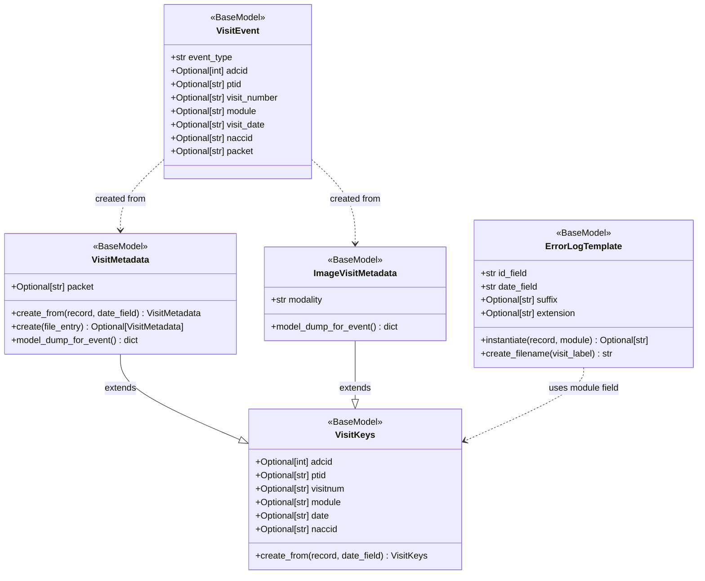
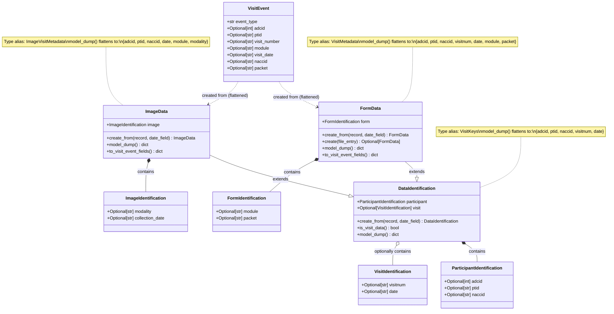

# Data Identification Design

## Purpose

This document analyzes the current state of data identification in the NACC Data Platform and proposes options for future improvements. It focuses on how different types of data (visit forms, non-visit forms, images) are identified and represented in the codebase.

## Current State

### Overview

The current implementation uses an inheritance hierarchy based on `VisitKeys` to represent data identification. The design conflates several concerns:
- Participant and center identification
- Visit association (or lack thereof)
- Datatype-specific fields (form names, packets, modalities)
- Field naming that doesn't accurately reflect the domain

### Key Issues

1. **Overloaded `module` field**: Used to represent both form names (A1, B1, NP) and imaging modalities (MR, CT, PET)
2. **Misleading class names**: `VisitKeys` and `VisitMetadata` suggest visit-only data, but are used for non-visit data too
3. **Mixed concerns**: Classes mix data identification with serialization for specific use cases (VisitEvent)
4. **Implicit semantics**: Whether `visitnum` and `date` are present/None determines if data is visit-associated

### Current Classes

| Class | Purpose | Data Types Supported | Key Fields | Location |
|-------|---------|---------------------|------------|----------|
| `VisitKeys` | Base class for data identification | All (visit forms, non-visit forms, images) | adcid, ptid, naccid, visitnum, module, date | nacc-common/error_models.py |
| `VisitMetadata` | Form-specific metadata with packet | Visit forms, non-visit forms | Inherits VisitKeys + packet | nacc-common/error_models.py |
| `ImageVisitMetadata` | Image-specific metadata | Images (MR, CT, PET) | Inherits VisitKeys + modality | Not yet implemented |
| `VisitEvent` | Event capture model | All (via VisitMetadata or ImageVisitMetadata) | event_type, adcid, ptid, visit_number, module, visit_date, naccid, packet | Not shown in provided code |
| `ErrorLogTemplate` | QC log filename generation | All (uses module field) | id_field, date_field, suffix, extension | common/error_logging/error_logger.py |

### Field Semantics by Data Type

**Visit Forms:**
- `adcid`, `ptid`, `naccid` - Participant/center identification
- `visitnum` - Present (visit sequence number)
- `date` - Visit date
- `module` - Form name (A1, B1, C1, etc.)
- `packet` - Visit type (I=Initial, F=Followup, T=Telephone)

**Non-Visit Forms:**
- `adcid`, `ptid`, `naccid` - Participant/center identification
- `visitnum` - None or omitted
- `date` - Collection date (not a visit date)
- `module` - Form name (NP, Milestone, etc.)
- `packet` - May be None or have different meaning

**Images:**
- `adcid`, `ptid`, `naccid` - Participant/center identification
- `visitnum` - None or omitted
- `date` - Collection date
- `module` - Set to modality value (MR, CT, PET) - overloaded meaning
- `modality` - Imaging modality (MR, CT, PET)

## Class Diagram - Current State



### Current Usage Patterns

**QC Logging:**
- Uses `ErrorLogTemplate` with `module` field to generate log filenames
- Works with any data type because `module` is overloaded
- Format: `{ptid}_{date}_{module}_qc-status.log`

**Event Capture:**
- `VisitMetadata` serializes to `VisitEvent` with field name mapping (date → visit_date, visitnum → visit_number)
- `ImageVisitMetadata` would serialize similarly but without packet
- `module` field is passed through to events

**File Annotation:**
- Uses `VisitMetadata` to annotate files with visit information
- Stores in `file.info.visit` structure

## Future State Options

### Option 1: Minimal Change - Clarify Current Design

**Approach:** Keep current structure but improve naming and documentation.

**Changes:**
- Rename `VisitKeys` → `DataIdentification` or `DataKeys`
- Document that `module` is a legacy field with overloaded meaning
- Add clear documentation about visit vs non-visit data semantics
- Keep inheritance hierarchy as-is

**Pros:**
- Minimal code changes
- Maintains backward compatibility
- Quick to implement

**Cons:**
- Doesn't fix the fundamental `module` overloading issue
- Still confusing for new developers
- Doesn't align well with domain model

### Option 2: Separate Datatype-Specific Classes

**Approach:** Create distinct classes for each datatype without forcing them into a single hierarchy.

**Structure:**
```
ParticipantIdentification (adcid, ptid, naccid)
  ├─> VisitData (+ visitnum, date)
  │     └─> VisitFormData (+ form_name, packet)
  └─> NonVisitData (+ collection_date)
        ├─> NonVisitFormData (+ form_name, optional packet)
        └─> ImageData (+ modality, collection_date)
```

**Pros:**
- Clear separation of concerns
- Accurate field names (form_name vs modality)
- Explicit about visit vs non-visit distinction
- Extensible for future datatypes

**Cons:**
- Significant refactoring required
- Need to update all usage sites
- May break backward compatibility
- More classes to maintain

### Option 3: Composition Over Inheritance

**Approach:** Use composition with separate identification and datatype components.

**Structure:**
```python
class ParticipantIdentification:
    adcid: int
    ptid: str
    naccid: str

class VisitIdentification:
    visitnum: str
    visit_date: str

class FormIdentification:
    form_name: str
    packet: Optional[str]

class ImageIdentification:
    modality: str
    collection_date: str

class DataIdentification:
    participant: ParticipantIdentification
    visit: Optional[VisitIdentification]  # None for non-visit data
    form: Optional[FormIdentification]    # Present for forms
    image: Optional[ImageIdentification]  # Present for images
```

**Pros:**
- Maximum flexibility
- Clear separation of concerns
- Easy to add new datatypes
- Accurate domain representation

**Cons:**
- Most complex refactoring
- Significant changes to all usage sites
- May be over-engineered for current needs
- Steeper learning curve

### Option 4: Hybrid Approach

**Approach:** Keep base class for common fields, but use accurate names for datatype-specific fields.

**Structure:**
```python
class DataIdentification:
    adcid: int
    ptid: str
    naccid: str
    collection_date: str
    visitnum: Optional[str]  # None for non-visit data

class FormData(DataIdentification):
    form_name: str
    packet: Optional[str]

class ImageData(DataIdentification):
    modality: str
```

**Pros:**
- Balances clarity with simplicity
- Accurate field names
- Moderate refactoring effort
- Maintains some backward compatibility through base class

**Cons:**
- Still uses inheritance (may not be ideal)
- Need to update usage sites
- Requires migration strategy

## Backward Compatibility Strategy: Type Aliases

### Challenge
The `nacc-common` package is distributed to external users (research centers). Any changes to the public API could break their code. We need to refactor internal implementation while maintaining the external interface.

### Solution: Type Aliases

Python type aliases allow us to:
1. Introduce new, accurately-named classes internally
2. Maintain old class names as aliases for backward compatibility
3. Gradually migrate internal code to new names
4. Eventually deprecate old names in a future major version

### Example Implementation

```python
# nacc_common/error_models.py

# New, accurately-named classes
class DataIdentification(BaseModel):
    """Base class for identifying data in the NACC platform.
    
    Replaces the legacy VisitKeys class with a more accurate name.
    """
    adcid: Optional[int] = None
    ptid: Optional[str] = None
    visitnum: Optional[str] = None
    module: Optional[str] = None  # Legacy field, see documentation
    date: Optional[str] = None
    naccid: Optional[str] = None

class FormData(DataIdentification):
    """Form-specific data identification.
    
    Replaces the legacy VisitMetadata class with a more accurate name.
    """
    packet: Optional[str] = None

# Type aliases for backward compatibility
# These maintain the old API for external users
VisitKeys = DataIdentification
VisitMetadata = FormData

# Mark as deprecated in docstrings and with warnings
import warnings

def __getattr__(name: str):
    """Provide deprecation warnings when old names are used."""
    if name == "VisitKeys":
        warnings.warn(
            "VisitKeys is deprecated, use DataIdentification instead",
            DeprecationWarning,
            stacklevel=2
        )
        return DataIdentification
    if name == "VisitMetadata":
        warnings.warn(
            "VisitMetadata is deprecated, use FormData instead", 
            DeprecationWarning,
            stacklevel=2
        )
        return FormData
    raise AttributeError(f"module {__name__!r} has no attribute {name!r}")
```

### Benefits

1. **Zero Breaking Changes:** External code using `VisitKeys` or `VisitMetadata` continues to work
2. **Internal Clarity:** New code can use `DataIdentification` and `FormData` for clarity
3. **Gradual Migration:** Internal codebase can be updated incrementally
4. **Type Safety:** Type checkers treat aliases as equivalent types
5. **Deprecation Path:** Can add warnings and eventually remove in major version bump

### Migration Phases

**Phase 1: Introduce Aliases (v1.x)**
- Add new class names with type aliases to old names
- Update documentation to reference new names
- Internal code continues using old names

**Phase 2: Internal Migration (v1.x)**
- Update internal code (common/, gear/) to use new names
- External users still use old names via aliases
- No breaking changes

**Phase 3: Deprecation Warnings (v2.0)**
- Add deprecation warnings when old names are used
- Documentation clearly states old names are deprecated
- Provide migration guide for external users

**Phase 4: Removal (v3.0)**
- Remove type aliases and old names
- Breaking change, but well-communicated and with migration path

### Limitations

Type aliases work well for class renames but have limitations:
- **Field renames:** Changing `module` to `form_name` would break serialization
- **Structural changes:** Moving from inheritance to composition requires more work
- **Method signatures:** Changing method parameters requires wrapper methods

### Recommendation for Field Names

For the `module` field specifically:

**Decision: Keep `module` field name**

Given that `module` is pervasive throughout the codebase and used in:
- QC log filename generation
- Event capture
- File annotations
- Multiple gears and processing pipelines

We should **keep the `module` field name** rather than trying to rename it to `form_name` or use separate fields.

**Approach:**
- Maintain `module` as the field name in all classes
- Clearly document that `module` has different meanings by datatype:
  - For forms: the form name (A1, B1, NP, Milestone, etc.)
  - For images: the imaging modality (MR, CT, PET, etc.)
  - For future datatypes: the primary type identifier
- Add validation or helper methods if needed to clarify usage
- Accept this as a pragmatic decision given the pervasive usage

**Example Documentation:**
```python
class DataIdentification(BaseModel):
    """Base class for identifying data in the NACC platform.
    
    The module field has datatype-specific meanings:
    - Forms: form name (A1, B1, NP, Milestone, etc.)
    - Images: imaging modality (MR, CT, PET, etc.)
    """
    adcid: Optional[int] = None
    ptid: Optional[str] = None
    visitnum: Optional[str] = None
    module: Optional[str] = None  # Datatype-specific identifier (see class docstring)
    date: Optional[str] = None
    naccid: Optional[str] = None
```

This avoids:
- Massive refactoring across the codebase
- Breaking changes to serialization formats
- Confusion from having multiple field names for the same concept
- Migration complexity for external users

## Recommendations

### Short Term
1. Add comprehensive documentation to existing classes explaining:
   - The overloaded meaning of `module`
   - When to use each class
   - Visit vs non-visit data semantics
2. Introduce type aliases for any renamed classes in nacc-common

### Long Term
Evaluate **Option 4 (Hybrid Approach)** with type aliases and keeping `module` field:
- Keep `module` field name (pervasive usage makes renaming impractical)
- Use type aliases for class renames (VisitKeys → DataIdentification)
- Clearly document `module` field semantics for each datatype
- Maintains a base class for common operations (QC logging, etc.)
- Type aliases protect external users from breaking changes
- Moderate refactoring effort with clear migration path
- Better aligns with domain model while being pragmatic

### Migration Strategy
1. Introduce new classes with type aliases to old names in nacc-common
2. Update internal code (common/, gear/) to use new names
3. External users continue using old names with no breaking changes
4. Add deprecation warnings in next major version
5. Remove aliases in future major version with clear migration guide

## Recommended Design: Composition with Class Renaming

### Overview

We'll use composition to separate concerns while maintaining backward compatibility through type aliases. This provides maximum flexibility and clarity while protecting external users.

### Core Design Principles

1. **Separation of Concerns**: Participant identification, visit association, and datatype-specific fields are separate
2. **Composition Over Inheritance**: Use composition to combine components rather than deep inheritance hierarchies
3. **Backward Compatibility**: Type aliases maintain the existing public API
4. **Keep `module` field**: Accept the pervasive usage and document clearly

### Proposed Class Structure

```python
# nacc_common/error_models.py

from typing import Optional
from pydantic import BaseModel

# ============================================================================
# Core Identification Components
# ============================================================================

class ParticipantIdentification(BaseModel):
    """Identifies a participant and their center."""
    adcid: Optional[int] = None
    ptid: Optional[str] = None
    naccid: Optional[str] = None

class VisitIdentification(BaseModel):
    """Identifies a specific visit."""
    visitnum: Optional[str] = None
    date: Optional[str] = None  # Visit date

# ============================================================================
# Datatype-Specific Identification
# ============================================================================

class FormIdentification(BaseModel):
    """Identifies form-specific data."""
    module: Optional[str] = None  # Form name (A1, B1, NP, Milestone, etc.)
    packet: Optional[str] = None  # I=Initial, F=Followup, T=Telephone

class ImageIdentification(BaseModel):
    """Identifies image-specific data."""
    modality: Optional[str] = None  # Imaging modality (MR, CT, PET, etc.)
    collection_date: Optional[str] = None  # Collection date

# ============================================================================
# Composite Data Identification Classes
# ============================================================================

class DataIdentification(BaseModel):
    """Base class for all data identification using composition.
    
    Combines participant identification with optional visit identification.
    This replaces the legacy VisitKeys class.
    """
    participant: ParticipantIdentification
    visit: Optional[VisitIdentification] = None
    
    @classmethod
    def create_from(
        cls, record: Dict[str, Any], date_field: Optional[str] = None
    ) -> "DataIdentification":
        """Factory method to create from a record dictionary.
        
        Maintains compatibility with legacy create_from interface.
        """
        date = record.get(date_field) if date_field is not None else None
        
        participant = ParticipantIdentification(
            adcid=record.get(FieldNames.ADCID),
            ptid=record.get(FieldNames.PTID),
            naccid=record.get(FieldNames.NACCID),
        )
        
        visit = None
        visitnum = record.get(FieldNames.VISITNUM)
        if visitnum is not None:
            visit = VisitIdentification(visitnum=visitnum, date=date)
        
        return cls(participant=participant, visit=visit)
    
    def is_visit_data(self) -> bool:
        """Check if this represents visit-associated data."""
        return self.visit is not None
    
    def model_dump(self, **kwargs) -> Dict[str, Any]:
        """Serialize to flat structure for backward compatibility.
        
        Flattens the composition into the legacy flat structure:
        {adcid, ptid, naccid, visitnum, date, module}
        """
        result = {}
        
        # Flatten participant
        if self.participant.adcid is not None:
            result['adcid'] = self.participant.adcid
        if self.participant.ptid is not None:
            result['ptid'] = self.participant.ptid
        if self.participant.naccid is not None:
            result['naccid'] = self.participant.naccid
        
        # Flatten visit
        if self.visit is not None:
            if self.visit.visitnum is not None:
                result['visitnum'] = self.visit.visitnum
            if self.visit.date is not None:
                result['date'] = self.visit.date
        
        # Subclasses will add module and other fields
        
        if kwargs.get('exclude_none'):
            return {k: v for k, v in result.items() if v is not None}
        return result

class FormData(DataIdentification):
    """Form-specific data identification using composition.
    
    Combines participant, optional visit, and form identification.
    This replaces the legacy VisitMetadata class.
    """
    form: FormIdentification
    
    @classmethod
    def create_from(
        cls, record: Dict[str, Any], date_field: Optional[str] = None
    ) -> "FormData":
        """Factory method to create from a record dictionary."""
        date = record.get(date_field) if date_field is not None else None
        
        participant = ParticipantIdentification(
            adcid=record.get(FieldNames.ADCID),
            ptid=record.get(FieldNames.PTID),
            naccid=record.get(FieldNames.NACCID),
        )
        
        visit = None
        visitnum = record.get(FieldNames.VISITNUM)
        if visitnum is not None:
            visit = VisitIdentification(visitnum=visitnum, date=date)
        
        form = FormIdentification(
            module=record.get(FieldNames.MODULE),
            packet=record.get(FieldNames.PACKET),
        )
        
        return cls(participant=participant, visit=visit, form=form)
    
    @classmethod
    def create(cls, file_entry: FileEntry) -> Optional["FormData"]:
        """Factory method to create FormData from a FileEntry.
        
        Reads from file.info.visit which has the flat structure.
        """
        file_entry = file_entry.reload()
        if not file_entry.info:
            return None
        
        visit_data = file_entry.info.get("visit")
        if not visit_data:
            return None
        
        try:
            # visit_data is in flat format, use create_from
            return FormData.create_from(visit_data, date_field='date')
        except (ValidationError, KeyError):
            return None
    
    def model_dump(self, **kwargs) -> Dict[str, Any]:
        """Serialize to flat structure for backward compatibility."""
        result = super().model_dump(**kwargs)
        
        # Add form fields
        if self.form.module is not None:
            result['module'] = self.form.module
        if self.form.packet is not None:
            result['packet'] = self.form.packet
        
        if kwargs.get('exclude_none'):
            return {k: v for k, v in result.items() if v is not None}
        return result
    
    @model_serializer(mode="wrap")
    def to_visit_event_fields(
        self, handler: SerializerFunctionWrapHandler, info: SerializationInfo
    ) -> Dict[str, Any]:
        """Extract fields needed for VisitEvent creation with proper field name mapping."""
        # Get the flat structure
        data = self.model_dump(exclude_none=info.exclude_none if hasattr(info, 'exclude_none') else False)
        
        if info.mode == "raw":
            return data
        
        # Map field names for VisitEvent
        if "date" in data:
            data["visit_date"] = data.pop("date")
        if "visitnum" in data:
            data["visit_number"] = data.pop("visitnum")
        return data

class ImageData(DataIdentification):
    """Image-specific data identification using composition.
    
    Combines participant and image identification.
    Images are not associated with visits.
    """
    image: ImageIdentification
    
    @classmethod
    def create_from(
        cls, record: Dict[str, Any], date_field: Optional[str] = None
    ) -> "ImageData":
        """Factory method to create from a record dictionary."""
        date = record.get(date_field) if date_field is not None else None
        
        participant = ParticipantIdentification(
            adcid=record.get(FieldNames.ADCID),
            ptid=record.get(FieldNames.PTID),
            naccid=record.get(FieldNames.NACCID),
        )
        
        # Images don't have visits
        modality = record.get(FieldNames.MODULE) or record.get('modality')
        
        image = ImageIdentification(
            modality=modality,
            collection_date=date,
        )
        
        return cls(participant=participant, visit=None, image=image)
    
    def model_dump(self, **kwargs) -> Dict[str, Any]:
        """Serialize to flat structure for backward compatibility."""
        result = super().model_dump(**kwargs)
        
        # Add image fields
        # For backward compatibility, set module to modality
        if self.image.modality is not None:
            result['module'] = self.image.modality
            result['modality'] = self.image.modality
        
        # Use collection_date as date
        if self.image.collection_date is not None:
            result['date'] = self.image.collection_date
        
        if kwargs.get('exclude_none'):
            return {k: v for k, v in result.items() if v is not None}
        return result
    
    @model_serializer(mode="wrap")
    def to_visit_event_fields(
        self, handler: SerializerFunctionWrapHandler, info: SerializationInfo
    ) -> Dict[str, Any]:
        """Extract fields needed for VisitEvent creation with proper field name mapping."""
        # Get the flat structure
        data = self.model_dump(exclude_none=info.exclude_none if hasattr(info, 'exclude_none') else False)
        
        if info.mode == "raw":
            return data
        
        # Map field names for VisitEvent
        if "date" in data:
            data["visit_date"] = data.pop("date")
        # Images don't have visitnum, so no visit_number mapping
        
        return data

# ============================================================================
# Type Aliases for Backward Compatibility
# ============================================================================

# These maintain the old API for external users
VisitKeys = DataIdentification
VisitMetadata = FormData
ImageVisitMetadata = ImageData
```

### Class Diagram - Proposed Design



### Class Correspondence to Existing Code

| New Class | Existing Class | Relationship | Notes |
|-----------|---------------|--------------|-------|
| `DataIdentification` | `VisitKeys` | Direct replacement | Same fields, better name. Type alias: `VisitKeys = DataIdentification` |
| `FormData` | `VisitMetadata` | Direct replacement | Same fields + methods, better name. Type alias: `VisitMetadata = FormData` |
| `ImageData` | `ImageVisitMetadata` | Direct replacement | New implementation. Type alias: `ImageVisitMetadata = ImageData` |
| `ParticipantIdentification` | N/A | New component class | Extracted from DataIdentification, can be used independently |
| `VisitIdentification` | N/A | New component class | Extracted from DataIdentification, can be used independently |
| `FormIdentification` | N/A | New component class | Extracted from FormData, can be used independently |
| `ImageIdentification` | N/A | New component class | Extracted from ImageData, can be used independently |

### Field Mapping

All existing fields are preserved in the new design:

**DataIdentification (was VisitKeys):**
- ✓ `adcid` - unchanged
- ✓ `ptid` - unchanged
- ✓ `naccid` - unchanged
- ✓ `visitnum` - unchanged
- ✓ `module` - unchanged
- ✓ `date` - unchanged
- ✓ `create_from()` - unchanged
- ➕ `to_participant()` - new helper method
- ➕ `to_visit()` - new helper method
- ➕ `is_visit_data()` - new helper method

**FormData (was VisitMetadata):**
- ✓ All DataIdentification fields
- ✓ `packet` - unchanged
- ✓ `create_from()` - inherited
- ✓ `create()` - unchanged
- ✓ `to_visit_event_fields()` - unchanged (was `model_serializer`)
- ➕ `to_form()` - new helper method

**ImageData (was ImageVisitMetadata):**
- ✓ All DataIdentification fields
- ✓ `modality` - unchanged
- ✓ `to_visit_event_fields()` - same as FormData
- ➕ `to_image()` - new helper method
- ➕ Auto-sets `module` to `modality` value

### Serialization Compatibility

The new classes maintain the same serialization format as existing classes:

```python
# Old code
old_metadata = VisitMetadata(
    adcid=1, ptid="123", visitnum="001", 
    date="2024-01-15", module="A1", packet="I"
)
old_dict = old_metadata.model_dump()
# {'adcid': 1, 'ptid': '123', 'visitnum': '001', 
#  'date': '2024-01-15', 'module': 'A1', 'packet': 'I', 'naccid': None}

# New code (using type alias)
new_metadata = VisitMetadata(  # Actually creates FormData
    adcid=1, ptid="123", visitnum="001",
    date="2024-01-15", module="A1", packet="I"
)
new_dict = new_metadata.model_dump()
# {'adcid': 1, 'ptid': '123', 'visitnum': '001',
#  'date': '2024-01-15', 'module': 'A1', 'packet': 'I', 'naccid': None}

# Identical output!
assert old_dict == new_dict
```

### Usage in Existing Code

**QC Logging (ErrorLogTemplate):**
```python
# Current usage - works unchanged
template = ErrorLogTemplate()
filename = template.instantiate(record, module="A1")

# Can now also use with new classes
form_data = FormData(ptid="123", date="2024-01-15", module="A1")
record = form_data.model_dump()
filename = template.instantiate(record, module=form_data.module)
```

**Event Capture (VisitEvent):**
```python
# Current usage - works unchanged
metadata = VisitMetadata(adcid=1, ptid="123", module="A1", packet="I")
event_dict = metadata.model_dump(exclude_none=True)
# Field mapping happens automatically via model_serializer

# New usage - identical behavior
form_data = FormData(adcid=1, ptid="123", module="A1", packet="I")
event_dict = form_data.model_dump(exclude_none=True)
# Same field mapping via model_serializer
```

**File Annotation:**
```python
# Current usage - works unchanged
metadata = VisitMetadata.create(file_entry)
if metadata:
    file_entry.update_info({"visit": metadata.model_dump()})

# New usage - identical behavior
form_data = FormData.create(file_entry)  # Same method
if form_data:
    file_entry.update_info({"visit": form_data.model_dump()})
```

### What Changes for Internal Code

Internal code (common/, gear/) can optionally use new features:

```python
# Old style - still works
metadata = VisitMetadata(adcid=1, ptid="123", visitnum="001", module="A1")

# New style - more explicit
form_data = FormData(adcid=1, ptid="123", visitnum="001", module="A1")

# New capabilities - extract components
participant = form_data.to_participant()
visit = form_data.to_visit()
form = form_data.to_form()

# New capabilities - check visit association
if form_data.is_visit_data():
    print("This is visit-associated data")
```

### What Doesn't Change

1. **Serialization format** - JSON/dict output is identical
2. **Database/file storage** - Stored data format unchanged
3. **Public API** - External users see no changes via type aliases
4. **Method signatures** - All existing methods preserved
5. **Field names** - All fields keep their names (including `module`)

### Key Differences

The main differences are:

1. **Better names** - `DataIdentification` instead of `VisitKeys`, `FormData` instead of `VisitMetadata`
2. **Component extraction** - New `to_participant()`, `to_visit()`, `to_form()`, `to_image()` methods
3. **Explicit checks** - New `is_visit_data()` method
4. **Component classes** - New standalone classes for when you only need part of the identification

### Key Features

1. **Component Classes**: `ParticipantIdentification`, `VisitIdentification`, `FormIdentification`, `ImageIdentification` can be used independently
2. **Composite Classes**: `DataIdentification`, `FormData`, `ImageData` combine components for practical use
3. **Extraction Methods**: `to_participant()`, `to_visit()`, `to_form()`, `to_image()` allow extracting components when needed
4. **Type Aliases**: `VisitKeys`, `VisitMetadata`, `ImageVisitMetadata` maintain backward compatibility
5. **Helper Methods**: `is_visit_data()` makes visit vs non-visit distinction explicit

### Usage Examples

```python
# Creating form data for a visit form
form_data = FormData(
    adcid=1,
    ptid="12345",
    naccid="NACC123",
    visitnum="001",
    date="2024-01-15",
    module="A1",
    packet="I"
)

# Check if it's visit data
if form_data.is_visit_data():
    visit = form_data.to_visit()
    print(f"Visit {visit.visitnum} on {visit.date}")

# Extract participant info
participant = form_data.to_participant()

# Extract form info
form = form_data.to_form()
print(f"Form {form.module} packet {form.packet}")

# Creating image data (non-visit)
image_data = ImageData(
    adcid=1,
    ptid="12345",
    naccid="NACC123",
    date="2024-01-20",
    modality="MR"
)
# module is automatically set to "MR"

# Backward compatibility - old code still works
old_style = VisitMetadata(  # Actually creates FormData
    adcid=1,
    ptid="12345",
    module="B1",
    packet="F"
)
```

### Migration Benefits

1. **No Breaking Changes**: External code using `VisitKeys` or `VisitMetadata` continues to work
2. **Internal Flexibility**: New code can use component classes when appropriate
3. **Clear Semantics**: `is_visit_data()` makes visit vs non-visit explicit
4. **Extensibility**: Easy to add new datatypes by extending `DataIdentification`
5. **Testability**: Component classes can be tested independently

### Migration Path

**Phase 1: Implementation**
- Add new classes to nacc-common
- Add type aliases
- Update tests to cover new classes

**Phase 2: Internal Migration**
- Update common/ and gear/ code to use new class names
- Use component extraction methods where beneficial
- Maintain backward compatibility

**Phase 3: Documentation**
- Update all documentation to reference new names
- Add migration guide for external users
- Mark old names as deprecated in docstrings

**Phase 4: Future Cleanup (v3.0)**
- Remove type aliases
- Remove deprecated names
- Breaking change with clear migration path

## External Visibility and Compatibility

### What is Externally Visible?

The data identification models have three main external touchpoints:

#### 1. QC Status Log Filenames

**Format:** `{ptid}_{date}_{module}_qc-status.log`

**Generated by:** `ErrorLogTemplate.instantiate()`

**Visibility:** File names in Flywheel project files

**Impact of Changes:**
- Filename format must remain stable
- `module` field is used directly in filename
- For forms: module = form name (A1, B1, NP)
- For images: module = modality (MR, CT, PET)
- Different datatypes can coexist with same naming pattern

**Compatibility:** ✅ No changes needed - `module` field preserved

#### 2. File Metadata (file.info.visit)

**Format:** JSON stored in `file.info.visit` on QC status log files

**Example:**
```json
{
  "visit": {
    "adcid": 1,
    "ptid": "12345",
    "visitnum": "001",
    "date": "2024-01-15",
    "module": "A1",
    "packet": "I",
    "naccid": "NACC123"
  }
}
```

**Generated by:** `FileVisitAnnotator.annotate_qc_log_file()`

**Visibility:** Stored in Flywheel, read by event capture and other gears

**Impact of Changes:**
- JSON structure must remain stable for existing files
- Field names must not change
- New fields can be added (backward compatible)
- Missing fields should be handled gracefully

**Compatibility:** ✅ No changes needed - serialization format preserved via `model_dump()`

#### 3. Transactional Events (VisitEvent JSON)

**Format:** JSON files that become Parquet tables

**Example:**
```json
{
  "action": "submit",
  "study": "adrc",
  "adcid": 1,
  "ptid": "12345",
  "visit_number": "001",
  "visit_date": "2024-01-15",
  "module": "A1",
  "packet": "I",
  "naccid": "NACC123"
}
```

**Generated by:** `VisitMetadata.model_dump()` with field name mapping (date → visit_date, visitnum → visit_number)

**Visibility:** 
- JSON files in Flywheel
- Parquet tables for analytics
- Potentially consumed by external systems

**Impact of Changes:**
- JSON schema must remain stable
- Field names must not change (visit_date, visit_number, module, packet)
- Different datatypes could have different event schemas
- Parquet table schemas must remain compatible

**Compatibility:** ✅ No changes needed - field mapping preserved via `model_serializer`

### Datatype-Specific Considerations

#### Forms (Visit and Non-Visit)

**QC Log Filename:** `{ptid}_{date}_{form_name}_qc-status.log`
- Example: `12345_2024-01-15_a1_qc-status.log`

**file.info.visit:**
```json
{
  "adcid": 1, "ptid": "12345", "visitnum": "001",
  "date": "2024-01-15", "module": "A1", "packet": "I"
}
```

**Event JSON:**
```json
{
  "action": "submit", "adcid": 1, "ptid": "12345",
  "visit_number": "001", "visit_date": "2024-01-15",
  "module": "A1", "packet": "I"
}
```

#### Images

**QC Log Filename:** `{ptid}_{date}_{modality}_qc-status.log`
- Example: `12345_2024-01-20_mr_qc-status.log`

**file.info.visit:**
```json
{
  "adcid": 1, "ptid": "12345",
  "date": "2024-01-20", "module": "MR", "modality": "MR"
}
```
Note: No `visitnum` or `packet` for images

**Event JSON:**
```json
{
  "action": "submit", "adcid": 1, "ptid": "12345",
  "visit_date": "2024-01-20", "module": "MR"
}
```
Note: No `visit_number` or `packet` for images

### Potential for Datatype-Specific Event Schemas

Since transactional events become Parquet tables, you could have:

**Option A: Single Event Table (Current)**
- All datatypes in one table
- Optional fields (packet, modality) are null for non-applicable types
- `module` field has different meanings by datatype

**Option B: Datatype-Specific Event Tables**
- `form_events` table with form-specific fields
- `image_events` table with image-specific fields
- Clearer schema per datatype
- Requires routing events to different tables

**Recommendation:** Start with Option A (single table) for backward compatibility. The composition design allows migrating to Option B later if needed without changing the data identification models.

### Backward Compatibility Guarantees

The proposed design maintains:

1. ✅ **QC log filename format** - unchanged
2. ✅ **file.info.visit JSON structure** - unchanged
3. ✅ **Event JSON field names** - unchanged (visit_date, visit_number, module, packet)
4. ✅ **Serialization behavior** - identical output via `model_dump()`
5. ✅ **Field name mapping** - preserved via `model_serializer`

### What Could Change in Future

With the composition design, future enhancements could include:

1. **Datatype-specific event tables** - Route FormData events to form_events table, ImageData events to image_events table
2. **Additional metadata fields** - Add new fields without breaking existing schemas
3. **Validation rules** - Add datatype-specific validation without changing serialization
4. **Component extraction** - Use `to_participant()`, `to_visit()` for analytics without changing storage

All of these are additive changes that don't break existing external contracts.

## Open Questions

1. **Backward Compatibility:** How important is it to maintain the exact current API for nacc-common package users?
2. **Event Capture:** Should VisitEvent be refactored to match the new structure, or should it remain as-is with adapters?
3. **QC Logging:** Can ErrorLogTemplate be updated to work with new structure, or does it need a new interface?
4. **Timeline:** What is the acceptable timeline for this refactoring given other priorities?
5. **External Dependencies:** Are there external systems or scripts that depend on the current field names in file.info.visit?
