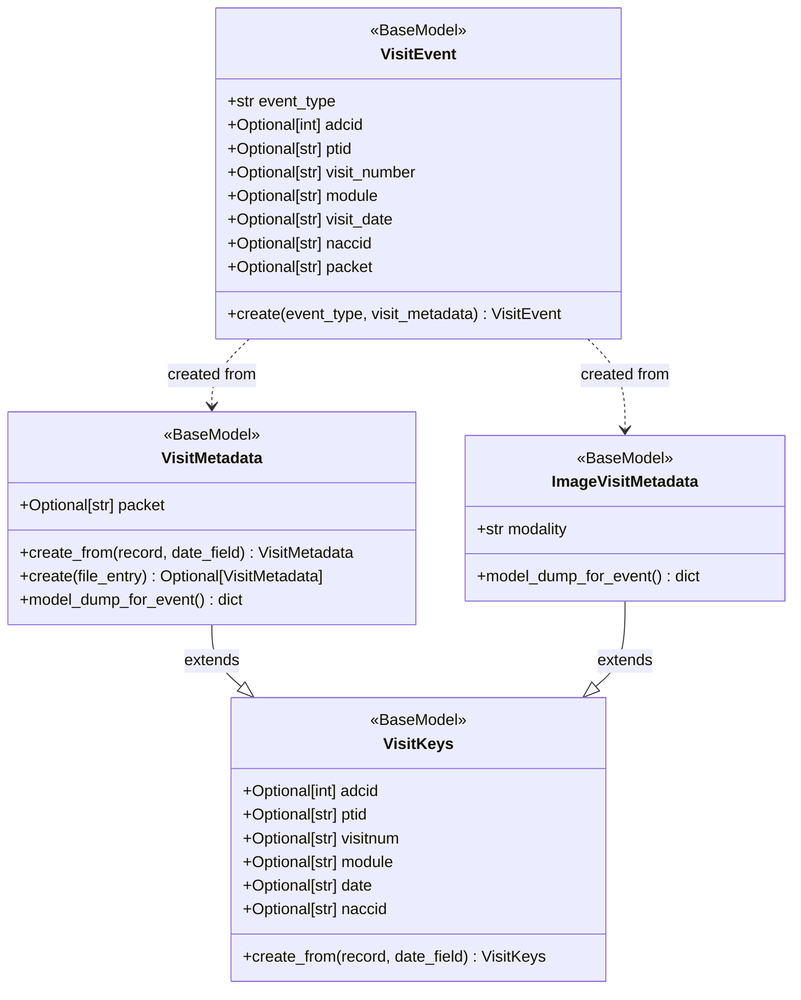

# Domain Analysis: Visit Metadata Architecture

## Purpose

This document provides a domain analysis for the visit metadata refactoring. It identifies key concepts, their relationships, and provides class diagrams to guide the implementation.

## Core Concepts

### Participant

The individual about which data is being collected in the NACC research program.

**Identifiers:**

- `ptid` - Participant identifier assigned by the center
- `naccid` - Participant identifier assigned by NACC (corresponds to an adcid-ptid pair)

### Center

The research center where participants have visits to collect data. Also known as ADC (Alzheimer's Disease Center).

**Identifier:**

- `adcid` - Center identifier assigned by NACC

### Visit

A formal annual event where a participant goes to a center for observation and collection of a canonical set of data. This is a structured concept in NACC's data model.

**Identifiers:**

- `visitnum` - Center-assigned sequence number for the visit (not necessarily numeric)
- `date` - The date of the first day of the visit

**Important:** Not all data collected about a participant is associated with a visit. Some data is collected once (e.g., post-mortem pathology), sporadically (e.g., milestone events), or independently (e.g., imaging studies that may occur near but not during a visit).

### Visit Data

Data collected during a visit, primarily consisting of forms.

**Forms:**

- Each form is identified by a `module` (e.g., A1, B1, C1)
- Forms may have a `packet` indicating the version based on visit type:
  - I = Initial visit
  - F = Followup visit
  - T = Telephone visit

**Other Visit Data:**

- Additional observations or measurements collected during the visit
- Must be associated with a specific visit (visitnum, date)

### Non-Visit Data

Data collected about a participant but not associated with a specific visit.

**Examples:**

- **One-time forms:** NP form (post-mortem pathology exam data)
- **Sporadic forms:** Milestone form (life events, participation changes)
- **Imaging data:** MR or PET images collected near or during a visit, but not formally associated with the visit
- **Other research data:** Other kinds of research data not currently collected

**Key Characteristic:** This data is associated with a participant (ptid, naccid) and center (adcid), but not with a visit (no visitnum). It has a collection date, but not a visit date.

### Data Identification

A set of fields that identify data collected about participants in the NACC Data Platform. Used across QC logging, event capture, and data processing.

**Core Identification Fields (always present):**
- `adcid` - Center identifier
- `ptid` - Participant identifier (assigned by center)
- `naccid` - Participant identifier (assigned by NACC, corresponds to adcid-ptid pair)
- `date` - Collection date (for visit data, this is the visit date; for non-visit data, this is when the data was collected)

**Visit-Specific Fields (only for visit-associated data):**
- `visitnum` - Visit sequence number (assigned by center, not necessarily numeric)

**Datatype-Specific Fields:**
- Forms have a form name (e.g., A1, B1, NP, Milestone)
- Forms may have a packet (I=Initial, F=Followup, T=Telephone)
- Images have a modality (MR, CT, PET)
- Other datatypes will have their own identifying fields

**Note:** The current code uses a field called `module` which conflates form names with imaging modalities. This is a legacy naming issue that should be addressed in the refactoring.

### Datatype

A category of data being processed in the platform. Each datatype may have specific metadata requirements beyond basic identification fields.

**Visit-Associated Datatypes:**

- **Visit Forms** - Clinical assessment forms collected during annual visits (UDS modules A1-D2, etc.)
  - Have visitnum and visit date
  - Have module (form identifier) and packet (visit type: I/F/T)

**Non-Visit Datatypes:**

- **Non-Visit Forms** - Forms collected once or sporadically, not tied to annual visits
  - Examples: NP (post-mortem pathology), Milestone (life events)
  - Have module but no visitnum or visit date (or visitnum/date may be None)
  - May have packet
- **Imaging** - Medical imaging data (MR, CT, PET scans)
  - Collected near or during visits but not formally associated with them
  - Have modality (MR, CT, PET) but no visitnum
  - Collection date is independent of visit date
- **Other Research Data** - Other kinds of research data not currently collected

**Key Distinction:** Visit-associated data is part of the formal annual visit structure. Non-visit data is collected about participants but outside this structure.

### Form Metadata

Metadata for form processing, applicable to both visit and non-visit forms.

**Fields:**

- `module` - Form identifier (A1, B1, NP, Milestone, etc.)
- `packet` - Form version based on context:
  - For visit forms: I=Initial, F=Followup, T=Telephone
  - For non-visit forms: May indicate version or be None

**Visit Forms vs Non-Visit Forms:**

- Visit forms have visitnum and visit date
- Non-visit forms may have visitnum=None and date represents collection date, not visit date

### Image Metadata

Visit metadata specific to image processing, including modality information that indicates the type of imaging.

**Additional Fields:**

- `modality` - Imaging modality (MR, CT, PET, etc.)

**Note:** For images, the `module` field is set to the modality value for consistency with QC logging and event capture.

## Class Diagram

## Relationship Descriptions

### Inheritance Hierarchy

- `VisitKeys` is the base class containing common visit identification fields
- `VisitMetadata` extends `VisitKeys` and adds form-specific `packet` field
- `ImageVisitMetadata` extends `VisitKeys` and adds image-specific `modality` field

### Usage Relationships

**VisitEvent:**
- Created from `VisitMetadata` for form events (includes packet)
- Created from `ImageVisitMetadata` for image events (no packet)
- Field name mapping: `date` → `visit_date`, `visitnum` → `visit_number`

## Design Principles

### Separation of Concerns

- **Data Identification** (VisitKeys): Core fields for identifying data
- **Datatype-Specific Metadata** (VisitMetadata, ImageVisitMetadata): Additional fields per datatype
- **Event Capture** (VisitEvent): Records actions with data context

### Extensibility

- New datatypes can extend `VisitKeys` with their specific fields
- Event capture adapts to different metadata structures through serialization

## Open Questions

1. **Other Research Data Metadata:** What additional fields will other research datatypes require?
2. **Packet Field for Images:** Should `ImageVisitMetadata` explicitly set `packet=None` or omit it entirely?
3. **Event Capture for New Datatypes:** Will other research data events need additional fields beyond what's in VisitEvent?

## Next Steps

1. Review and refine concepts with stakeholders
2. Address open questions
3. Update requirements document based on domain insights
