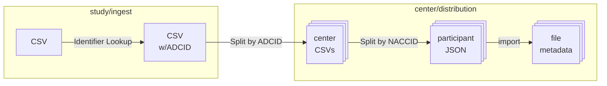

# CSV File Processing

This document discusses the process(es) for handling CSV data that is submitted to NACC by a study or collaborating organization.

## General framework

This is the general framework for handling CSV files for one or both of these purposes:

* distributing participant data to the centers, or
* attaching data to the subjects for participants for use in released data or query tool indexing.

The basic steps are the following

1. Upload CSV containing data from all centers to study ingest.
2. Within study ingest project
   1. ID transformations:
      1. if data only has NACCID for participants, do reverse identifier lookup to insert ADCID (and PTID)
      2. if data only has ADCID, PTID, do identifier lookup to insert NACCID
   2. split rows in CSV by ADCID and write center-specific rows to corresponding project in center
3. Within center/project
   1. Split rows in center-specific CSV by NACCID to create JSON file attached to subject
   2. Run form-importer to load JSON into file custom info

And, are illustrated in this diagram

This process may be followed by a metadata curation process for computing derived variables and variables for indexing in the MQT.

### Gears

There is some variation in implementation, but the general process outlined involves the following gears:

* [identifier-lookup](../identifier_lookup/): used to ensure both ADCID and NACCID are available for splitting purposes
* [csv-center-splitter](../csv_center_splitter/): uses the ADCID to split the CSV and save the corresponding rows to a CSV file in a project of the center group
* [csv-subject-splitter](../csv_subject_splitter/): uses the NACCID to split the center-level CSV into rows, writing each row as a JSON file attached to an acquisition under the subject
* [form-importer](https://gitlab.com/flywheel-io/scientific-solutions/gears/form-importer): imports the JSON data and inserts it into the file custom information `file.info`

## Variation
### Data ingest

One detail of variation is where data is ingested.

In some cases, the data is ingested into a study-specific ingest project of a center for the organization providing the data.
An example is NCRAD, which provides several data streams.
There is a group for NCRAD, and then projects for ingest of each data stream.
This is the process described above.

In other cases, data is ingested into AWS S3, and processes may occur in AWS before the data is transferred to Flywheel.
An example of this is SCAN, where data is transferred into the S3 bucket, and split by center and each file written into center-specific projects in Flywheel. 
This uses a different set of gears up to the point where the files are saved in Flywheel.

### Data transformations

