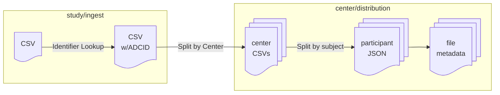

# CSV File Processing

1. upload CSV to study ingest containing data from all centers
2. within study ingest project
   1. ID transformations:
      1. if data only has NACCID for participants, do reverse identifier lookup to insert ADCID (and PTID)
      2. if data only has ADCID, PTID, do identifier lookup to insert NACCID
   2. split rows in CSV by ADCID and write center-specific rows to corresponding project in center
3. within center/project
   1. split rows in center-specific CSV by NACCID to create JSON file attached to subject
   2. run form-importer to load JSON into file custom info

