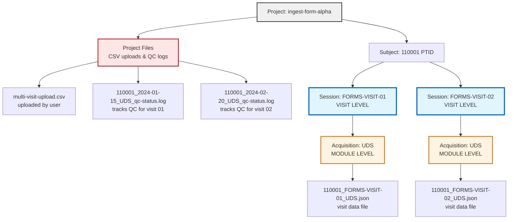
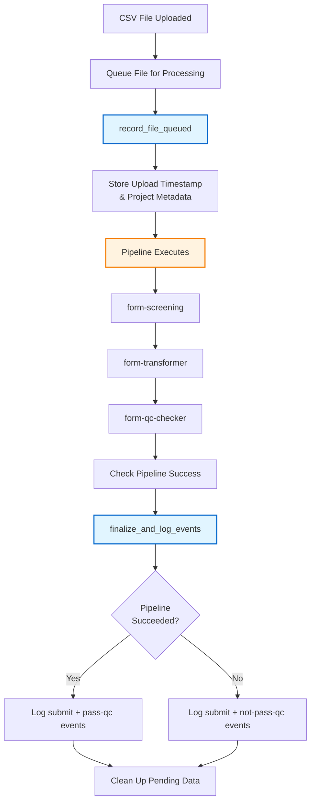
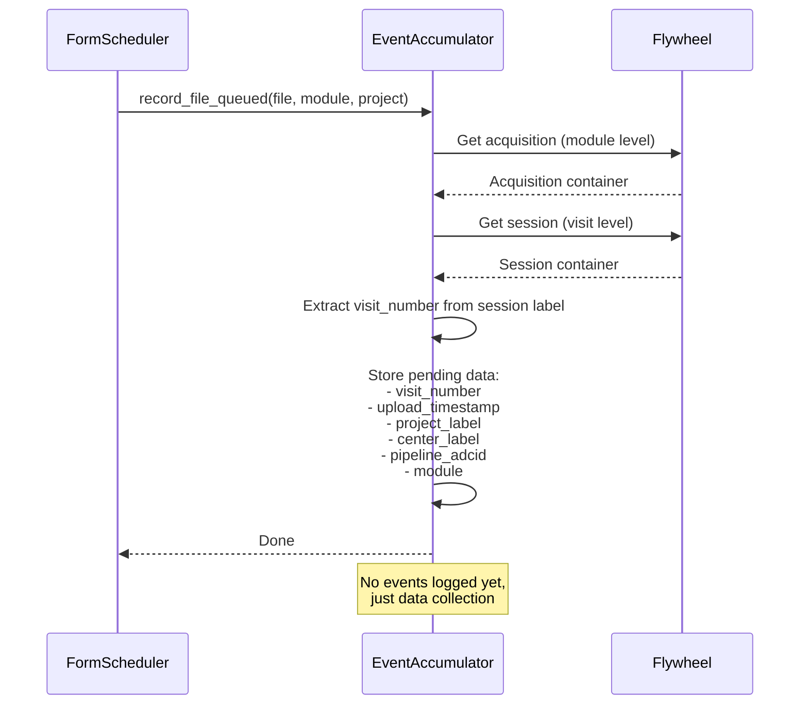
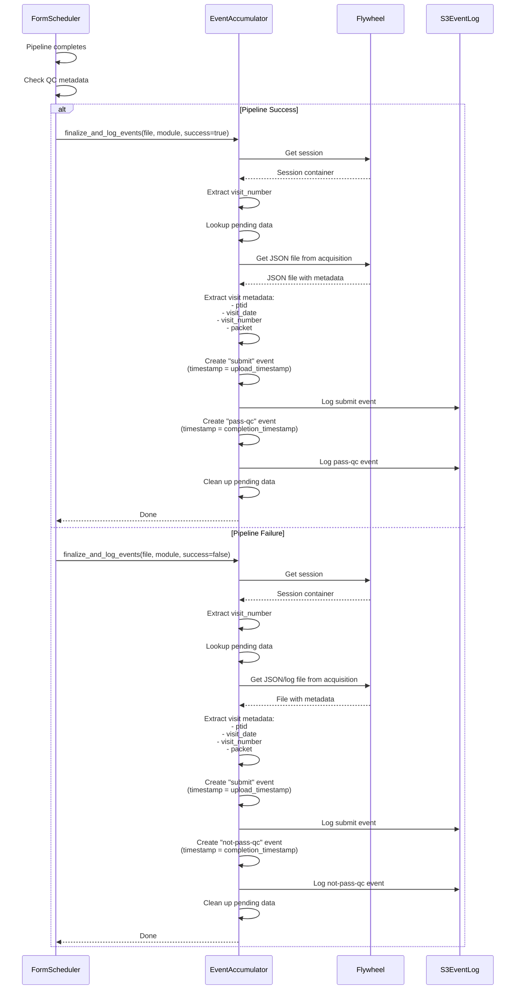

# Event Logging in Form Scheduler

## Overview

The form-scheduler gear logs visit events to track the lifecycle of form submissions through the data pipeline. This document explains how event logging works for developers unfamiliar with the gear.

## What Events Are Logged

The gear logs three types of events for each visit:

- **submit**: Records when a visit is submitted for processing (uses upload timestamp)
  - Logged when a CSV file is initially uploaded and queued
  
- **pass-qc**: Records when a visit successfully completes all QC checks (uses completion timestamp)
  - **ONLY logged when BOTH conditions are met:**
    1. JSON file exists at ACQUISITION level (proves form-transformer succeeded)
    2. ALL pipeline gears have status="PASS" in QC metadata
  - **Can be logged independently without a submit event** in the same job
    - Example: Follow-up visits blocked on UDS packet get evaluated once UDS is cleared
    
- **not-pass-qc**: Records when a visit fails QC validation (uses completion timestamp)
  - Logged when ANY of these occur:
    - No JSON file at ACQUISITION level (early failure)
    - Any gear has status != "PASS"

**Important:** Not all visits generate both submit and outcome events in the same job. "pass-qc" events can occur independently when previously blocked visits are re-evaluated.

## Key Concepts

### Flywheel Container Hierarchy

Understanding the Flywheel container structure is essential:



**Key Points:**

- **Project Files**: CSV files uploaded by users and QC log files are stored at PROJECT level
- **Session** = Visit (e.g., "FORMS-VISIT-01" represents visit number "01")
- **Acquisition** = Module (e.g., "UDS", "FTLD", "LBD")
- **CSV files** can contain multiple visits and are uploaded to PROJECT level
- **QC log files** are created at PROJECT level (one per visit: `{ptid}_{visitdate}_{module}_qc-status.log`)
- **JSON files** are created at ACQUISITION level (one per visit/module combination)
- Events are tracked by visit_number, extracted from the session label

### Multi-Visit Processing

A single CSV file can contain data for multiple visits. The pipeline processes each visit separately:

1. User uploads CSV with visits 01, 02, 03 to PROJECT level
2. form-screening validates the CSV format
3. identifier-lookup provisions identifiers and creates QC log files at PROJECT level (one per visit)
4. form-transformer splits CSV into separate JSON files (one per visit) attached to ACQUISITION level
5. form-qc-checker validates each visit independently and updates QC metadata
6. Each visit generates its own pair of events

**Important Notes:**
- If pipeline fails at identifier-lookup or form-transformer, no JSON file is created at ACQUISITION level
- QC log files at PROJECT level are still created and track the failure
- Not all modules have visit numbers in session labels (module-specific configuration)

### File Locations

Understanding where files are stored is important for event logging:

- **CSV files**: Uploaded to PROJECT level, can contain multiple visits
- **QC log files**: Created at PROJECT level by identifier-lookup gear, one per visit
  - Naming pattern: `{ptid}_{visitdate}_{module}_qc-status.log`
  - Example: `110001_2024-01-15_UDS_qc-status.log`
  - Always created, even if pipeline fails
- **JSON files**: Created at ACQUISITION level by form-transformer, one per visit/module
  - Naming pattern: `{ptid}_FORMS-VISIT-{visitnum}_{module}.json` (for modules with visit numbers)
  - Example: `110001_FORMS-VISIT-01_UDS.json`
  - Only created if pipeline succeeds through form-transformer
  - Not created if pipeline fails at identifier-lookup or form-transformer

## Event Logging Architecture

### Two-Phase Approach

Event logging uses a two-phase accumulation strategy for newly submitted visits:

**Phase 1: Capture Upload Information**
- When a CSV file is queued for processing
- Records upload timestamp and project metadata
- Stores data in memory keyed by visit_number
- Only applies to newly uploaded files

**Phase 2: Finalize and Log Events**
- After pipeline completes
- Retrieves visit metadata from JSON files
- Creates and logs events:
  - For new submissions: both "submit" and outcome events
  - For re-evaluations: only outcome events (no pending data from Phase 1)
- Cleans up pending data

**Note:** Re-evaluated visits (e.g., after dependency resolution) skip Phase 1 since they were already submitted previously. Only outcome events are logged for these cases.

### VisitEventAccumulator Class

The `VisitEventAccumulator` class manages the event logging process:

- Accumulates partial data throughout pipeline execution
- Uses visit_number as the tracking key
- Extracts visit metadata from Flywheel containers
- Creates complete VisitEvent objects
- Writes events to S3 via VisitEventLogger

## Process Flow

### High-Level Overview



### Phase 1: Recording Queued Files

When a CSV file is queued for processing, the gear calls `record_file_queued()`:



**What happens:**

1. Get the acquisition container (module level) from the file
2. Get the session container (visit level) from the acquisition
3. Extract visit_number from session label using module config template
4. Store pending data in memory, keyed by visit_number
5. Capture upload timestamp from file creation time

**No events are logged at this stage** - we're just collecting information.

### Phase 2: Finalizing and Logging Events

After the pipeline completes, the gear calls `finalize_and_log_events()`:



**What happens:**

1. Get session container and extract visit_number
2. Lookup pending data stored in Phase 1
3. Find JSON file in acquisition (contains visit metadata)
4. Extract visit metadata (ptid, visit_date, visit_number, packet)
5. Create "submit" event with upload_timestamp from Phase 1
6. Log "submit" event to S3
7. Create outcome event ("pass-qc" or "not-pass-qc") with current completion_timestamp
8. Log outcome event to S3
9. Clean up pending data from memory

**Both events are logged at this stage**, but with different timestamps reflecting when each action occurred.

## Determining Pipeline Success

The gear determines pipeline success by checking QC metadata in the JSON file.

**CRITICAL: "pass-qc" event is ONLY logged when BOTH conditions are met:**
1. **JSON file exists** at ACQUISITION level (proves form-transformer succeeded)
2. **ALL gears have status="PASS"** in QC metadata

```python
def __check_pipeline_success(file, module) -> bool:
    """Check if pipeline completed successfully using QC metadata.
    
    Returns True ONLY if:
    1. JSON file exists at ACQUISITION level
    2. ALL pipeline gears have status="PASS"
    """
    # Find JSON file in acquisition
    json_file = find_json_file(acquisition, module)
    
    if not json_file:
        # No JSON = early failure at identifier-lookup or form-transformer
        # This is ALWAYS a failure - cannot log "pass-qc"
        return False
    
    # Parse QC metadata using FileQCModel
    qc_model = FileQCModel.model_validate(json_file.info)
    
    # Check status of ALL pipeline gears
    pipeline_gears = ['form-screening', 'identifier-lookup', 
                      'form-transformer', 'form-qc-checker']
    
    for gear_name in pipeline_gears:
        status = qc_model.get_status(gear_name)
        
        if status is None:
            return False  # Gear hasn't run - failure
        
        if status != "PASS":
            return False  # Any non-PASS status is failure
    
    # ALL gears passed - this is the ONLY case for "pass-qc"
    return True
```

**QC Metadata Structure:**

Each gear writes its validation status to `file.info.qc`. Both QC log files (at PROJECT level) and JSON files (at ACQUISITION level) contain this metadata structure.

**For "pass-qc" events, we check the JSON file at ACQUISITION level and require ALL gears to have status="PASS".**

#### QC Log File (at PROJECT level)

**Filename**: `110001_2024-01-15_UDS_qc-status.log`

```yaml
file.info:
  qc:
    form-screening:
      validation:
        state: "PASS" | "FAIL" | "IN REVIEW"
        data: [FileError, FileError, ...]
        cleared: [...]
    form-transformer:
      validation:
        state: "PASS"
        data: []
    form-qc-checker:
      validation:
        state: "PASS"
        data: []
```

#### Visit JSON File (at ACQUISITION level)

**Filename**: `110001_FORMS-VISIT-01_UDS.json`

```yaml
file.info:
  forms:
    json:
      ptid: "110001"
      visitnum: "01"
      visitdate: "2024-01-15"
      packet: "I"
      module: "UDS"
      # ... other form fields
  qc:
    # Same structure as QC log file
    form-screening:
      validation:
        state: "PASS"
    form-transformer:
      validation:
        state: "PASS"
    form-qc-checker:
      validation:
        state: "PASS"
```

**Key Points:**

- QC log file at PROJECT level tracks pipeline progress for the visit
- Visit JSON file at ACQUISITION level contains both visit data and QC metadata
- Both files have the same `file.info.qc` structure with gear validation states
- Gears update BOTH the log file and the JSON file
- We can check either file for QC status (log file is canonical)

## Event Timing

Events use different timestamps to reflect when actions actually occurred:

### Successful Submission

```mermaid
gantt
    title Timeline of Successful Visit Submission
    dateFormat HH:mm
    axisFormat %H:%M
    
    section File Upload
    User uploads CSV                    :milestone, m1, 10:00, 0m
    Capture upload_timestamp            :crit, 10:00, 1m
    
    section Pipeline
    form-screening runs                 :active, 10:05, 5m
    form-transformer runs               :active, 10:10, 5m
    form-qc-checker runs                :active, 10:15, 5m
    
    section Event Logging
    Capture completion_timestamp        :crit, 10:20, 1m
    Log "submit" event (T0)             :done, 10:20, 1m
    Log "pass-qc" event (T4)            :done, 10:21, 1m
```



- **submit event**: timestamp = 10:00 (upload_timestamp from Phase 1)
- **pass-qc event**: timestamp = 10:20 (completion_timestamp from Phase 2)
  - **Requirements met:**
    - ✅ JSON file exists at ACQUISITION level
    - ✅ ALL gears (form-screening, identifier-lookup, form-transformer, form-qc-checker) have status="PASS"
- Both events logged at 10:20, but with different timestamps

### Failed Submission

```mermaid
gantt
    title Timeline of Failed Visit Submission
    dateFormat HH:mm
    axisFormat %H:%M
    
    section File Upload
    User uploads CSV                    :milestone, m1, 10:00, 0m
    Capture upload_timestamp            :crit, 10:00, 1m
    
    section Pipeline
    form-screening runs                 :active, 10:05, 3m
    Validation errors found             :milestone, m2, 10:08, 0m
    Pipeline stops                      :10:08, 0m
    
    section Event Logging
    Capture completion_timestamp        :crit, 10:08, 1m
    Log "submit" event (T0)             :done, 10:08, 1m
    Log "not-pass-qc" event (T2)        :done, 10:09, 1m
```



- **submit event**: timestamp = 10:00 (upload_timestamp from Phase 1)
- **not-pass-qc event**: timestamp = 10:08 (completion_timestamp from Phase 2)
- Both events logged at 10:08, but with different timestamps

## Data Structures

### PendingVisitData

Holds partial visit data until pipeline completes:

```python
class PendingVisitData(BaseModel):
    visit_number: str              # e.g., "01", "02"
    session_id: str                # Session container ID
    acquisition_id: str            # Acquisition container ID
    module: str                    # e.g., "UDS"
    project_label: str             # e.g., "ingest-form-alpha"
    center_label: str              # e.g., "alpha"
    pipeline_adcid: int            # ADCID for event routing
    upload_timestamp: datetime     # For "submit" event
    completion_timestamp: Optional[datetime] = None  # For outcome event
    csv_filename: str = ""         # For logging/debugging
```

### VisitEvent

Complete event object logged to S3:

```python
class VisitEvent(BaseModel):
    action: str                    # "submit", "pass-qc", "not-pass-qc"
    pipeline_adcid: int            # ADCID for event routing
    project_label: str             # Project name
    center_label: str              # Center name
    gear_name: str                 # "form-scheduler"
    ptid: str                      # Participant ID
    visit_date: date               # Visit date
    visit_number: str              # Visit number
    datatype: str                  # "form"
    module: str                    # "UDS", "FTLD", etc.
    packet: Optional[str]          # Packet type
    timestamp: datetime            # When action occurred
```

## Integration Points

### In FormSchedulerQueue.__init__

Create the event accumulator:

```python
self.__event_accumulator = VisitEventAccumulator(
    event_logger=event_logger,
    module_configs=module_configs,
    proxy=proxy
)
```

### In _add_submission_pipeline_files

After adding file to queue:

```python
# Record file queued for event tracking
self.__event_accumulator.record_file_queued(
    file=file,
    module=module,
    project=project
)
```

### In _process_pipeline_queue

After pipeline completes:

```python
# Determine if pipeline succeeded
pipeline_succeeded = self.__check_pipeline_success(file, module)

# Finalize and log events
self.__event_accumulator.finalize_and_log_events(
    file=file,
    module=module,
    pipeline_succeeded=pipeline_succeeded
)
```

## Key Design Principles

1. **Non-invasive**: Event logging doesn't change pipeline execution
2. **Deferred**: Events are logged after pipeline completes, not during
3. **Complete**: All metadata is available before logging
4. **Dual timestamps**: Captures both upload and completion times
5. **Robust**: Uses existing QC infrastructure to determine success/failure
6. **Memory-efficient**: Cleans up pending data after logging

## Error Handling

The event logging process includes robust error handling:

- If visit_number cannot be extracted, logs warning and skips event logging
- If pipeline_adcid is missing, logs warning and skips event logging
- If JSON file is not found, logs warning and skips event logging
- If visit metadata is incomplete, logs warning and skips event logging
- All errors are logged but don't fail the gear execution
- Pending data is always cleaned up, even on error

## Event Storage in S3

Events are written to S3 in a structured format organized by ADCID and project.

### S3 Path Structure

```
s3://event-bucket/
└── adcid-{pipeline_adcid}/
    └── {project_label}/
        └── log/
            ├── log-submit-{YYYYMMDD}.json
            ├── log-pass-qc-{YYYYMMDD}.json
            └── log-not-pass-qc-{YYYYMMDD}.json
```

### Example

For a visit with:
- pipeline_adcid: 42
- project_label: "ingest-form-alpha"
- visit_date: "2024-01-15"

Events are written to:
```
s3://event-bucket/adcid-42/ingest-form-alpha/log/
├── log-submit-20240115.json
└── log-pass-qc-20240115.json
```

### Event File Format

Each event file contains a JSON object with the complete VisitEvent data:

```json
{
  "action": "submit",
  "pipeline_adcid": 42,
  "project_label": "ingest-form-alpha",
  "center_label": "alpha",
  "gear_name": "form-scheduler",
  "ptid": "110001",
  "visit_date": "2024-01-15",
  "visit_number": "01",
  "datatype": "form",
  "module": "UDS",
  "packet": "I",
  "timestamp": "2024-01-15T10:00:00Z"
}
```

## Important Considerations

### QC Approval Workflow

The "pass-qc" event can be triggered in multiple scenarios:

1. **Immediate success**: Pipeline completes successfully with no QC alerts
   - Both "submit" and "pass-qc" events logged in the same form-scheduler job
   
2. **Deferred approval**: Pipeline completes with QC alerts that are later approved
   - "submit" and "not-pass-qc" events logged initially
   - "pass-qc" event logged later when alerts are approved
   - This happens in a separate form-scheduler job
   
3. **Dependency resolution**: Visits blocked on dependencies get re-evaluated
   - Example: Follow-up visits or modules blocked on UDS packet
   - When blocking dependency is cleared (e.g., UDS packet passes QC), blocked visits are re-evaluated
   - "pass-qc" event logged WITHOUT a corresponding "submit" event in the same job
   - The original "submit" event was logged when the visit was first uploaded

### Modules Without Visit Numbers

Not all modules include visit numbers in their session labels. For modules without visit numbers:
- Event logging will be skipped (cannot extract visit_number as tracking key)
- Alternative tracking mechanisms may be needed for such modules

### Early Pipeline Failures

If the pipeline fails at identifier-lookup or form-transformer:
- No JSON file is created at ACQUISITION level
- QC log files at PROJECT level still exist and track the failure
- Event logging requires visit metadata from JSON files, so events cannot be logged for early failures
- **This is ALWAYS a "not-pass-qc" scenario** - JSON file is required for "pass-qc"

## Summary

Event logging in form-scheduler uses a two-phase accumulation strategy for new submissions:

1. **Phase 1** (record_file_queued): Capture upload timestamp when file is queued
2. **Phase 2** (finalize_and_log_events): Complete metadata and log events after pipeline

This approach ensures:
- Complete event data with accurate timestamps
- No interference with pipeline execution
- Reliable success/failure detection using QC metadata
- Clean separation of concerns between pipeline and event logging
- Structured event storage in S3 for downstream processing

**Event Patterns:**

- **New submission**: Both "submit" and outcome events logged in same job
- **Re-evaluation**: Only outcome event logged (no "submit" event)
  - Examples: QC approval, dependency resolution (UDS packet cleared)

**Current Limitations:**
- Requires visit numbers in session labels (module-specific)
- Requires JSON files at ACQUISITION level (fails for early pipeline failures)
- Re-evaluation scenarios not fully implemented (returns early if no pending data)
  - Need to extract metadata from JSON only, without pending data
  - Need to decide: log "submit" with completion timestamp, or skip "submit" entirely
