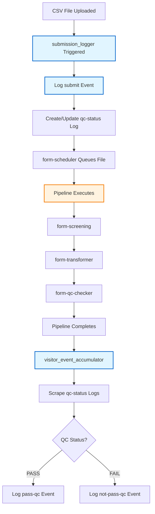
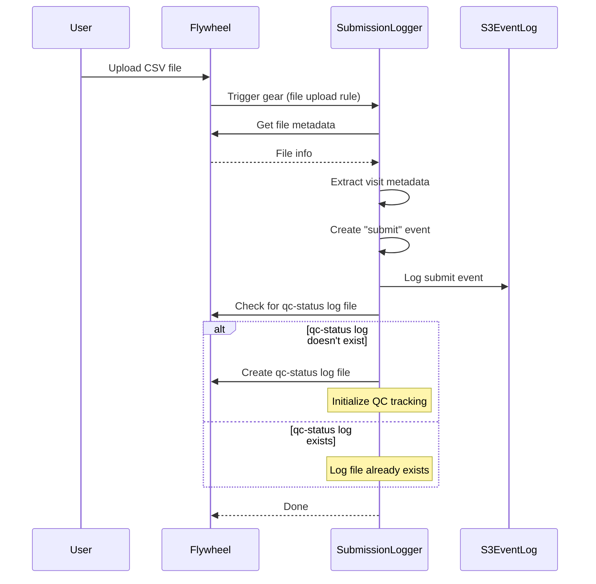

# Event Logging in Form Scheduler

## Overview

The NACC Data Platform uses a two-component approach to log visit events throughout the data pipeline lifecycle:

1. **submission_logger gear**: Captures submit events when files are uploaded, creates qc-status log files
2. **visitor_event_accumulator**: Scrapes non-submit events (pass-qc, not-pass-qc) from qc-status log files

This document explains how event logging works for developers unfamiliar with the system.

## What Events Are Logged

Three types of events track the visit lifecycle:

- **submit**: Records when a visit is submitted for processing
  - Logged by **submission_logger gear** when file is uploaded
  - Creates qc-status log file if one doesn't exist
  - Uses upload timestamp
  
- **pass-qc**: Records when a visit successfully completes all QC checks
  - Logged by **visitor_event_accumulator** after pipeline completes
  - Scraped from qc-status log files
  - Uses completion timestamp

- **not-pass-qc**: Records when a visit fails QC validation
  - Logged by **visitor_event_accumulator** after pipeline completes
  - Scraped from qc-status log files
  - Uses completion timestamp

## Key Concepts

### Flywheel Container Hierarchy

Understanding the Flywheel container structure is essential:


**Key Points:**

- **Project Files**: CSV files uploaded by users and QC log files are stored at PROJECT level
- **Session** = Visit (e.g., "FORMS-VISIT-01" represents visit number "01")
- **Acquisition** = Module (e.g., "UDS", "FTLD", "LBD")
- **CSV files** can contain multiple visits and are uploaded to PROJECT level
- **QC log files** are created at PROJECT level (one per visit: `{ptid}_{visitdate}_{module}_qc-status.log`)
- **JSON files** are created at ACQUISITION level (one per visit/module combination)
- Events are tracked by visit_number, extracted from the session label

### Multi-Visit Processing

A single CSV file can contain data for multiple visits. The pipeline processes each visit separately:

1. User uploads CSV with visits 01, 02, 03 to PROJECT level
2. form-screening validates the CSV format
3. identifier-lookup provisions identifiers and creates QC log files at PROJECT level (one per visit)
4. form-transformer splits CSV into separate JSON files (one per visit) attached to ACQUISITION level
5. form-qc-checker validates each visit independently and updates QC metadata
6. Each visit generates its own pair of events

**Important Notes:**
- If pipeline fails at identifier-lookup or form-transformer, no JSON file is created at ACQUISITION level
- QC log files at PROJECT level are still created and track the failure
- Not all modules have visit numbers in session labels (module-specific configuration)

### File Locations

Understanding where files are stored is important for event logging:

- **CSV files**: Uploaded to PROJECT level, can contain multiple visits
- **QC log files**: Created at PROJECT level by identifier-lookup gear, one per visit
  - Naming pattern: `{ptid}_{visitdate}_{module}_qc-status.log`
  - Example: `110001_2024-01-15_UDS_qc-status.log`
  - Always created, even if pipeline fails
- **JSON files**: Created at ACQUISITION level by form-transformer, one per visit/module
  - Naming pattern: `{ptid}_FORMS-VISIT-{visitnum}_{module}.json` (for modules with visit numbers)
  - Example: `110001_FORMS-VISIT-01_UDS.json`
  - Only created if pipeline succeeds through form-transformer
  - Not created if pipeline fails at identifier-lookup or form-transformer

## Event Logging Architecture

### Two-Component Approach

Event logging is split between two components:

**1. submission_logger gear (Submit Events)**
- Triggered when a file is uploaded to Flywheel
- Logs "submit" event immediately
- Creates qc-status log file if one doesn't exist
- Runs as a gear rule on file upload

**2. visitor_event_accumulator (Outcome Events)**
- Runs after pipeline completes in form-scheduler
- Scrapes qc-status log files for QC metadata
- Logs "pass-qc" or "not-pass-qc" events based on QC status
- Works with both CSV files (submission pipeline) and JSON files (finalization pipeline)

**Key Benefits:**
- Submit events captured immediately at upload time
- Outcome events captured after pipeline processing
- QC status log files serve as single source of truth
- Decoupled components for better separation of concerns

### VisitorEventAccumulator Class

The `VisitorEventAccumulator` class in form-scheduler:

- Uses visitor pattern to traverse qc-status log files
- Extracts visit metadata and QC status from log files
- Creates VisitEvent objects for outcome events
- Writes events to S3 via VisitEventLogger
- Filters log files by modification timestamp to process only relevant files

## Process Flow

### High-Level Overview



### When File is Uploaded

When a CSV file is uploaded to Flywheel, the submission_logger gear is triggered:



**What happens:**

1. User uploads CSV file to PROJECT level
2. Flywheel triggers submission_logger gear via file upload rule
3. submission_logger extracts visit metadata from file
4. Logs "submit" event to S3 with upload timestamp
5. Checks if qc-status log file exists at PROJECT level
6. Creates qc-status log file if it doesn't exist
7. Gear completes

**Submit event is logged immediately at upload time.**

**Note:** The qc-status log file serves as the single source of truth for QC status throughout the pipeline.

### When Pipeline Completes

After the pipeline completes, form-scheduler uses visitor_event_accumulator to log outcome events:


**What happens:**

1. Pipeline completes in form-scheduler
2. visitor_event_accumulator is invoked with the processed file
3. Finds qc-status log files at PROJECT level modified after file upload
4. For each qc-status log file:
   - Uses visitor pattern to traverse QC metadata
   - Extracts visit metadata (ptid, visit_date, visit_number, packet)
   - Checks overall QC status from all gears
   - Creates outcome event ("pass-qc" or "not-pass-qc")
   - Logs event to S3 with completion timestamp

**Outcome events are scraped from qc-status log files.**

**Note:** The visitor pattern allows flexible traversal of QC metadata structure without hardcoding gear names or pipeline stages.

## Determining Pipeline Success

The gear determines pipeline success by checking QC metadata in the JSON file.

**CRITICAL: "pass-qc" event is ONLY logged when BOTH conditions are met:**
1. **JSON file exists** at ACQUISITION level (proves form-transformer succeeded)
2. **ALL gears have status="PASS"** in QC metadata

```python
def __check_pipeline_success(file, module) -> bool:
    """Check if pipeline completed successfully using QC metadata.
    
    Returns True ONLY if:
    1. JSON file exists at ACQUISITION level
    2. ALL pipeline gears have status="PASS"
    """
    # Find JSON file in acquisition
    json_file = find_json_file(acquisition, module)
    
    if not json_file:
        # No JSON = early failure at identifier-lookup or form-transformer
        # This is ALWAYS a failure - cannot log "pass-qc"
        return False
    
    # Parse QC metadata using FileQCModel
    qc_model = FileQCModel.model_validate(json_file.info)
    
    # Check status of ALL pipeline gears
    pipeline_gears = ['form-screening', 'identifier-lookup', 
                      'form-transformer', 'form-qc-checker']
    
    for gear_name in pipeline_gears:
        status = qc_model.get_status(gear_name)
        
        if status is None:
            return False  # Gear hasn't run - failure
        
        if status != "PASS":
            return False  # Any non-PASS status is failure
    
    # ALL gears passed - this is the ONLY case for "pass-qc"
    return True
```

**QC Metadata Structure:**

Each gear writes its validation status to `file.info.qc`. Both QC log files (at PROJECT level) and JSON files (at ACQUISITION level) contain this metadata structure.

**For "pass-qc" events, we check the JSON file at ACQUISITION level and require ALL gears to have status="PASS".**

#### QC Log File (at PROJECT level)

**Filename**: `110001_2024-01-15_UDS_qc-status.log`

```yaml
file.info:
  qc:
    form-screening:
      validation:
        state: "PASS" | "FAIL" | "IN REVIEW"
        data: [FileError, FileError, ...]
        cleared: [...]
    form-transformer:
      validation:
        state: "PASS"
        data: []
    form-qc-checker:
      validation:
        state: "PASS"
        data: []
```

#### Visit JSON File (at ACQUISITION level)

**Filename**: `110001_FORMS-VISIT-01_UDS.json`

```yaml
file.info:
  forms:
    json:
      ptid: "110001"
      visitnum: "01"
      visitdate: "2024-01-15"
      packet: "I"
      module: "UDS"
      # ... other form fields
  qc:
    # Same structure as QC log file
    form-screening:
      validation:
        state: "PASS"
    form-transformer:
      validation:
        state: "PASS"
    form-qc-checker:
      validation:
        state: "PASS"
```

**Key Points:**

- QC log file at PROJECT level tracks pipeline progress for the visit
- Visit JSON file at ACQUISITION level contains both visit data and QC metadata
- Both files have the same `file.info.qc` structure with gear validation states
- Gears update BOTH the log file and the JSON file
- We can check either file for QC status (log file is canonical)

## Event Timing

Events use different timestamps to reflect when actions actually occurred:

### Successful Submission


- **submit event**: timestamp = 10:00 (upload_timestamp from Phase 1)
- **pass-qc event**: timestamp = 10:20 (completion_timestamp from Phase 2)
  - **Requirements met:**
    - ✅ JSON file exists at ACQUISITION level
    - ✅ ALL gears (form-screening, identifier-lookup, form-transformer, form-qc-checker) have status="PASS"
- Both events logged at 10:20, but with different timestamps

### Failed Submission


- **submit event**: timestamp = 10:00 (upload_timestamp from Phase 1)
- **not-pass-qc event**: timestamp = 10:08 (completion_timestamp from Phase 2)
- Both events logged at 10:08, but with different timestamps

## Data Structures

### PendingVisitData

Holds partial visit data until pipeline completes:

```python
class PendingVisitData(BaseModel):
    ptid: str                      # Participant ID
    visit_date: str                # Visit date (YYYY-MM-DD format) - part of key
    visit_number: str              # e.g., "01", "02"
    session_id: str                # Session container ID
    acquisition_id: str            # Acquisition container ID
    module: str                    # e.g., "UDS" - part of key
    project_label: str             # e.g., "ingest-form" (ADRC), "ingest-form-dvcid"
    center_label: str              # e.g., "alpha"
    pipeline_adcid: int            # ADCID for event routing
    upload_timestamp: datetime     # For "submit" event
    completion_timestamp: Optional[datetime] = None  # For outcome event
    csv_filename: str = ""         # For logging/debugging
```

**Key**: Pending data is keyed by `VisitKey(ptid, visit_date, module)` - a NamedTuple that aligns with the QC log file naming pattern.

**Note**: There is only one visit per year per participant at a center (ADCID). However, each visit can have multiple modules (UDS, FTLD, LBD, etc.), so module is included in the key to distinguish between different module submissions for the same visit.

### VisitEvent

Complete event object logged to S3:

```python
class VisitEvent(BaseModel):
    action: str                    # "submit", "pass-qc", "not-pass-qc"
    study: str                     # Study identifier (e.g., "adrc", "dvcid", "leads")
    pipeline_adcid: int            # ADCID for event routing
    project_label: str             # Project name (e.g., "ingest-form", "ingest-form-dvcid")
    center_label: str              # Center name
    gear_name: str                 # "form-scheduler"
    ptid: str                      # Participant ID
    visit_date: date               # Visit date
    visit_number: str              # Visit number
    datatype: str                  # "form"
    module: str                    # "UDS", "FTLD", "LBD", etc.
    packet: Optional[str]          # Packet type
    timestamp: datetime            # When action occurred
```

## Integration Points

### submission_logger Gear

Configured as a Flywheel gear rule:
- **Trigger**: File upload to PROJECT level
- **Action**: Run submission_logger gear
- **Inputs**: Uploaded file
- **Outputs**: Submit event to S3, qc-status log file created/updated

### In FormSchedulerQueue.__init__

Create the visitor event accumulator:

```python
self.__event_accumulator = EventAccumulator(
    pipeline=pipeline,
    event_logger=event_logger
)
```

### In _process_pipeline_queue

After pipeline completes:

```python
# After: JobPoll.wait_for_pipeline(self.__proxy, job_search)

# Log outcome events by scraping qc-status logs
if self.__event_accumulator:
    try:
        self.__event_accumulator.log_events(
            file=file,
            project=self.__project
        )
    except Exception as error:
        log.warning(f"Failed to log events for {file.name}: {error}")
```

## Key Design Principles

1. **Separation of concerns**: Submit events (submission_logger) separate from outcome events (visitor_event_accumulator)
2. **Non-invasive**: Event logging doesn't change pipeline execution
3. **Immediate submit capture**: Submit events logged at upload time via gear rule
4. **QC log as source of truth**: qc-status log files track QC status throughout pipeline
5. **Visitor pattern**: Flexible traversal of QC metadata without hardcoding gear names
6. **Dual timestamps**: Captures both upload and completion times
7. **Robust**: Uses existing QC infrastructure to determine success/failure

## Error Handling

The event logging process includes robust error handling:

- If visit_number cannot be extracted, logs warning and skips event logging
- If pipeline_adcid is missing, logs warning and skips event logging
- If JSON file is not found, logs warning and skips event logging
- If visit metadata is incomplete, logs warning and skips event logging
- All errors are logged but don't fail the gear execution
- Pending data is always cleaned up, even on error

## Event Storage in S3

Events are written to S3 in a flat structure organized by environment.

### S3 Path Structure

```
s3://event-bucket/
├── prod/
│   ├── log-submit-{YYYYMMDD-HHMMSS}-{adcid}-{project}-{ptid}-{visitnum}.json
│   ├── log-pass-qc-{YYYYMMDD-HHMMSS}-{adcid}-{project}-{ptid}-{visitnum}.json
│   └── log-not-pass-qc-{YYYYMMDD-HHMMSS}-{adcid}-{project}-{ptid}-{visitnum}.json
└── dev/
    └── ...
```

**Filename Format**: `log-{action}-{timestamp}-{adcid}-{project}-{ptid}-{visitnum}.json`

Where:
- **action**: Event type (`submit`, `pass-qc`, `not-pass-qc`)
- **timestamp**: Event timestamp in format `YYYYMMDD-HHMMSS` (when action occurred)
- **adcid**: Pipeline ADCID
- **project**: Project label (sanitized)
- **ptid**: Participant ID
- **visitnum**: Visit number

### Example

For a visit with:
- environment: `prod`
- pipeline_adcid: `42`
- project_label: `ingest-form` (ADRC study)
- ptid: `110001`
- visit_number: `01`
- submit timestamp: `2024-01-15T10:00:00Z`
- pass-qc timestamp: `2024-01-15T10:20:00Z`

Events are written to:
```
s3://event-bucket/prod/log-submit-20240115-100000-42-ingest-form-110001-01.json
s3://event-bucket/prod/log-pass-qc-20240115-102000-42-ingest-form-110001-01.json
```

For a DVCID study visit:
```
s3://event-bucket/prod/log-submit-20240115-100000-44-ingest-form-dvcid-110003-01.json
```

### Event File Format

Each event file contains a JSON object with the complete VisitEvent data:

```json
{
  "action": "submit",
  "study": "adrc",
  "pipeline_adcid": 42,
  "project_label": "ingest-form",
  "center_label": "alpha",
  "gear_name": "form-scheduler",
  "ptid": "110001",
  "visit_date": "2024-01-15",
  "visit_number": "01",
  "datatype": "form",
  "module": "UDS",
  "packet": "I",
  "timestamp": "2024-01-15T10:00:00Z"
}
```

### Design Rationale

The flat structure optimizes for the primary use case: scraping all events into a single Parquet table.

**Advantages:**
- Simple listing: Single S3 LIST operation gets all events
- Efficient filtering: Glob patterns work directly on filenames
- Chronological ordering: Natural sort by filename gives time order
- Self-documenting: Key metadata visible in filename
- No recursive traversal needed

## Important Considerations

### QC Approval Workflow

The "pass-qc" event can be triggered in multiple scenarios:

1. **Immediate success**: Pipeline completes successfully with no QC alerts
   - Both "submit" and "pass-qc" events logged in the same form-scheduler job
   
2. **Deferred approval**: Pipeline completes with QC alerts that are later approved
   - "submit" and "not-pass-qc" events logged initially
   - "pass-qc" event logged later when alerts are approved
   - This happens in a separate form-scheduler job
   
3. **Dependency resolution**: Visits blocked on dependencies get re-evaluated
   - Example: Follow-up visits or modules blocked on UDS packet
   - When blocking dependency is cleared (e.g., UDS packet passes QC), blocked visits are re-evaluated
   - "pass-qc" event logged WITHOUT a corresponding "submit" event in the same job
   - The original "submit" event was logged when the visit was first uploaded

### Modules Without Visit Numbers

Not all modules include visit numbers in their session labels. For modules without visit numbers:
- Event logging will be skipped (cannot extract visit_number as tracking key)
- Alternative tracking mechanisms may be needed for such modules

### Early Pipeline Failures

If the pipeline fails at identifier-lookup or form-transformer:
- No JSON file is created at ACQUISITION level
- QC log files at PROJECT level still exist and track the failure
- Event logging requires visit metadata from JSON files, so events cannot be logged for early failures
- **This is ALWAYS a "not-pass-qc" scenario** - JSON file is required for "pass-qc"

## Summary

Event logging in form-scheduler uses a two-phase accumulation strategy for new submissions:

1. **Phase 1** (record_file_queued): Capture upload timestamp when file is queued
2. **Phase 2** (finalize_and_log_events): Complete metadata and log events after pipeline

This approach ensures:
- Complete event data with accurate timestamps
- No interference with pipeline execution
- Reliable success/failure detection using QC metadata
- Clean separation of concerns between pipeline and event logging
- Structured event storage in S3 for downstream processing

**Event Patterns:**

- **New submission with existing metadata**: Submit event logged at queue time, outcome event logged at completion
- **New submission without metadata**: Both submit and outcome events logged at completion
- **Re-evaluation**: Only outcome event logged (no "submit" event)

**Metadata Sources (in order of preference):**
1. QC log file at PROJECT level (created by identifier-lookup, always available)
2. JSON file at ACQUISITION level (created by form-transformer, may not exist for early failures)
  - Examples: QC approval, dependency resolution (UDS packet cleared)

**Current Limitations:**
- Requires visit numbers in session labels (module-specific)
- Requires JSON files at ACQUISITION level (fails for early pipeline failures)
- Re-evaluation scenarios not fully implemented (returns early if no pending data)
  - Need to extract metadata from JSON only, without pending data
  - Need to decide: log "submit" with completion timestamp, or skip "submit" entirely
