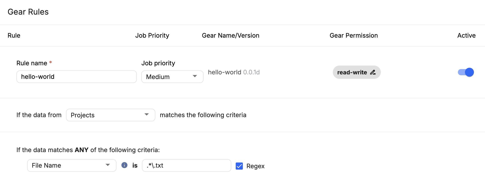
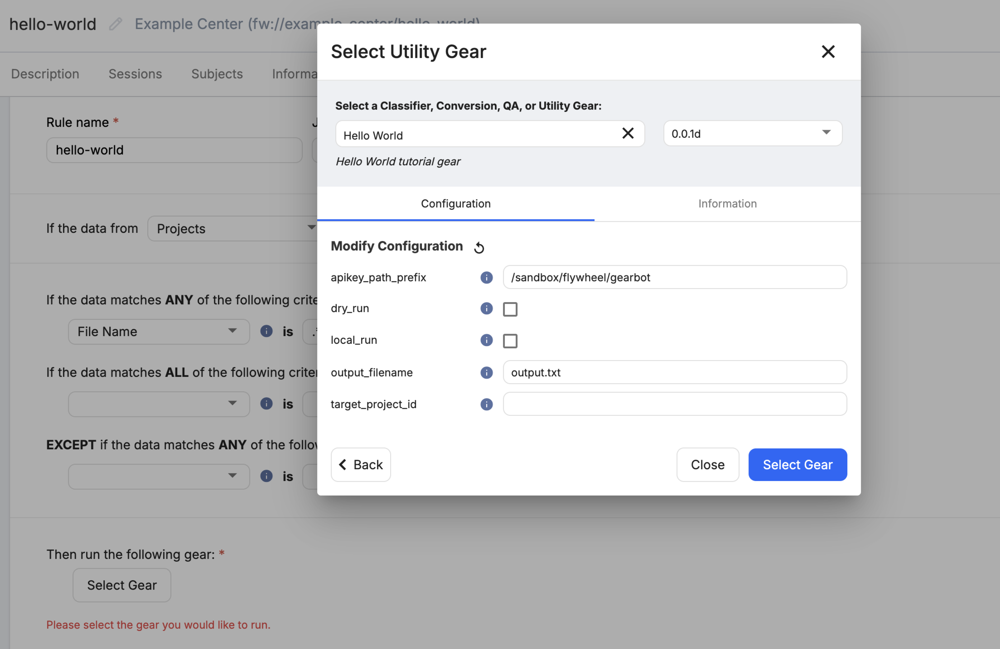
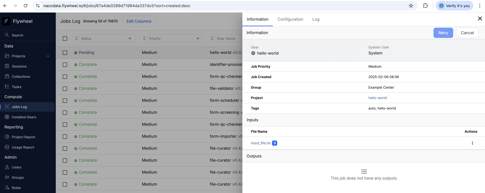
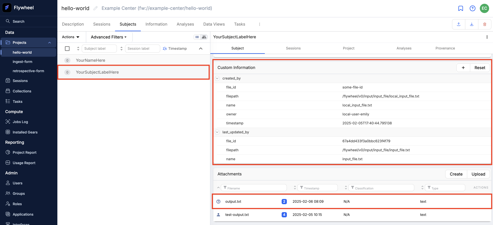
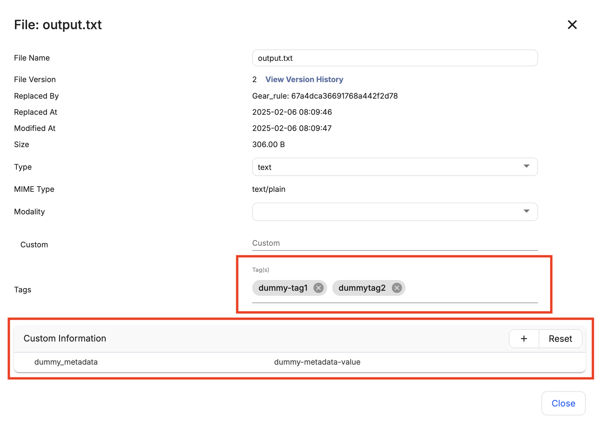
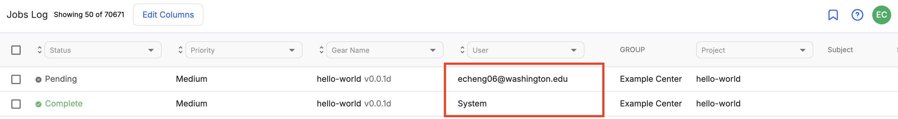

# Hello World Gear

The following tutorial outlines developing and running a basic gear in the context of NACC's Flywheel environment.

**Please do this tutorial on a separate branch and do NOT push your hello-world gears to main.**

* [Set Up](#set-up)
* [Hello World](#hello-world)
    * [Creating the Gear](#creating-the-gear)
    * [Configurations and Parameters](#configurations-and-parameters)
        * [Manifest](#manifest)
        * [API Keys](#api-keys)
        * [Output Files](#output-files)
        * [Local Runs](#local-runs)
    * [Developing the Gear](#developing-the-gear)
        * [run.py](#runpy)
        * [main.py](#mainpy)
    * [Building and Uploading the Gear](#building-and-uploading-the-gear)
    * [Running the Gear](#running-the-gear)
        * [Locally](#locally)
            * [Passing Environment Variables](#passing-environment-variables)
            * [Development Cycle](#development-cycle)
        * [Triggering through Gear Rules](#triggering-through-gear-rules)
            * [Monitoring and Viewing Result](#monitoring-and-viewing-results)
        * [Programmatically Triggering](#programmatically-triggering)

## Set Up

Before we begin, please ensure you have access to NACC's Sandbox Flywheel instance ([nacc.flywheel.io](https://naccdata.flywheel.io/)), as well as read-write permissions to the [hello-world](https://naccdata.flywheel.io/#/projects/6792d642e6aa584a8b16cf7a) project this tutorial will take place in. If you do not have access, reach out to the NACC Tech Team or [nacchelp@uw.edu](mailto:nacchelp@uw.edu).

> While not strictly necessary for this tutorial, if you want to actually upload the gear to Flywheel you will also need site-wide admin access - if you do not require site-level admin access otherwise, you can use a version of this gear already uploaded to Flywheel.

Additionally, it is advised to do gear development in the VS Code devcontainer environment, otherwise you may run into build issues (developing on MacOS with Apple Silicon in particular is known to be finicky about this). You can follow the steps in the [Getting Started](../development/index.md#getting-started) guide.

> Even if you opt out of using the VS Code devcontainer, you will still need [Pants](https://www.pantsbuild.org/) installed in your environment in order to build the gears.

While this tutorial will go through each component explicitly, it will echo a lot of the documentation already provided in the [Development Guide](../development/index.md) which is a great general guide for gear development. Flywheel's [Gear Development Guide](https://docs.flywheel.io/Developer_Guides/dev_gear_building_tutorial_part_1_developing_gears/) is also a great resource, particularly in regards to Flywheel-specific nuances.

# Hello World

In this tutorial we will write a basic gear that reads a plain text input file containing a subject label and associated metadata, creates a subject based on that information, and also writes an output file to that subject. Along the way it will grab information about the context the gear it is running in to illustrate navigating through the Flywheel hierarchy. We will then walk through how to execute the gear, both locally and through the UI. 

A complete example of this can be found under `hello_world_example`.

**Please do this tutorial on a separate branch and do NOT push your hello-world gears to main.**

## Creating The Gear

Also see [Adding a New Gear](../development/index.md#adding-a-new-gear) in the Development Guide.

Each gear is set up using [cookiecutter](https://cookiecutter.readthedocs.io/en/stable/installation.html) templates. Ensure `cookiecutter` is installed in your environment, and then in the root of the repo run

```bash
cookiecutter templates/gear --output-dir gear/
```

with the following values when prompted (defaults are used for everything except steps 1 and 2)

```bash
[1/9] gear_name (Gear Name): Hello World
[2/9] gear_description (A NACC gear for Flywheel): Hello World tutorial gear
[3/9] package_name (hello-world): 
[4/9] module_name (hello_world): 
[5/9] app_name (hello_world_app): 
[6/9] class_name (HelloWorld): 
[7/9] image_tag (0.0.1): 
[8/9] author (NACC): 
[9/9] maintainer (NACC <nacchelp@uw.edu>): 
```

You will now find your newly-created gear under `gear/hello_world`. The gear components are discussed in detail in [Gear Details](https://github.com/naccdata/flywheel-gear-extensions/blob/main/docs/development/gear-details.md).

You will also want to set up the documentation for your gear, which is similarly created with

```bash
cookiecutter templates/docs --output-dir docs/
```

with the following values when prompted (defaults are used for everything except steps 1 and 2)

```bash
[1/3] gear_name (Gear Name): Hello World
[2/3] gear_description (A NACC gear for Flywheel): Hello World tutorial gear documentation
[3/3] module_name (hello_world): 
```

The generated docs can be found under `docs/hello_world`. This creates both an `index.md`, which is the written documentation for your gear, as well as the `CHANGELOG.md` for keeping track of the different versions. While not necessary just for the sake of developing a runnable gear, it is a good idea to keep these two files updated throughout gear iteration, not just for yourself but also your fellow developers. See [Documenting and Versioning](https://github.com/naccdata/flywheel-gear-extensions/blob/main/docs/development/index.md#documenting-and-versioning) for more details.

## Configurations and Parameters

We will start by defining our gear's inputs and configuration values which are defined in the `manifest.json`. See [Flywheel's manifest documentation](https://docs.flywheel.io/Developer_Guides/dev_gear_building_tutorial_part_5_the_manifest/) for more information on the manifest JSON.

### Manifest

For now, you can think of the manifest as where we define our **inputs** and **configuration values**, and lives under `src/docker/manifest.json`. The cookiecutter template will have already set up a basic one for you; update the `inputs` and `config` sections of the manifest to look like the following:

```json
    "inputs": {
        "api-key": {
            "base": "api-key"
        },
        "input_file": {
            "description": "The input file containing the name of the subject to create",
            "base": "file",
            "type": {
                "enum": [
                    "source code"
                ]
            }
        }
    },
    "config": {
        "output_filename": {
            "description": "Name of output file to write to",
            "type": "string"
        },
        "local_run": {
            "description": "Whether or not this is a local run",
            "type": "boolean",
            "default": false
        },
        "target_project_id": {
            "description": "Target project ID, must be set to a valid Flywheel project ID if using local_run. Otherwise if set to the empty string, uses the input_file's parent project.",
            "type": "string",
            "default": ""
        },
        "dry_run": {
            "description": "Whether to do a dry run",
            "type": "boolean",
            "default": false
        },
        "apikey_path_prefix": {
            "description": "The instance specific AWS parameter path prefix for apikey",
            "type": "string",
            "default": "/sandbox/flywheel/gearbot"

        }
```

### API Keys

Notice how we left in `api-key` and `apikey_path_prefix` - these are included in every gear we write, and are necessary to ensure the correct user permissions are being used within the given gear context.

The `api-key` corresponds to an user's Flywheel API key. `apikey_path_prefix` is similar - it tells the gear where in the AWS parameter store to grab the gear bot's API key. NACC's Flywheel instances are configured to provide the environment variables with AWS credentials necessary for the gear/gear bot to access AWS resources*, including said parameter store. See the [Gear Bot documentation](./gear-bot.md) for more information.

The Hello World gear does not actually need nor use the Gear Bot, as it is isolated to a single project (`example-center/hello-world`) - however most of the gears _will_ need it, so is left in for demonstration purposes.

> \* One important nuance is that a new gear will not automatically get these AWS environment variables passed - Flywheel needs to add it to the NACC credentials condor. The easiest way is to send [Flywheel a support ticket](https://support.flywheel.io/hc/en-us/requests/new) and ask for the gear(s) "to be added to the credentials condor". This `hello-world` gear we are about to write is already on the list, so you do not have to worry about that for this tutorial.

### Output Files

Flywheel and its gears are file-based, so any dynamic input value should come from an input file. Configuration parameters on the other hand usually remain relatively static within a given context; for example setting `apikey_path_prefix` to either `/sandbox/flywheel/gearbot` or `/prod/flywheel/gearbot`. This is especially true if the gear is intended to be automatically triggered via [Gear Rules](https://docs.flywheel.io/user/compute/gears/user_gear_rules/), which we will talk about in more detail later in this tutorial.

Outputs are defined a little less explicitly - essentially, _any_ file saved to the `output` directory in Flywheel's hierarchy will be saved under the corresponding acquisitions if it's an utility gear, or in the separate analysis container if an analysis gear. See [The Flywheel Environment](https://docs.flywheel.io/Developer_Guides/dev_gear_building_tutorial_part_3_the_flywheel_environment/) for more information.

Within NACC, however, we tend to directly write/upload files at all levels of the hierarchy - in this tutorial we will write a file and attach it to a subject. These must be _explicitly_ uploaded within your gear, which is why we have set the `output_filename` as a configuration value as opposed to an actual file. Either way, we usually "parameterize" the output file by specifying the output filename, to avoid having it hardcoded within the gear itself.

### Local Runs

Running a gear that locally is a bit tricky especially if you want to modify data in Flywheel, since local files don't have the container and metadata information associated with them the same way Flywheel objects do. Both the `local_run` and `target_project_id` variables will be used throughout the gear to get around that limitation.

## Developing the Gear

### run.py

Next we will define the `run.py`, which you can think of as the **entrypoint** to the gear (we will gloss over the specifics, but in a nutshell the Pants environment creates a binary executable `.pex` with this entrypoint which the Docker image/gear ends up calling). 

Navigate to `src/python/run.py` where a template has been set up. At the bottom you'll notice there is an executable `main` which sets up the [GearEngine](../common/src/gear_execution/gear_execution.py). This `GearEngine` sets up the `GearToolKitContext` (discussed in a moment) and runs the `HelloWorldVisitor`.

The commented out code showcases creating the `GearEngine` with a parameter store, which is required if using the Gear Bot. 

```python
def main():
    """Main method for Hello World."""
    GearEngine().run(gear_type=HelloWorldVisitor)

    # if using the Gear Bot
    # GearEngine.create_with_parameter_store().run(
    #     gear_type=HelloWorldVisitor)

if __name__ == "__main__":
    main()

```

Your job is to define the `HelloWorldVisitor` and its `run` method, which comes in two parts:

1. Define the `create` method. This works in conjunction with the `__init__` method and is generally where you pull configuration values from. This is done through the `GearToolkitContext`, which you can learn more about [here](https://flywheel-io.gitlab.io/public/gear-toolkit/flywheel_gear_toolkit/context/). This context is primarily how we handle reading in inputs/configuration values along with adding custom information, but is generally useful for other things as well (you can directly access [Flywheel's SDK client](https://flywheel-io.gitlab.io/product/backend/sdk/tags/19.5.0/python/index.html) through this context).

```python
class HelloWorldVisitor(GearExecutionEnvironment):
    """Visitor for the Hello World gear."""

    def __init__(self,
                 client: ClientWrapper,
                 input_file: InputFileWrapper,
                 target_project_id: str,
                 output_filename: str,
                 local_run: bool = False):
        super().__init__(client=client)

        if local_run and not target_project_id:
            raise ValueError("If local run is set to true, a "
                             "target project ID must be provided")

        self.__input_file = input_file
        self.__target_project_id = target_project_id
        self.__output_filename = output_filename
        self.__local_run = local_run

    @classmethod
    def create(
        cls,
        context: GearToolkitContext,
        parameter_store: Optional[ParameterStore] = None
    ) -> 'HelloWorldVisitor':
        """Creates a HelloWorldVisitor object.

        Args:
            context: The gear context.
            parameter_store: The parameter store
        Returns:
          the execution environment
        Raises:
          GearExecutionError if any expected inputs are missing
        """
        client = ContextClient.create(context=context)

        # # Gear Bot version
        # client = GearBotClient.create(context=context,
        #                               parameter_store=parameter_store)

        output_filename = context.config.get('output_filename', None)
        target_project_id = context.config.get('target_project_id', None)
        local_run = context.config.get('local_run', False)

        if not output_filename:
            raise GearExecutionError("Output filename not defined")


        input_file = InputFileWrapper.create(input_name='input_file',
                                             context=context)

        return HelloWorldVisitor(client=client,
                                 input_file=input_file,
                                 target_project_id=target_project_id,
                                 output_filename=output_filename,
                                 local_run=local_run)
```

* `client` is what interacts with Flywheel. You can also use a `ContextClient` will just use your API key (`api-key`), or the commented out version uses `GearBotClient` which uses the Gear Bot API Key, pulled from `apikey_path_prefix`, and is usually what is used for the majority of our NACC gears
    * Behind the scenes, this client is a wrapper around the `GearToolkitContext`'s client
    * Using the Gear Bot requires the correct AWS environment variables set up, which will be discussed more when we get to running the gear
* `context.config` allows you to access the configuration values like a normal Python dict; we pull out `output_filename` and ensure it's set, if not throw a GearExecutionError. Similarly we extract `target_project_id` and `local_run`, setting defaults if not defined
* Grabbing file inputs is done by creating an `InputFileWrapper`, which takes the specified file from the context and wraps it with useful methods and properties

The above are used to create a `HelloWorldVisitor`, which implements the abstract `GearExecutionEnvironment`. It uses the client to create a [FlywheelProxy](../common/src/python/flywheel_adaptor/flywheel_proxy.py) object, which will be our primary means of dealing with anything related to Flywheel.

2. Now let's look at the visitor's `run` method:

```python
from hello_world_app.main import run

    def run(self, context: GearToolkitContext) -> None:
        """Run the Hello World gear."""

        # if target project ID is not set, try to grab it from the
        # input file's parent
        try:
            if not self.__target_project_id:
                file_id = self.__input_file.file_id
                file = self.proxy.get_file(file_id)
                project = self.proxy.get_project_by_id(file.parents.project)
            else:
                project = self.proxy.get_project_by_id(self.__target_project_id)
        except ApiException as error:
            raise GearExecutionError(
                f'Failed to find the input file and/or project: {error}') from error

        project = ProjectAdaptor(project=project, proxy=self.proxy)
        log.info(f"Running in group {project.group}, project {project.label}")

        run(proxy=self.proxy,
            context=context,
            project=project,
            input_file=self.__input_file,
            output_filename=self.__output_filename,
            local_run=self.__local_run)
```

The `proxy` is our primary means of interacting with Flywheel, in particular looking up and grabbing data; it differs from `context` in that `context` is more about this specific execution whreas `proxy` is used for looking up things that already exist in Flywheel.

The try block is locating the actual file and project contexts from Flywheel using the file's ID, and throwing a `GearExecutionError` if the file does not exist (if doing a local run, we just directly pass the project ID). We then wrap project around a `ProjectAdaptor`, which wraps the raw project context into a wrapper with useful properties and methods.

We then execute the main `run`, which was imported from `hello_world_app.main`, which we will fill out in the next section.

### main.py

The next file we will look at `main.py`, which can be considered the main execution of your gear. This is where the actual "work" you want your gear to do should happen. In this case we have a single `run` method, but your gear could develop into a more detailed Python module.

The main thing to keep in mind is that this is a monorepo, and a lot of common code has already been extracted under `common/src/python`. It is advised to use the common code as much as possible. You simply need to import them like any other Python module, as shown below. We will not go into great detail on it here, but this is possible thanks to the Pants build this repository is set up with. If you need to add a dependency, adding it to `requirements.txt` in the root of the repo will apply it to the entire codebase.

```python
# from common/src/python
from flywheel_adaptor.flywheel_proxy import FlywheelProxy, ProjectAdaptor
from flywheel_gear_toolkit import GearToolkitContext
from gear_execution.gear_execution import InputFileWrapper
from utils.utils import parse_string_to_list
```

The primary ones to use are the Flywheel adaptors, e.g. wrappers around Flywheel containers. We have already used `FlywheelProxy` and `ProjectAdaptor`, which is a proxy for the Flywheel client and adaptor for a Flywheel project, respectively. There are also adaptors for the Group (`GroupAdaptor`) and Subject ([SubjectAdaptor](../common/src/python/flywheel_adaptor/subject_adaptor.py))) containers, the latter of which we will use in this gear.

Our `main.run` method takes in the following parameters:

```python
def run(proxy: FlywheelProxy,
        context: GearToolkitContext,
        project: ProjectAdaptor,
        input_file: InputFileWrapper,
        output_filename: str,
        local_run: bool = False) -> None:
    """Runs the Hello World process.

    Args:
        proxy: the proxy for the Flywheel instance, for
            interacting with Flywheel
        context: GearToolkitContext, for applying custom
            information updates to the input file
        project: The corresponding project of this file
        input_file: InputFileWrapper to read the input file
            from, pulls the subject to create and metadata
            to add
        output_filename: Name of file to write results to
            and attach to the created subject
        local_run: Whether or not this is a local run, may
            block certain actions that cannot be done while
            iterating on a local file
    """
```

Let us walk through each step of our `main.py` logic:

1. **Reading the input file:** Remember that `input_file` is an `InputFileWrapper`, so the path we are actually opening to read is `input_file.filepath`:

```python
    # 1. read the name from the first line of the input file
    with open(input_file.filepath, mode='r') as fh:
        label = fh.readline().strip()
        tags = parse_string_to_list(fh.readline())
        metadata = fh.readline().strip()
        pass_qc = fh.readline().strip().upper() == 'YES'

    log.info(f"Read name {label} from input file")
    log.info(f"Read tags {tags} from input file")
    log.info(f"Read metadata {metadata} from input file")
```

2. **Adding a subject:** Using the label we pulled from the input file, we attempt to create a subject with that label. If a subject with that label already exists, we instead search for that one. In both cases, a `SubjectAdaptor` is returned and we add custom information about the input file we just evaluated, again pulled from the `InputFileWrapper`. The owner is a particular attribute that class does not expose, so we access it through the raw Flywheel entry (`input_file.file_input`).

> This is not very intuitive, but the proxy object always has a `dry_run` property, which is pulled from the same `dry_run` configuration value in the manifest if it exists (which in this case it does). We can use this to implement dry run logic.

```python
    # 2. add subject with label
    timestamp = datetime.now()
    if proxy.dry_run:
        log.info("DRY RUN: Would have created or looked up " +
                 f"subject with label {label}")
    else:
        log.info(f"Creating subject with label {label}")

        # add custom information to the subject with information about
        # the file it was created from
        subject_metadata = {
            'name': input_file.filename,
            'filepath': input_file.filepath,
            'owner': input_file.file_input['object']['origin']['id'],
            'file_id': input_file.file_id,
            'timestamp': timestamp
        }
        try:
            subject = project.add_subject(label)
            subject.update({"created_by": subject_metadata})
        except ApiException as error:
            log.warning(error)
            subject = project.find_subject(label)
            subject.update({"last_updated_by": subject_metadata})
```

3. **Updating Project custom information:** Next we look at the project, which was already grabbed in `run.py` and passed as a `ProjectAdaptor`. In this example we grab the project's custom information, and look for the `count` and `entries` fields, and then increment/append to them.

```python
    # 3. get project custom information and increment counter by 1
    # and then also add label to array
    log.info("Grabbing project custom information")
    project_info = project.get_info()
    if project_info.get('count', None) is None:
        project_info['count'] = 0

    if project_info.get('entries', None) is None:
        project_info['entries'] = []

    log.info(f"Previous count: {project_info['count']}")
    log.info(f"Previous entries: {project_info['entries']}")

    if proxy.dry_run:
        log.info("DRY RUN: Would have added to project metadata")
    else:
        log.info("Updating project metadata")
        project_info['count'] += 1
        project_info['entries'].append(label)
        project.update_info(project_info)
```

4. **Writing an output file and attaching it to the Subject:** Here we write to an output file with various attributes of our subject and project containers. We then define a `FileSpec` object and upload the file to our previously created/found subject. We could just as easily upload this file to the project, or create an acquisition and upload it there as well.

```python
    # 4. Write output file and attach it to the subject
    stream = StringIO()
    stream.write(f"Hello {label}!\n")
    stream.write(f"You were created or updated at {timestamp}\n")

    # we only have the subject if not a dry run
    if not proxy.dry_run:
        stream.write(f"Your ID is {subject.id}\n")

    stream.write(f"This is the URL of the site instance: {proxy.get_site()}\n")
    stream.write("And this is your project's information:\n")
    stream.write(f"Project ID: {project.id}\n")
    stream.write(f"Label: {project.label}\n")
    stream.write(f"Group: {project.group}")
    contents = stream.getvalue()

    if proxy.dry_run:
        log.info("DRY RUN: Would have written the following " +
                 f"to {output_filename}:")
        log.info(contents)
    else:
        log.info(f"Writing output to {output_filename} and " +
                 f"attaching it to subject {subject.label}")
        file_spec = FileSpec(name=output_filename,
                             contents=contents,
                             content_type='text/plain',
                             size=len(contents))

        # upload_file returns a list, so we grab index 0
        # since this only returns the file entry, we query the
        # proxy to get the actual Flywheel file
        output_file_entry = subject.upload_file(file_spec)[0]  # type: ignore
        output_file = proxy.get_file(output_file_entry['file_id'])

```

5. **Updating tags and custom information:** Next we update the tags and custom information of our files. There are two ways to do this: directly on a Flywheel file, as our `output_file` showcases, or through the `context.metadata`, described under the [GearContextToolKit.metadata here](https://flywheel-io.gitlab.io/public/gear-toolkit/flywheel_gear_toolkit/context/#writing-metadata-metadatajson). Note that in order to add tags/metadata, the target has to exist in Flywheel under some container, since tags and metadata only make sense in that context. This is mainly a concern when running things on local files, which is why the below checks `local_run` before attempting to write that information to `input_file`.

```python
    if proxy.dry_run:
        log.info(f"DRY RUN: Would have added tags: {tags}")
        log.info(f"DRY RUN: Would have added metadata: {metadata}")
    else:
        output_file.add_tags(tags)
        output_file.update_info({'dummy_metadata': metadata})

        if not local_run:
            context.metadata.add_file_tags(input_file.file_input,
                                           tags=['hello-world-processed'])
            context.metadata.add_qc_result(input_file.file_input,
                                           name='hello-world-qc',
                                           state='PASS' if pass_qc else 'NO',
                                           data=[{
                                               'msg':
                                               f'input file said {pass_qc}'
                                           }])
        else:
            log.info(
                "LOCAL RUN: cannot update metadata for input file, as it does "
                + "not belong to a Flywheel container")

```

And that's it for this gear! Feel free to modify the `main.py` for your own use case.

## Building and Uploading the Gear

**This step is highly recommended to be done in the VS Code devcontainer, otherwise your resulting gear may have incompatible architectural issues.**

Again, most of the following steps are outlined under the [development guide](../development/index.md#working-with-a-gear), but this tutorial will go over it a bit more explicitly. In a nutshell, the gears are built using [Pants](https://www.pantsbuild.org) and upload/management is done through the [fw-beta Flywheel CLI](https://flywheel-io.gitlab.io/tools/app/cli/fw-beta/). Ensure both are configured in your environment.

Before building, we also want to lint and format our gears. Any PR or merge to main will also run a [GitHub Action](https://github.com/naccdata/flywheel-gear-extensions/actions/workflows/pants.yml) which runs these same steps.

```bash
pants fmt gear/hello_world::
pants lint gear/hello_world::
pants check gear/hello_world::
```

Building is then simply

```bash
pants package gear/hello_world/src/docker/
```

The output should look similar to this:

```bash
$ pants package src/docker/
00:05:39.23 [INFO] Completed: Building docker image naccdata/hello-world:0.0.1d +1 additional tag.
00:05:39.23 [INFO] Wrote dist/gear.hello_world_example.src.docker/hello-world.docker-info.json
Built docker images: 
  * naccdata/hello-world:0.0.1d
  * naccdata/hello-world:latest
Docker image ID: sha256:991208f952a3c3abbbe01d099144a21c369ef7894b7dde83e05ae7d0299b1fb1
```

This creates a docker image using the information defined in the `manifest.json` - in this case, building the image will creates both the `naccdata/hello-world:0.0.1d` and `naccdata/hello-world:latest` images.

Uploading the gear to Flywheel then requires `fw-beta` as well as site-admin access - first make sure you are logged into the correct instance

```bash
fw-beta login
# entire your API key when prompted

fw-beta gear upload src/docker
```

Again using the `manifest.json`, the CLI will know to look for the `naccdata/hello-world:0.0.1d` image and push it to the Flywheel instance's docker registry.

**IMPORTANT NOTE:** Flywheel does not allow pushing the same image/version multiple times; so once the above `naccdata/hello-world:0.0.1d` is uploaded, an image with that same name/tag can't be uploaded again, so you must increment the version. In order to avoid pushing multiple minor changes to Flywheel, it is advised to test your gear locally before pushing your gear to the instance. In a similar vein, while we don't neccessarily follow a specific versioning schema, some developers use alpha characters to denote certain dev iterations, e.g. the `d` in this example.

## Running the Gear

There are several ways you can run a gear.

### Locally

This is the most ideal for development/debugging, but is a bit involved to get set up. Again, most of this utilizes the `fw-beta` CLI and is documented by [Flywheel here](https://docs.flywheel.io/Developer_Guides/dev_gear_building_tutorial_part_7_running_gear_locally/) as well as our own [development buide](../development.md#running-a-gear-locally), and again ensure you are logged into the correct Flywheel instance first.

In the context of this repo, the script `bin/set-up-gear-for-local-run.sh` simplifies some of the steps. For the Hello World gear:

```bash
fw-beta login
# entire your API key when prompted

./bin/set-up-gear-for-local-run.sh hello_world <YOUR-FW-API-KEY> example-center/hello-world sandbox
```

Inspecting the script, it runs the following commands:

```bash
config_dir="./gear/${GEAR}/src/docker"

# Set up config using defaults from manifest
fw-beta gear config --new $config_dir

# Set API key
fw-beta gear config -i api_key=$FW_API_KEY $config_dir

# Set destination for output
fw-beta gear config -d $FW_PATH $config_dir

# Set the apikey_path_prefix to specified fw context (sandbox or prod)
fw-beta gear config -c apikey_path_prefix="/${FW_CONTEXT}/flywheel/gearbot" $config_dir
```

This creates `gear/hello_world/docker/config.json`, which is based on the configuration defined in the adjacent `manifest.json`. Because `input_file` and `output_filename` were neither handled by the above script nor have default values, they need to be added manually (note `-i` for inputs and `-c` for configuration values).

We also set some of the other configuration values to override their defaults.

```bash
cd gear/hello_world
fw-beta gear config -i input_file="./src/data/input_file.txt" src/docker
fw-beta gear config -c output_filename='output.txt' src/docker
fw-beta gear config -c local_run=true src/docker
fw-beta gear config -c dry_run=true src/docker

# this ID corresponds to example-center/hello-world, which you can easily get from the URL or query with the Flywheel SDK
fw-beta gear config -c target_project_id='6792d642e6aa584a8b16cf7a' src/docker
```

You should now have a config file that looks similar to the following (do **NOT** push this file to the repo, especially if it contains secret keys!). Here I also manually modified `mimetype` to be `text/plain`, and `origin/id` to be `local-user-example`.

```json
{
    "config": {
        "local_run": true,
        "target_project_id": "",
        "dry_run": false,
        "apikey_path_prefix": "/sandbox/flywheel/gearbot",
        "output_filename": "output.txt"
    },
    "inputs": {
        "api-key": {
            "base": "api-key",
            "key": "<YOUR-FW-API-KEY>"
        },
        "input_file": {
            "base": "file",
            "location": {
                "name": "input_file.txt",
                "path": "/flywheel/v0/input/input_file/input_file.txt"
            },
            "object": {
                "size": 67,
                "type": null,
                "mimetype": "text/plain",
                "modality": null,
                "classification": {},
                "tags": [],
                "info": {},
                "zip_member_count": null,
                "version": 1,
                "file_id": "",
                "origin": {
                    "type": "user",
                    "id": "local-user-example"
                }
            }
        }
    },
    "destination": {
        "id": "6792d642e6aa584a8b16cf7a",
        "type": "project"
    }
}
```

Notice the format of `input_file`. If this were an actual Flywheel file, `object` would have a lot more filled out, but since we are using a local file in this case it just sets all of them to default values. The `location` is the file's location relative to the gear - you can think of `/flywheel/v0` as the working directory for the gear's Docker image, and this particular location is where Flywheel will put the input file to run on.

> If you want this to use/correspond to a file on Flywheel, you will need to get and manually apply this information, usually from looking up the file through the Flywheel SDK. However, it will still be treated like a "local" file

This also creates an `.input_map.json` which tells `fw-beta` where to find the actual input file for our next step.

Now that the configuration is set up, we need to prepare the correct directory structure for our gear. This is easily done with the following command (`-p` means `--prepare`).

```bash
fw-beta gear run -p src/docker
```

which will have the following output:

```bash
$ fw-beta gear run -p src/docker/
Building gear structure in /tmp/gear/hello-world_0.0.1d.
Populating inputs.
* Found file input with source path: /w/f/g/h/s/d/input_file.txt, 
        copying to destination: /t/g/h/i/i/input_file.txt

Success! Prepared gear structure in /tmp/gear/hello-world_0.0.1d
```

This creates the gear structure at `/tmp/gear/hello-world_0.0.1d` which simulates the directory structure when the gear is run in Flywheel. If you inspect that location, you can see that it moved our config, manifest, and input files to this location, as well as set up the output and working directories:

```bash
$ ls /tmp/gear/hello-world_0.0.1d/ -R
/tmp/gear/hello-world_0.0.1d/:
config.json  input  manifest.json  output  work

/tmp/gear/hello-world_0.0.1d/input:
input_file

/tmp/gear/hello-world_0.0.1d/input/input_file:
input_file.txt

/tmp/gear/hello-world_0.0.1d/output:

/tmp/gear/hello-world_0.0.1d/work:
```

Now we're ready to actually run our gear:

```bash
fw-beta gear run /tmp/gear/hello-world_0.0.1d
```

which will execute the earlier-generated `naccdata/hello-world:0.0.1d` image using the gear directory.

If all goes well, the output should look similar to the following:

```
$ fw-beta gear run /tmp/gear/hello-world_0.0.1d
Populating inputs.
* Found file input with source path: /w/f/g/h/s/d/input_file.txt, 
        copying to destination: /t/g/h/i/i/input_file.txt

Creating container from naccdata/hello-world:0.0.1d
WARNING: The requested image's platform (linux/amd64) does not match the detected host platform (linux/arm64/v8) and no specific platform was requested
[2963ms   INFO     ]  Log level is INFO
[2964ms   INFO     ]  Destination is project=6792d642e6aa584a8b16cf7a
[2964ms   INFO     ]  Input file "input_file" is input_file.txt from None=None
[2964ms   INFO     ]  Config "output_filename=test-output.txt"
[2964ms   INFO     ]  Config "target_project_id=6792d642e6aa584a8b16cf7a"
[2964ms   INFO     ]  Config "local_run=True"
[2964ms   INFO     ]  Config "dry_run=True"
[2964ms   INFO     ]  Config "apikey_path_prefix=/sandbox/flywheel/gearbot"
[3831ms   INFO     ]  Running in group example-center, project hello-world
[3832ms   INFO     ]  Read name YourSubjectLabelHere from input file
[3832ms   INFO     ]  Read tags ['dummy-tag1', 'dummytag2'] from input file
[3832ms   INFO     ]  Read metadata dummy-metadata-value from input file
[3833ms   INFO     ]  DRY RUN: Would have created or looked up subject with label YourSubjectLabelHere
[3833ms   INFO     ]  Grabbing project custom information
[4012ms   INFO     ]  Previous count: 12
[4012ms   INFO     ]  Previous entries: ['YourNameHere', 'YourNameHere', 'YourNameHere', 'YourNameHere', 'YourNameHere', 'YourNameHere', 'YourNameHere', 'YourSubjectLabelHere', 'YourSubjectLabelHere', 'YourSubjectLabelHere', 'YourSubjectLabelHere', 'YourSubjectLabelHere']
[4012ms   INFO     ]  DRY RUN: Would have added to project metadata
[4438ms   INFO     ]  DRY RUN: Would have written the following to test-output.txt:
[4438ms   INFO     ]  Hello YourSubjectLabelHere!
You were created or updated at 2025-02-06 01:03:59.864902
This is the URL of the site instance: https://naccdata.flywheel.io
And this is your project's information:
Project ID: 6792d642e6aa584a8b16cf7a
Label: hello-world
Group: example-center
[4438ms   INFO     ]  DRY RUN: Would have added tags: ['dummy-tag1', 'dummytag2']
[4438ms   INFO     ]  DRY RUN: Would have added metadata: dummy-metadata-value
Args passed to container: ['docker', 'run', '-v', '/tmp/gear/hello-world_0.0.1d/input:/flywheel/v0/input', '-v', '/tmp/gear/hello-world_0.0.1d/output:/flywheel/v0/output', '-v', '/tmp/gear/hello-world_0.0.1d/work:/flywheel/v0/work', '-v', '/tmp/gear/hello-world_0.0.1d/config.json:/flywheel/v0/config.json', '-v', '/tmp/gear/hello-world_0.0.1d/manifest.json:/flywheel/v0/manifest.json', '--entrypoint=/bin/sh', "-e FLYWHEEL='/flywheel/v0'", 'naccdata/hello-world:0.0.1d', '-c', '/bin/run']
Dumping run command in run.sh
```

You can also see the `docker run` command that was actually used behind the scenes at the bottom, and how it mounted all the configuration/manifest/input files stored in the temporary gear structure.

Since we set `dry_run` to true, we just see reported what would have happened - in general it's a good idea to thoroughly log your gear so you know what it's doing at any given time, especially for debugging purposes. Set `dry_run` to `false` to have it actually do what you are about to see in the next [Triggering through Gear Rules: Viewing the Results](#viewing-the-results) section.

#### Passing Environment Variables

Earlier we mentioned that running as a Gear Bot requires AWS environment variables to be set - in this case we need to explicitly pass them to the `fw-beta gear run` command, usually done through an `.env` file:

```bash
fw-beta gear run /tmp/gear/hello-world_0.0.1d -- --env-file .env
```

The `--` means to pass through arguments to the docker run command that is happening behind the scenes of `fw-beta gear run`, and then `--env-file .env` means to load the environment variables from a `.env` file. We do not need to do this for this Hello World gear, but keep this in mind when running gears that require the Gear Bot or other environment variables.

#### Development Cycle

Once the above is set up, the development and testing flow becomes easier to manage. In general:

1. Every time you make a change you want to test, run `pants package src/docker` to rebuild the image
2. Assuming the image tag stayed the same (remember the version matters for Flywheel but not for local development!), you can just rerun `fw-beta gear run /tmp/gear/hello-world_0.0.1d`
    1. If the configuration or version changed, make sure to run `fw-beta gear run -p src/docker` first to rebuild/update the gear structure, and remember updating the version will also change the `/tmp/...` location you pass to `fw-beta gear run`

### Triggering through Gear Rules

The most common and "production" method of triggering gears is through gear rules. See [Flywheel's Gear Rule documentation](https://docs.flywheel.io/user/compute/gears/user_gear_rules/) for more detailed information.

To develop pipelines, gear rules are chained together using different metadata elements of the input and output files, such as using the file name or tags. For example, since this Hello World gear writes a `hello-world-processed` tag to the input file on completion, this could be used to trigger another gear to make a 2-gear pipeline.

For this tutorial, we want to define a Gear Rule to trigger the Hello World gear whenever a file with the `.txt` extension is uploaded to the Project (note the specification of data at the Project level and the use of regex in the following image):



Next, we select the gear it will actually trigger. When selecting a gear, you will be prompted to fill in the configuration values, which we set to the following (we can leave the local run-specific variables blank as they are not needed here):



We then specify that the data (file) that triggered the gear be set as our `input_file`, and because the gear needs to be able to read/write to the project, set its permissions to `read-write`. Then hit "Save" to save the gear rule.


> Make sure the gear rule is set to "Active" once you have saved the gear - if you are updating a pre-existing gear rule, Flywheel will inactivate it as a safeguard.

Next we want to trigger the gear rule - note that the gear rule will NOT trigger on any pre-existing files. Under "Attachments" select "Upload" and upload the input file you wish to run the gear on:


#### Monitoring and Viewing the Results

Navigating to the "Jobs Log", you can now see a job has been kicked off for the gear rule. Clicking on the job will give you more information about it, including where it was triggered from, what configurations/inputs/outputs it has, the logs, etc. It will take a few minutes (3 minutes at the time of writing) for the gear to move from the "Pending" to "Running" state due to instance configurations (production is set to 1 minute).



Navigating back to our Project and taking a look at the Subjects will now show the subject our Hello World gear just created/modified, with the areas highlighted being the values we populated. Similarly, the custom information at the project level and input file should have also updated. You should also get this output when running locally with `dry_run` set to `false`.




Congratulations, you have successfuly created and run a gear!

### Programmatically Triggering

You can also manually trigger a gear that has been uploaded into your Flywheel instance programmatically through the [Flywheel SDK](https://flywheel-io.gitlab.io/product/backend/sdk/index.html), which can be useful for one-off admin tasks.

The following script illustrates triggering the Hello World Gear using the Flywheel SDK:

```python
import flywheel

API_KEY="YOUR API KEY"
fw = flywheel.Client(API_KEY)

dest_project = fw.lookup('example-center/hello-world')
gear = fw.lookup('gears/hello-world')
gear.print_details()

config = {
  "output_filename": "output.txt",
  "target_project_id": "",
  "local_run": False,
  "dry_run": False,
  "apikey_path_prefix": "/sandbox/flywheel/gearbot"
}

# since our client is using our API key, don't need to specify it
# in the input arguments to trigger the gear
input_args = {
    'input_file': dest_project.get_file('input_file.txt')
}
job_id = gear.run(destination=dest_project,
                  inputs=input_args,
                  config=config)

print(job_id)
```

Which will produce the following output:

```
$ python3 run_gears.py
Hello World

Hello World tutorial gear

Name:           hello-world
Version:        0.0.1d
Category:       utility
Author:         NACC
Maintainer:     NACC <nacchelp@uw.edu>
URL:            https://naccdata.github.io/flywheel-gear-extensions
Source:         https://github.com/naccdata/flywheel-gear-extensions

Inputs:
  api-key (api-key, required)
  input_file (file, required)

Configuration:
  output_filename (string)
    Name of output file to write to
  target_project_id (string, default: )
    Target project ID, must be set to a valid Flywheel project ID if using local_run.
      Otherwise if set to the empty string, uses the input_file's parent project.
  local_run (boolean, default: False)
    Whether or not this is a local run
  dry_run (boolean, default: False)
    Whether to do a dry run
  apikey_path_prefix (string, default: /prod/flywheel/gearbot)
    The instance specific AWS parameter path prefix for apikey
67a4e8165e7ef42cdf144bae
```

You can also see the job running in the Jobs Log. The only difference is that the user is now an actual user and not "System" (gear rule trigger).

