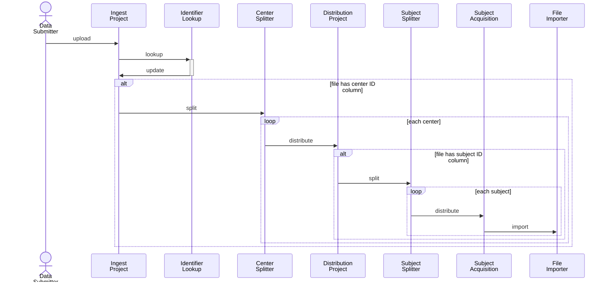
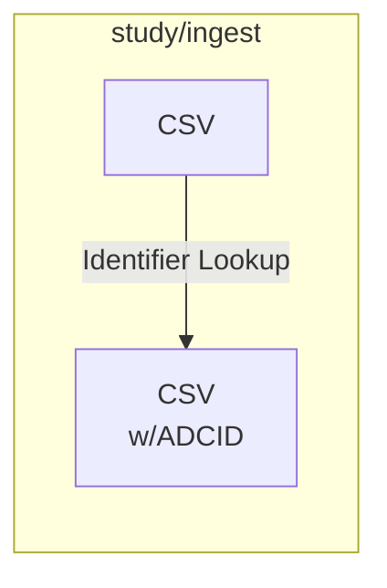
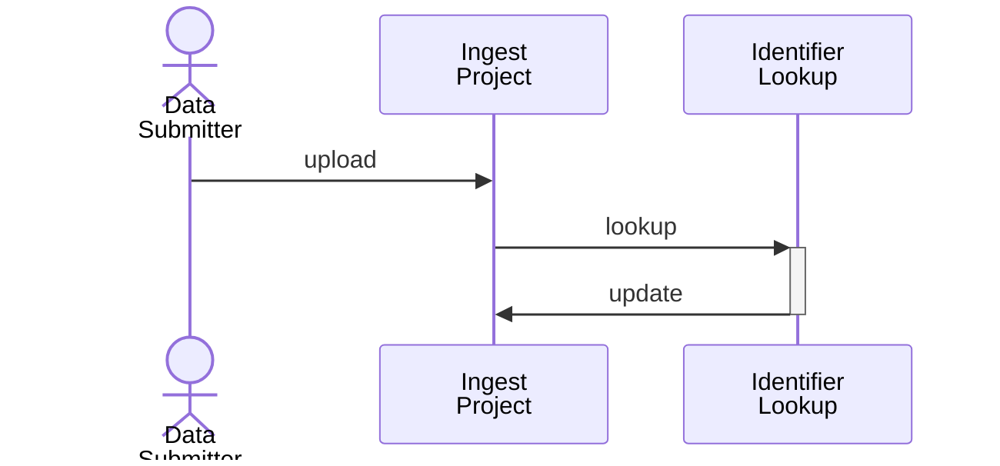
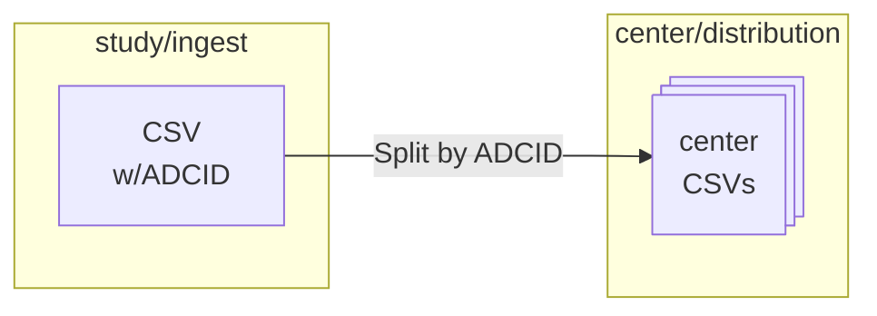
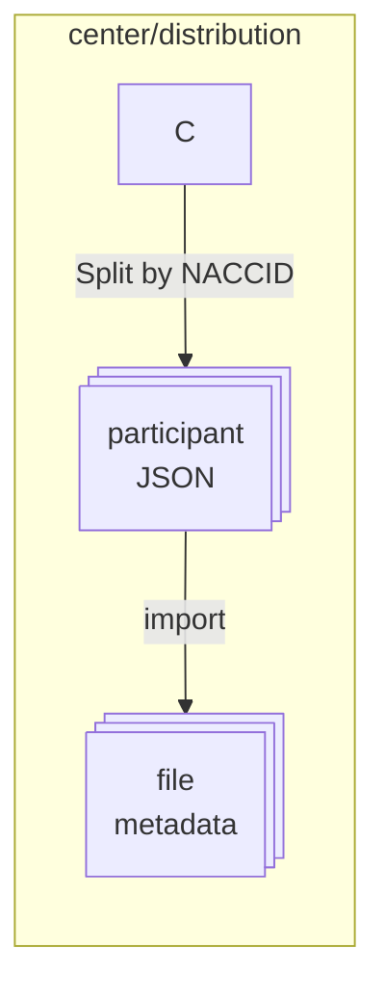
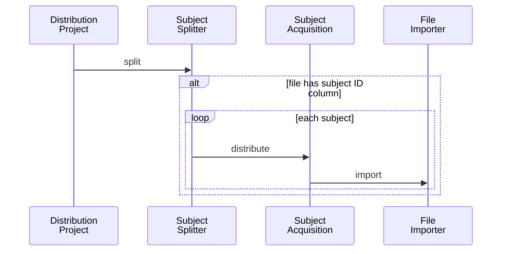

# CSV File Processing

This document discusses the process(es) for handling CSV data that is submitted to NACC by a study or collaborating organization.

The data in these files CSV files are processed for one or both of these purposes:

* distributing participant data to the centers, and
* attaching data to the subjects for participants for use in released data or query tool indexing.

with the processing involving these steps

1. [Ingest the CSV file](#ingest-csv-file)
2. [Split the CSV file by center](#split-csv-by-center)
3. [Split each center-specific files by subject](#split-center-csv-by-participant)

These are discussed in more detail below.



## Ingest CSV File

As the first step, a CSV containing data from all centers is uploaded to the study ingest.
The study ingest is typically a study-specific ingest project of a center for the organization providing the data.

An example is NCRAD, which provides several data streams.
There is a group for NCRAD, and then projects for ingest of each data stream.
This is the process described above.

On upload, ID transformations may be required to ensure the CSV has the the NACCID and ADCID columns:

   1. if data only has NACCID for participants, do reverse identifier lookup to insert ADCID
   2. if data only has ADCID, PTID, do identifier lookup to insert NACCID


### Ingest processes

> If this diagram is not rendered properly, view this [document in the repository](https://github.com/naccdata/flywheel-gear-extensions/blob/document-csv-process/docs/processes/csv_pipeline.md#ingest-processes)





### Gear: 

[identifier-lookup](../identifier_lookup/): used to ensure both ADCID and NACCID are available for splitting purposes


### Variation

The primary variation is where data is ingested.
Ordinarily data is uploaded to an ingest project in Flywheel, but, in other cases, data is ingested into AWS S3.
In this scenario, transformation processes may occur in AWS before the data is transferred to Flywheel.

An example of this is SCAN, where data is transferred into the S3 bucket, and split by center and each file written into center-specific projects in Flywheel. 
This uses a different set of gears up to the point where the files are saved in Flywheel.

## Split CSV by Center

The next step is to split rows of the CSV by ADCID and write center-specific rows to a new CSV in a project in the group corresponding to the ADCID.

### Center-splitting processes

> If this diagram is not rendered properly, view this [document in the repository](https://github.com/naccdata/flywheel-gear-extensions/blob/document-csv-process/docs/processes/csv_pipeline.md#center-splitting-processes)



```mermaid
sequenceDiagram
    participant ingest as Ingest<br/>Project
    participant csplitter as Center<br/>Splitter
    participant distribution as Distribution<br/>Project

   ingest ->> csplitter: split
    alt file has center ID column
       loop each center
          csplitter ->> distribution: distribute
          alt file has subject ID column
       end
    end
```

### Gear: 

[csv-center-splitter](../csv_center_splitter/): uses the ADCID to split the CSV and save the corresponding rows to a CSV file in a project of the center group

### Variation

The CSV center splitter supports batching the splitting process to avoid scenarios where a large number of downstream jobs are created.

## Split center CSV by participant

The final step is to split rows in the center-specific CSV by NACCID to create JSON file attached to subject.
After which the form-importer is run to load JSON into the file custom info.

#### Participant splitting processes

> If this diagram is not rendered properly, view this [document in the repository](https://github.com/naccdata/flywheel-gear-extensions/blob/document-csv-process/docs/processes/csv_pipeline.md#participant-splitting-processes)






### Gears:
* [csv-subject-splitter](../csv_subject_splitter/index.md): uses the NACCID to split the center-level CSV into rows, writing each row as a JSON file attached to an acquisition under the subject
* [form-importer](https://gitlab.com/flywheel-io/scientific-solutions/gears/form-importer): imports the JSON data and inserts it into the file custom information `file.info`


### Variation:

The form-importer allows specifying a prefix for importing values into the custom information.

The convention is that for form data the prefix is `form.json`, while for other files the prefix is `raw`.
Since, custom information for a file is denoted with prefix `file.info`, you may see these prefixes as `file.info.form.json` and `file.info.raw`.

