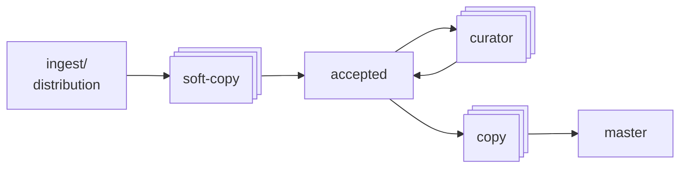

# Data Aggregation and Curation

## Processes

```mermaid
flowchart LR
    A@{ shape: rect, label: "ingest/\ndistribution" }
    B@{ shape: rect, label: "accepted" }
    C@{ shape: processes, label: "soft-copy" }
    D@{ shape: processes, label: "curator" }
    E@{ shape: processes, label: "copy" }
    F@{ shape: rect, label: "master" }
    A --> C
    C --> B
    B --> D
    D --> B
    B --> E
    E --> F
```

## Gears:

- [soft-copy](https://gitlab.com/flywheel-io/scientific-solutions/gears/soft-copy)
- [attribute-curator](../attribute-curator/)