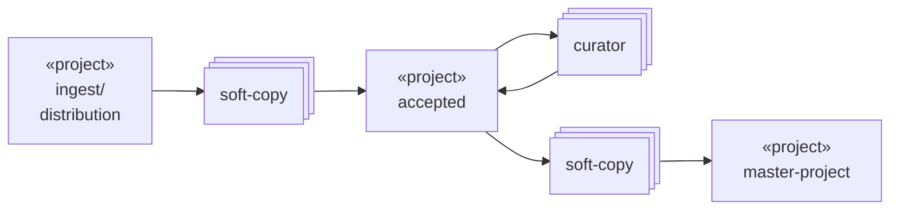

# Data Aggregation and Curation

## Processes

> If this diagram is not rendered properly, view this [document in the repository](https://github.com/naccdata/flywheel-gear-extensions/blob/document-csv-process/docs/processes/curation.md)

## Gears:

- [soft-copy](https://gitlab.com/flywheel-io/scientific-solutions/gears/soft-copy)
- [attribute-curator](../attribute-curator/)