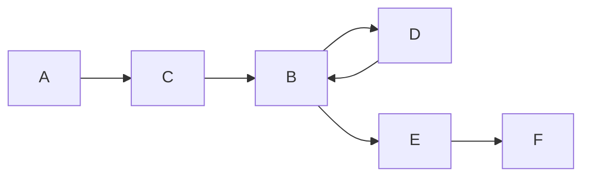

# Data Aggregation and Curation

```mermaid
flowchart LR
    A@{ shape: rect, label:"ingest/distribution" } --> C@{ shape: rect, label:"soft-copy" }
    C --> B@{ shape: rect, label:"accepted" }
    B --> D@{ shape: rect, label:"curator" }
    D --> B
    B --> E@{ shape: rect, label:"copy" }
    E --> F@{ shape: rect, label:"master" }
```