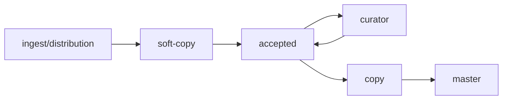

# Data Aggregation and Curation

```mermaid
flowchart LR
    A@{ shape: rect, label: "ingest/distribution" }
    B@{ shape: rect, label: "accepted" }
    C@{ shape: rect, label: "soft-copy" }
    D@{ shape: rect, label: "curator" }
    E@{ shape: rect, label: "copy" }
    F@{ shape: rect, label: "master" }
    A --> C
    C --> B
    B --> D
    D --> B
    B --> E
    E --> F
```