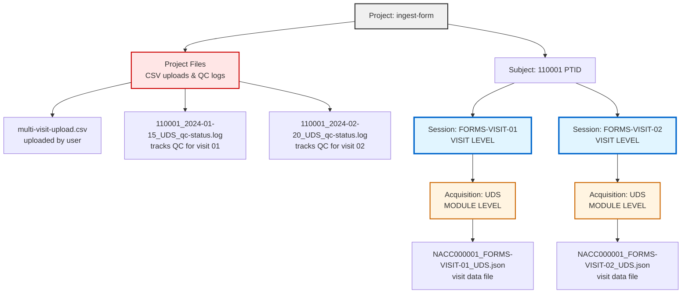
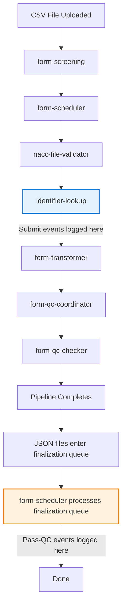
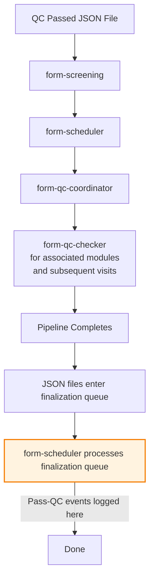
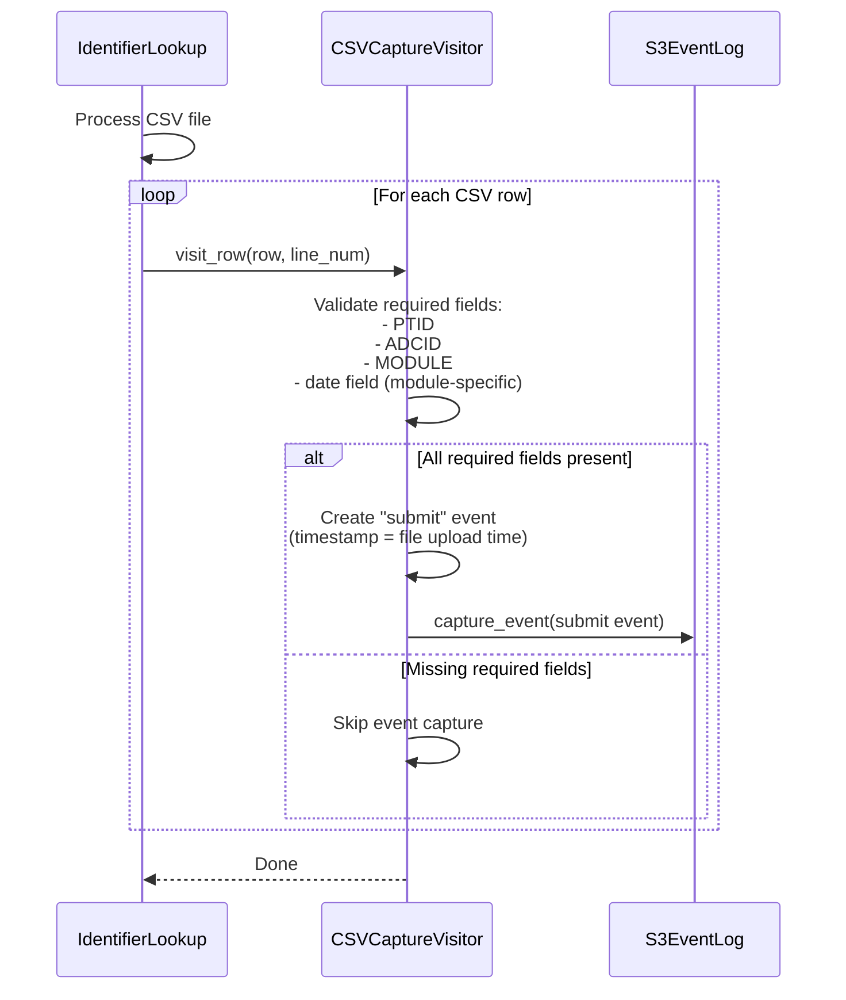
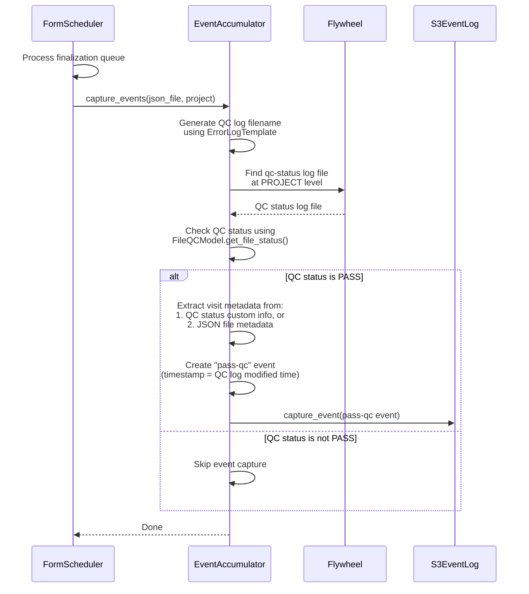

# Event Capture System

## Overview

The NACC Data Platform captures visit events throughout the data processing pipeline to track submission and quality control outcomes. Events are logged to S3 for downstream processing and analytics.

This document explains how the event capture system works for developers unfamiliar with the system.

## Event Types

The system captures two types of events:

- **submit**: Records when a visit is submitted for processing
  - Logged by identifier-lookup gear during CSV processing
  - Uses file upload timestamp
  
- **pass-qc**: Records when a visit successfully completes all QC checks
  - Logged by form-scheduler gear during finalization queue processing
  - Uses QC completion timestamp from log file modification time

## Key Concepts

### Flywheel Container Hierarchy

Understanding the Flywheel container structure is essential:



**Key Points:**

- **Project Files**: CSV files uploaded by users and QC log files are stored at PROJECT level
- **Session** = Visit (e.g., "FORMS-VISIT-01" represents visit number "01")
- **Acquisition** = Module (e.g., "UDS", "FTLD", "LBD")
- **CSV files** can contain multiple visits and are uploaded to PROJECT level
- **QC log files** are created at PROJECT level (one per visit: `{ptid}_{visitdate}_{module}_qc-status.log`)
- **JSON files** are created at ACQUISITION level (one per visit/module combination)
- Events are tracked by visit_number, extracted from the session label

### Multi-Visit Processing

A single CSV file can contain data for multiple visits. The pipeline processes each visit separately:

1. User uploads CSV with visits 01, 02, 03 to PROJECT level
2. form-screening validates the CSV format
3. identifier-lookup provisions identifiers and creates QC log files at PROJECT level (one per visit)
4. form-transformer splits CSV into separate JSON files (one per visit) attached to ACQUISITION level
5. form-qc-checker validates each visit independently and updates QC metadata
6. Each visit generates its own pair of events

**Important Notes:**

- If pipeline fails at identifier-lookup or form-transformer, no JSON file is created at ACQUISITION level
- QC log files at PROJECT level are still created and track the failure
- Not all modules have visit numbers in session labels (module-specific configuration)

### File Locations

Understanding where files are stored is important for event capture:

- **CSV files**: Uploaded to PROJECT level, can contain multiple visits
- **QC log files**: Created at PROJECT level by identifier-lookup gear, one per visit
  - Naming pattern: `{ptid}_{visitdate}_{module}_qc-status.log`
  - Example: `110001_2024-01-15_UDS_qc-status.log`
  - Always created, even if pipeline fails
- **JSON files**: Created at ACQUISITION level by form-transformer, one per visit/module
  - Naming pattern: `{naccid}_FORMS-VISIT-{visitnum}_{module}.json` (for modules with visit numbers)
  - Example: `NACC000001_FORMS-VISIT-01_UDS.json`
  - Only created if pipeline succeeds through form-transformer
  - Not created if pipeline fails at identifier-lookup or form-transformer

## Event Capture Architecture

### Submit Events (identifier-lookup)

The identifier-lookup gear captures submit events during CSV processing:

#### CSVCaptureVisitor

- Runs as CSV rows are processed during identifier lookup
- Logs "submit" event for each valid row with required fields
- Uses file upload timestamp as event timestamp
- Integrated into CSV visitor pattern

**Key Benefits:**

- Submit events captured at the point of data entry
- Each visit tracked individually
- Non-invasive: doesn't interfere with identifier lookup

### Pass-QC Events (form-scheduler)

The form-scheduler gear captures pass-qc events during finalization queue processing:

#### EventAccumulator

- Runs when processing JSON files in the finalization queue
- Finds corresponding qc-status log file using ErrorLogTemplate
- Checks QC status using FileQCModel
- Logs "pass-qc" events only for visits that pass all QC checks
- Uses QC log file modification time as event timestamp

**Key Benefits:**

- Pass-QC events captured when visits are finalized
- QC status log files serve as single source of truth
- Non-invasive: doesn't interfere with pipeline execution
- Simple and focused: only logs successful outcomes

## Process Flow

### High-Level Overview

There are two distinct workflows in the form processing system:

#### Submission Pipeline (CSV files)



#### Finalization Pipeline (QC passed JSON files)



### Submit Event Capture

During CSV processing, identifier-lookup captures submit events:



### Pass-QC Event Capture

When processing the finalization queue, form-scheduler captures pass-qc events:



**What happens:**

1. **Submit Events (identifier-lookup):**
   - CSV rows are processed during identifier lookup
   - CSVCaptureVisitor validates required fields for each row
   - Submit event captured for each valid row with file upload timestamp

2. **Pass-QC Events (form-scheduler):**
   - JSON files are processed in finalization queue
   - EventAccumulator finds corresponding QC status log using ErrorLogTemplate
   - Checks QC status using FileQCModel
   - If status is PASS, extracts metadata and captures pass-qc event
   - Uses QC log modification time as event timestamp

## Determining QC Pass Status

QC pass status is determined by checking the qc-status log file.

**CRITICAL: "pass-qc" event is ONLY captured when:**

1. **QC status log file exists** at PROJECT level
2. **FileQCModel.get_file_status() returns QC_STATUS_PASS**

```python
def _check_qc_status(qc_log_file: FileEntry) -> bool:
    """Check if QC status is PASS.
    
    Returns True ONLY if FileQCModel indicates PASS status.
    """
    try:
        qc_model = FileQCModel.model_validate(qc_log_file.info)
    except ValidationError:
        return False
    
    # Check if QC status is PASS
    file_status = qc_model.get_file_status()
    return file_status == QC_STATUS_PASS
```

### QC Metadata Structure

Each gear writes its validation status to `file.info.qc`. Both QC log files (at PROJECT level) and JSON files (at ACQUISITION level) contain this metadata structure.

**For "pass-qc" events, we check the QC status log file at PROJECT level using FileQCModel.**

### QC Log File (at PROJECT level)

**Filename**: `110001_2024-01-15_UDS_qc-status.log`

```yaml
file.info:
  qc:
    form-screening:
      validation:
        state: "PASS" | "FAIL" | "IN REVIEW"
        data: [FileError, FileError, ...]
        cleared: [...]
    form-transformer:
      validation:
        state: "PASS"
        data: []
    form-qc-checker:
      validation:
        state: "PASS"
        data: []
```

### Visit JSON File (at ACQUISITION level)

**Filename**: `NACC000001_FORMS-VISIT-01_UDS.json`

```yaml
file.info:
  forms:
    json:
      ptid: "110001"
      visitnum: "01"
      visitdate: "2024-01-15"
      packet: "I"
      module: "UDS"
      # ... other form fields
  qc:
    # Same structure as QC log file
    form-screening:
      validation:
        state: "PASS"
    form-transformer:
      validation:
        state: "PASS"
    form-qc-checker:
      validation:
        state: "PASS"
```

**Key Points:**

- QC log file at PROJECT level tracks pipeline progress for the visit
- Visit JSON file at ACQUISITION level contains both visit data and QC metadata
- Both files have the same `file.info.qc` structure with gear validation states
- Gears update BOTH the log file and the JSON file
- We can check either file for QC status (log file is canonical)

## Event Timing

Events use different timestamps to reflect when actions actually occurred:

### Successful Submission

When a visit passes QC:

- **submit event**: Captured by identifier-lookup gear when CSV file is processed
  - Timestamp: File upload time
- **pass-qc event**: Captured by form-scheduler gear when JSON file is processed in finalization queue
  - Timestamp: QC status log file modification time

### Failed Submission

When a visit fails QC:

- **submit event**: Captured by identifier-lookup gear when CSV file is processed
  - Timestamp: File upload time
- **No pass-qc event**: Only successful outcomes generate pass-qc events

## Data Structures

### VisitEvent

Event object logged to S3:

```python
class VisitEvent(BaseModel):
    action: str                    # "submit" or "pass-qc"
    study: str                     # Study identifier (extracted from project label)
    pipeline_adcid: int            # ADCID for event routing
    project_label: str             # Project name (e.g., "ingest-form", "ingest-form-dvcid")
    center_label: str              # Center name
    gear_name: str                 # "identifier-lookup" or "form-scheduler"
    ptid: str                      # Participant ID
    visit_date: date               # Visit date
    visit_number: str              # Visit number (optional for some modules)
    datatype: str                  # "form"
    module: str                    # "UDS", "FTLD", "LBD", etc.
    packet: Optional[str]          # Packet type (optional)
    timestamp: datetime            # When action occurred
```

### VisitMetadata

Metadata extracted from QC status or JSON files:

```python
class VisitMetadata(BaseModel):
    ptid: str                      # Participant ID
    date: date                     # Visit date
    visitnum: Optional[str]        # Visit number
    module: str                    # Module name
    packet: Optional[str]          # Packet type
```

## Implementation Details

### Identifier Lookup Integration

Submit events are captured during CSV processing using the CSVCaptureVisitor.

#### In NACCIDLookupApp.run

During CSV processing:

```python
# Create CSV capture visitor for submit events
csv_capture_visitor = CSVCaptureVisitor(
    center_label=center.label,
    project_label=project.label,
    gear_name="identifier-lookup",
    event_capture=event_capture,
    module_configs=module_configs,
    error_writer=error_writer,
    timestamp=file.created,  # Use file upload time
    action="submit",
    datatype="form"
)

# Process CSV with multiple visitors including event capture
csv_reader.accept_visitors([
    naccid_lookup_visitor,
    csv_capture_visitor,  # Captures submit events
    qc_status_visitor
])
```

### Form Scheduler Integration

Pass-qc events are captured during finalization queue processing.

#### In FormSchedulerQueue._log_pipeline_events

After finalization queue processing:

```python
def _log_pipeline_events(self, json_file: FileEntry) -> None:
    """Capture pass-qc events for finalized JSON files."""
    if not self.__event_capture:
        return
    
    try:
        from form_scheduler_app.event_accumulator import EventAccumulator
        event_accumulator = EventAccumulator(event_capture=self.__event_capture)
        event_accumulator.capture_events(json_file=json_file, project=self.__project)
    except Exception as error:
        log.warning(f"Failed to capture events for {json_file.name}: {error}")
```

## Key Design Principles

1. **Separation of concerns**: Submit events (identifier-lookup) separate from pass-qc events (form-scheduler)
2. **Non-invasive**: Event capture doesn't change pipeline execution
3. **QC log as source of truth**: qc-status log files track QC status throughout pipeline
4. **Simple and focused**: Only captures successful outcomes (pass-qc), not failures
5. **Robust**: Uses existing QC infrastructure (FileQCModel) to determine success
6. **Metadata extraction**: Prioritizes QC status custom info, falls back to JSON file metadata

## Error Handling

The event capture process includes robust error handling:

- If QC status log file is not found, logs debug message and skips event capture
- If QC status is not PASS, logs debug message and skips event capture
- If visit metadata cannot be extracted, logs warning and skips event capture
- If visit event cannot be created, logs warning and skips event capture
- All errors are logged but don't fail the gear execution
- Event capture failures are caught and logged as errors with full traceback

## Event Storage in S3

Events are written to S3 in a flat structure organized by environment.

### S3 Path Structure

```text
s3://event-bucket/
├── prod/
│   ├── log-submit-{YYYYMMDD-HHMMSS}-{adcid}-{project}-{ptid}-{visitnum}.json
│   └── log-pass-qc-{YYYYMMDD-HHMMSS}-{adcid}-{project}-{ptid}-{visitnum}.json
└── dev/
    └── ...
```

**Filename Format**: `log-{action}-{timestamp}-{adcid}-{project}-{ptid}-{visitnum}.json`

Where:

- **action**: Event type (`submit`, `pass-qc`)
- **timestamp**: Event timestamp in format `YYYYMMDD-HHMMSS` (when action occurred)
- **adcid**: Pipeline ADCID
- **project**: Project label (sanitized)
- **ptid**: Participant ID
- **visitnum**: Visit number (if present)

### Example

For a visit with:

- environment: `prod`
- pipeline_adcid: `42`
- project_label: `ingest-form` (ADRC study)
- ptid: `110001`
- visit_number: `01`
- submit timestamp: `2024-01-15T10:00:00Z`
- pass-qc timestamp: `2024-01-15T10:20:00Z`

Events are written to:

```text
s3://event-bucket/prod/log-submit-20240115-100000-42-ingest-form-110001-01.json
s3://event-bucket/prod/log-pass-qc-20240115-102000-42-ingest-form-110001-01.json
```

For a DVCID study visit:

```text
s3://event-bucket/prod/log-submit-20240115-100000-44-ingest-form-dvcid-110003-01.json
```

### Event File Format

Each event file contains a JSON object with the complete VisitEvent data:

```json
{
  "action": "submit",
  "study": "adrc",
  "pipeline_adcid": 42,
  "project_label": "ingest-form",
  "center_label": "alpha",
  "gear_name": "identifier-lookup",
  "ptid": "110001",
  "visit_date": "2024-01-15",
  "visit_number": "01",
  "datatype": "form",
  "module": "UDS",
  "packet": "I",
  "timestamp": "2024-01-15T10:00:00Z"
}
```

### Design Rationale

The flat structure optimizes for the primary use case: scraping all events into a single Parquet table.

**Advantages:**

- Simple listing: Single S3 LIST operation gets all events
- Efficient filtering: Glob patterns work directly on filenames
- Chronological ordering: Natural sort by filename gives time order
- Self-documenting: Key metadata visible in filename
- No recursive traversal needed

## Important Considerations

### QC Approval Workflow

The "pass-qc" event is captured when visits successfully complete QC validation:

1. **Immediate success**: Pipeline completes successfully with no QC alerts
   - "pass-qc" event captured during finalization queue processing

2. **Deferred approval**: Pipeline completes with QC alerts that are later approved
   - Initially no "pass-qc" event (QC status is not PASS)
   - "pass-qc" event captured later when alerts are approved and finalization queue is reprocessed

3. **Dependency resolution**: Visits blocked on dependencies get re-evaluated
   - Example: Follow-up visits or modules blocked on UDS packet
   - When blocking dependency is cleared, blocked visits are re-evaluated
   - "pass-qc" event captured when re-evaluation succeeds

### Modules Without Visit Numbers

Not all modules include visit numbers in their session labels. For modules without visit numbers:

- Visit number will be None in the VisitEvent
- Event capture will still occur if other required fields are present
- Filename will show "None" for visitnum component

### Submit Events for Invalid Rows

During CSV processing in identifier-lookup:

- Submit events are only captured for rows with all required fields (PTID, ADCID, MODULE, date field)
- Rows missing required fields will not generate submit events
- This ensures event data integrity

## Summary

Event capture in the form processing pipeline is split between two gears:

- **Submit events (identifier-lookup)**: Captured during CSV processing using CSVCaptureVisitor
- **Pass-QC events (form-scheduler)**: Captured during finalization queue processing using EventAccumulator

**Key Points:**

- Submit events captured for each valid CSV row during identifier lookup
- Pass-QC events captured only for visits that pass all QC checks
- QC status log files at PROJECT level serve as single source of truth for QC status
- Events use appropriate timestamps (file upload for submit, QC log modification for pass-qc)
- Uses FileQCModel.get_file_status() to determine QC outcome
- Non-invasive: Event capture doesn't interfere with pipeline execution
- Robust error handling: Event capture failures don't break pipeline execution
