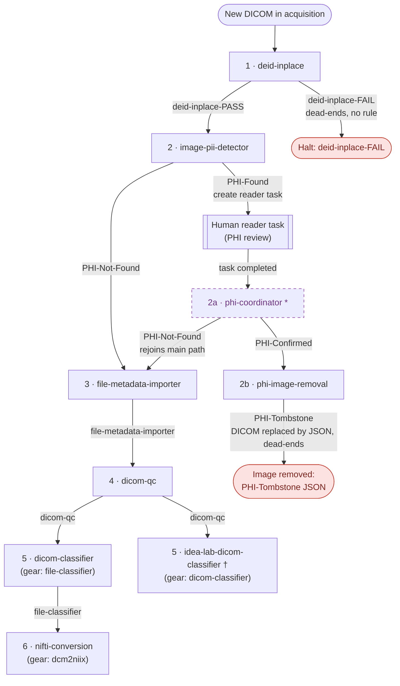

# Gears: `zach-test-center/phi-test`

Reference for the gear rules configured on this project. For each gear: its **function**, **inputs**, **output**, and the **requirements that trigger it**. Full machine-readable settings live in the per-rule JSON files alongside this document (see [_index.json](_index.json)).

These rules form a single DICOM-processing chain. Each gear tags the file when it finishes, and the next gear's rule is set to trigger on that tag, so the gears below are listed in the order they run. All rules match only `file.type = dicom`; the parent container is an acquisition unless noted. One gear in the chain, `phi-coordinator`, has **no project rule** and is run manually / on demand; it is marked with `*` below.

| # | Gear rule | Gear | Runs after (trigger tag) | Adds tag |
|---|-----------|------|--------------------------|----------|
| 1 | deid-inplace | `deid-inplace` | (any new DICOM) | `deid-inplace-PASS` / `-FAIL` |
| 2 | image-pii-detector | `image-pii-detector` | `deid-inplace-PASS` | `PHI-Found` (awaiting review) |
| 2a | phi-coordinator&nbsp;`*` | `phi-coordinator` | *(no rule: completed PHI reader task)* | `PHI-Not-Found` / `PHI-Confirmed` |
| 2b | phi-image-removal | `phi-image-removal` | `PHI-Confirmed` | `PHI-Tombstone` (on the tombstone JSON) |
| 3 | file-metadata-importer | `file-metadata-importer` | `deid-inplace-PASS` + `PHI-Not-Found` | `file-metadata-importer` |
| 4 | dicom-qc | `dicom-qc` | `file-metadata-importer` | `dicom-qc` |
| 5 | dicom-classifier | `file-classifier` | `dicom-qc` | `file-classifier` |
| 5 | idea-lab-dicom-classifier&nbsp;`†` | `dicom-classifier` | `dicom-qc` | `mr-classifier` |
| 6 | nifti-conversion | `dcm2niix` | `file-classifier` | `nifti-conversion` |

`*` `phi-coordinator` has no gear rule on `phi-test`; it is run manually / on demand and finalizes the PHI tags from completed reader tasks (see its section below).

`†` `idea-lab-dicom-classifier` is a **terminal side-branch**: it fires off the `dicom-qc` tag but nothing downstream triggers on the `mr-classifier` tag it adds. The main chain continues `dicom-qc` to `dicom-classifier` (`file-classifier`) to `nifti-conversion` (`dcm2niix`).

### Pipeline flow

Edge labels show the tag (or tags) a file must carry for the next rule to fire.

Notes: `image-pii-detector` now matches only the exact `deid-inplace-PASS` tag, so `-FAIL` files stop at deid-inplace (no rule consumes `deid-inplace-FAIL`). Among the `-PASS` files, only those resolved to `PHI-Not-Found` proceed to file-metadata-importer. After metadata import, `dicom-qc` runs; both classifiers then fire off the `dicom-qc` tag. Only `dicom-classifier` (tag `file-classifier`) feeds nifti-conversion; `idea-lab-dicom-classifier` (tag `mr-classifier`) is a terminal side-branch. `phi-coordinator` (dashed) has **no project gear rule**; it is run manually / on demand and finalizes the PHI tags from completed reader tasks. Files it resolves to `PHI-Confirmed` are then consumed by **phi-image-removal**, which replaces the DICOM with a JSON tombstone (tagged `PHI-Tombstone`); this is the terminal step of the confirmed-PHI branch (nothing consumes `PHI-Tombstone`).

> `api-key` is an input on every gear but is supplied automatically by Flywheel (the running user's API context), so it is omitted from the input lists below.

---

## 1. deid-inplace: `deid-inplace`

**Function:** Deidentifies a Flywheel DICOM file in place using a deid profile.

**Inputs:**
- `input-file` *(file, required, triggering file)*: the DICOM to deidentify.
- `deid-profile` *(file, required)*: deid profile; fixed input `full-deid-dev-wip.yml` (project file).
- `subject-csv` *(file, optional)*: per-subject overrides.

**Output:** A deidentified version of the DICOM, written in place. The original is **kept** (`delete-original = false`). Tags the file `deid-inplace-PASS` or `deid-inplace-FAIL`.

**Triggered when:** a DICOM file in an acquisition is **not** yet tagged `deid-inplace*` (i.e. not yet deidentified).

---

## 2. image-pii-detector: `image-pii-detector`

**Function:** Scans image pixel data for burned-in Personal Identifiable Information (PII), reports findings, and (in other modes) can redact PII from the pixels.

**Inputs:**
- `image_file` *(file, required, triggering file)*: the DICOM image to scan.
- `bbox_coords` *(file, optional)*: predefined bounding-box coordinates to redact.

**Output:** PII findings report (operating mode `Detection+ReaderTasks`: detection and task creation, not automatic redaction). Two outcomes:
- **No PHI detected**: file is tagged `PHI-Not-Found` and continues the workflow.
- **PHI detected**: file is tagged `PHI-Found` and gets a **reader task** for manual review (assigned to `zstark@washington.edu`); **phi-coordinator** then resolves it to `PHI-Confirmed` (→ **phi-image-removal**, step 2b) or `PHI-Not-Found` (rejoin the workflow).

**Triggered when:** a DICOM file in an acquisition is tagged `deid-inplace-PASS` (exact match, not the wildcard) and is **not** yet tagged `image-pii-detector`. Files tagged `deid-inplace-FAIL` no longer reach this gear.

---

## 2a. phi-coordinator: `phi-coordinator`

> **No project gear rule is configured for this gear on `phi-test`.** It is a Flywheel `utility` gear run manually / on demand. The values below are the gear's defaults, and "Acts on" describes what it processes, not an automatic rule trigger.

**Function:** Finalizes PHI review tags by reading completed reader-task form responses. For each completed task in the configured protocol, it reads the reviewer's yes/no answer and resolves the file's PHI tags accordingly.

**Inputs:** None beyond the auto-provided `api-key`; it operates on reader-task form responses via the API, not on a file input.

**Output** (tag changes only; no new file):
- Removes `PHI-Found` from a file once its review is resolved.
- Adds `PHI-Confirmed` when the reviewer confirms PHI is present; the file leaves the main workflow and is picked up by **phi-image-removal** (step 2b).
- Adds `PHI-Not-Found` when the reviewer reports no PHI, so the file proceeds to `file-metadata-importer`.
- Tags each processed reader task `phi-coordinator` so it is excluded from future runs.
- If a completed task has no usable answer, resets it to *Todo* and clears its response (`reset_on_missing_data = true`, default).

**Acts on** (no rule, manual / on demand): completed reader tasks in the protocol `default_image_pii_detector_protocol` (config `phi_protocol_label`), reading the yes/no answer from response key `phi_radio` (config `answer_key`). These are the tasks created by **image-pii-detector** (step 2).

---

## 2b. phi-image-removal: `phi-image-removal`

**Function:** Removes an image confirmed to contain PHI by replacing it with a JSON **tombstone** that records the removed file's details. This is the terminal step of the confirmed-PHI branch (implements the tombstone approach from todo.md item 4).

**Inputs:**
- `input_file` *(file, required, triggering file)*: the `PHI-Confirmed` DICOM to remove.

**Output:** The original DICOM is replaced in place by a JSON tombstone file recording its details; the tombstone is tagged `PHI-Tombstone`. Nothing downstream consumes `PHI-Tombstone`, so the file ends here.

**Config:** `dry_run = false` (default; log-only when true), `confirmed_tag = PHI-Confirmed` (the tag required to act), `tombstone_tag = PHI-Tombstone` (added to the tombstone JSON).

**Triggered when:** a DICOM file tagged `PHI-Confirmed` (added by **phi-coordinator**, step 2a). Unlike the other rules, this rule matches DICOMs in **any** parent container (acquisition, session, subject, project, or analysis), not just acquisitions. It has **no `_not` exclusion tag**, but its own output is a JSON tombstone (not `file.type = dicom`), so it does not re-trigger on what it produces.

---

## 3. file-metadata-importer: `file-metadata-importer`

**Function:** Extracts file metadata and imports it into Flywheel under `file.info.header`. Supports DICOM / DICOM Zip, PTD (Siemens PT), NIfTI, ParaVision (Bruker), and PAR/REC (Philips).

**Inputs:**
- `input-file` *(file, required, triggering file)*: the file whose header metadata is imported.

**Output:** Header metadata written to `file.info.header`; no new file is produced. Tags the file `file-metadata-importer`; `dicom-qc` triggers on this tag.

**Triggered when:** a DICOM file in an acquisition is tagged **both** `deid-inplace-PASS` and `PHI-Not-Found`, and is **not** tagged `PHI-Found` or `file-metadata-importer`.

---

## 4. dicom-qc: `dicom-qc`

**Function:** Validates a DICOM archive against a set of hardcoded and user-specified rules (series/slice consistency, instance-number uniqueness, embedded localizer, bed movement, DICOM-standard validation, etc.).

**Inputs:**
- `dicom` *(file, required, triggering file)*: the DICOM archive to validate.
- `validation-schema` *(file, required)*: rule schema (gear default used when none supplied).

**Output:** QC results written to the file's metadata (`file.info.qc`); no new file is produced. Tags the file `dicom-qc`; both classifiers trigger on this tag. Note: the tag is added whenever QC *runs* (not only when it passes), so it does not gate downstream gears on the QC result (see todo.md item 1).

**Triggered when:** a DICOM file in an acquisition is tagged `file-metadata-importer` and is **not** yet tagged `dicom-qc`.

---

## 5a. dicom-classifier: `file-classifier`

**Function:** Generic file classifier; updates a file's classification from the metadata already attached to it. Runs only **after** metadata-populating gears (such as file-metadata-importer).

**Inputs:**
- `file-input` *(file, required, triggering file)*: the file to classify.
- `profile` *(file, optional)*: classification profile.

**Output:** Classification written to the file's metadata, replacing any existing classification (`remove_existing = true`); no new file is produced. Tags the file `file-classifier`.

**Triggered when:** a DICOM file in an acquisition is tagged `dicom-qc` and is **not** yet tagged `file-classifier`.

---

## 5b. idea-lab-dicom-classifier: `dicom-classifier`

**Function:** Classifies DICOM files (IDEA-lab classifier).

**Inputs:**
- `file-input` *(file, required, triggering file)*: the DICOM to classify.

**Output:** Classification written to the file's metadata, added alongside any existing classification (`remove_existing = false`); no new file is produced. Tags the file `mr-classifier`. **Terminal side-branch**: no rule triggers on the `mr-classifier` tag, so it does not feed nifti-conversion.

**Triggered when:** a DICOM file in an acquisition is tagged `dicom-qc` and is **not** yet tagged `mr-classifier`.

---

## 6. nifti-conversion: `dcm2niix`

**Function:** Converts DICOM (or PAR/REC) to NIfTI using Chris Rorden's dcm2niix.

**Inputs:**
- `dcm2niix_input` *(file, required, triggering file)*: the DICOM archive to convert.
- `rec_file_input` *(file, optional)*: PAR/REC `.rec` companion file.

**Output:** A compressed NIfTI file (`.nii.gz`, `compress_images = y`) plus a BIDS JSON sidecar (`bids_sidecar = y`), written to the acquisition. Derived/localizer/2D images are skipped (`ignore_derived = true`). Tags the file `nifti-conversion`.

**Triggered when:** a DICOM file in an acquisition is tagged `file-classifier`.
