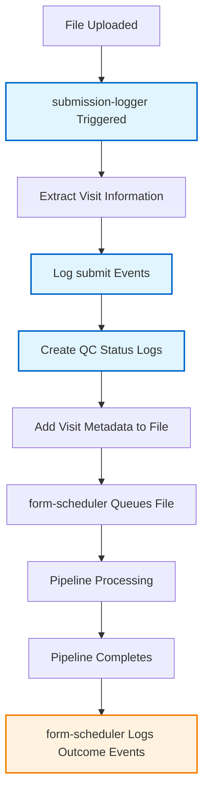

# Submission Logger

## Overview

The submission-logger gear captures "submit" events when new files are uploaded to NACC projects. It runs automatically when files are submitted, extracts visit information from the uploaded data, logs submit events for each visit, and creates visit QC status logs at the project level.

This gear is the first step in the event logging pipeline, working in conjunction with the form-scheduler gear which handles outcome events (pass-qc, not-pass-qc) after pipeline completion.

## Purpose

The submission-logger gear serves several critical functions:

1. **Event Logging**: Creates "submit" events in the transaction log when files are uploaded
2. **Visit Tracking**: Extracts visit information from uploaded files to enable per-visit tracking
3. **QC Status Initialization**: Creates initial QC status log files for each visit at the project level
4. **Metadata Enhancement**: Adds visit details to file.info metadata for future event logging

## Key Features

- **Multi-format Support**: Initially focused on CSV form data, designed to work with any submission format
- **Visit Extraction**: Parses uploaded files to identify individual visits and their metadata
- **Event Generation**: Creates structured submit events for each visit found in the uploaded file
- **QC Log Creation**: Initializes QC status tracking files for downstream pipeline processing
- **Metadata Enrichment**: Enhances file metadata with visit details for improved traceability

## Integration with Event Logging Pipeline

The submission-logger works as part of a comprehensive event logging system:



## Workflow

### 1. File Processing Trigger

The gear is triggered when a new file is uploaded to a NACC project and processes files that contain visit data (initially C

- Monitors for file upload events
- Identifies files that contain visit data (initially CSV files)
- Validates file format and accessibility

### 2. Visit Information Extraction

For each uploaded file, the gear:

- Parses the file content to identify individual visits
- Extracts visit metadata including:
  - **PTID**: Participant identifier
  - **Visit Date**: Date of the visit (key identifier)
  - **Visit Number**: Sequential visit identifier (optional, form-specific)
  - **Module**: Form module (UDS, FTLD, LBD, etc.) (optional, form-specific)
  - **Packet**: Packet type (I, F, etc.) (optional, form-specific)
  - **Study**: Study identifier (ADRC, DVCID, etc.)

### 3. Submit Event Logging

For each visit identified in the file:

- Creates a structured VisitEvent with action="submit"
- Uses the file upload timestamp as the event timestamp
- Logs the event to S3 using the established event logging infrastructure
- Includes all relevant visit and project metadata

### 4. QC Status Log Creation

Creates initial QC status log files at the project level:

- **Filename Pattern**: `{ptid}_{visitdate}_{module}_qc-status.log`
- **Location**: Project-level files (same level as uploaded CSV)
- **Purpose**: Tracks QC status throughout the pipeline processing
- **Initial State**: Empty QC metadata structure ready for pipeline gears

### 5. File Metadata Enhancement

Adds visit details to the uploaded file's metadata:

- Stores visit information in `file.info.visit` structure
- Enables future event logging to access visit details without re-parsing
- Supports efficient processing by downstream gears

## Data Structures

### VisitEvent for Submit Actions

```python
class VisitEvent(BaseModel):
    action: str = "submit"         # Always "submit" for this gear
    study: str                     # Study identifier (e.g., "adrc", "dvcid")
    pipeline_adcid: int            # ADCID for event routing
    project_label: str             # Project name (e.g., "ingest-form")
    center_label: str              # Center name
    gear_name: str = "submission-logger"
    ptid: str                      # Participant ID
    visit_date: date               # Visit date from file data (key identifier)
    visit_number: Optional[str]    # Visit number from file data (form-specific)
    datatype: str = "form"         # Data type being submitted
    module: Optional[str]          # Form module (UDS, FTLD, LBD, etc.) - form-specific
    packet: Optional[str]          # Packet type (I, F, etc.) - form-specific
    timestamp: datetime            # File upload timestamp
```

### Visit Metadata Structure

Visit information extracted from files and stored in metadata:

```python
class VisitInfo(BaseModel):
    ptid: str                      # Participant identifier
    visit_date: date               # Visit date (key identifier)
    visit_number: Optional[str]    # Visit number (form-specific)
    module: Optional[str]          # Form module (form-specific)
    packet: Optional[str]          # Packet type (form-specific)
    study: str                     # Study identifier
    center_label: str              # Center name
```

### QC Status Log Structure

Initial QC status log files created for each visit:

```yaml
# File: {ptid}_{visitdate}_{module}_qc-status.log
file.info:
  visit:
    ptid: "110001"
    visit_date: "2024-01-15"
    visit_number: "01"          # Optional - form-specific
    module: "UDS"               # Optional - form-specific
    packet: "I"                 # Optional - form-specific
    study: "adrc"
    center_label: "alpha"
  qc:
    # Empty initially - populated by pipeline gears
    # Structure matches form-scheduler expectations
```

## File Processing

### CSV Form Data Processing

For CSV files containing form data:

1. **Format Validation**: Ensures CSV has required columns for visit identification
2. **Visit Parsing**: Extracts visit information from each row
3. **Deduplication**: Handles multiple rows for the same visit appropriately
4. **Validation**: Verifies visit data completeness and consistency

### Expected CSV Structure

The gear expects CSV files with columns that allow visit identification:

```csv
ptid,visitdate,visitnum,packet,module,...
110001,2024-01-15,01,I,UDS,...
110001,2024-02-20,02,I,UDS,...
110002,2024-01-10,01,I,UDS,...
```

### Multi-Visit Handling

A single CSV file can contain multiple visits:

- Each visit generates its own submit event
- Each visit gets its own QC status log file
- Visit metadata is aggregated in the uploaded file's metadata

## Error Handling

The gear includes robust error handling:

- **File Access Errors**: Logs warnings if uploaded file cannot be read
- **Parse Errors**: Handles malformed CSV data gracefully
- **Missing Metadata**: Continues processing with available information
- **Event Logging Failures**: Logs errors but doesn't fail gear execution
- **QC Log Creation Failures**: Attempts to continue with remaining visits

## Integration Points

### Flywheel Integration

- **File Upload Triggers**: Responds to Flywheel file upload events
- **Project Context**: Extracts project and center information from Flywheel context
- **File Storage**: Creates QC log files at appropriate Flywheel project level

### Event Logging Infrastructure

- **S3 Event Storage**: Uses existing VisitEventLogger infrastructure
- **Event Format**: Follows established VisitEvent schema
- **Filename Convention**: Follows S3 event logging filename patterns

### Pipeline Integration

- **QC Log Compatibility**: Creates QC logs compatible with form-scheduler expectations
- **Metadata Standards**: Uses metadata structures expected by downstream gears
- **File Naming**: Follows established naming conventions for QC status logs

## Configuration

### Gear Configuration

The gear accepts configuration parameters:

```yaml
config:
  # Event logging configuration
  event_bucket: "nacc-event-logs"
  environment: "prod"  # or "dev"
  
  # File processing configuration
  supported_formats: ["csv"]
  required_columns: ["ptid", "visitdate", "visitnum", "packet", "module"]
  
  # QC log configuration
  create_qc_logs: true
  qc_log_template: "{ptid}_{visitdate}_{module}_qc-status.log"
```

### Environment Variables

Required environment variables:

- `AWS_ACCESS_KEY_ID`: AWS credentials for S3 event logging
- `AWS_SECRET_ACCESS_KEY`: AWS credentials for S3 event logging
- `EVENT_BUCKET`: S3 bucket for event storage
- `ENVIRONMENT`: Environment identifier (prod/dev)

## Monitoring and Logging

### Gear Logging

The gear provides detailed logging:

- **File Processing**: Logs each file being processed
- **Visit Extraction**: Reports number of visits found
- **Event Creation**: Confirms each submit event logged
- **Error Conditions**: Detailed error messages for troubleshooting

### Metrics

Key metrics tracked:

- **Files Processed**: Number of files successfully processed
- **Visits Extracted**: Total visits identified across all files
- **Events Logged**: Number of submit events successfully created
- **Errors**: Count and types of processing errors

## Future Enhancements

### Planned Features

1. **Format Expansion**: Support for additional file formats beyond CSV
2. **Validation Enhancement**: More sophisticated visit data validation
3. **Retry Logic**: Automatic retry for transient failures
4. **Batch Processing**: Efficient handling of large files with many visits

### Integration Opportunities

1. **Real-time Notifications**: Integration with notification systems for submit events
2. **Dashboard Integration**: Metrics and status reporting for monitoring dashboards
3. **Audit Trail**: Enhanced audit logging for compliance requirements

## Troubleshooting

### Common Issues

1. **Missing Visit Information**: Check CSV column names and data format
2. **Event Logging Failures**: Verify AWS credentials and S3 bucket access
3. **QC Log Creation Failures**: Check Flywheel permissions and project access
4. **Performance Issues**: Monitor file size and visit count for optimization

### Debug Information

Enable debug logging to see:

- Detailed file parsing information
- Visit extraction results
- Event creation details
- S3 upload status

## Related Documentation

- [Form Scheduler Event Logging](../form_scheduler/event-logging.md) - Outcome event logging
- [Event Logging Architecture](../processes/event-logging.md) - Overall event system design
- [QC Status Management](../processes/qc-status.md) - QC log file specifications